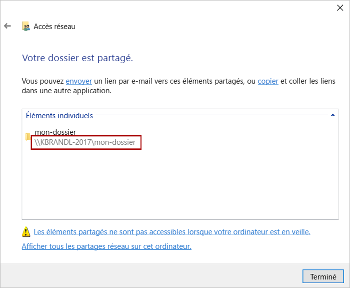
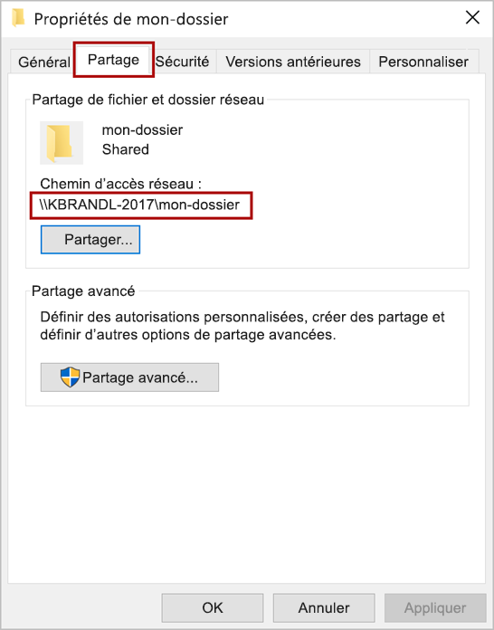
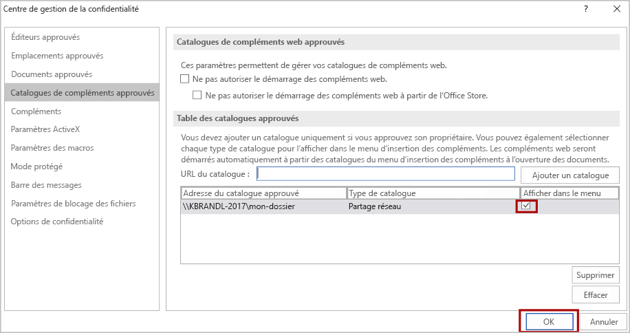

# Chargement de version test de compléments Office

Vous pouvez installer un complément Office à tester dans un client Office s’exécutant sous Windows en publiant le manifeste sur un partage de fichiers réseau (instructions ci-dessous).

> [!NOTE]
> Si votre projet de complément a été créé avec l’outil [**Yo Office**](https://github.com/OfficeDev/generator-office), il existe une façon alternative de charger la version test correspondante qui pourrait fonctionner pour vous. Pour plus de détails, voir [Charger une version test des compléments Office à l’aide de la commande de chargement indépendant](sideload-office-addin-using-sideload-command.md).

Cet article s’applique uniquement aux tests des compléments Word, Excel ou PowerPoint sur Windows. Si vous souhaitez tester sur une autre plateforme ou si vous souhaitez tester un complément Outlook, consultez l'une des rubriques suivantes pour charger la version test de votre complément :

- [Chargement de version test des compléments Office dans Office Online](sideload-office-add-ins-for-testing.md)
- [Chargement de version test des compléments Office sur iPad et Mac](sideload-an-office-add-in-on-ipad-and-mac.md)
- [Chargement de version test des compléments Outlook](https://docs.microsoft.com/outlook/add-ins/sideload-outlook-add-ins-for-testing)

La vidéo suivante vous guide à travers la procédure de chargement indépendant de votre complément dans la version de bureau Office ou Office Online à l’aide du catalogue d’un dossier partagé.  

> [!VIDEO https://www.youtube.com/embed/XXsAw2UUiQo]

## Partager un dossier

1. Dans l’Explorateur de fichiers sur l’ordinateur Windows sur lequel vous voulez héberger votre complément, accédez au dossier parent ou à la lettre de lecteur du dossier que vous souhaitez utiliser comme catalogue de dossiers partagés.

2. Ouvrez le menu contextuel du dossier que vous souhaitez utiliser comme catalogue de dossiers partagés (cliquez avec le bouton droit sur le dossier) et sélectionnez **Propriétés**.

3. Dans la boîte de dialogue **Propriétés** , cliquez sur l’onglet **Partage** , puis choisissez le bouton **Partager**.

    

4. Dans la boîte de dialogue **de l’accès réseau**, ajoutez-vous ainsi que tous les autres utilisateurs et/ou groupes avec lesquels vous souhaitez partager votre complément. Vous aurez besoin d’au moins une autorisation d’accès en **lecture/écriture** au dossier. Après avoir terminé de choisir les personnes avec qui vous partagez, cliquez sur le bouton **Partager**.

5. Lorsque vous voyez la confirmation que **votre dossier est partagé**, notez le chemin d’accès complet du réseau qui s’affiche immédiatement après le nom du dossier. (Vous devrez saisir cette valeur comme **URL de catalogue** lorsque vous [spécifiez que ce dossier partagé est un catalogue approuvé](#specify-the-shared-folder-as-a-trusted-catalog), comme le décrit la section suivante de cet article.) Cliquez sur le bouton **Terminé** pour fermer la boîte de dialogue **Accès réseau**.

   

6. Cliquez sur le bouton **Fermer** pour fermer la boîte de dialogue **Propriétés** .

## Spécifier le dossier partagé en tant que catalogue approuvé
      
1. Ouvrez un nouveau document dans Excel, Word ou PowerPoint.
    
2. Choisissez l’onglet **Fichier**, puis choisissez **Options**.
    
3. Choisissez l’onglet **Centre de gestion de la confidentialité**, puis choisissez le bouton **Paramètres du Centre de gestion de la confidentialité**.
    
4. Choisissez **Catalogues de compléments approuvés**.
    
5. Dans la zone **URL du catalogue** , entrez le chemin d’accès complet du réseau vers le dossier que vous avez auparavant [partagé](#share-a-folder). Si vous n’avez pas noté le chemin réseau complet du réseau lorsque vous avez partagé le dossier, vous pouvez le récupérer dans la boîte de dialogue **Propriétés** du dossier, comme illustré dans la capture d’écran suivante. 

    
    
6. Une fois que vous avez saisi le chemin d’accès réseau complet du dossier dans la zone **URL du catalogue**, cliquez sur le bouton **Ajouter un catalogue**.

7. Sélectionnez la case à cocher **Afficher dans le Menu** de l’élément nouvellement ajouté, puis cliquez sur le bouton **OK** pour fermer la boîte de dialogue **Centre de gestion de la confidentialité** . 

    

8. Choisissez le bouton **OK** pour fermer la boîte de dialogue **Options Word** .

9. Fermez et ouvrez de nouveau l’application Office afin que vos modifications prennent effet.
    

## Charger une version test de votre complément

1. Placez le fichier manifeste XML d’un complément en cours de test dans le catalogue de dossiers partagés. Notez que vous déployez l’application web elle-même sur un serveur web. Veillez à spécifier l’URL dans l’élément **SourceLocation** du fichier manifeste.

    > [!IMPORTANT]
    > [!include[HTTPS guidance](../includes/https-guidance.md)]

2. Dans Excel, Word ou PowerPoint, sélectionnez **Mes compléments** dans l’onglet **Insérer** du ruban.

3. Choisissez **DOSSIER PARTAGÉ** dans la boîte de dialogue **Compléments Office**.

4. Sélectionnez le nom du complément, puis choisissez **OK** pour insérer le complément.

## Voir aussi

- [Valider et résoudre des problèmes avec votre manifeste](troubleshoot-manifest.md)
- [Publier votre complément Office](../publish/publish.md)
    
