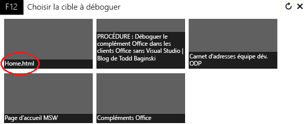
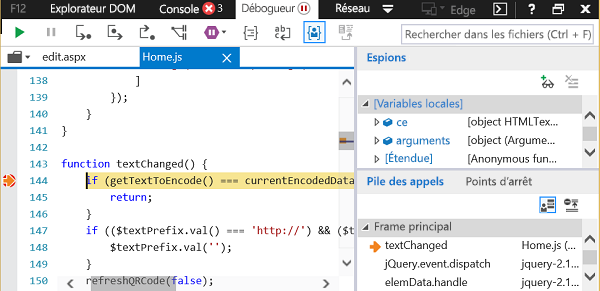

# Débogage des compléments avec les outils de développement F12 sur Windows 10

Les outils de développement F12 inclus dans Windows 10 vous aident à déboguer, tester et accélérer vos pages web. Ils vous aident également à développer et déboguer les compléments Office si vous n’utilisez pas un IDE comme Visual Studio ou si vous devez examiner un problème pendant l’exécution de votre complément hors de l’IDE. Vous pouvez lancer les outils de développement F12 après l’exécution de votre complément.

Dans cet article, vous découvrirez comment utiliser le débogueur des outils de développement F12 de Windows 10 pour tester votre complément Office. Vous pouvez tester les compléments de l’Office Store ou les compléments ajoutés à partir d’autres emplacements. Les outils F12 s’ouvrent dans une fenêtre séparée et n’utilisent pas Visual Studio.

 >**Remarque**  le débogueur fait partie des outils de développement F12 de Windows 10 et d’Internet Explorer. Il n’est pas inclus dans les versions antérieures de Windows. 

### Conditions préalables

Les logiciels suivants doivent être installés :

- Les outils de développement F12, inclus dans Windows 10. 
    
- L’application cliente Office qui héberge votre complément. 
    
- Votre complément. 
    
### Utilisation du débogueur

Cet exemple utilise Word et un complément gratuit de l’Office Store.

1. Ouvrez un document vierge dans Word.  
    
2. Sous l’onglet **Insertion**, dans le groupe Compléments, cliquez sur Office Store et sélectionnez le complément QR4Office. (Vous pouvez charger n’importe quel complément depuis l’Office Store ou votre catalogue de compléments.)
    
3. Ouvrez les outils de développement F12 correspondants à votre version d’Office :
    
      - Pour la version 32 bits, utilisez C:\Windows\System32\F12\F12Chooser.exe
    
  - Pour la version 64 bit, utilisez C:\Windows\SysWOW64\F12\F12Chooser.exe
    

    Lorsque vous cliquez sur F12Chooser, une autre fenêtre (intitulée « Choisir la cible à déboguer ») affiche les applications possibles pour effectuer le débogage. Sélectionnez l’application de votre choix. Si vous écrivez votre propre complément, sélectionnez le site web où le complément est déployé. Il peut s’agir d’une URL localhost. 
    
    Par exemple, sélectionnez **home.html**. 
    
    

4. Dans la fenêtre F12, sélectionnez le fichier à déboguer.
    
    Pour sélectionner le fichier, cliquez sur l’icône de dossier située au-dessus du volet (gauche) du **script**. La liste déroulante affiche les fichiers disponibles. Sélectionnez home.js.
    
5. Définissez le point d’arrêt.
    
    To set the breakpoint in home.js, choose line 144, which is in the  _textChanged_ function. You will see a red dot to the left of the line and a corresponding line in the **Callstack and Breakpoints** (bottom right) pane. For other ways to set a breakpoint, see [Inspect running JavaScript with the Debugger](https://msdn.microsoft.com/library/dn255007%28v=vs.85%29.aspx). 
    
    

6. Exécutez votre complément pour déclencher le point d’arrêt.
    
    Cliquez sur la zone de texte URL dans la partie supérieure du volet QR4Office pour modifier le texte. Dans le débogueur, dans le volet **Pile d’appels et Points d’arrêt**, vous verrez que le point d’arrêt s’est déclenché et affiche différentes informations. Vous devrez peut-être actualiser l’outil F12 pour afficher les résultats.
    
    

## Ressources supplémentaires

- [Inspecter le code JavaScript en cours d’exécution avec le débogueur](https://msdn.microsoft.com/library/dn255007%28v=vs.85%29.aspx)
    
- [Utilisation des outils de développement F12](https://msdn.microsoft.com/en-us/library/bg182326%28v=vs.85%29.aspx)
    
