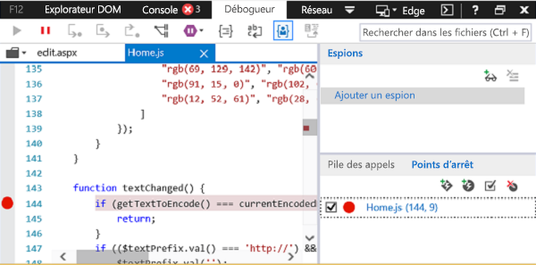
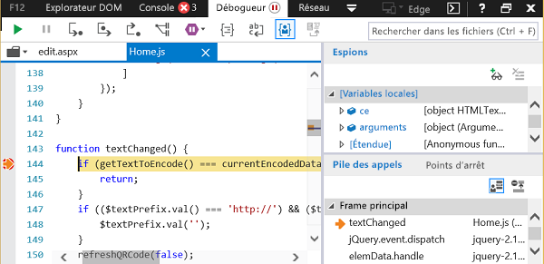

# Débogage des compléments avec les outils de développement sur Windows 10

Il existe des outils de développement en dehors des IDE pour vous aider à déboguer vos compléments sous Windows 10. Ils sont utiles lorsque vous devez examiner un problème pendant l’exécution de votre complément hors de l’IDE.

L’outil que vous utilisez dépend de l’exécution du complément dans Microsoft Edge ou Internet Explorer. Cela est fonction de la version de Windows 10 et de la version d’Office qui sont installées sur l’ordinateur. Pour déterminer quel navigateur est utilisé sur votre ordinateur de développement, consultez [Navigateurs utilisés par les compléments Office](../concepts/browsers-used-by-office-web-add-ins.md).

> [!NOTE]
> Les instructions décrites dans cet article ne peuvent pas être utilisées pour déboguer un complément Outlook qui utilise des fonctions Exécuter. Pour déboguer un complément Outlook qui utilise des fonctions Exécuter, nous vous recommandons de l’attacher à Visual Studio en mode script ou à un autre débogueur de script.

## Lorsque le complément s’exécute dans Microsoft Edge

[!include[Enable debugging on Microsoft Edge DevTools](../includes/enable-debugging-on-edge-devtools.md)]

### Débogage avec Microsoft Edge DevTools

Lorsque le complément s’exécute dans Microsoft Edge, vous pouvez utiliser [Microsoft Edge DevTools](https://www.microsoft.com/p/microsoft-edge-devtools-preview/9mzbfrmz0mnj?activetab=pivot%3Aoverviewtab).

1. Exécutez le complément.

2. Exécutez Microsoft Edge DevTools.

3. Dans les outils, ouvrez l’onglet **Local**. Votre complément est répertorié par son nom.

4. Cliquez sur le nom du complément pour l’ouvrir dans les outils.

5. Ouvrez l’onglet **Débogueur**. 

6. Cliquez sur l’icône de dossier située au-dessus du volet (gauche) du **script**. Dans la liste des fichiers disponibles qui apparaît dans la liste déroulante, sélectionnez le fichier JavaScript que vous souhaitez déboguer.

7. Pour définir un point d’arrêt, sélectionnez la ligne. Vous verrez un point rouge à gauche de la ligne et une ligne correspondante dans le volet **Pile d’appels** (en bas à droite).

8. Exécutez les fonctions dans le complément, si nécessaire, afin de déclencher le point d’arrêt.

## Lorsque le complément s’exécute dans Internet Explorer

Lorsque le complément s’exécute dans Internet Explorer, vous pouvez utiliser le débogueur des outils de développement F12 sous Windows 10 pour tester votre complément. Vous pouvez lancer les outils de développement F12 après l’exécution du complément. Les outils F12 s’ouvrent dans une fenêtre distincte et n’utilisent pas Visual Studio.

> [!NOTE]
> Le débogueur fait partie des outils de développement F12 de Windows 10 et d’Internet Explorer. Il n’est pas inclus dans les versions antérieures de Windows. 

Cet exemple utilise Word et un complément gratuit d’AppSource.

1. Ouvrez un document vierge dans Word.  
    
2. Sous l’onglet **Insertion**, dans le groupe Compléments, cliquez sur **Store** et sélectionnez le complément **QR4Office**. (Vous pouvez charger n’importe quel complément depuis l’Office Store ou votre catalogue de compléments.)
    
3. Ouvrez les outils de développement F12 correspondant à votre version d’Office :
    
   - Pour la version 32 bits, utilisez C:\Windows\System32\F12\IEChooser.exe
    
   - Pour la version 64 bits, utilisez C:\Windows\SysWOW64\F12\IEChooser.exe
    
   Lorsque vous cliquez sur IEChooser, une autre fenêtre (intitulée « Choisir la cible à déboguer ») affiche les applications possibles pour effectuer le débogage. Sélectionnez l’application de votre choix. Si vous écrivez votre propre complément, sélectionnez le site web où le complément est déployé. Il peut s’agir d’une URL localhost. 
    
   Par exemple, sélectionnez **home.html**. 
    
   

4. Dans la fenêtre F12, sélectionnez le fichier à déboguer.
    
   Pour sélectionner le fichier dans la fenêtre F12, cliquez sur l’icône de dossier située au-dessus du volet (gauche) du **script**. Dans la liste des fichiers disponibles qui apparaît dans la liste déroulante, sélectionnez **Home.js**.
    
5. Définissez le point d’arrêt.
    
   Pour définir le point d’arrêt dans **Home.js**, choisissez la ligne 144 située dans la fonction `textChanged`. Vous verrez un point rouge à gauche de la ligne et une ligne correspondante dans le volet Pile d’appels et Points d’arrêt (en bas à droite). Pour connaître d’autres façons de définir un point d’arrêt, consultez la rubrique [Inspecter le code JavaScript en cours d’exécution avec le débogueur](/previous-versions/windows/internet-explorer/ie-developer/samples/dn255007(v=vs.85)). 
    
   

6. Exécutez votre complément pour déclencher le point d’arrêt.
    
   Dans Word, cliquez sur la zone de texte URL dans la partie supérieure du volet **QR4Office** et essayez de saisir du texte. Dans le débogueur, dans le volet **Pile d’appels et Points d’arrêt**, vous verrez que le point d’arrêt s’est déclenché et affiche différentes informations. Vous devrez peut-être actualiser le débogueur pour afficher les résultats.
    
   

## Voir aussi

- [Inspecter le code JavaScript en cours d’exécution avec le débogueur](/previous-versions/windows/internet-explorer/ie-developer/samples/dn255007(v=vs.85))
- [Utilisation des outils de développement F12](/previous-versions/windows/internet-explorer/ie-developer/samples/bg182326(v=vs.85))
