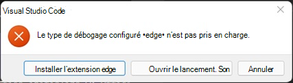

# <a name="debug-add-ins-on-windows-using-visual-studio-code-and-microsoft-edge-webview2-chromium-based"></a>Déboguer des compléments sur Windows à l’aide de Visual Studio Code et Microsoft Edge WebView2 (basé sur Chromium)

Les modules complémentaires Office fonctionnant sous Windows peuvent déboguer contre le moteur d'exécution Edge Chromium WebView2 directement dans Visual Studio Code.

> [!IMPORTANT]
> Cet article s'applique uniquement lorsqu'Office exécute des modules complémentaires dans le moteur d'exécution Microsoft Edge Chromium WebView2, comme expliqué dans la [section Navigateurs utilisés par les modules complémentaires Office](../concepts/browsers-used-by-office-web-add-ins.md). Pour obtenir des instructions sur le débogage dans Visual Studio Code contre l'héritage Microsoft Edge avec le moteur d'exécution WebView (EdgeHTML) d'origine, consultez [la section Extension Office Add-in Debugger pour Visual Studio Code](debug-with-vs-extension.md).

> [!TIP]
> Si vous ne pouvez pas ou ne souhaitez pas déboguer à l’aide d’outils intégrés à Visual Studio Code; ou vous rencontrez un problème qui se produit uniquement lorsque le complément est exécuté en dehors de Visual Studio Code, vous pouvez déboguer le runtime Edge Chromium WebView2 à l’aide des outils de développement Edge (basés sur Chromium), comme décrit dans [Déboguer les compléments à l’aide des outils de développement pour Microsoft Edge WebView2](debug-add-ins-using-devtools-edge-chromium.md).

Ce mode de débogage est dynamique et vous permet de définir des points d'arrêt pendant l'exécution du code. Visualisez immédiatement les modifications apportées à votre code lorsque le débogueur est connecté, sans perdre votre session de débogage. Les modifications de votre code persistent également, de sorte que vous voyez les résultats de plusieurs modifications de votre code. L’image suivante illustre cette extension en action.


## <a name="prerequisites"></a>Conditions préalables

- [Visual Studio Code](https://code.visualstudio.com/)
- [Node.js (version 10+)](https://nodejs.org/)
- Windows 10, 11
- La combinaison d’une plateforme et d’une application Office qui prend en charge Microsoft Edge avec WebView2 (basé sur Chromium), comme expliqué dans [Navigateurs utilisés par les compléments Office](../concepts/browsers-used-by-office-web-add-ins.md). Si votre version de Microsoft 365 est antérieure à 2101, vous devez installer WebView2. Suivez les instructions pour l’installer sur [Microsoft Edge WebView2/Incorporer du contenu web... avec Microsoft Edge webView2](https://developer.microsoft.com/microsoft-edge/webview2/).

## <a name="use-the-visual-studio-code-debugger"></a>Utiliser le débogueur de Visual Studio Code

Ces instructions supposent que vous avez l’expérience de l’utilisation de la ligne de commande, que vous comprenez JavaScript de base et que vous avez créé un projet de complément Office avant d’utiliser le [générateur Yeoman pour les compléments Office](../develop/yeoman-generator-overview.md). Si vous ne l’avez pas encore fait, consultez l’un de nos didacticiels, comme le didacticiel [complément Excel Office](../tutorials/excel-tutorial.md).

1. La première étape dépend du projet et de la façon dont il a été créé.

   - Si vous souhaitez créer un projet pour expérimenter le débogage dans Visual Studio Code, utilisez [le générateur Yeoman pour les modules complémentaires Office](../develop/yeoman-generator-overview.md). Pour ce faire, utilisez l'un de nos guides de démarrage rapide, tel que [le guide de démarrage rapide du module complémentaire Outlook](../quickstarts/outlook-quickstart.md). 
   - Si vous souhaitez déboguer un projet existant créé avec Yo Office, passez à l’étape suivante.
   - Si vous souhaitez déboguer un projet existant qui n'a pas été créé avec Yo Office, suivez la procédure de [l'annexe A](#appendix-a), puis revenez à l'étape suivante de cette procédure.

1. Ouvrez VS Code et ouvrez votre projet dans celui-ci. 

1. Choisissez **View > Run** ou entrez **Ctrl+Shift+D** pour passer en mode débogage.

1. Dans les options **RUN AND DEBUG**, choisissez l'option Edge Chromium pour votre application hôte, telle que **Outlook Desktop (Edge Chromium)**. Sélectionnez **F5** ou choisissez **Exécuter > Démarrer le débogage** dans le menu pour commencer le débogage. Cette action lance automatiquement un serveur local dans une fenêtre Node pour héberger votre complément, puis ouvre automatiquement l’application hôte, telle qu’Excel ou Word. Cela peut prendre plusieurs heures.

   > [!TIP]
   > Si vous n’utilisez pas un projet créé avec Yo Office, vous pouvez être invité à ajuster une clé de Registre. Dans le dossier racine de votre projet, exécutez ce qui suit dans la ligne de commande.
   >
   > ``` command&nbsp;line
   > npx office-addin-debugging start <your manifest path>
   > ```

   > [!IMPORTANT]
   > Si votre projet a été créé avec des versions antérieures de Yo Office, il se peut que la boîte de dialogue d'erreur suivante s'affiche environ 10 à 30 secondes après le début du débogage (à ce moment-là, vous êtes peut-être déjà passé à une autre étape de cette procédure) et qu'elle soit cachée derrière la boîte de dialogue décrite à l'étape suivante.
   >
   > 
   >
   > Terminez les tâches de [l’Annexe B](#appendix-b) , puis redémarrez cette procédure.
   
1. Dans l’application hôte, votre complément est désormais prêt à être utilisé. Sélectionnez **Afficher le volet de tâches** ou exécutez toute autre commande de complément. Une boîte de dialogue s’affiche avec un texte semblable à ce qui suit :

   > Arrêter sur chargement WebView.
   > Pour déboguer l’affichage web, attachez VS Code dans l’instance d’affichage web à l’aide du débogueur Microsoft pour l’extension Edge, puis cliquez sur OK pour continuer. Pour éviter que cette boîte de dialogue ne s’affiche à l’avenir, cliquez sur Annuler.

   Sélectionnez **OK**.

   [!INCLUDE [Cancelling the WebView Stop On Load dialog box](../includes/webview-stop-on-load-cancel-dialog.md)]

1. Vous pourrez définir des points d’arrêt dans le code de votre projet, puis déboguer. Pour définir des points d'arrêt dans Visual Studio Code, passez la souris à côté d'une ligne de code et sélectionnez le cercle rouge qui apparaît.

    

1. Exécutez la fonctionnalité dans votre add-in qui appelle les lignes avec des points d'arrêt. Vous verrez que les points d’arrêt ont été atteints et que vous pouvez inspecter les variables locales.

   > [!NOTE]
   > Les points d’arrêt dans les appels de `Office.initialize` ou de `Office.onReady` sont ignorés. Pour plus d’informations sur ces méthodes, consultez [Initialiser votre complément Office](../develop/initialize-add-in.md).

> [!IMPORTANT]
> La meilleure façon d’arrêter une session de débogage consiste à sélectionner **Shift+F5** ou à choisir **Exécuter > Arrêter le débogage** dans le menu. Cette action doit fermer la fenêtre du serveur Node et tenter de fermer l’application hôte, mais une invite s’affiche sur l’application hôte vous demandant s’il faut enregistrer le document ou non. Faites un choix approprié et laissez l’application hôte se fermer. Évitez de fermer manuellement la fenêtre Node ou l’application hôte. Cela peut entraîner des bogues en particulier lorsque vous arrêtez et démarrez des sessions de débogage à plusieurs reprises.
>
> Si le débogage cesse de fonctionner ; par exemple, si les points d’arrêt sont ignorés ; arrêter le débogage. Ensuite, si nécessaire, fermez toutes les fenêtres d’application hôte et la fenêtre Nœud. Enfin, fermez Visual Studio Code et rouvrez-le.

### <a name="appendix-a"></a>Annexe A

Si votre projet n’a pas été créé avec Yo Office, vous devez créer une configuration de débogage pour Visual Studio Code. 

1. Créez un fichier nommé `launch.json` dans le dossier du projet `\.vscode` s'il n'y en a pas déjà un. 
1. Assurez-vous que le fichier possède un `configurations` tableau. Voici un exemple simple d’un `launch.json`.

   ```json
   {
     // other properities may be here.
   
     "configurations": [
   
       // configuration objects may be here.
   
     ]
   
     //other properies may be here.
   }
   ```

1. Ajoutez l’objet suivant au `configurations` tableau.

   ```json
   {
      "name": "$HOST$ Desktop (Edge Chromium)",
      "type": "pwa-msedge",
      "request": "attach",
      "useWebView": true,
      "port": 9229,
      "timeout": 600000,
      "webRoot": "${workspaceRoot}",
      "preLaunchTask": "Debug: Excel Desktop",
      "postDebugTask": "Stop Debug"
   },
   ```

1. Remplacez le caractère générique `$HOST$` par le nom de l'application Office dans laquelle le module complémentaire s'exécute, par exemple `Outlook` ou `Word`.
1. Enregistrez et fermez le fichier.

### <a name="appendix-b"></a>Annexe B

1. Dans la boîte de dialogue d’erreur, sélectionnez le bouton **Annuler**.
1. Si le débogage ne s'arrête pas automatiquement, sélectionnez **Shift+F5** ou choisissez **Exécuter > Arrêter le débogage** dans le menu. 
1. Fermez la fenêtre Nœud sur laquelle le serveur local est en cours d’exécution, s’il ne se ferme pas automatiquement.
1. Fermez l'application Office si elle ne se ferme pas automatiquement.
1. Ouvrez le fichier `\.vscode\launch.json` dans le projet. 
1. Dans le tableau `configurations`, il existe plusieurs objets de configuration. Recherchez celui dont le nom a le modèle `$HOST$ Desktop (Edge Chromium)` où $HOST$ est une application Office dans laquelle votre complément s’exécute ; par exemple, `Outlook Desktop (Edge Chromium)` ou `Word Desktop (Edge Chromium)`. 
1. Modifiez la valeur de la propriété de `"type"` par `"edge"` ou `"pwa-msedge"`.
1. Changez la valeur de la propriété `"useWebView"` de la chaîne `"advanced"` par la chaîne de caractères au booléen `true` (notez qu'il n'y a pas de guillemets autour du `true`).
1. Enregistrez le fichier.
1. Fermez VS Code.

## <a name="see-also"></a>Voir aussi

- [Test et débogage de compléments Office](test-debug-office-add-ins.md)
- [Déboguer les add-ins sur Windows à l'aide de Visual Studio Code et du WebView hérité de Microsoft Edge (EdgeHTML)](debug-with-vs-extension.md)
- [Déboguer des compléments à l’aide des outils de développement pour Internet Explorer](debug-add-ins-using-f12-tools-ie.md)
- [Déboguer des compléments à l’aide des outils de développement pour la version héritée Edge](debug-add-ins-using-devtools-edge-legacy.md)
- [Déboguer des compléments à l’aide des Outils de développement dans Microsoft Edge (basés sur Chromium)](debug-add-ins-using-devtools-edge-chromium.md)
- [Attacher un débogueur à partir du volet Office](attach-debugger-from-task-pane.md)
