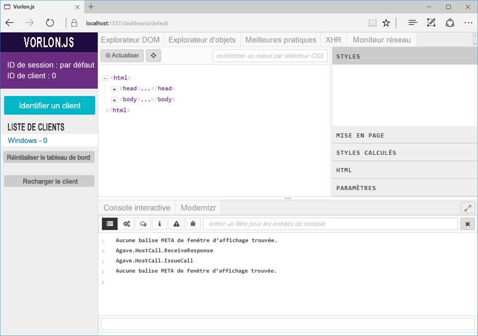

# <a name="debug-office-add-ins-on-ipad-and-mac"></a>Débogage des compléments Office sur iPad et Mac

Vous pouvez utiliser Visual Studio pour le développement et le débogage des compléments sur Windows. Toutefois, vous ne pouvez pas l’utiliser pour déboguer les compléments sur iPad ou sur Mac. Dans la mesure où les compléments sont développés dans le code HTML et Javascript, ils devraient fonctionner sur différentes plateformes. Il peut toutefois exister de légères différences dans l’affichage du code HTML dans les différents navigateurs. Cette rubrique explique comment déboguer les compléments en exécution sur iPad ou sur Mac. 

## <a name="debugging-with-vorlonjs"></a>Débogage avec Vorlon.JS 

Vorlon.JS est un débogueur de pages web, semblable aux outils disponibles avec la touche F12. Il est conçu pour fonctionner à distance et déboguer des pages web sur différents appareils. Pour plus d’informations, consultez le [site web de Vorlon](http://www.vorlonjs.com).  

### <a name="install-and-set-up-up-vorlonjs-on-a-mac-or-ipad"></a>Installation et configuration de Vorlon.JS sur Mac ou iPad 

1.  Connectez-vous à l’appareil en tant qu’administrateur.

2.  Installez [Node.js](https://nodejs.org) s’il n’est pas déjà installé. 

2.  Ouvrez une fenêtre **Terminal** et entrez la commande `npm i -g vorlon`. L’outil est installé dans le dossier `/usr/local/lib/node_modules/vorlon`.

### <a name="configure-vorlonjs-to-use-https"></a>Configuration de Vorlon.JS pour une utilisation avec le protocole HTTPS

Pour déboguer une application à l’aide de Vorlon.JS, ajoutez la balise `<script>` à la page d’ouverture de l’application qui charge un script Vorlon.JS à partir d’un emplacement connu (pour plus de détails, reportez-vous à la procédure suivante). Le protocole HTTPS, ou SSL, est requis pour les compléments. Par extension, tout script utilisé doit être hébergé sur un serveur HTTPS, y compris le script Vorlon.JS. Par conséquent, afin d’utiliser Vorlon.JS avec des compléments, vous devez le configurer pour qu’il se serve du protocole SSL. 

4.  Dans **Finder**, accédez à `/usr/local/lib/node_modules/vorlon`, ouvrez le menu contextuel (en cliquant avec le bouton droit) du dossier `/Server`, puis sélectionnez **Lire les informations**.

5.  Cliquez sur l’icône en forme de cadenas dans le coin inférieur droit de la fenêtre **Informations sur le serveur** pour déverrouiller le dossier.

6. Dans la section **Partage et permissions** de la fenêtre, définissez le **privilège** pour le groupe **personnel** sur **Lecture et écriture**.

7. Cliquez à nouveau sur l’icône en forme de cadenas pour ***verrouiller à nouveau*** le dossier.

8. Dans **Finder**, développez le sous-dossier `/Server`, cliquez avec le bouton droit sur le fichier `config.json`, puis sélectionnez **Lire les informations**.

9. Dans la fenêtre **config.json info**, modifiez les privilèges du fichier de la même façon que pour le dossier `/Server` parent. Verrouillez à nouveau le dossier et fermez la fenêtre.

10. Dans **Finder**, cliquez avec le bouton droit sur le fichier `config.json`, sélectionnez **Ouvrir avec**, puis **TextEdit**. Le fichier s’ouvre dans un éditeur de texte.

11. Définissez la valeur de la propriété **useSSL** sur `true`.

12. Dans la section **Modules**, recherchez le module ayant pour **ID** `OFFICE` et pour **nom** `Office Addin`. Si la valeur de la propriété **enabled** pour le module n’est pas déjà définie sur `true`, définissez-la sur `true`.

13. Enregistrez le fichier et fermez l’éditeur.

5.  Dans **Finder**, accédez à `/usr/local/lib/node_modules/vorlon`, cliquez avec le bouton droit sur le sous-dossier `Server`, et sélectionnez **Nouveau terminal au dossier**. 
    
7.  Dans la fenêtre **Terminal**, entrez `sudo vorlon`. Vous êtes invité à saisir le mot de passe de l’administrateur. Le serveur Vorlon démarre. Laissez la fenêtre **Terminal** ouverte.

6.  Ouvrez une fenêtre de navigateur et accédez à `https://localhost:1337`, qui est l’interface de Vorlon.JS. Lorsque vous y êtes invité, sélectionnez **Toujours** pour approuver le certificat de sécurité. 

    >**Remarque :** si aucune fenêtre d’invite n’apparaît, vous devrez peut-être approuver le certificat manuellement. Le fichier de certificat est le suivant : `/usr/local/lib/node_modules/vorlon/Server/cert/server.crt`. Suivez la procédure ci-dessous. Si vous rencontrez des problèmes, consultez l’aide de Macintosh ou iPad. 
    >
    >1. Fermez la fenêtre du navigateur et, dans la fenêtre **Terminal** en cours d’exécution sur le serveur Vorlon, utilisez le raccourci Ctrl+C pour arrêter le serveur.
    >2. Dans **Finder**, cliquez avec le bouton droit sur le fichier `server.crt` et sélectionnez **Trousseaux d’accès**. La fenêtre **Trousseaux d’accès** s’ouvre.
    >2. Dans la liste **Trousseaux** sur la gauche, sélectionnez **Connexion** si l’option n’est pas déjà sélectionnée, puis choisissez **Certificats** dans la section **Catégorie**. Le certificat **localhost** figure dans la liste.
    >3. Cliquez avec le bouton droit sur le certificat **localhost** et sélectionnez **Lire les informations**. Une fenêtre **localhost** s’ouvre.
    >4. Dans la section **Approuver**, ouvrez le sélecteur nommé **Lors de l’utilisation de ce certificat** et sélectionnez **Toujours approuver**. 
    >5. Fermez la fenêtre **localhost**. Si l’action réussit, une croix blanche dans un cercle bleu apparaît sur l’icône du certificat **localhost** dans la fenêtre **Trousseaux d’accès**.

### <a name="configure-the-add-in-for-vorlonjs-debugging"></a>Configuration du complément pour le débogage Vorlon.JS

1. Ajoutez la balise de script suivante à la section `<head>` du fichier home.html (ou fichier HTML principal) de votre complément :

    ```    
    <script src="https://localhost:1337/vorlon.js"></script>    
    ```  

2. Déployez l’application web du complément sur un serveur web accessible à partir de l’ordinateur Mac ou de l’iPad, tel qu’un site web Azure. 

3. Mettez à jour l’URL du complément à tous les emplacements où elle apparaît dans le manifeste du complément.

4. Copiez le manifeste du complément dans le dossier suivant sur l’ordinateur Mac ou l’iPad : `/Users/{your_name_on_the_device}/Library/Containers/com.microsoft.{host_name}/Data/Documents/wef`, où *{host_name}* est Word, Excel, PowerPoint ou Outlook.

### <a name="inspect-an-add-in-in-vorlonjs"></a>Vérification d’un complément dans Vorlon.JS

1. Si le serveur Vorlon n’est pas en cours d’exécution, dans **Finder**, accédez à `/usr/local/lib/node_modules/vorlon`, puis cliquez avec le bouton droit sur le sous-dossier `Server` et sélectionnez **Nouveau terminal au dossier**. 
    
7.  Dans la fenêtre **Terminal**, entrez `sudo vorlon`. Vous êtes invité à saisir le mot de passe de l’administrateur. Le serveur Vorlon démarre. Laissez la fenêtre **Terminal** ouverte.

6.  Ouvrez une fenêtre de navigateur et accédez à `https://localhost:1337`, qui est l’interface de Vorlon.JS.

7. Chargez une version test du complément. S’il s’agit d’un complément pour Excel, PowerPoint ou Word, chargez une version test en suivant les étapes décrites dans la rubrique relative au [chargement d’une version test d’un complément Office sur iPad et Mac](https://dev.office.com/docs/add-ins/testing/sideload-an-office-add-in-on-ipad-and-mac). S’il s’agit d’un complément Outlook, chargez une version de test en suivant les étapes décrites dans la rubrique relative au [chargement de version test des compléments Outlook](https://dev.office.com/docs/add-ins/testing/sideload-outlook-add-ins-for-testing). Si le complément n’utilise pas les commandes du complément, il s’ouvre automatiquement. Sinon, cliquez sur le bouton d’ouverture du complément. En fonction de la version de l’application hôte d’Office, vous trouverez le bouton sur l’onglet **Accueil** ou sur l’onglet **Complément**.

Le complément apparaît dans la liste des clients dans Vorlon.JS (sur la gauche dans l’interface de Vorlon.JS) en tant que **{Système d’exploitation} - n**, pour un nombre *n*, et où *{Système d’exploitation}* correspond au type d’appareil (par exemple, « Macintosh »). 



L’outil Vorlon dispose d’une variété de plug-ins. Les plug-ins actuellement activés apparaissent sous forme d’onglets dans la partie supérieure de l’interface de l’outil. (Vous pouvez en activer davantage en cliquant sur l’icône en forme d’engrenage sur la gauche.) Ces plug-ins sont semblables aux fonctions disponibles dans les outils F12. Par exemple, vous pouvez mettre en surbrillance les éléments DOM, exécuter des commandes, etc. Pour plus d’informations, reportez-vous à la page relative à la [documentation principale sur les plug-ins Vorlon](http://vorlonjs.com/documentation/#console). 

Un plug-in **Complément Office** permet d’ajouter des fonctionnalités supplémentaires pour Office.js, telles que l’exploration du modèle objet, l’exécution d’appels Office.js et la lecture des valeurs des propriétés de l’objet. Pour plus d’informations, reportez-vous à l’article relatif à l’utilisation du [plug-in VorlonJS pour déboguer un complément Office](https://blogs.msdn.microsoft.com/mim/2016/02/18/vorlonjs-plugin-for-debugging-office-addin/).

>**Remarque :** il n’existe aucun moyen de définir des points d’arrêt dans Vorlon.JS.

## <a name="clearing-the-office-applications-cache-on-a-mac-or-ipad"></a>Effacement du cache de l’application Office sur un ordinateur Mac ou un iPad

Les compléments sont souvent mis en cache dans Office pour Mac, pour des raisons de performances. En règle générale, vous pouvez effacer le cache en rechargeant le complément. En présence de plusieurs compléments dans le même document, il se peut que le processus d’effacement automatique du cache lors du rechargement ne fonctionne pas systématiquement. 

Sur un ordinateur Mac, vous pouvez effacer le cache manuellement en supprimant tous les éléments contenus dans le dossier `/Users/{your_name_on_the_device}/Library/Containers/com.Microsoft.OsfWebHost/Data/`. 

Sur un iPad, vous pouvez appeler `window.location.reload(true)` à partir de JavaScript dans le complément pour forcer le rechargement. Vous pouvez également choisir de réinstaller Office.
