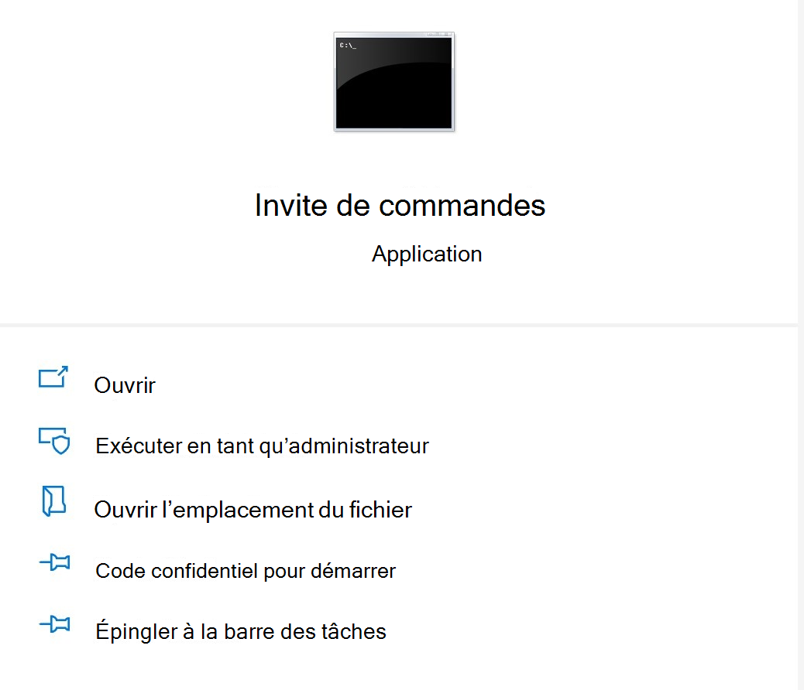

# <a name="microsoft-office-add-in-debugger-extension-for-visual-studio-code"></a>Complément Microsoft Office Extension de débogueur pour Visual Studio Code

L’extension de déboguer du Microsoft Office pour Visual Studio Code vous permet de déboguer votre Office Par rapport au Microsoft Edge avec le runtime WebView d’origine (EdgeHTML). Pour obtenir des instructions sur le débogage Microsoft Edge WebView2 (basé sur Chromium web), consultez [cet article.](./debug-desktop-using-edge-chromium.md)

Ce mode de débogage est dynamique, ce qui vous permet de définir des points d’arrêt pendant l’exécution du code. Vous pouvez voir les modifications dans votre code immédiatement lorsque le déboguer est attaché, tout cela sans perdre votre session de débogage. Vos modifications de code sont également persistantes, afin que vous pouvez voir les résultats de plusieurs modifications apportées à votre code. L’image suivante illustre cette extension en action.


## <a name="prerequisites"></a>Configuration requise

- [Visual Studio Code](https://code.visualstudio.com/) (doit être exécuté en tant qu’administrateur)
- [Node.js (version 10+)](https://nodejs.org/)
- Windows 10, 11
- [Microsoft Edge](https://www.microsoft.com/edge)

Ces instructions supposent que vous avez de l’expérience en utilisant la ligne de commande, que vous comprenez javaScript de base et que vous avez créé un projet de Office avant d’utiliser le générateur Yo Office. Si vous ne l’avez pas encore fait, envisagez de consulter l’un de nos didacticiels, comme Excel Office [didacticiel sur le add-in.](../tutorials/excel-tutorial.md)

## <a name="install-and-use-the-debugger"></a>Installer et utiliser le débogueur

1. Si vous avez besoin de créer un projet de Office, utilisez le générateur [yo-Office pour en créer un.](../quickstarts/excel-quickstart-jquery.md?tabs=yeomangenerator) Suivez les invites de la ligne de commande pour configurer votre projet. Vous pouvez choisir n’importe quelle langue ou type de projet en fonction de vos besoins. Ce didacticiel utilise un Excel du volet Des tâches.

    > [!NOTE]
    > Si vous avez déjà un projet, ignorez l’étape 1 et passez à l’étape 2.

1. Ouvrez une invite de commandes en tant qu’administrateur.
   

1. Accédez au répertoire de votre projet.

1. Exécutez la commande suivante pour ouvrir votre projet dans Visual Studio Code en tant qu’administrateur.

    ```command&nbsp;line
    code .
    ```

  Une Visual Studio Code est ouverte, accédez manuellement au dossier du projet.

  > [!TIP]
  > Pour ouvrir Visual Studio Code en tant qu’administrateur, sélectionnez **l’option** Exécuter en tant qu’administrateur lors de l’ouverture Visual Studio Code après l’avoir recherché dans Windows.

1. Dans VS Code, sélectionnez **Ctrl + Shift + X** pour ouvrir la barre Extensions. Recherchez l’extension « Microsoft Office débompeur de l’extension de module de 2013 » et installez-

1. Dans le dossier .vscode de votre projet, ouvrez le fichier **launch.json**. Ajoutez le code suivant à la `configurations` section.

    ```JSON
    {
      "type": "office-addin",
      "request": "attach",
      "name": "Attach to Office Add-ins",
      "port": 9222,
      "trace": "verbose",
      "url": "https://localhost:3000/taskpane.html?_host_Info=HOST$Win32$16.01$en-US$$$$0",
      "webRoot": "${workspaceFolder}",
      "timeout": 45000
    }
    ```

1. Dans la section JSON que vous avez copiée, recherchez la `"url"` propriété. Dans cette URL, vous devez remplacer le texte **HOST** en minuscules par l’application qui héberge votre Office de messagerie. Par exemple, si votre Office est pour Excel, la valeur de votre URL est `"https://localhost:3000/taskpane.html?_host_Info=Excel$Win32$16.01$en-US$\$\$\$0"` .

1. Ouvrez l’invite de commandes et assurez-vous que vous êtes dans le dossier racine de votre projet. Exécutez la commande `npm start` pour démarrer le serveur dev. Lorsque votre application se charge dans l’application Office, ouvrez le volet Des tâches.

1. Revenir à Visual Studio Code et choisissez **Afficher >** Déboguer ou entrez **Ctrl+Shift+D** pour passer en mode Débogage.

1. Dans les options de débogage, sélectionnez Attacher aux Office de **travail.** Sélectionnez **F5** ou **sélectionnez Exécuter > démarrer le débogage** à partir du menu pour commencer le débogage.

1. Définissez un point d’arrêt dans le fichier du volet Des tâches de votre projet. Vous pouvez définir des points d’arrêt Visual Studio Code en pointant à côté d’une ligne de code et en sélectionnant le cercle rouge qui s’affiche.

    

1. Exécutez votre add-in. Vous verrez que les points d’arrêt ont été atteints et que vous pouvez inspecter les variables locales.

## <a name="see-also"></a>Voir aussi

- [Test et débogage de compléments Office](test-debug-office-add-ins.md)
- [Déboguer des compléments à l’aide des outils de développement pour Internet Explorer](debug-add-ins-using-f12-tools-ie.md)
- [Déboguer des compléments à l’aide des outils de développement pour la version héritée Edge](debug-add-ins-using-devtools-edge-legacy.md)
- [Déboguer des applications à l’aide des outils de développement Microsoft Edge (Chromium base de données)](debug-add-ins-using-devtools-edge-chromium.md)
