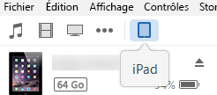
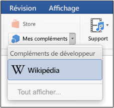
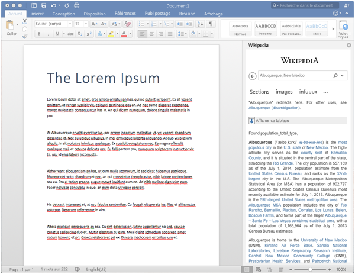

# Chargement de version test des compléments Office sur iPad et Mac

Pour voir comment votre complément s’exécutera dans Office pour iOS, vous pouvez charger une version test du manifeste de votre complément sur un iPad à l’aide d’iTunes ou directement dans Office pour Mac. Cette opération ne vous permettra pas de définir des points d’arrêt ni de déboguer le code de votre complément pendant son exécution, mais vous pourrez observer son comportement, et vérifier que l’interface utilisateur est fonctionnelle et qu’elle s’affiche correctement. 

## Configuration requise pour Office pour iOS

- Un ordinateur Windows ou Mac sur lequel [iTunes](http://www.apple.com/itunes/download/) est installé.
    
- Un iPad fonctionnant sous iOS 8.2 ou version ultérieure sur lequel [Excel pour iPad](https://itunes.apple.com/us/app/microsoft-excel/id586683407?mt=8) est installé et disposant d’un câble de synchronisation.
    
- Le fichier .xml de manifeste pour le complément que vous voulez tester.
    

## Configuration requise pour Office pour Mac

- Un Mac fonctionnant sous OS X v10.10 « Yosemite » ou une version ultérieure, avec [Office pour Mac](https://products.office.com/en-us/buy/compare-microsoft-office-products?tab=omac) installé.
    
- Word pour Mac version 15.18 (160109).
   
- Excel pour Mac version 15.19 (160206).

- PowerPoint pour Mac version 15.24 (160614)
    
- Le fichier .xml de manifeste pour le complément que vous voulez tester.
    

## Chargement d’une version test d’un complément dans Excel ou Word pour iPad

1. Utilisez un câble de synchronisation pour connecter votre iPad à votre ordinateur. Lorsque vous connectez l’iPad à votre ordinateur pour la première fois, le message **Approuver cet ordinateur ?** s’affiche. Sélectionnez **Approuver** pour continuer.

2. Dans iTunes, sélectionnez l’icône **iPad** en dessous de la barre de menu.
    
    

3. Sous  **Réglages** sur le côté gauche d’iTunes, sélectionnez **Applications**.
    
    

4. Sur le côté droite d’iTunes, faites défiler vers  **Partage de fichiers**, puis sélectionnez  **Excel** ou **Word** dans la colonne **Compléments**.
    
    

5. Au bas de la colonne  **Excel** ou **Documents Word**, sélectionnez  **Ajouter un fichier**, puis sélectionnez le fichier .xml de manifeste du complément dont vous voulez charger une version test. 
    
6. Ouvrez l'application Excel ou Word sur votre iPad. Si l'application Excel ou Word est déjà en cours d'exécution, choisissez le bouton  **Home**, puis fermez et redémarrez l'application.
    
7. Ouvrez un document.
    
8. Choisissez  **Compléments** dans l’onglet **Insérer**. La version test chargée de votre complément peut être insérée sous l’en-tête  **Développeur** dans l’interface utilisateur **Compléments**.
    
    

## Charger une version test de complément dans Office pour Mac

> **Remarque :** Pour charger une version test d’un complément Outlook 2016 pour Mac, voir [Chargement de version test des compléments Outlook](sideload-outlook-add-ins-for-testing.md).

1. Ouvrez **Terminal** et accédez à l’un des dossiers suivants, dans lequel vous enregistrerez le fichier manifeste de votre complément. Si le dossier `wef` n’existe pas sur votre ordinateur, créez-le.
    
    - Pour Word : `/Users/<username>/Library/Containers/com.microsoft.Word/Data/documents/wef`    
    - Pour Excel : `/Users/<username>/Library/Containers/com.microsoft.Excel/Data/documents/wef`
    - Pour PowerPoint : `/Users/<username>/Library/Containers/com.microsoft.Powerpoint/Data/documents/wef`
    
2. Ouvrez le dossier dans **Finder** à l’aide de la commande `open .` (sans oublier le point). Copier le fichier manifeste de votre complément dans ce dossier.
    
    

3. Ouvrez Word, puis ouvrez un document. Redémarrez Word si cette application est déjà en cours d'exécution.
    
4. Dans Word, choisissez **Insertion** > **Compléments** > **Mes compléments** (menu déroulant), puis choisissez votre complément.
    
    

  > **Important :** Les versions test chargées de vos compléments ne s’afficheront pas dans la boîte de dialogue Mes compléments. Elles sont visibles uniquement dans le menu déroulant (petite flèche vers le bas à droite de Mes compléments dans l’onglet **Insérer**). Les versions test chargées de vos compléments sont répertoriées sous l’en-tête **Compléments de développeur** dans ce menu. 
    
5. Vérifiez que votre complément apparaît dans Word.
    
    
    
> **Remarque :** Les compléments sont souvent mis en cache dans Office pour Mac, pour des raisons de performances. Si vous avez besoin de forcer le rechargement de votre complément en cours de développement, vous pouvez effacer le dossier Users/<usr>/Library/Containers/com.Microsoft.OsfWebHost/Data/. 

## Ressources supplémentaires

- [Débogage des compléments Office sur iPad et Mac](../testing/debug-office-add-ins-on-ipad-and-mac.md)
    
