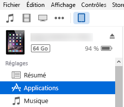
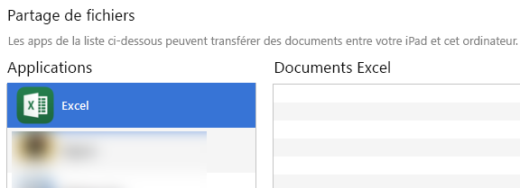
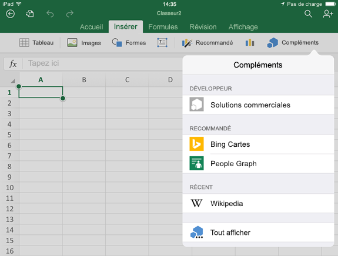
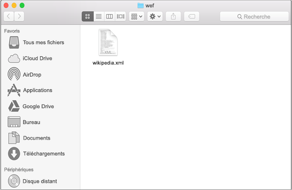
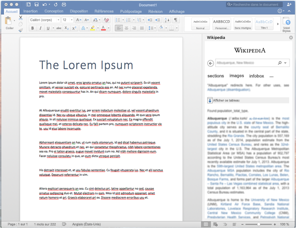

# Chargement de version test des compléments Office sur iPad et MacSideload Office Add-ins on iPad and Mac for testing

Pour voir comment votre complément s’exécutera dans Office pour iOS, vous pouvez charger une version test du manifeste de votre complément sur un iPad à l’aide d’iTunes ou directement dans Office pour Mac. Cette opération ne vous permettra pas de définir des points d’arrêt ni de déboguer le code de votre complément pendant son exécution, mais vous pourrez observer son comportement, et vérifier que l’interface utilisateur est fonctionnelle et qu’elle s’affiche correctement.To see how your add-in will run in Office for iOS, you can sideload your add-in's manifest onto an iPad using iTunes, or sideload your add-in's manifest directly in Office for Mac. This action won't enable you to set breakpoints and debug your add-in's code while it's running, but you can see how it behaves and verify that the UI is usable and rendering appropriately. 

## Configuration requise pour Office pour iOSPrerequisites for Office for iOS

- Un ordinateur Windows ou Mac sur lequel [iTunes](http://www.apple.com/itunes/download/) est installé.A Windows or Mac computer with [iTunes](http://www.apple.com/itunes/download/) installed.
    
- Un iPad fonctionnant sous iOS 8.2 ou version ultérieure sur lequel [Excel pour iPad](https://itunes.apple.com/us/app/microsoft-excel/id586683407?mt=8) est installé et disposant d’un câble de synchronisation.An iPad running iOS 8.2 or later with [Excel for iPad](https://itunes.apple.com/us/app/microsoft-excel/id586683407?mt=8) installed, and a sync cable.
    
- Le fichier .xml de manifeste pour le complément que vous voulez tester.The manifest .xml file for the add-in you want to test.
    

## Configuration requise pour Office pour MacPrerequisites for Office for Mac

- Un Mac fonctionnant sous OS X v10.10 « Yosemite » ou une version ultérieure, avec [Office pour Mac](https://products.office.com/buy/compare-microsoft-office-products?tab=omac) installé.A Mac running OS X v10.10 "Yosemite" or later with [Office for Mac](https://products.office.com/buy/compare-microsoft-office-products?tab=omac) installed.
    
- Word pour Mac version 15.18 (160109).Word for Mac version 15.18 (160109).
   
- Excel pour Mac version 15.19 (160206).Excel for Mac version 15.19 (160206).

- PowerPoint pour Mac version 15.24 (160614)PowerPoint for Mac version 15.24 (160614)
    
- Le fichier .xml de manifeste pour le complément que vous voulez tester.The manifest .xml file for the add-in you want to test.
    

## Chargement d’une version test d’un complément dans Excel ou Word pour iPadSideload an add-in on Excel or Word for iPad

1. Utilisez un câble de synchronisation pour connecter votre iPad à votre ordinateur. Lorsque vous connectez l’iPad à votre ordinateur pour la première fois, le message **Approuver cet ordinateur ?** s’affiche. Sélectionnez **Approuver** pour continuer.Use a sync cable to connect your iPad to your computer. If you're connecting the iPad to your computer for the first time, you'll be prompted with  **Trust This Computer?**. Choose **Trust** to continue.

2. Dans iTunes, sélectionnez l’icône **iPad** en dessous de la barre de menu.In iTunes, choose the  **iPad** icon below the menu bar.
    
    

3. Sous  **Réglages** sur le côté gauche d’iTunes, sélectionnez **Applications**.Under  **Settings** on the left side of iTunes, choose **Apps**.
    
    

4. Sur le côté droite d’iTunes, faites défiler vers  **Partage de fichiers**, puis sélectionnez  **Excel** ou **Word** dans la colonne **Compléments**.On the right side of iTunes, scroll down to  **File Sharing**, and then choose  **Excel** or **Word** in the **Add-ins** column.
    
    

5. Au bas de la colonne  **Excel** ou **Documents Word**, sélectionnez  **Ajouter un fichier**, puis sélectionnez le fichier .xml de manifeste du complément dont vous voulez charger une version test.At the bottom of the  **Excel** or **Word Documents** column, choose **Add File**, and then select the manifest .xml file of the add-in you want to sideload. 
    
6. Ouvrez l'application Excel ou Word sur votre iPad. Si l'application Excel ou Word est déjà en cours d'exécution, choisissez le bouton  **Home**, puis fermez et redémarrez l'application.Open the Excel or Word app on your iPad. If the Excel or Word app is already running, choose the  **Home** button, and then close and restart the app.
    
7. Ouvrez un document.Open a document.
    
8. Choisissez  **Compléments** dans l’onglet **Insérer**. La version test chargée de votre complément peut être insérée sous l’en-tête  **Développeur** dans l’interface utilisateur **Compléments**.Choose  **Add-ins** on the **Insert** tab. Your sideloaded add-in is available to insert under the **Developer** heading in the **Add-ins** UI.
    
    

## Charger une version test de complément dans Office pour MacSideload an add-in on Office for Mac

> [!NOTE]
> Pour charger une version test d’un complément Outlook pour Mac, consultez [Chargement de version test des compléments Outlook](https://docs.microsoft.com/outlook/add-ins/sideload-outlook-add-ins-for-testing).To sideload Outlook 2016 for Mac add-in, see [Sideload Outlook add-ins for testing](https://docs.microsoft.com/outlook/add-ins/sideload-outlook-add-ins-for-testing).

1. Ouvrez **Terminal** et accédez à l’un des dossiers suivants, dans lequel vous enregistrerez le fichier manifeste de votre complément. Si le dossier `wef` n’existe pas sur votre ordinateur, créez-le.Open  **Terminal** and go to one of the following folders where you'll save your add-in's manifest file. If the `wef` folder doesn't exist on your computer, create it.
    
    - Pour Word :  `/Users/<username>/Library/Containers/com.microsoft.Word/Data/documents/wef`For Word:  `/Users/<username>/Library/Containers/com.microsoft.Word/Data/documents/wef`    
    - Pour Excel :  `/Users/<username>/Library/Containers/com.microsoft.Excel/Data/documents/wef`For Excel:  `/Users/<username>/Library/Containers/com.microsoft.Excel/Data/documents/wef`
    - Pour PowerPoint : `/Users/<username>/Library/Containers/com.microsoft.Powerpoint/Data/documents/wef`For PowerPoint: `/Users/<username>/Library/Containers/com.microsoft.Powerpoint/Data/documents/wef`
    
2. Ouvrez le dossier dans **Finder** à l’aide de la commande `open .` (sans oublier le point). Copier le fichier manifeste de votre complément dans ce dossier.Open the folder in  **Finder** using the command `open .` (including the period or dot). Copy your add-in's manifest file to this folder.
    
    

3. Ouvrez Word, puis ouvrez un document. Redémarrez Word si cette application est déjà en cours d'exécution.Open Word, and then open a document. Restart Word if it's already running.
    
4. Dans Word, choisissez **Insertion** > **Compléments** > **Mes compléments** (menu déroulant), puis choisissez votre complément.In Word, choose  **Insert** > **Add-ins** > **My Add-ins** (drop-down menu), and then choose your add-in.
    
    

    > [!IMPORTANT]
    > Les versions test chargées de vos compléments ne s’afficheront pas dans la boîte de dialogue Mes compléments. Elles sont visibles uniquement dans le menu déroulant (petite flèche vers le bas à droite de Mes compléments dans l’onglet **Insérer**). Les versions test chargées de vos compléments sont répertoriées sous l’en-tête **Compléments de développeur** dans ce menu.Sideloaded add-ins will not show up in the My Add-ins dialog box. They are only visible within the drop-down menu (small down-arrow to the right of My Add-ins on the **Insert** tab). Sideloaded add-ins are listed under the **Developer Add-ins** heading in this menu. 
    
5. Vérifiez que votre complément apparaît dans Word.Verify that your add-in is displayed in Word.
    
    
    
    > [!NOTE]
    > Les compléments sont souvent mis en cache dans Office pour Mac, pour des raisons de performances. Si vous avez besoin de forcer le rechargement de votre complément en cours de développement, vous pouvez effacer le dossier `Users/<usr>/Library/Containers/com.Microsoft.OsfWebHost/Data/`.Add-ins are cached often in Office for Mac, for performance reasons. If you need to force a reload of your add-in while you're developing it, you can clear the `Users/<usr>/Library/Containers/com.Microsoft.OsfWebHost/Data/` folder. 

## Voir aussiSee also

- [Débogage des compléments Office sur iPad et MacDebug Office Add-ins on iPad and Mac](debug-office-add-ins-on-ipad-and-mac.md)
    
