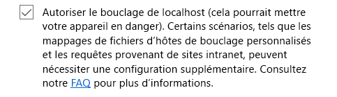

# Chargement de version test des compléments Office dans Office sur le webSideload Office Add-ins in Office on the web for testing

Vous procéder à un chargement de version test pour installer un complément Office sans avoir à le placer au préalable dans un catalogue de compléments.You can install an Office Add-in for testing without having to first put it in an add-in catalog by using sideloading. Le chargement de version test s’effectue dans Office 365 ou Office sur le web.Sideloading can be done in either Office 365 or Office Online. La procédure est légèrement différente entre les deux plateformes.The procedure is slightly different for the two platforms. 

Lorsque vous chargez une version test d’un complément, le manifeste du complément est stocké dans le stockage local du navigateur. Ainsi, si vous videz le cache du navigateur ou si vous basculez vers un autre navigateur, vous devez à nouveau charger une version test de complément.When you sideload an add-in, the add-in manifest is stored in the browser's local storage, so if you clear the browser's cache, or switch to a different browser, you have to sideload the add-in again.

> [!NOTE]
> Tel que décrit dans cet article, le chargement de version test est pris en charge dans Word, Excel et PowerPoint. Pour charger une version test de complément Outlook, voir la rubrique relative au [chargement de version test des compléments Outlook](/outlook/add-ins/sideload-outlook-add-ins-for-testing).Sideloading as described in this article is supported on Word, Excel, and PowerPoint. To sideload an Outlook add-in, see [Sideload Outlook add-ins for testing](/outlook/add-ins/sideload-outlook-add-ins-for-testing).

La vidéo suivante présente la procédure de chargement de version test de votre complément dans la version Office sur le web ou le bureau.The following video walks you through the process of sideloading your add-in in Office desktop or Office Online.

> [!VIDEO https://www.youtube.com/embed/XXsAw2UUiQo]

## Chargement de version test d’un complément Office dans Office sur le webSideload an Office Add-in in Office on the web

1. Ouvrez [Microsoft Office sur le web](https://office.live.com/).Open [Microsoft Office on the web](https://office.live.com/).
    
2. Dans **Commencer à utiliser les applications en ligne maintenant**, choisissez **Excel**, **Word** ou **PowerPoint**, puis ouvrez un document.In  **Get started with the online apps now**, choose  **Excel**,  **Word**, or  **PowerPoint**; and then open a new document.
    
3. Ouvrez l’onglet **Insérer** dans le ruban, puis dans la section **Compléments**, choisissez **Compléments Office**.Open the  **Insert** tab on the ribbon and, in the **Add-ins** section, choose **Office Add-ins**.
    
4. Dans la boîte de dialogue **Compléments Office**, sélectionnez l’onglet **MES COMPLÉMENTS**, choisissez **Gérer mes compléments**, puis **Télécharger mon complément**.On the  **Office Add-ins** dialog, select the **MY ADD-INS** tab, choose **Manage My Add-ins**, and then  **Upload My Add-in**.
    
    

5.  **Accédez** au fichier manifeste du complément, puis sélectionnez **Télécharger**.**Browse** to the add-in manifest file, and then select **Upload**.
    
    

6. Vérifiez que votre complément est installé. S’il s’agit d’une commande de complément, elle doit apparaître dans le ruban ou dans le menu contextuel. S’il s’agit d’un complément du volet Office, le volet doit apparaître.Verify that your add-in is installed. For example, if it is an add-in command, it should appear on either the ribbon or the context menu. If it is a task pane add-in, the pane should appear.

> [!NOTE]
>Pour tester votre complément Office avec Microsoft Edge, deux étapes de configuration sont nécessaires :To test your Office Add-in with Edge, two configuration steps are required: 
>
> - Depuis une invite de commandes Windows, exécutez la ligne suivante : `CheckNetIsolation LoopbackExempt -a -n="Microsoft.MicrosoftEdge_8wekyb3d8bbwe"`In a Windows Command Prompt, run the following line: `CheckNetIsolation LoopbackExempt -a -n="Microsoft.MicrosoftEdge_8wekyb3d8bbwe"`
>
> - Entrez « **about:flags** » dans la barre de recherche Microsoft Edge pour afficher les options des Paramètres de développeur.Enter “**about:flags**” in the Edge search bar to bring up the Developer Settings options.  Cochez l’option « **Autoriser le bouclage localhost** », puis redémarrez Microsoft Edge.Check the “**Allow localhost loopback**” option and restart Edge.

>    

## Chargement de version test d’un complément Office dans Office 365Sideload an Office Add-in in Office 365

1. Connectez-vous à votre compte Office 365.Sign in to your Office 365 account.
    
2. Ouvrez le lanceur d’applications à l’extrémité gauche de la barre d’outils et sélectionnez **Excel**,  **Word** ou **PowerPoint**, puis créez un document.Open the App Launcher on the left end of the toolbar and select  **Excel**,  **Word**, or  **PowerPoint**, and then create a new document.
    
3. Les étapes 3 à 6 sont identiques à celles de la section précédente, **Chargement d’une version de test d’un complément Office dans Office sur le web**.Steps 3 - 6 are the same as in the preceding section **Sideload an Office Add-in in Office Online**.

## Chargement d’une version test d’un complément lors de l’utilisation de Visual StudioSideload an add-in when using Visual Studio

Si vous développez votre complément à l’aide de Visual Studio, le processus de chargement d’une version de teste est similaire.If you're using Visual Studio to develop your add-in, the process to sideload is similar. La seule différence est que vous devez mettre à jour la valeur de l’élément **SourceURL** dans votre manifeste afin d’inclure l’URL complète de déploiement du complément.The only difference is that you must update the value of the **SourceURL** element in your manifest to include the full URL where the add-in is deployed.

> [!NOTE]
> Si vous pouvez charger une version test des compléments à partir de Visual Studio vers Office sur le web, vous ne pouvez pas les déboguer à partir de Visual Studio.Although you can sideload add-ins from Visual Studio to Office Online, you cannot debug them from Visual Studio. Pour déboguer, vous devrez utiliser les outils de débogage du navigateur.To debug you will need to use the browser debugging tools. Pour plus d’informations, voir [Débogage de compléments dans Office sur le web](debug-add-ins-in-office-online.md).For more information, see [Debug add-ins in Office Online](debug-add-ins-in-office-online.md).

1. Dans Visual Studio, affichez la fenêtre **Propriétés** en choisissant **Affichage** -> **Fenêtre Propriétés**.In Visual Studio, show the **Properties** window by choosing **View** -> **Properties Window**.
2. Dans l’**Explorateur de solutions**, sélectionnez le projet web.In the **Solution Explorer**, select the web project. Cela a pour effet d’afficher les propriétés du projet dans la fenêtre **Propriétés**.This will display properties for the project in the **Properties** window.
3. Dans la fenêtre Propriétés, copiez l’**URL SSL**.In the Properties window, copy the **SSL URL**.
4. Dans le projet de complément, ouvrez le fichier XML de manifeste.In the add-in project, open the manifest XML file. Veillez à modifier le code XML source.Be sure you are editing the source XML. Pour certains types de projets, Visual Studio ouvre un affichage visuel du code XML qui ne fonctionnera pas pour l’étape suivante.For some project types Visual Studio will open a visual view of the XML which will not work for the next step.
5. Cherchez toutes les instances de **~remoteAppUrl/** et remplacez-les par l’URL SSL que vous venez de copier.Search and replace all instances of **~remoteAppUrl/** with the SSL URL you just copied. Vous verrez plusieurs remplacements en fonction du type de projet, et les nouvelles URL ressembleront à `https://localhost:44300/Home.html`.You will see several replacements depending on the project type, and the new URLs will appear similar to `https://localhost:44300/Home.html`.
6. Enregistrez le fichier XML.Save the XML file.
7. Cliquez avec le bouton droit sur le projet web, puis sélectionnez **Déboguer** -> **Démarrer une nouvelle instance**.Right click the web project and choose **Debug** -> **Start new instance**. Cela a pour effet d’exécuter le projet web sans lancer Office.This will run the web project without launching Office.
8. À partir d’Office sur le web, chargez la version test du complément en suivant les étapes décrites précédemment dans [Chargement de version test d’un complément Office dans Office sur le web](#sideload-an-office-add-in-in-office-on-the-web).From Office Online, sideload the add-in using steps previously described in [Sideload an Office Add-in in Office Online](#sideload-an-office-add-in-in-office-on-the-web).
