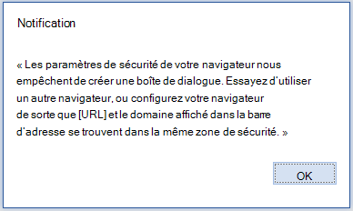

# <a name="troubleshoot-user-errors-with-office-add-ins"></a>Résolution des erreurs rencontrées par l’utilisateur avec des compléments Office

Parfois, vos utilisateurs peuvent rencontrer des problèmes avec les compléments Office que vous développez. Par exemple, il se peut qu’un complément ne se charge pas ou soit inaccessible. Utilisez les informations de cet article pour résoudre les problèmes courants que vos utilisateurs rencontrent avec votre complément Office.

Vous pouvez également utiliser [Fiddler](https://www.telerik.com/fiddler) pour identifier et déboguer les problèmes avec vos compléments.

## <a name="common-errors-and-troubleshooting-steps"></a>Erreurs courantes et étapes de dépannage

Le tableau suivant répertorie les messages d’erreur courants que les utilisateurs pourraient rencontrer, ainsi que les étapes que les utilisateurs peuvent suivre pour résoudre les erreurs.

|**Message d’erreur**|**Solution**|
|:-----|:-----|
|Erreur d’application : impossible d’accéder au catalogue|Vérifiez les paramètres de pare-feu. Le terme « catalogue » désigne AppSource. Ce message indique que l’utilisateur ne peut pas accéder à AppSource.|
|Erreur d’application : cette application n’a pas pu être démarrée. Fermez cette boîte de dialogue pour ignorer le problème, ou cliquez sur « Redémarrer » pour réessayer.|Vérifiez que les dernières mises à jour d’Office sont installés, ou téléchargez la [mise à jour pour Office 2013](https://support.microsoft.com/kb/2986156/).|
|Erreur : l’objet ne prend pas en charge la propriété ou la méthode « defineProperty »|Vérifiez qu’Internet Explorer ne fonctionne pas en mode de compatibilité. Accédez à Outils > **Paramètres d’affichage de compatibilité**.|
|Désolé, nous n’avons pas pu charger l’application, car la version de votre navigateur n’est pas prise en charge. Cliquez ici pour obtenir la liste des versions de navigateur prises en charge.|Assurez-vous que le navigateur prend en charge le stockage local HTML5 ou réinitialisez les paramètres d’Internet Explorer. Pour plus d’informations sur les navigateurs pris en charge, reportez-vous à [Configuration requise pour exécuter des compléments Office](../concepts/requirements-for-running-office-add-ins.md).|

## <a name="when-installing-an-add-in-you-see-error-loading-add-in-in-the-status-bar"></a>Lors de l’installation d’un complément, le message « Erreur lors du chargement du complément » s’affiche dans la barre d’état

1. Fermez Office.
1. Vérifiez que le manifeste est valide.
1. Redémarrez le complément.
1. Réinstallez le complément.

Vous pouvez également nous adresser des commentaires : si vous utilisez Excel sur Windows ou Mac, vous pouvez adresser un commentaire à l’équipe chargée de l’extensibilité d’Office directement à partir d’Excel. Pour ce faire, sélectionnez **Fichier** | **Commentaires** | **Envoyer un smiley mécontent**. Envoyer un smiley mécontent fournit les journaux nécessaires pour comprendre le problème.

## <a name="outlook-add-in-doesnt-work-correctly"></a>Le complément Outlook ne fonctionne pas correctement

Si un complément Outlook s’exécutant sous Windows et [à l’aide d’Internet Explorer](../concepts/browsers-used-by-office-web-add-ins.md) ne fonctionne pas correctement, essayez d’activer le débogage de script dans Internet Explorer.

- Go to Tools > **Internet Options**  >  **Advanced**.
- Sous **Parcourir**, décochez les cases **Désactiver le débogage des scripts (Internet Explorer)** et **Désactiver le débogage des scripts (autres applications)**.

Nous vous recommandons de décocher ces paramètres uniquement pour résoudre le problème. Si vous ne les réactivez pas, vous recevrez des invites. Une fois que le problème est résolu, recochez les cases **Désactiver le débogage des scripts (Internet Explorer)** et **Désactiver le débogage des scripts (autres applications)**.

## <a name="add-in-doesnt-activate-in-office-2013"></a>Le complément ne s’active pas dans Office 2013

Si le add-in ne s’active pas lorsque l’utilisateur effectue les étapes suivantes.

1. connexion à son compte Microsoft dans Office 2013 ;

1. activation de la vérification à deux étapes pour son compte Microsoft ;

1. vérification de son identité après invitation lorsqu’il tente d’insérer un complément.

Pour résoudre ce problème, vérifiez que les dernières mises à jour Office sont installées ou téléchargez la [mise à jour pour Office 2013](https://support.microsoft.com/kb/2986156/).

## <a name="add-in-dialog-box-cannot-be-displayed"></a>La boîte de dialogue des compléments ne s’affiche pas

Lorsqu’un utilisateur utilise un complément Office, il est invité à autoriser l’affichage d’une boîte de dialogue. L’utilisateur choisit **Autoriser** et le message d’erreur suivant se produit.

« Les paramètres de sécurité de votre navigateur nous empêchent de créer une boîte de dialogue. Essayez d’utiliser un autre navigateur, ou configurez votre navigateur de sorte que [URL] et le domaine affiché dans la barre d’adresse se trouvent dans la même zone de sécurité. »



|**Navigateurs concernés**|**Plateformes concernées**|
|:--------------------|:---------------------|
|Microsoft Edge|Office sur le web|

Pour résoudre le problème, les utilisateurs finaux ou les administrateurs peuvent ajouter le domaine du module à la liste des sites de confiance dans Microsoft Edge navigateur.

> [!IMPORTANT]
> n’ajoutez pas l’URL d’un complément à votre liste de sites de confiance si vous ne faites pas confiance au complément.

Pour ajouter une URL à votre liste de sites de confiance :

1. Dans **Panneau de configuration,** accédez à **Options Internet** > **Sécurité**.
1. Sélectionnez la zone **Sites de confiance**, puis choisissez **Sites**.
1. Entrez l’URL qui apparaît dans le message d’erreur, puis choisissez **Ajouter**.
1. Essayez d’utiliser le complément à nouveau. Si le problème persiste, vérifiez les paramètres pour les autres zones de sécurité et assurez-vous que le domaine du complément se trouve dans la même zone que l’URL qui s’affiche dans la barre d’adresse de l’application Office.

Ce problème se produit lorsque l’API de la boîte de dialogue est utilisée en mode contextuel. Pour éviter ce problème, utilisez l’indicateur [displayInFrame](/javascript/api/office/office.ui). Cela nécessite que votre page prenne en charge l’affichage dans un iframe. L’exemple suivant montre comment utiliser l’indicateur.

```js
Office.context.ui.displayDialogAsync(startAddress, {displayInIFrame:true}, callback);
```

## <a name="see-also"></a>Voir aussi

- [Résolution des erreurs rencontrées par l’utilisateur avec des compléments Office](troubleshoot-development-errors.md)
