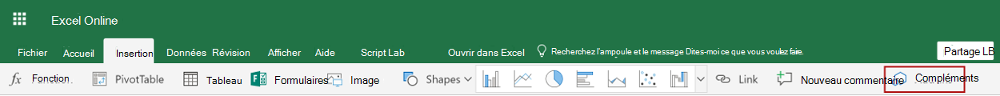

# <a name="tutorial-create-custom-functions-in-excel"></a><span data-ttu-id="d68ed-103">Didacticiel : créer des fonctions personnalisées dans Excel</span><span class="sxs-lookup"><span data-stu-id="d68ed-103">Tutorial: Create custom functions in Excel</span></span>

<span data-ttu-id="d68ed-104">Les fonctions personnalisées vous permettent d’ajouter de nouvelles fonctions dans Excel en définissant ces fonctions dans JavaScript dans le cadre d’un complément.</span><span class="sxs-lookup"><span data-stu-id="d68ed-104">Custom functions enable you to add new functions to Excel by defining those functions in JavaScript as part of an add-in.</span></span> <span data-ttu-id="d68ed-105">Les utilisateurs d’Excel peuvent accéder aux fonctions personnalisées comme ils le feraient pour n’importe quelle fonction native d’Excel, telle que `SUM()`.</span><span class="sxs-lookup"><span data-stu-id="d68ed-105">Users within Excel can access custom functions as they would any native function in Excel, such as `SUM()`.</span></span> <span data-ttu-id="d68ed-106">Vous pouvez créer des fonctions personnalisées qui effectuent des tâches simples comme des calculs personnalisés ou des tâches plus complexes telles que la diffusion en continu des données en temps réel à partir du web dans une feuille de calcul.</span><span class="sxs-lookup"><span data-stu-id="d68ed-106">You can create custom functions that perform simple tasks like calculations or more complex tasks such as streaming real-time data from the web into a worksheet.</span></span>

<span data-ttu-id="d68ed-107">Dans ce didacticiel, vous allez :</span><span class="sxs-lookup"><span data-stu-id="d68ed-107">In this tutorial, you will:</span></span>
> [!div class="checklist"]
> - <span data-ttu-id="d68ed-108">Créer un complément de fonction personnalisée à l’aide la [Générateur Yeoman de compléments Office](https://www.npmjs.com/package/generator-office).</span><span class="sxs-lookup"><span data-stu-id="d68ed-108">Create a custom function add-in using the [Yeoman generator for Office Add-ins](https://www.npmjs.com/package/generator-office).</span></span> 
> - <span data-ttu-id="d68ed-109">Utiliser une fonction personnalisée prédéfinie pour effectuer un calcul simple.</span><span class="sxs-lookup"><span data-stu-id="d68ed-109">Use a prebuilt custom function to perform a simple calculation.</span></span>
> - <span data-ttu-id="d68ed-110">Créer une fonction personnalisée qui demande les données à partir du web.</span><span class="sxs-lookup"><span data-stu-id="d68ed-110">Create a custom function that gets data from the web.</span></span>
> - <span data-ttu-id="d68ed-111">Créer une fonction personnalisée qui diffuse les données en temps réel à partir du web.</span><span class="sxs-lookup"><span data-stu-id="d68ed-111">Create a custom function that streams real-time data from the web.</span></span>

## <a name="prerequisites"></a><span data-ttu-id="d68ed-112">Conditions préalables</span><span class="sxs-lookup"><span data-stu-id="d68ed-112">Prerequisites</span></span>

[!include[Yeoman generator prerequisites](../includes/quickstart-yo-prerequisites.md)]

- <span data-ttu-id="d68ed-113">Excel sur Windows (1904 ou version ultérieure, connecté à un abonnement Microsoft 365) ou sur le web.</span><span class="sxs-lookup"><span data-stu-id="d68ed-113">Excel on Windows (version 1904 or later, connected to a Microsoft 365 subscription) or on the web</span></span>

## <a name="create-a-custom-functions-project"></a><span data-ttu-id="d68ed-114">Créer un projet de fonctions personnalisées</span><span class="sxs-lookup"><span data-stu-id="d68ed-114">Create a custom functions project</span></span>

 <span data-ttu-id="d68ed-115">Pour commencer, vous devez créer le projet de code pour créer votre complément de fonction personnalisée.</span><span class="sxs-lookup"><span data-stu-id="d68ed-115">To start, you'll create the code project to build your custom function add-in.</span></span> <span data-ttu-id="d68ed-116">Le [générateur Yeoman de compléments Office](https://www.npmjs.com/package/generator-office) permettra de configurer votre projet avec certaines fonctions personnalisées prédéfinies que vous pouvez essayer. Si vous avez déjà exécuté le démarrage rapide des fonctions personnalisées et généré un projet, continuez à utiliser ce projet et passez à [cette étape](#create-a-custom-function-that-requests-data-from-the-web).</span><span class="sxs-lookup"><span data-stu-id="d68ed-116">The [Yeoman generator for Office Add-ins](https://www.npmjs.com/package/generator-office) will set up your project with some prebuilt custom functions that you can try out. If you have already run the custom functions quick start and generated a project, continue to use that project and skip to [this step](#create-a-custom-function-that-requests-data-from-the-web) instead.</span></span>

1. [!include[Yeoman generator create project guidance](../includes/yo-office-command-guidance.md)]

    - <span data-ttu-id="d68ed-117">**Sélectionnez un type de projet :** `Excel Custom Functions Add-in project`</span><span class="sxs-lookup"><span data-stu-id="d68ed-117">**Choose a project type:** `Excel Custom Functions Add-in project`</span></span>
    - <span data-ttu-id="d68ed-118">**Sélectionnez un type de script :** `JavaScript`</span><span class="sxs-lookup"><span data-stu-id="d68ed-118">**Choose a script type:** `JavaScript`</span></span>
    - <span data-ttu-id="d68ed-119">**Comment souhaitez-vous nommer votre complément ?**</span><span class="sxs-lookup"><span data-stu-id="d68ed-119">**What do you want to name your add-in?**</span></span> `starcount`

    

    <span data-ttu-id="d68ed-121">Le générateur crée le projet et installe les composants Node.js de la prise en charge.</span><span class="sxs-lookup"><span data-stu-id="d68ed-121">The Yeoman generator will create the project files and install supporting Node components.</span></span>

    [!include[Yeoman generator next steps](../includes/yo-office-next-steps.md)]

1. <span data-ttu-id="d68ed-122">Accédez au dossier racine du projet.</span><span class="sxs-lookup"><span data-stu-id="d68ed-122">Navigate to the root folder of the project.</span></span>

    ```command&nbsp;line
    cd starcount
    ```

1. <span data-ttu-id="d68ed-123">Créez le projet.</span><span class="sxs-lookup"><span data-stu-id="d68ed-123">Build the project.</span></span>

    ```command&nbsp;line
    npm run build
    ```

    > [!NOTE]
    > <span data-ttu-id="d68ed-124">Les compléments Office doivent utiliser le protocole HTTPS, et non HTTP, même lorsque vous développez.</span><span class="sxs-lookup"><span data-stu-id="d68ed-124">Office Add-ins should use HTTPS, not HTTP, even when you are developing.</span></span> <span data-ttu-id="d68ed-125">Si vous êtes invité à installer un certificat après avoir exécuté `npm run build`, acceptez d’installer le certificat fourni par le générateur Yeoman.</span><span class="sxs-lookup"><span data-stu-id="d68ed-125">If you are prompted to install a certificate after you run `npm run build`, accept the prompt to install the certificate that the Yeoman generator provides.</span></span>

1. <span data-ttu-id="d68ed-126">Démarrez le serveur web local qui est exécuté dans Node.js.</span><span class="sxs-lookup"><span data-stu-id="d68ed-126">Start the local web server, which runs in Node.js.</span></span> <span data-ttu-id="d68ed-127">Vous pouvez tester le complément de fonction personnalisée dans Excel sur le web ou sur Windows.</span><span class="sxs-lookup"><span data-stu-id="d68ed-127">You can try out the custom function add-in in Excel on the web or Windows.</span></span>

# <a name="excel-on-windows-or-mac"></a>[<span data-ttu-id="d68ed-128">Excel sur Windows ou Mac</span><span class="sxs-lookup"><span data-stu-id="d68ed-128">Excel on Windows or Mac</span></span>](#tab/excel-windows)

<span data-ttu-id="d68ed-129">Pour tester votre complément dans Excel sur Windows ou Mac, exécutez la commande suivante.</span><span class="sxs-lookup"><span data-stu-id="d68ed-129">To test your add-in in Excel on Windows or Mac, run the following command.</span></span> <span data-ttu-id="d68ed-130">Lorsque vous exécutez cette commande, le serveur web local et Excel s’ouvrent avec votre complément chargé.</span><span class="sxs-lookup"><span data-stu-id="d68ed-130">When you run this command, the local web server will start and Excel will open with your add-in loaded.</span></span>

```command&nbsp;line
npm run start:desktop
```

# <a name="excel-on-the-web"></a>[<span data-ttu-id="d68ed-131">Excel sur le web</span><span class="sxs-lookup"><span data-stu-id="d68ed-131">Excel on the web</span></span>](#tab/excel-online)

<span data-ttu-id="d68ed-132">Pour tester votre complément dans Excel sur un navigateur, exécutez la commande suivante.</span><span class="sxs-lookup"><span data-stu-id="d68ed-132">To test your add-in in Excel on a browser, run the following command.</span></span> <span data-ttu-id="d68ed-133">Lorsque vous exécutez cette commande, le serveur web local démarre.</span><span class="sxs-lookup"><span data-stu-id="d68ed-133">When you run this command, the local web server will start.</span></span>

```command&nbsp;line
npm run start:web
```

<span data-ttu-id="d68ed-134">Pour utiliser votre complément de fonctions personnalisées, ouvrez un nouveau classeur dans Excel sur le web.</span><span class="sxs-lookup"><span data-stu-id="d68ed-134">To use your custom functions add-in, open a new workbook in Excel on the web.</span></span> <span data-ttu-id="d68ed-135">Dans ce classeur, chargez une version test de votre complément en procédant comme suit.</span><span class="sxs-lookup"><span data-stu-id="d68ed-135">In this workbook, complete the following steps to sideload your add-in.</span></span>

1. <span data-ttu-id="d68ed-136">Dans Excel, sélectionnez l’onglet **Insertion**, puis **Compléments**.</span><span class="sxs-lookup"><span data-stu-id="d68ed-136">In Excel, choose the **Insert** tab and then choose **Add-ins**.</span></span>

   

1. <span data-ttu-id="d68ed-138">Sélectionnez **Gérer mes Compléments** et sélectionnez **Télécharger mon complément**.</span><span class="sxs-lookup"><span data-stu-id="d68ed-138">Choose **Manage My Add-ins** and select **Upload My Add-in**.</span></span>

1. <span data-ttu-id="d68ed-139">Sélectionnez **Parcourir...** et accédez au répertoire racine du projet créé par le Générateur de Yo Office.</span><span class="sxs-lookup"><span data-stu-id="d68ed-139">Choose **Browse...** and navigate to the root directory of the project that the Yeoman generator created.</span></span>

1. <span data-ttu-id="d68ed-140">Sélectionnez le fichier **manifest.xml** puis sélectionnez **Ouvrir**, puis sélectionnez **Télécharger**.</span><span class="sxs-lookup"><span data-stu-id="d68ed-140">Select the file **manifest.xml** and choose **Open**, then choose **Upload**.</span></span>

---

## <a name="try-out-a-prebuilt-custom-function"></a><span data-ttu-id="d68ed-141">Essayer une fonction personnalisée prédéfinie</span><span class="sxs-lookup"><span data-stu-id="d68ed-141">Try out a prebuilt custom function</span></span>

<span data-ttu-id="d68ed-142">Le projet de fonctions personnalisées que vous avez créé contient certaines fonctions personnalisées prédéfinies, définies dans le fichier **./src/functions/functions.js**.</span><span class="sxs-lookup"><span data-stu-id="d68ed-142">The custom functions project that you created contains some prebuilt custom functions, defined within the **./src/functions/functions.js** file.</span></span> <span data-ttu-id="d68ed-143">Le fichier **manifest.xml** indique que toutes les fonctions personnalisées appartiennent à l’`CONTOSO`espace de noms.</span><span class="sxs-lookup"><span data-stu-id="d68ed-143">The **./manifest.xml** file specifies that all custom functions belong to the `CONTOSO` namespace.</span></span> <span data-ttu-id="d68ed-144">L’espace de noms CONTOSO permet d’accéder aux fonctions personnalisées dans Excel.</span><span class="sxs-lookup"><span data-stu-id="d68ed-144">You'll use the CONTOSO namespace to access the custom functions in Excel.</span></span>

<span data-ttu-id="d68ed-145">Ensuite, vous allez essayer `ADD` la fonction personnalisée en suivant les étapes suivantes.</span><span class="sxs-lookup"><span data-stu-id="d68ed-145">Next you'll try out the `ADD` custom function by completing the following steps.</span></span>

1. <span data-ttu-id="d68ed-146">Dans Excel, accédez à n’importe quelle cellule et entrez `=CONTOSO`.</span><span class="sxs-lookup"><span data-stu-id="d68ed-146">In Excel, go to any cell and enter `=CONTOSO`.</span></span> <span data-ttu-id="d68ed-147">Notez que le menu de saisie semi-automatique affiche la liste de toutes les fonctions dans l’espace de noms `CONTOSO`.</span><span class="sxs-lookup"><span data-stu-id="d68ed-147">Notice that the autocomplete menu shows the list of all functions in the `CONTOSO` namespace.</span></span>

1. <span data-ttu-id="d68ed-148">Exécutez la`CONTOSO.ADD` fonction, avec les nombres `10` et `200` comme paramètres d’entrée, en spécifiant la valeur`=CONTOSO.ADD(10,200)`suivante dans la cellule et appuyez sur entrée.</span><span class="sxs-lookup"><span data-stu-id="d68ed-148">Run the `CONTOSO.ADD` function, with numbers `10` and `200` as input parameters, by typing the value `=CONTOSO.ADD(10,200)` in the cell and pressing enter.</span></span>

<span data-ttu-id="d68ed-149">Le `ADD` fonction personnalisée calcule la somme des deux nombres que vous avez spécifiés et renvoie le résultat **210** .</span><span class="sxs-lookup"><span data-stu-id="d68ed-149">The `ADD` custom function computes the sum of the two numbers that you provided and returns the result of **210**.</span></span>

## <a name="create-a-custom-function-that-requests-data-from-the-web"></a><span data-ttu-id="d68ed-150">Créer une fonction personnalisée qui demande les données à partir du web</span><span class="sxs-lookup"><span data-stu-id="d68ed-150">Create a custom function that requests data from the web</span></span>

<span data-ttu-id="d68ed-151">Intégration de données à partir du Web est un excellent moyen pour étendre Excel via les fonctions personnalisées.</span><span class="sxs-lookup"><span data-stu-id="d68ed-151">Integrating data from the Web is a great way to extend Excel through custom functions.</span></span> <span data-ttu-id="d68ed-152">Vous allez ensuite créer une fonction personnalisée nommée `getStarCount` qui affiche le nombre d’étoiles attribuées à un référentiel GitHub donné.</span><span class="sxs-lookup"><span data-stu-id="d68ed-152">Next you'll create a custom function named `getStarCount` that shows how many stars a given Github repository possesses.</span></span>

1. <span data-ttu-id="d68ed-153">Dans le projet **starcount**, recherchez le fichier **./src/functions/functions.js** et ouvrez-le dans votre éditeur de code.</span><span class="sxs-lookup"><span data-stu-id="d68ed-153">In the **starcount** project, find the file **./src/functions/functions.js** and open it in your code editor.</span></span>

1. <span data-ttu-id="d68ed-154">Dans le fichier **function.js**, ajoutez le code suivant.</span><span class="sxs-lookup"><span data-stu-id="d68ed-154">In **function.js**, add the following code.</span></span>

    ```JS
    /**
      * Gets the star count for a given Github repository.
      * @customfunction 
      * @param {string} userName string name of Github user or organization.
      * @param {string} repoName string name of the Github repository.
      * @return {number} number of stars given to a Github repository.
      */
      async function getStarCount(userName, repoName) {
        try {
          //You can change this URL to any web request you want to work with.
          const url = "https://api.github.com/repos/" + userName + "/" + repoName;
          const response = await fetch(url);
          //Expect that status code is in 200-299 range
          if (!response.ok) {
            throw new Error(response.statusText)
          }
            const jsonResponse = await response.json();
            return jsonResponse.watchers_count;
        }
        catch (error) {
          return error;
        }
      }
    ```

1. <span data-ttu-id="d68ed-155">Exécutez la commande suivante pour régénérer le projet.</span><span class="sxs-lookup"><span data-stu-id="d68ed-155">Run the following command to rebuild the project.</span></span>

    ```command&nbsp;line
    npm run build
    ```

1. <span data-ttu-id="d68ed-156">Enregistrez de nouveau le complément dans Excel en procédant comme suit (pour Excel sur le web, Windows ou Mac).</span><span class="sxs-lookup"><span data-stu-id="d68ed-156">Complete the following steps (for Excel on the web, Windows, or Mac) to re-register the add-in in Excel.</span></span> <span data-ttu-id="d68ed-157">Vous devez suivre ces étapes pour que la nouvelle fonction devienne disponible.</span><span class="sxs-lookup"><span data-stu-id="d68ed-157">You must complete these steps before the new function will be available.</span></span>

### <a name="excel-on-windows-or-mac"></a>[<span data-ttu-id="d68ed-158">Excel sur Windows ou Mac</span><span class="sxs-lookup"><span data-stu-id="d68ed-158">Excel on Windows or Mac</span></span>](#tab/excel-windows)

1. <span data-ttu-id="d68ed-159">Fermez Excel, puis rouvrez-le.</span><span class="sxs-lookup"><span data-stu-id="d68ed-159">Close Excel and then reopen Excel.</span></span>

1. <span data-ttu-id="d68ed-160">Dans Excel, sélectionnez l’onglet **insérer**, puis cliquez sur la flèche vers le bas située à droite de **Mes compléments**.  </span><span class="sxs-lookup"><span data-stu-id="d68ed-160">In Excel, choose the **Insert** tab and then choose the down-arrow located to the right of **My Add-ins**.  </span></span>

1. <span data-ttu-id="d68ed-161">Dans la liste des compléments disponibles, recherchez la section **Compléments de développeur**, puis sélectionnez le complément **starcount** pour effectuer cette opération.</span><span class="sxs-lookup"><span data-stu-id="d68ed-161">In the list of available add-ins, find the **Developer Add-ins** section and select the **starcount** add-in to register it.</span></span>
    <span data-ttu-id="d68ed-162"></span><span class="sxs-lookup"><span data-stu-id="d68ed-162"></span></span>


# <a name="excel-on-the-web"></a>[<span data-ttu-id="d68ed-163">Excel sur le web</span><span class="sxs-lookup"><span data-stu-id="d68ed-163">Excel on the web</span></span>](#tab/excel-online)

1. <span data-ttu-id="d68ed-164">Dans Excel, sélectionnez l’onglet **Insertion**, puis sélectionnez **Compléments**.  </span><span class="sxs-lookup"><span data-stu-id="d68ed-164">In Excel, choose the **Insert** tab and then choose **Add-ins**.  </span></span>

1. <span data-ttu-id="d68ed-165&quot;>Sélectionnez **Gérer mes Compléments** et sélectionnez **Télécharger mon complément**.</span><span class=&quot;sxs-lookup&quot;><span data-stu-id=&quot;d68ed-165&quot;>Choose **Manage My Add-ins** and select **Upload My Add-in**.</span></span>

1. <span data-ttu-id=&quot;d68ed-166&quot;>Sélectionnez **Parcourir...** et accédez au répertoire racine du projet créé par le Générateur de Yo Office.</span><span class=&quot;sxs-lookup&quot;><span data-stu-id=&quot;d68ed-166&quot;>Choose **Browse...** and navigate to the root directory of the project that the Yeoman generator created.</span></span>

1. <span data-ttu-id=&quot;d68ed-167&quot;>Sélectionnez le fichier **manifest.xml** puis sélectionnez **Ouvrir**, puis sélectionnez **Télécharger**.</span><span class=&quot;sxs-lookup&quot;><span data-stu-id=&quot;d68ed-167&quot;>Select the file **manifest.xml** and choose **Open**, then choose **Upload**.</span></span>

---

<ol start=&quot;5&quot;>
<li> <span data-ttu-id=&quot;d68ed-168&quot;>Essayez la nouvelle fonction.</span><span class=&quot;sxs-lookup&quot;><span data-stu-id=&quot;d68ed-168&quot;>Try out the new function.</span></span> <span data-ttu-id=&quot;d68ed-169&quot;>Dans la cellule <strong>B1</strong>, tapez le texte <strong>=CONTOSO.GETSTARCOUNT(&quot;OfficeDev&quot;, &quot;Excel-Custom-Functions")</strong>, puis appuyez sur Entrée.</span><span class="sxs-lookup"><span data-stu-id="d68ed-169">In cell <strong>B1</strong>, type the text <strong>=CONTOSO.GETSTARCOUNT("OfficeDev", "Excel-Custom-Functions")</strong> and press enter.</span></span> <span data-ttu-id="d68ed-170">Le résultat dans la cellule <strong>B1</strong> doit correspondre au nombre d’étoiles actuellement attribuées au [référentiel GitHub Excel-Custom-Functions](https://github.com/OfficeDev/Excel-Custom-Functions).</span><span class="sxs-lookup"><span data-stu-id="d68ed-170">You should see that the result in cell <strong>B1</strong> is the current number of stars given to the [Excel-Custom-Functions Github repository](https://github.com/OfficeDev/Excel-Custom-Functions).</span></span></li>
</ol>

## <a name="create-a-streaming-asynchronous-custom-function"></a><span data-ttu-id="d68ed-171">Créer une fonction personnalisée asynchrone de diffusion en continu</span><span class="sxs-lookup"><span data-stu-id="d68ed-171">Create a streaming asynchronous custom function</span></span>

<span data-ttu-id="d68ed-172">La fonction `getStarCount` renvoie le nombre d’étoiles attribuées à un référentiel à un moment donné.</span><span class="sxs-lookup"><span data-stu-id="d68ed-172">The `getStarCount` function returns the number of stars a repository has at a specific moment in time.</span></span> <span data-ttu-id="d68ed-173">Les fonctions personnalisées peuvent également renvoyer des données qui changent continuellement.</span><span class="sxs-lookup"><span data-stu-id="d68ed-173">Custom functions also return data that is continuously changing.</span></span> <span data-ttu-id="d68ed-174">Ces fonctions sont appelées fonctions de diffusion en continu.</span><span class="sxs-lookup"><span data-stu-id="d68ed-174">These functions are called streaming functions.</span></span> <span data-ttu-id="d68ed-175">Elles doivent inclure un `invocation` paramètre qui fait référence à la cellule à partir de laquelle la fonction a été appelée.</span><span class="sxs-lookup"><span data-stu-id="d68ed-175">They must include an `invocation` parameter which refers to the cell that called the function.</span></span> <span data-ttu-id="d68ed-176">Le `invocation` paramètre permet de mettre à jour le contenu de la cellule à tout moment.</span><span class="sxs-lookup"><span data-stu-id="d68ed-176">The `invocation` parameter is used to update the contents of the cell at any time.</span></span>  

<span data-ttu-id="d68ed-177">Vous remarquerez que l’exemple de code suivant inclut deux fonctions (`currentTime` et `clock`).</span><span class="sxs-lookup"><span data-stu-id="d68ed-177">In the following code sample, notice that there are two functions, `currentTime` and `clock`.</span></span> <span data-ttu-id="d68ed-178">`currentTime` est une fonction statique qui n’utilise pas la diffusion en continu.</span><span class="sxs-lookup"><span data-stu-id="d68ed-178">The `currentTime` function is a static function that doesn't use streaming.</span></span> <span data-ttu-id="d68ed-179">Elle renvoie la date sous la forme d’une chaîne.</span><span class="sxs-lookup"><span data-stu-id="d68ed-179">It returns the date as a string.</span></span> <span data-ttu-id="d68ed-180">La fonction `clock` utilise la fonction `currentTime` pour fournir la nouvelle heure toutes les secondes à une cellule dans Excel.</span><span class="sxs-lookup"><span data-stu-id="d68ed-180">The `clock` function uses the `currentTime` function to provide the new time every second to a cell in Excel.</span></span> <span data-ttu-id="d68ed-181">Elle utilise `invocation.setResult` pour communiquer l’heure à la cellule Excel et `invocation.onCanceled` pour gérer le résultat de l’annulation de la fonction.</span><span class="sxs-lookup"><span data-stu-id="d68ed-181">It uses `invocation.setResult` to deliver the time to the Excel cell and `invocation.onCanceled` to handle function cancellation.</span></span> 

<span data-ttu-id="d68ed-182">Le projet **starcount** contient déjà les deux fonctions suivantes dans le fichier **./src/functions/functions.js** .</span><span class="sxs-lookup"><span data-stu-id="d68ed-182">The **starcount** project already contains the following two functions in the **./src/functions/functions.js** file.</span></span>

```JS
/**
 * Returns the current time
 * @returns {string} String with the current time formatted for the current locale.
 */
function currentTime() {
  return new Date().toLocaleTimeString();
}
    
/**
 * Displays the current time once a second
 * @customfunction
 * @param {CustomFunctions.StreamingInvocation<string>} invocation Custom function invocation
 */
function clock(invocation) {
  const timer = setInterval(() => {
    const time = currentTime();
    invocation.setResult(time);
  }, 1000);
    
  invocation.onCanceled = () => {
    clearInterval(timer);
  };
}
```

<span data-ttu-id="d68ed-183">Pour tester les fonctions, tapez le texte **=CONTOSO. CLOCK()** dans la cellule **C1**, ensuite appuyez sur Entrée.</span><span class="sxs-lookup"><span data-stu-id="d68ed-183">To try out the functions, type the text **=CONTOSO.CLOCK()** in cell **C1** and press enter.</span></span> <span data-ttu-id="d68ed-184">La date du jour doit apparaître. Elle est mise à jour toutes les secondes.</span><span class="sxs-lookup"><span data-stu-id="d68ed-184">You should see the current date, which streams an update every second.</span></span> <span data-ttu-id="d68ed-185">Cette horloge n’est qu’une minuterie incluse dans une boucle, mais vous pouvez vous inspirer de cette idée pour créer des fonctions plus complexes qui récupèrent des données en temps réel en exécutant des requêtes web.</span><span class="sxs-lookup"><span data-stu-id="d68ed-185">While this clock is just a timer on a loop, you can use the same idea of setting a timer on more complex functions that make web requests for real-time data.</span></span>

## <a name="next-steps"></a><span data-ttu-id="d68ed-186">Étapes suivantes</span><span class="sxs-lookup"><span data-stu-id="d68ed-186">Next steps</span></span>

<span data-ttu-id="d68ed-187">Félicitations !</span><span class="sxs-lookup"><span data-stu-id="d68ed-187">Congratulations!</span></span> <span data-ttu-id="d68ed-188">Vous avez créé un nouveau projet de fonctions personnalisées, essayé une fonction prédéfinie, créé une fonction personnalisée qui récupère des données à partir du web et créé une fonction personnalisée qui diffuse des données.</span><span class="sxs-lookup"><span data-stu-id="d68ed-188">You've created a new custom functions project, tried out a prebuilt function, created a custom function that requests data from the web, and created a custom function that streams data.</span></span> <span data-ttu-id="d68ed-189">Ensuite, vous pouvez modifier votre projet pour utiliser un runtime partagé, ce qui permet à votre fonction d’interagir plus facilement avec le volet de tâches.</span><span class="sxs-lookup"><span data-stu-id="d68ed-189">Next, you can modify your project to use a shared runtime, making it easier for your function to interact with the task pane.</span></span> <span data-ttu-id="d68ed-190">Suivez la procédure décrite dans cet article.</span><span class="sxs-lookup"><span data-stu-id="d68ed-190">Follow the steps in the following article.</span></span>

> [!div class="nextstepaction"]
> [<span data-ttu-id="d68ed-191">Configurer votre complément pour utiliser un runtime partagé</span><span class="sxs-lookup"><span data-stu-id="d68ed-191">Configure your add-in to use a shared runtime</span></span>](../develop/configure-your-add-in-to-use-a-shared-runtime.md)
