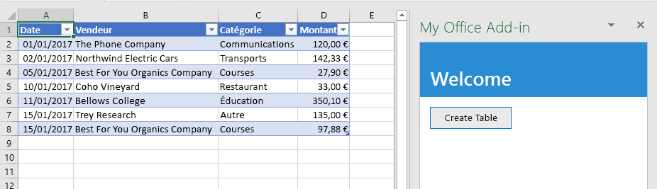
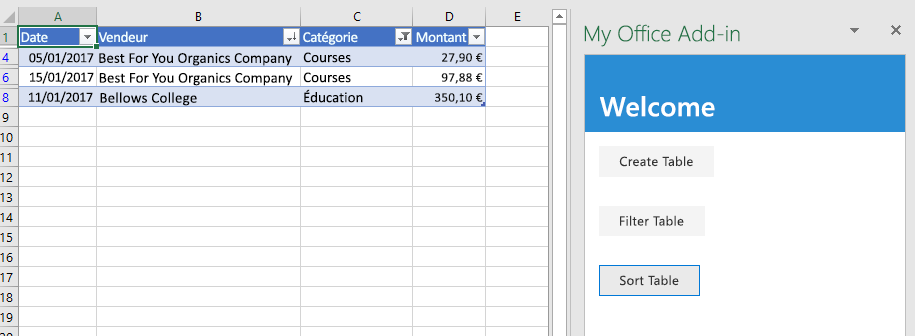
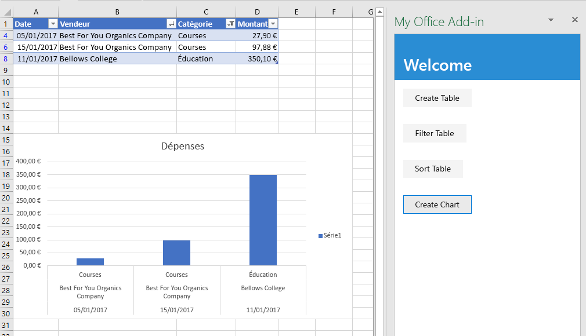
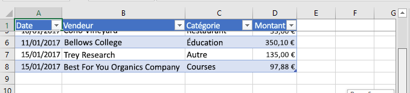
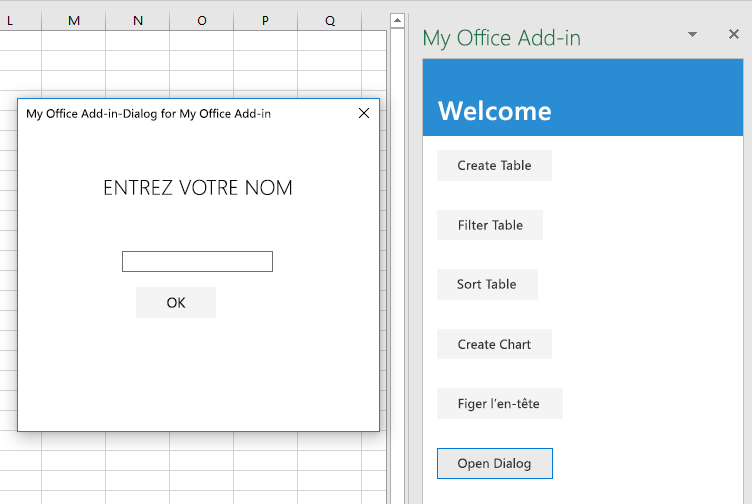

# <a name="tutorial-create-an-excel-task-pane-add-in"></a><span data-ttu-id="2d8fe-103">Didacticiel : Créer un complément de volet de tâches de Excel</span><span class="sxs-lookup"><span data-stu-id="2d8fe-103">Tutorial: Create an Excel task pane add-in</span></span>

<span data-ttu-id="2d8fe-104">Dans ce tutoriel, vous allez créer un complément de volet de tâches Excel qui:</span><span class="sxs-lookup"><span data-stu-id="2d8fe-104">In this tutorial, you'll create an Excel task pane add-in that:</span></span>

> [!div class="checklist"]
> * <span data-ttu-id="2d8fe-105">Crée un tableau</span><span class="sxs-lookup"><span data-stu-id="2d8fe-105">Creates a table</span></span>
> * <span data-ttu-id="2d8fe-106">Filtres et tris un tableau</span><span class="sxs-lookup"><span data-stu-id="2d8fe-106">Filters and sorts a table</span></span>
> * <span data-ttu-id="2d8fe-107">Crée un graphique (Chart)</span><span class="sxs-lookup"><span data-stu-id="2d8fe-107">Creates a chart</span></span>
> * <span data-ttu-id="2d8fe-108">Figer une en-tête de tableau</span><span class="sxs-lookup"><span data-stu-id="2d8fe-108">Freezes a table header</span></span>
> * <span data-ttu-id="2d8fe-109">Protège une feuille de calcul</span><span class="sxs-lookup"><span data-stu-id="2d8fe-109">Protects a worksheet</span></span>
> * <span data-ttu-id="2d8fe-110">Ouvrir une boîte de dialogue</span><span class="sxs-lookup"><span data-stu-id="2d8fe-110">Opens a dialog</span></span>

## <a name="prerequisites"></a><span data-ttu-id="2d8fe-111">Conditions requises</span><span class="sxs-lookup"><span data-stu-id="2d8fe-111">Prerequisites</span></span>

<span data-ttu-id="2d8fe-112">Pour utiliser ce didacticiel, les logiciels suivants doivent être installés.</span><span class="sxs-lookup"><span data-stu-id="2d8fe-112">To use this tutorial, you need to have the following installed.</span></span> 

- <span data-ttu-id="2d8fe-p101">Excel 2016, version 1711 (Démarrer en un clic version 8730.1000) ou version ultérieure. Vous devrez peut-être participer au programme Office Insider pour obtenir cette version. Pour plus d’informations, reportez-vous à [Participez au programme Office Insider](https://products.office.com/office-insider?tab=tab-1).</span><span class="sxs-lookup"><span data-stu-id="2d8fe-p101">Excel 2016, version 1711 (Build 8730.1000 Click-to-Run) or later. You might need to be an Office Insider to get this version. For more information, see [Be an Office Insider](https://products.office.com/office-insider?tab=tab-1).</span></span>

- [<span data-ttu-id="2d8fe-116">Node</span><span class="sxs-lookup"><span data-stu-id="2d8fe-116">Node</span></span>](https://nodejs.org/en/) 

- <span data-ttu-id="2d8fe-117">[Git Bash](https://git-scm.com/downloads) (ou un autre client Git)</span><span class="sxs-lookup"><span data-stu-id="2d8fe-117">[Git Bash](https://git-scm.com/downloads) (or another Git client)</span></span>

- <span data-ttu-id="2d8fe-118">Vous devez disposer d’une connexion Internet pour tester le complément dans ce didacticiel.</span><span class="sxs-lookup"><span data-stu-id="2d8fe-118">You need to have an Internet connection to test the add-in in this tutorial.</span></span>

## <a name="create-your-add-in-project"></a><span data-ttu-id="2d8fe-119">Créer votre projet de complément</span><span class="sxs-lookup"><span data-stu-id="2d8fe-119">Create your add-in project</span></span>

<span data-ttu-id="2d8fe-120">Procédez comme suit pour créer le projet de complément Excel que vous souhaitez utiliser comme base pour ce didacticiel.</span><span class="sxs-lookup"><span data-stu-id="2d8fe-120">Complete the following steps to create the Excel add-in project that you'll use as the basis for this tutorial.</span></span>

1. <span data-ttu-id="2d8fe-121">Clonez le référentiel GitHub du [didacticiel sur les compléments Excel](https://github.com/OfficeDev/Excel-Add-in-Tutorial).</span><span class="sxs-lookup"><span data-stu-id="2d8fe-121">Clone the GitHub repository [Excel add-in tutorial](https://github.com/OfficeDev/Excel-Add-in-Tutorial).</span></span>

2. <span data-ttu-id="2d8fe-122">Ouvrez une fenêtre Git Bash, ou une invite système Node.JS, et accédez au dossier **Start** du projet.</span><span class="sxs-lookup"><span data-stu-id="2d8fe-122">Open a Git bash window, or Node.JS-enabled system prompt, and navigate to the **Start** folder of the project.</span></span>

3. <span data-ttu-id="2d8fe-123">Exécutez la commande `npm install` pour installer les outils et les bibliothèques répertoriées dans le fichier package.json.</span><span class="sxs-lookup"><span data-stu-id="2d8fe-123">Run the command `npm install` to install the tools and libraries listed in the package.json file.</span></span> 

4. <span data-ttu-id="2d8fe-124">Suivez les étapes de l' [installation du certificat auto-signé](https://github.com/OfficeDev/generator-office/blob/master/src/docs/ssl.md) pour approuver le certificat pour le système d’exploitation de votre ordinateur de développement.</span><span class="sxs-lookup"><span data-stu-id="2d8fe-124">Carry out the steps in [Installing the self-signed certificate](https://github.com/OfficeDev/generator-office/blob/master/src/docs/ssl.md) to trust the certificate for your development computer's operating system.</span></span>

## <a name="create-a-table"></a><span data-ttu-id="2d8fe-125">Créer un tableau</span><span class="sxs-lookup"><span data-stu-id="2d8fe-125">Create a table</span></span>

<span data-ttu-id="2d8fe-126">Dans cette étape du didacticiel, vous vérifiez à l’aide de programme que votre complément prend en charge la version actuelle Excel de l’utilisateur, vous ajoutez un tableau à une feuille de calcul, vous renseignez le tableau avec des données et vous le mettez en forme.</span><span class="sxs-lookup"><span data-stu-id="2d8fe-126">In this step of the tutorial, you'll programmatically test that your add-in supports the user's current version of Excel, add a table to a worksheet, populate the table with data, and format it.</span></span>

### <a name="code-the-add-in"></a><span data-ttu-id="2d8fe-127">Codage du complément</span><span class="sxs-lookup"><span data-stu-id="2d8fe-127">Code the add-in</span></span>

1. <span data-ttu-id="2d8fe-128">Ouvrez le projet dans votre éditeur de code.</span><span class="sxs-lookup"><span data-stu-id="2d8fe-128">Open the project in your code editor.</span></span>

2. <span data-ttu-id="2d8fe-129">Ouvrez le fichier index.html.</span><span class="sxs-lookup"><span data-stu-id="2d8fe-129">Open the file index.html.</span></span>

3. <span data-ttu-id="2d8fe-130">Remplacez `TODO1` par le codage suivant :</span><span class="sxs-lookup"><span data-stu-id="2d8fe-130">Replace the `TODO1` with the following markup:</span></span>

    ```html
    <button class="ms-Button" id="create-table">Create Table</button>
    ```

4. <span data-ttu-id="2d8fe-131">Ouvrez le fichier app.js.</span><span class="sxs-lookup"><span data-stu-id="2d8fe-131">Open the app.js file.</span></span>

5. <span data-ttu-id="2d8fe-p102">Remplacez `TODO1` par le code suivant. Ce code détermine si la version Excel de l’utilisateur prend en charge une version d’Excel.js qui inclut toutes les API utilisées dans cette série de didacticiels. Dans un complément de production, utilisez le corps du bloc conditionnel pour masquer ou désactiver l’interface utilisateur appelant des API non prises en charge. Cela permet à l’utilisateur de toujours utiliser les parties du complément prises en charge par leur version d’Excel.</span><span class="sxs-lookup"><span data-stu-id="2d8fe-p102">Replace the `TODO1` with the following code. This code determines whether the user's version of Excel supports a version of Excel.js that includes all the APIs that this series of tutorials will use. In a production add-in, use the body of the conditional block to hide or disable the UI that would call unsupported APIs. This will enable the user to still make use of the parts of the add-in that are supported by their version of Excel.</span></span>

    ```js
    if (!Office.context.requirements.isSetSupported('ExcelApi', '1.7')) {
        console.log('Sorry. The tutorial add-in uses Excel.js APIs that are not available in your version of Office.');
    }
    ```

6. <span data-ttu-id="2d8fe-136">Remplacez `TODO2` par le code suivant :</span><span class="sxs-lookup"><span data-stu-id="2d8fe-136">Replace the `TODO2` with the following code:</span></span>

    ```js
    $('#create-table').click(createTable);
    ```

7. <span data-ttu-id="2d8fe-137">Remplacez `TODO3` par le code suivant.</span><span class="sxs-lookup"><span data-stu-id="2d8fe-137">Replace the `TODO3` with the following code.</span></span> <span data-ttu-id="2d8fe-138">Remarque:</span><span class="sxs-lookup"><span data-stu-id="2d8fe-138">Note:</span></span>

   - <span data-ttu-id="2d8fe-p104">Votre logique métier Excel.js est ajoutée à la fonction qui est transmise à `Excel.run`. Cette logique n’est pas exécutée immédiatement. Au lieu de cela, elle est ajoutée à une file d’attente de commandes.</span><span class="sxs-lookup"><span data-stu-id="2d8fe-p104">Your Excel.js business logic will be added to the function that is passed to `Excel.run`. This logic does not execute immediately. Instead, it is added to a queue of pending commands.</span></span>

   - <span data-ttu-id="2d8fe-142">La méthode `context.sync` envoie toutes les commandes en file d’attente vers Excel pour exécution.</span><span class="sxs-lookup"><span data-stu-id="2d8fe-142">The `context.sync` method sends all queued commands to Excel for execution.</span></span>

   - <span data-ttu-id="2d8fe-p105">L’élément `Excel.run` est suivi par un bloc `catch`. Il s’agit d’une meilleure pratique que vous devez toujours suivre.</span><span class="sxs-lookup"><span data-stu-id="2d8fe-p105">The `Excel.run` is followed by a `catch` block. This is a best practice that you should always follow.</span></span> 

    ```js
    function createTable() {
        Excel.run(function (context) {

            // TODO4: Queue table creation logic here.

            // TODO5: Queue commands to populate the table with data.

            // TODO6: Queue commands to format the table.

            return context.sync();
        })
        .catch(function (error) {
            console.log("Error: " + error);
            if (error instanceof OfficeExtension.Error) {
                console.log("Debug info: " + JSON.stringify(error.debugInfo));
            }
        });
    }
    ```

8. <span data-ttu-id="2d8fe-p106">Remplacez `TODO4` par le code suivant. Remarque :</span><span class="sxs-lookup"><span data-stu-id="2d8fe-p106">Replace `TODO4` with the following code. Note:</span></span>

   - <span data-ttu-id="2d8fe-p107">Le code crée un tableau à l’aide de la méthode `add` de collection de tableau d’une feuille de calcul, qui existe toujours même si elle est vide. Il s’agit de la méthode standard de création d’objets Excel.js. Il n’existe aucune API pour le constructeur de classe API. De plus, vous n’utilisez jamais d’opérateur `new` pour créer un objet Excel. Au lieu de cela, vous l’ajoutez à un objet de la collection parent.</span><span class="sxs-lookup"><span data-stu-id="2d8fe-p107">The code creates a table by using `add` method of a worksheet's table collection, which always exists even if it is empty. This is the standard way that Excel.js objects are created. There are no class constructor APIs, and you never use a `new` operator to create an Excel object. Instead, you add to a parent collection object.</span></span>

   - <span data-ttu-id="2d8fe-p108">Le premier paramètre de la méthode `add` est la plage comprenant uniquement la ligne supérieure du tableau, et non la plage entière utilisée en fin de compte par le tableau. La raison est que lorsque le complément remplit les lignes de données (dans l’étape suivante), il ajoute de nouvelles lignes au tableau au lieu d’écrire des valeurs dans les cellules des lignes existantes. Il s’agit d’un modèle plus courant, car le nombre de lignes contenues dans un tableau est souvent inconnu lorsque le tableau est créé.</span><span class="sxs-lookup"><span data-stu-id="2d8fe-p108">The first parameter of the `add` method is the range of only the top row of the table, not the entire range the table will ultimately use. This is because when the add-in populates the data rows (in the next step), it will add new rows to the table instead of writing values to the cells of existing rows. This is a more common pattern because the number of rows that a table will have is often not known when the table is created.</span></span>

   - <span data-ttu-id="2d8fe-154">Les noms de tableau doivent être uniques dans l’ensemble du classeur, pas uniquement dans la feuille de calcul.</span><span class="sxs-lookup"><span data-stu-id="2d8fe-154">Table names must be unique across the entire workbook, not just the worksheet.</span></span>

    ```js
    var currentWorksheet = context.workbook.worksheets.getActiveWorksheet();
    var expensesTable = currentWorksheet.tables.add("A1:D1", true /*hasHeaders*/);
    expensesTable.name = "ExpensesTable";
    ```

9. <span data-ttu-id="2d8fe-155">Remplacez `TODO5` par le code suivant.</span><span class="sxs-lookup"><span data-stu-id="2d8fe-155">Replace `TODO5` with the following code.</span></span> <span data-ttu-id="2d8fe-156">Remarque :</span><span class="sxs-lookup"><span data-stu-id="2d8fe-156">Note:</span></span>

   - <span data-ttu-id="2d8fe-157">Les valeurs de cellule d’une plage sont définies avec un tableau de tableaux.</span><span class="sxs-lookup"><span data-stu-id="2d8fe-157">The cell values of a range are set with an array of arrays.</span></span>

   - <span data-ttu-id="2d8fe-p110">Les nouvelles lignes sont créées dans un tableau en appelant la méthode `add` de collection de ligne du tableau. Vous pouvez ajouter plusieurs lignes dans un seul appel de `add` en incluant plusieurs tableaux de valeurs de cellule dans le tableau parent transmis en tant que deuxième paramètre.</span><span class="sxs-lookup"><span data-stu-id="2d8fe-p110">New rows are created in a table by calling the `add` method of the table's row collection. You can add multiple rows in a single call of `add` by including multiple cell value arrays in the parent array that is passed as the second parameter.</span></span>

    ```js
    expensesTable.getHeaderRowRange().values =
        [["Date", "Merchant", "Category", "Amount"]];

    expensesTable.rows.add(null /*add at the end*/, [
        ["1/1/2017", "The Phone Company", "Communications", "120"],
        ["1/2/2017", "Northwind Electric Cars", "Transportation", "142.33"],
        ["1/5/2017", "Best For You Organics Company", "Groceries", "27.9"],
        ["1/10/2017", "Coho Vineyard", "Restaurant", "33"],
        ["1/11/2017", "Bellows College", "Education", "350.1"],
        ["1/15/2017", "Trey Research", "Other", "135"],
        ["1/15/2017", "Best For You Organics Company", "Groceries", "97.88"]
    ]);
    ```

10. <span data-ttu-id="2d8fe-p111">Remplacez `TODO6` par le code suivant. Remarque :</span><span class="sxs-lookup"><span data-stu-id="2d8fe-p111">Replace `TODO6` with the following code. Note:</span></span>

   - <span data-ttu-id="2d8fe-162">Le code recherche une référence à la colonne **Amount** en transmettant son index de base zéro à la méthode `getItemAt` de collection de colonnes du tableau.</span><span class="sxs-lookup"><span data-stu-id="2d8fe-162">The code gets a reference to the **Amount** column by passing its zero-based index to the `getItemAt` method of the table's column collection.</span></span>

     > [!NOTE]
     > <span data-ttu-id="2d8fe-163">Les objets de collection Excel.js, tels que `TableCollection`, `WorksheetCollection` et `TableColumnCollection` ont une propriété `items` qui correspond à un tableau de types d’objet enfant, comme `Table` ou `Worksheet` ou `TableColumn`; mais un objet `*Collection` n’est pas lui-même un tableau.</span><span class="sxs-lookup"><span data-stu-id="2d8fe-163">Excel.js collection objects, such as `TableCollection`, `WorksheetCollection`, and `TableColumnCollection` have an `items` property that is an array of the child object types, such as `Table` or `Worksheet` or `TableColumn`; but a `*Collection` object is not itself an array.</span></span>

   - <span data-ttu-id="2d8fe-164">Le code définit ensuite la plage de la colonne **Amount** sous la forme Euros à la deuxième décimale.</span><span class="sxs-lookup"><span data-stu-id="2d8fe-164">The code then formats the range of the **Amount** column as Euros to the second decimal.</span></span> 

   - <span data-ttu-id="2d8fe-p112">Enfin, il s’assure que la largeur des colonnes et la hauteur des lignes sont assez grandes pour contenir l’élément de données le plus long (ou le plus haut). Notez que le code doit rechercher des objets `Range` à mettre en forme. Les objets `TableColumn` et `TableRow` n’ont pas de propriétés de mise en forme.</span><span class="sxs-lookup"><span data-stu-id="2d8fe-p112">Finally, it ensures that the width of the columns and height of the rows is big enough to fit the longest (or tallest) data item. Notice that the code must get `Range` objects to format. `TableColumn` and `TableRow` objects do not have format properties.</span></span>

        ```js
        expensesTable.columns.getItemAt(3).getRange().numberFormat = [['€#,##0.00']];
        expensesTable.getRange().format.autofitColumns();
        expensesTable.getRange().format.autofitRows();
        ```

### <a name="test-the-add-in"></a><span data-ttu-id="2d8fe-168">Test du complément</span><span class="sxs-lookup"><span data-stu-id="2d8fe-168">Test the add-in</span></span>

1. <span data-ttu-id="2d8fe-169">Ouvrez une fenêtre Git Bash ou une invite système activée par Node.JS, et accédez au dossier **Démarrer** du projet.</span><span class="sxs-lookup"><span data-stu-id="2d8fe-169">Open a Git bash window, or Node.JS-enabled system prompt, and navigate to the **Start** folder of the project.</span></span>

2. <span data-ttu-id="2d8fe-170">Exécutez la commande `npm run build` pour transpiler votre code source ES6 en une version antérieure de JavaScript prise en charge par Internet Explorer (utilisée par certaines versions d’Excel pour exécuter des compléments Excel).</span><span class="sxs-lookup"><span data-stu-id="2d8fe-170">Run the command `npm run build` to transpile your ES6 source code to an earlier version of JavaScript that is supported by Internet Explorer (which is used by some versions of Excel to run Excel add-ins).</span></span>

3. <span data-ttu-id="2d8fe-171">Exécutez la commande `npm start` pour démarrer un serveur web en cours d’exécution sur localhost.</span><span class="sxs-lookup"><span data-stu-id="2d8fe-171">Run the command `npm start` to start a web server running on localhost.</span></span>

4. <span data-ttu-id="2d8fe-172">Chargez une version test du complément en utilisant l’une des méthodes suivantes :</span><span class="sxs-lookup"><span data-stu-id="2d8fe-172">Sideload the add-in by using one of the following methods:</span></span>

    - <span data-ttu-id="2d8fe-173">Windows : [Chargement de version test des compléments Office sur Windows](../testing/create-a-network-shared-folder-catalog-for-task-pane-and-content-add-ins.md)</span><span class="sxs-lookup"><span data-stu-id="2d8fe-173">Windows: [Sideload Office Add-ins on Windows](../testing/create-a-network-shared-folder-catalog-for-task-pane-and-content-add-ins.md)</span></span>

    - <span data-ttu-id="2d8fe-174">Navigateur Web: [chargement de compléments Office dans Office sur le Web](../testing/sideload-office-add-ins-for-testing.md#sideload-an-office-add-in-in-office-on-the-web)</span><span class="sxs-lookup"><span data-stu-id="2d8fe-174">Web browser: [Sideload Office Add-ins in Office on the web](../testing/sideload-office-add-ins-for-testing.md#sideload-an-office-add-in-in-office-on-the-web)</span></span>

    - <span data-ttu-id="2d8fe-175">iPad et Mac : [Chargement de versions test des compléments Office sur iPad et Mac](../testing/sideload-an-office-add-in-on-ipad-and-mac.md)</span><span class="sxs-lookup"><span data-stu-id="2d8fe-175">iPad and Mac: [Sideload Office Add-ins on iPad and Mac](../testing/sideload-an-office-add-in-on-ipad-and-mac.md)</span></span>

5. <span data-ttu-id="2d8fe-176">Dans le menu **Accueil**, sélectionnez **Afficher le volet Office**.</span><span class="sxs-lookup"><span data-stu-id="2d8fe-176">On the **Home** menu, choose **Show Taskpane**.</span></span>

6. <span data-ttu-id="2d8fe-177">Dans le volet Office, sélectionnez **Créer un tableau**.</span><span class="sxs-lookup"><span data-stu-id="2d8fe-177">In the task pane, choose **Create Table**.</span></span>

    

## <a name="filter-and-sort-a-table"></a><span data-ttu-id="2d8fe-179">Filtrer et trier un tableau</span><span class="sxs-lookup"><span data-stu-id="2d8fe-179">Filter and sort a table</span></span>

<span data-ttu-id="2d8fe-180">Dans cette étape du didacticiel, vous allez filtrer et trier le tableau que vous avez créé précédemment.</span><span class="sxs-lookup"><span data-stu-id="2d8fe-180">In this step of the tutorial, you'll filter and sort the table that you created previously.</span></span>

### <a name="filter-the-table"></a><span data-ttu-id="2d8fe-181">Filtrage du tableau</span><span class="sxs-lookup"><span data-stu-id="2d8fe-181">Filter the table</span></span>

1. <span data-ttu-id="2d8fe-182">Ouvrez le projet dans votre éditeur de code.</span><span class="sxs-lookup"><span data-stu-id="2d8fe-182">Open the project in your code editor.</span></span>

2. <span data-ttu-id="2d8fe-183">Ouvrez le fichier index.html.</span><span class="sxs-lookup"><span data-stu-id="2d8fe-183">Open the file index.html.</span></span>

3. <span data-ttu-id="2d8fe-184">Juste en dessous de la balise `div` qui contient le bouton `create-table`, ajoutez le balisage suivant :</span><span class="sxs-lookup"><span data-stu-id="2d8fe-184">Just below the `div` that contains the `create-table` button, add the following markup:</span></span>

    ```html
    <div class="padding">
        <button class="ms-Button" id="filter-table">Filter Table</button>
    </div>
    ```

4. <span data-ttu-id="2d8fe-185">Ouvrez le fichier app.js.</span><span class="sxs-lookup"><span data-stu-id="2d8fe-185">Open the app.js file.</span></span>

5. <span data-ttu-id="2d8fe-186">Juste en dessous de la ligne qui attribue un gestionnaire de clic au bouton `create-table`, ajoutez le code suivant :</span><span class="sxs-lookup"><span data-stu-id="2d8fe-186">Just below the line that assigns a click handler to the `create-table` button, add the following code:</span></span>

    ```js
    $('#filter-table').click(filterTable);
    ```

6. <span data-ttu-id="2d8fe-187">Ajoutez la fonction suivante juste après la fonction `createTable`.</span><span class="sxs-lookup"><span data-stu-id="2d8fe-187">Just below the `createTable` function, add the following function:</span></span>

    ```js
    function filterTable() {
        Excel.run(function (context) {

            // TODO1: Queue commands to filter out all expense categories except
            //        Groceries and Education.

            return context.sync();
        })
        .catch(function (error) {
            console.log("Error: " + error);
            if (error instanceof OfficeExtension.Error) {
                console.log("Debug info: " + JSON.stringify(error.debugInfo));
            }
        });
    }
    ```

7. <span data-ttu-id="2d8fe-188">Remplacez `TODO1` par le code suivant.</span><span class="sxs-lookup"><span data-stu-id="2d8fe-188">Replace `TODO1` with the following code.</span></span> <span data-ttu-id="2d8fe-189">Remarque :</span><span class="sxs-lookup"><span data-stu-id="2d8fe-189">Note:</span></span>

   - <span data-ttu-id="2d8fe-p114">Le code obtient tout d’abord une référence à la colonne à filtrer en transférant le nom de la colonne à la méthode `getItem`, au lieu de transmettre son index à la méthode `getItemAt` comme le fait la méthode `createTable`. Puisque les utilisateurs peuvent déplacer des colonnes de tableau, la colonne d’un index donné peut être modifiée après la création du tableau. Par conséquent, il est préférable d’utiliser le nom de la colonne pour obtenir une référence de la colonne. Dans le didacticiel précédent, nous avons utilisé la méthode `getItemAt` en toute sécurité, car nous l’avons utilisée dans la même méthode que celle qui crée le tableau, il n’y a donc aucune chance qu’un utilisateur ait déplacé la colonne.</span><span class="sxs-lookup"><span data-stu-id="2d8fe-p114">The code first gets a reference to the column that needs filtering by passing the column name to the `getItem` method, instead of passing its index to the `getItemAt` method as the `createTable` method does. Since users can move table columns, the column at a given index might change after the table is created. Hence, it is safer to use the column name to get a reference to the column. We used `getItemAt` safely in the preceding tutorial, because we used it in the very same method that creates the table, so there is no chance that a user has moved the column.</span></span>

   - <span data-ttu-id="2d8fe-194">La méthode `applyValuesFilter` est l’une des nombreuses méthodes de filtrage sur l’objet `Filter`.</span><span class="sxs-lookup"><span data-stu-id="2d8fe-194">The `applyValuesFilter` method is one of several filtering methods on the `Filter` object.</span></span>

    ```js
    var currentWorksheet = context.workbook.worksheets.getActiveWorksheet();
    var expensesTable = currentWorksheet.tables.getItem('ExpensesTable');
    var categoryFilter = expensesTable.columns.getItem('Category').filter;
    categoryFilter.applyValuesFilter(["Education", "Groceries"]);
    ``` 

### <a name="sort-the-table"></a><span data-ttu-id="2d8fe-195">Tri du tableau</span><span class="sxs-lookup"><span data-stu-id="2d8fe-195">Sort the table</span></span>

1. <span data-ttu-id="2d8fe-196">Ouvrez le fichier index.html.</span><span class="sxs-lookup"><span data-stu-id="2d8fe-196">Open the file index.html.</span></span>

2. <span data-ttu-id="2d8fe-197">En dessous de la balise `div` qui contient le bouton `filter-table`, ajoutez le balisage suivant :</span><span class="sxs-lookup"><span data-stu-id="2d8fe-197">Below the `div` that contains the `filter-table` button, add the following markup:</span></span>

    ```html
    <div class="padding">
        <button class="ms-Button" id="sort-table">Sort Table</button>
    </div>
    ```

3. <span data-ttu-id="2d8fe-198">Ouvrez le fichier app.js.</span><span class="sxs-lookup"><span data-stu-id="2d8fe-198">Open the app.js file.</span></span>

4. <span data-ttu-id="2d8fe-199">En dessous de la ligne qui attribue un gestionnaire de clic au bouton `filter-table`, ajoutez le code suivant :</span><span class="sxs-lookup"><span data-stu-id="2d8fe-199">Below the line that assigns a click handler to the `filter-table` button, add the following code:</span></span>

    ```js
    $('#sort-table').click(sortTable);
    ```

5. <span data-ttu-id="2d8fe-200">Ajoutez la fonction suivante après la fonction `filterTable`.</span><span class="sxs-lookup"><span data-stu-id="2d8fe-200">Below the `filterTable` function add the following function.</span></span>

    ```js
    function sortTable() {
        Excel.run(function (context) {

            // TODO1: Queue commands to sort the table by Merchant name.

            return context.sync();
        })
        .catch(function (error) {
            console.log("Error: " + error);
            if (error instanceof OfficeExtension.Error) {
                console.log("Debug info: " + JSON.stringify(error.debugInfo));
            }
        });
    }
    ```

6. <span data-ttu-id="2d8fe-201">Remplacez `TODO1` par le code suivant.</span><span class="sxs-lookup"><span data-stu-id="2d8fe-201">Replace `TODO1` with the following code.</span></span> <span data-ttu-id="2d8fe-202">Tenez compte des informations suivantes :</span><span class="sxs-lookup"><span data-stu-id="2d8fe-202">Note:</span></span>

   - <span data-ttu-id="2d8fe-203">Le code crée un tableau d’objets `SortField` qui ne comporte qu’un seul membre puisque le complément ne trie que la colonne Merchant.</span><span class="sxs-lookup"><span data-stu-id="2d8fe-203">The code creates an array of `SortField` objects which has just one member since the add-in only sorts on the Merchant column.</span></span>

   - <span data-ttu-id="2d8fe-204">La propriété `key` d’un objet `SortField` est l’index de la colonne à trier qui part de zéro.</span><span class="sxs-lookup"><span data-stu-id="2d8fe-204">The `key` property of a `SortField` object is the zero-based index of the column to sort-on.</span></span>

   - <span data-ttu-id="2d8fe-205">Le membre `sort` d’un objet `Table` est un objet `TableSort`, et non une méthode.</span><span class="sxs-lookup"><span data-stu-id="2d8fe-205">The `sort` member of a `Table` is a `TableSort` object, not a method.</span></span> <span data-ttu-id="2d8fe-206">Les objets `SortField` sont transmis à la méthode `apply` de l’objet `TableSort`.</span><span class="sxs-lookup"><span data-stu-id="2d8fe-206">The `SortField`s are passed to the `TableSort` object's `apply` method.</span></span>

    ```js
    var currentWorksheet = context.workbook.worksheets.getActiveWorksheet();
    var expensesTable = currentWorksheet.tables.getItem('ExpensesTable');
    var sortFields = [
        {
            key: 1,            // Merchant column
            ascending: false,
        }
    ];

    expensesTable.sort.apply(sortFields);
    ```

### <a name="test-the-add-in"></a><span data-ttu-id="2d8fe-207">Test du complément</span><span class="sxs-lookup"><span data-stu-id="2d8fe-207">Test the add-in</span></span>

1. <span data-ttu-id="2d8fe-208">Si la fenêtre Git Bash, ou l’invite système Node.JS, de l’étape précédente du didacticiel est encore ouverte, appuyez sur \*\*Ctrl+C \*\*à deux reprises pour arrêter le serveur web en cours d’exécution.</span><span class="sxs-lookup"><span data-stu-id="2d8fe-208">If the Git bash window, or Node.JS-enabled system prompt, from the previous stage tutorial is still open, enter **Ctrl+C** twice to stop the running web server.</span></span> <span data-ttu-id="2d8fe-209">Sinon, ouvrez une fenêtre Git Bash, ou une invite système Node.JS, et accédez au dossier **Start** du projet.</span><span class="sxs-lookup"><span data-stu-id="2d8fe-209">Otherwise, open a Git bash window, or Node.JS-enabled system prompt, and navigate to the **Start** folder of the project.</span></span>

     > [!NOTE]
     > <span data-ttu-id="2d8fe-210">Bien que le serveur synchronisé au navigateur recharge votre complément dans le volet Office chaque fois que vous apportez une modification à un fichier, y compris le fichier app.js, il ne retranspile pas le code JavaScript. Vous devez donc de nouveau utiliser la commande build afin que les modifications apportées à app.js prennent effet.</span><span class="sxs-lookup"><span data-stu-id="2d8fe-210">Although the browser-sync server reloads your add-in in the task pane every time you make a change to any file, including the app.js file, it does not retranspile the JavaScript, so you must repeat the build command in order for your changes to app.js to take effect.</span></span> <span data-ttu-id="2d8fe-211">Pour ce faire, vous devez arrêter le processus du serveur pour pouvoir obtenir une invite et saisir la commande build.</span><span class="sxs-lookup"><span data-stu-id="2d8fe-211">In order to do this, you need to kill the server process so that you can get a prompt to enter the build command.</span></span> <span data-ttu-id="2d8fe-212">Une fois la commande build exécutée, redémarrez le serveur.</span><span class="sxs-lookup"><span data-stu-id="2d8fe-212">After the build, you restart the server.</span></span> <span data-ttu-id="2d8fe-213">Les prochaines étapes vous permettent d’effectuer ce processus.</span><span class="sxs-lookup"><span data-stu-id="2d8fe-213">The next few steps carry out this process.</span></span>

2. <span data-ttu-id="2d8fe-214">Exécutez la commande `npm run build` pour transpiler votre code source ES6 en une version antérieure de JavaScript prise en charge par Internet Explorer (utilisée par certaines versions d’Excel pour exécuter des compléments Excel).</span><span class="sxs-lookup"><span data-stu-id="2d8fe-214">Run the command `npm run build` to transpile your ES6 source code to an earlier version of JavaScript that is supported by Internet Explorer (which is used by some versions of Excel to run Excel add-ins).</span></span>

3. <span data-ttu-id="2d8fe-215">Exécutez la commande `npm start` pour démarrer un serveur web en cours d’exécution sur localhost.</span><span class="sxs-lookup"><span data-stu-id="2d8fe-215">Run the command `npm start` to start a web server running on localhost.</span></span>

4. <span data-ttu-id="2d8fe-216">Rechargez le volet des tâches en le fermant, puis dans le menu **Accueil**, sélectionnez **Afficher le volet des tâches** pour rouvrir le complément.</span><span class="sxs-lookup"><span data-stu-id="2d8fe-216">Reload the task pane by closing it, and then on the **Home** menu, select **Show Taskpane** to reopen the add-in.</span></span>

5. <span data-ttu-id="2d8fe-217">Si, pour une raison quelconque, le tableau ne se trouve pas dans la feuille de calcul ouverte, dans le volet Office, sélectionnez **Créer un tableau**.</span><span class="sxs-lookup"><span data-stu-id="2d8fe-217">If for any reason the table is not in the open worksheet, in the task pane, choose **Create Table**.</span></span>

6. <span data-ttu-id="2d8fe-218">Choisissez les boutons **Filtrer le tableau** et **Trier le tableau** dans n’importe quel ordre.</span><span class="sxs-lookup"><span data-stu-id="2d8fe-218">Choose the **Filter Table** and **Sort Table** buttons, in either order.</span></span>

    

## <a name="create-a-chart"></a><span data-ttu-id="2d8fe-220">Création d’un graphique (chart)</span><span class="sxs-lookup"><span data-stu-id="2d8fe-220">Create a chart</span></span>

<span data-ttu-id="2d8fe-221">Dans cette étape du didacticiel, vous créerez un graphique à l’aide de données provenant du tableau précédemment créé, puis vous mettrez en forme le graphique.</span><span class="sxs-lookup"><span data-stu-id="2d8fe-221">In this step of the tutorial, you'll create a chart using data from the table that you created previously, and then format the chart.</span></span>

### <a name="chart-a-chart-using-table-data"></a><span data-ttu-id="2d8fe-222">Un graphique à l’aide de données du tableau de graphique (chart)</span><span class="sxs-lookup"><span data-stu-id="2d8fe-222">Chart a chart using table data</span></span>

1. <span data-ttu-id="2d8fe-223">Ouvrez le projet dans votre éditeur de code.</span><span class="sxs-lookup"><span data-stu-id="2d8fe-223">Open the project in your code editor.</span></span>

2. <span data-ttu-id="2d8fe-224">Ouvrez le fichier index.html.</span><span class="sxs-lookup"><span data-stu-id="2d8fe-224">Open the file index.html.</span></span>

3. <span data-ttu-id="2d8fe-225">En dessous de la balise `div` qui contient le bouton `sort-table`, ajoutez le balisage suivant :</span><span class="sxs-lookup"><span data-stu-id="2d8fe-225">Below the `div` that contains the `sort-table` button, add the following markup:</span></span>

    ```html
    <div class="padding">
        <button class="ms-Button" id="create-chart">Create Chart</button>
    </div>
    ```

4. <span data-ttu-id="2d8fe-226">Ouvrez le fichier app.js.</span><span class="sxs-lookup"><span data-stu-id="2d8fe-226">Open the app.js file.</span></span>

5. <span data-ttu-id="2d8fe-227">En dessous de la ligne qui attribue un gestionnaire de clic au bouton `sort-chart`, ajoutez le code suivant :</span><span class="sxs-lookup"><span data-stu-id="2d8fe-227">Below the line that assigns a click handler to the `sort-chart` button, add the following code:</span></span>

    ```js
    $('#create-chart').click(createChart);
    ```

6. <span data-ttu-id="2d8fe-228">Ajoutez la fonction suivante après la fonction `sortTable`.</span><span class="sxs-lookup"><span data-stu-id="2d8fe-228">Below the `sortTable` function add the following function.</span></span>

    ```js
    function createChart() {
        Excel.run(function (context) {

            // TODO1: Queue commands to get the range of data to be charted.

            // TODO2: Queue command to create the chart and define its type.

            // TODO3: Queue commands to position and format the chart.

            return context.sync();
        })
        .catch(function (error) {
            console.log("Error: " + error);
            if (error instanceof OfficeExtension.Error) {
                console.log("Debug info: " + JSON.stringify(error.debugInfo));
            }
        });
    }
    ```

7. <span data-ttu-id="2d8fe-p119">Remplacez `TODO1` par le code suivant. Pour exclure la ligne d’en-tête, le code utilise la méthode `Table.getDataBodyRange` pour obtenir la plage de données à représenter sous forme de graphique à la place de la méthode `getRange`.</span><span class="sxs-lookup"><span data-stu-id="2d8fe-p119">Replace `TODO1` with the following code. Note that in order to exclude the header row, the code uses the `Table.getDataBodyRange` method to get the range of data you want to chart instead of the `getRange` method.</span></span>

    ```js
    var currentWorksheet = context.workbook.worksheets.getActiveWorksheet();
    var expensesTable = currentWorksheet.tables.getItem('ExpensesTable');
    var dataRange = expensesTable.getDataBodyRange();
    ```

8. <span data-ttu-id="2d8fe-p120">Remplacez `TODO2` par le code suivant. Notez les paramètres suivants :</span><span class="sxs-lookup"><span data-stu-id="2d8fe-p120">Replace `TODO2` with the following code. Note the following parameters:</span></span>

   - <span data-ttu-id="2d8fe-p121">Le premier paramètre transmis à la méthode `add` spécifie le type de graphique. Il en existe plusieurs dizaines de types.</span><span class="sxs-lookup"><span data-stu-id="2d8fe-p121">The first parameter to the `add` method specifies the type of chart. There are several dozen types.</span></span>

   - <span data-ttu-id="2d8fe-235">Le deuxième paramètre spécifie la plage de données à inclure dans le graphique.</span><span class="sxs-lookup"><span data-stu-id="2d8fe-235">The second parameter specifies the range of data to include in the chart.</span></span>

   - <span data-ttu-id="2d8fe-236">Le troisième paramètre détermine si une série de points de données provenant du tableau doit être représentée sous forme de graphique par ligne ou par colonne.</span><span class="sxs-lookup"><span data-stu-id="2d8fe-236">The third parameter determines whether a series of data points from the table should be charted row-wise or column-wise.</span></span> <span data-ttu-id="2d8fe-237">L’option `auto` demande à Excel de déterminer la meilleure méthode.</span><span class="sxs-lookup"><span data-stu-id="2d8fe-237">The option `auto` tells Excel to decide the best method.</span></span>

    ```js
    var chart = currentWorksheet.charts.add('ColumnClustered', dataRange, 'auto');
    ```

9. <span data-ttu-id="2d8fe-p123">Remplacez `TODO3` par le code suivant. La majeure partie du code est explicite. Remarque :</span><span class="sxs-lookup"><span data-stu-id="2d8fe-p123">Replace `TODO3` with the following code. Most of this code is self-explanatory. Note:</span></span>
   
   - <span data-ttu-id="2d8fe-p124">Les paramètres de la méthode `setPosition` spécifient les cellules situées en haut à gauche et en bas à droite de la zone de feuille de calcul devant contenir le graphique. Excel peut ajuster des éléments, tels que la largeur de ligne pour que le graphique s’affiche correctement dans l’espace attribué.</span><span class="sxs-lookup"><span data-stu-id="2d8fe-p124">The parameters to the `setPosition` method specify the upper left and lower right cells of the worksheet area that should contain the chart. Excel can adjust things like line width to make the chart look good in the space it has been given.</span></span>
   
   - <span data-ttu-id="2d8fe-p125">Une « série » est un ensemble de points de données dans une colonne du tableau. Étant donné qu’il n’existe qu’une seule colonne autre que de type chaîne dans le tableau, Excel déduit que la colonne est la seule colonne de points de données pour le graphique. Il interprète les autres colonnes comme des étiquettes de graphique. Par conséquent, il y aura simplement une série dans le graphique et un index 0. Il s’agit de celle à étiqueter avec « Valeur en € ».</span><span class="sxs-lookup"><span data-stu-id="2d8fe-p125">A "series" is a set of data points from a column of the table. Since there is only one non-string column in the table, Excel infers that the column is the only column of data points to chart. It interprets the other columns as chart labels. So there will be just one series in the chart and it will have index 0. This is the one to label with "Value in €".</span></span>

    ```js
    chart.setPosition("A15", "F30");
    chart.title.text = "Expenses";
    chart.legend.position = "right"
    chart.legend.format.fill.setSolidColor("white");
    chart.dataLabels.format.font.size = 15;
    chart.dataLabels.format.font.color = "black";
    chart.series.getItemAt(0).name = 'Value in €';
    ```

### <a name="test-the-add-in"></a><span data-ttu-id="2d8fe-248">Test du complément</span><span class="sxs-lookup"><span data-stu-id="2d8fe-248">Test the add-in</span></span>

1. <span data-ttu-id="2d8fe-249">Si la fenêtre Git Bash, ou l’invite système Node.JS, de l’étape précédente du didacticiel est encore ouverte, appuyez sur \*\*Ctrl+C \*\*à deux reprises pour arrêter le serveur web en cours d’exécution.</span><span class="sxs-lookup"><span data-stu-id="2d8fe-249">If the Git bash window, or Node.JS-enabled system prompt, from the previous stage tutorial is still open, enter **Ctrl+C** twice to stop the running web server.</span></span> <span data-ttu-id="2d8fe-250">Sinon, ouvrez une fenêtre Git Bash, ou une invite système Node.JS, et accédez au dossier **Start** du projet.</span><span class="sxs-lookup"><span data-stu-id="2d8fe-250">Otherwise, open a Git bash window, or Node.JS-enabled system prompt, and navigate to the **Start** folder of the project.</span></span>

     > [!NOTE]
     > <span data-ttu-id="2d8fe-p127">Bien que le serveur synchronisé au navigateur recharge votre complément dans le volet Office chaque fois que vous apportez une modification à un fichier, y compris le fichier app.js, il ne retranspile pas le code JavaScript. Vous devez donc de nouveau utiliser la commande build afin que les modifications apportées à app.js prennent effet. Pour ce faire, vous devez arrêter le processus du serveur pour pouvoir obtenir une invite et saisir la commande build. Une fois la commande build exécutée, redémarrez le serveur. Les prochaines étapes vous permettent d’effectuer ce processus.</span><span class="sxs-lookup"><span data-stu-id="2d8fe-p127">Although the browser-sync server reloads your add-in in the task pane every time you make a change to any file, including the app.js file, it does not retranspile the JavaScript, so you must repeat the build command in order for your changes to app.js to take effect. In order to do this, you need to kill the server process in so that you can get a prompt to enter the build command. After the build, you restart the server. The next few steps carry out this process.</span></span>

2. <span data-ttu-id="2d8fe-255">Exécutez la commande `npm run build` pour transpiler votre code source ES6 en une version antérieure de JavaScript prise en charge par Internet Explorer (utilisée par certaines versions d’Excel pour exécuter des compléments Excel).</span><span class="sxs-lookup"><span data-stu-id="2d8fe-255">Run the command `npm run build` to transpile your ES6 source code to an earlier version of JavaScript that is supported by Internet Explorer (which is used by some versions of Excel to run Excel add-ins).</span></span>

3. <span data-ttu-id="2d8fe-256">Exécutez la commande `npm start` pour démarrer un serveur web en cours d’exécution sur localhost.</span><span class="sxs-lookup"><span data-stu-id="2d8fe-256">Run the command `npm start` to start a web server running on localhost.</span></span>

4. <span data-ttu-id="2d8fe-257">Rechargez le volet des tâches en le fermant, puis dans le menu **Accueil**, sélectionnez **Afficher le volet des tâches** pour rouvrir le complément.</span><span class="sxs-lookup"><span data-stu-id="2d8fe-257">Reload the task pane by closing it, and then on the **Home** menu, select **Show Taskpane** to reopen the add-in.</span></span>

5. <span data-ttu-id="2d8fe-258">Si pour une raison quelconque le tableau n’est pas dans la feuille de calcul ouverte, dans le volet Office, sélectionnez **Créer un tableau**, puis les boutons **Filtrer le tableau** et **Trier le tableau** dans n’importe quel ordre.</span><span class="sxs-lookup"><span data-stu-id="2d8fe-258">If for any reason the table is not in the open worksheet, in the task pane, choose **Create Table** and then **Filter Table** and **Sort Table** buttons, in either order.</span></span>

6. <span data-ttu-id="2d8fe-p128">Sélectionnez le bouton **Créer un graphique**. Un graphique est créé dans lequel seules les données provenant des lignes filtrées sont incluses. Les étiquettes sur les points de données en bas sont organisées selon l’ordre de tri du graphique, à savoir les noms de marchand par ordre alphabétique inversé.</span><span class="sxs-lookup"><span data-stu-id="2d8fe-p128">Choose the **Create Chart** button. A chart is created and only the data from the rows that have been filtered are included. The labels on the data points across the bottom are in the sort order of the chart; that is, merchant names in reverse alphabetical order.</span></span>

    

## <a name="freeze-a-table-header"></a><span data-ttu-id="2d8fe-263">Figer un en-tête de tableau</span><span class="sxs-lookup"><span data-stu-id="2d8fe-263">Freeze a table header</span></span>

<span data-ttu-id="2d8fe-p129">Lorsqu’un tableau est tellement long que l’utilisateur doit le faire défiler pour afficher les lignes suivantes, la ligne d’en-tête peut être masquée. Dans cette étape du didacticiel, vous allez figer la ligne d’en-tête du tableau que vous avez créé précédemment, afin qu’elle reste visible même lorsque l’utilisateur fait défiler la feuille de calcul vers le bas.</span><span class="sxs-lookup"><span data-stu-id="2d8fe-p129">When a table is long enough that a user must scroll to see some rows, the header row can scroll out of sight. In this step of the tutorial, you'll freeze the header row of the table that you created previously, so that it remains visible even as the user scrolls down the worksheet.</span></span>

### <a name="freeze-the-tables-header-row"></a><span data-ttu-id="2d8fe-266">Figer la ligne d’en-tête du tableau</span><span class="sxs-lookup"><span data-stu-id="2d8fe-266">Freeze the table's header row</span></span>

1. <span data-ttu-id="2d8fe-267">Ouvrez le projet dans votre éditeur de code.</span><span class="sxs-lookup"><span data-stu-id="2d8fe-267">Open the project in your code editor.</span></span>

2. <span data-ttu-id="2d8fe-268">Ouvrez le fichier index.html.</span><span class="sxs-lookup"><span data-stu-id="2d8fe-268">Open the file index.html.</span></span>

3. <span data-ttu-id="2d8fe-269">En dessous de la balise `div` qui contient le bouton `create-chart`, ajoutez le balisage suivant :</span><span class="sxs-lookup"><span data-stu-id="2d8fe-269">Below the `div` that contains the `create-chart` button, add the following markup:</span></span>

    ```html
    <div class="padding">
        <button class="ms-Button" id="freeze-header">Freeze Header</button>
    </div>
    ```

4. <span data-ttu-id="2d8fe-270">Ouvrez le fichier app.js.</span><span class="sxs-lookup"><span data-stu-id="2d8fe-270">Open the app.js file.</span></span>

5. <span data-ttu-id="2d8fe-271">En dessous de la ligne qui attribue un gestionnaire de clic au bouton `create-chart`, ajoutez le code suivant :</span><span class="sxs-lookup"><span data-stu-id="2d8fe-271">Below the line that assigns a click handler to the `create-chart` button, add the following code:</span></span>

    ```js
    $('#freeze-header').click(freezeHeader);
    ```

6. <span data-ttu-id="2d8fe-272">En dessous de la fonction `createChart`, ajoutez la fonction suivante :</span><span class="sxs-lookup"><span data-stu-id="2d8fe-272">Below the `createChart` function add the following function:</span></span>

    ```js
    function freezeHeader() {
        Excel.run(function (context) {

            // TODO1: Queue commands to keep the header visible when the user scrolls.

            return context.sync();
        })
        .catch(function (error) {
            console.log("Error: " + error);
            if (error instanceof OfficeExtension.Error) {
                console.log("Debug info: " + JSON.stringify(error.debugInfo));
            }
        });
    }
    ```

7. <span data-ttu-id="2d8fe-273">Remplacez `TODO1` par le code suivant.</span><span class="sxs-lookup"><span data-stu-id="2d8fe-273">Replace `TODO1` with the following code.</span></span> <span data-ttu-id="2d8fe-274">Tenez compte des informations suivantes :</span><span class="sxs-lookup"><span data-stu-id="2d8fe-274">Note:</span></span>

   - <span data-ttu-id="2d8fe-275">La collection `Worksheet.freezePanes` est un ensemble de volets de la feuille de calcul qui sont épinglés, c’est-à-dire figés, lorsque vous faites défiler la feuille de calcul.</span><span class="sxs-lookup"><span data-stu-id="2d8fe-275">The `Worksheet.freezePanes` collection is a set of panes in the worksheet that are pinned, or frozen, in place when the worksheet is scrolled.</span></span>

   - <span data-ttu-id="2d8fe-p131">La méthode `freezeRows` prend comme paramètre le nombre de lignes, à partir du haut, qui doivent être figées. Nous transmettons `1` pour figer la première ligne.</span><span class="sxs-lookup"><span data-stu-id="2d8fe-p131">The `freezeRows` method takes as a parameter the number of rows, from the top that are to be pinned in place. We pass `1` to pin the first row in place.</span></span>

    ```js
    var currentWorksheet = context.workbook.worksheets.getActiveWorksheet();
    currentWorksheet.freezePanes.freezeRows(1);
    ```

### <a name="test-the-add-in"></a><span data-ttu-id="2d8fe-278">Test du complément</span><span class="sxs-lookup"><span data-stu-id="2d8fe-278">Test the add-in</span></span>

1. <span data-ttu-id="2d8fe-279">Si la fenêtre Git Bash, ou l’invite système Node.JS, de l’étape précédente du didacticiel est encore ouverte, appuyez sur \*\*Ctrl+C \*\*à deux reprises pour arrêter le serveur web en cours d’exécution.</span><span class="sxs-lookup"><span data-stu-id="2d8fe-279">If the Git bash window, or Node.JS-enabled system prompt, from the previous stage tutorial is still open, enter **Ctrl+C** twice to stop the running web server.</span></span> <span data-ttu-id="2d8fe-280">Sinon, ouvrez une fenêtre Git Bash, ou une invite système Node.JS, et accédez au dossier **Start** du projet.</span><span class="sxs-lookup"><span data-stu-id="2d8fe-280">Otherwise, open a Git bash window, or Node.JS-enabled system prompt, and navigate to the **Start** folder of the project.</span></span>

     > [!NOTE]
     > <span data-ttu-id="2d8fe-p133">Bien que le serveur synchronisé au navigateur recharge votre complément dans le volet Office chaque fois que vous apportez une modification à un fichier, y compris le fichier app.js, il ne retranspile pas le code JavaScript. Vous devez donc de nouveau utiliser la commande build afin que les modifications apportées à app.js prennent effet. Pour ce faire, vous devez arrêter le processus du serveur pour pouvoir obtenir une invite et saisir la commande build. Une fois la commande build exécutée, redémarrez le serveur. Les prochaines étapes vous permettent d’effectuer ce processus.</span><span class="sxs-lookup"><span data-stu-id="2d8fe-p133">Although the browser-sync server reloads your add-in in the task pane every time you make a change to any file, including the app.js file, it does not retranspile the JavaScript, so you must repeat the build command in order for your changes to app.js to take effect. In order to do this, you need to kill the server process in so that you can get a prompt to enter the build command. After the build, you restart the server. The next few steps carry out this process.</span></span>

2. <span data-ttu-id="2d8fe-285">Exécutez la commande `npm run build` pour transpiler votre code source ES6 en une version antérieure de JavaScript prise en charge par Internet Explorer (utilisée par certaines versions d’Excel pour exécuter des compléments Excel).</span><span class="sxs-lookup"><span data-stu-id="2d8fe-285">Run the command `npm run build` to transpile your ES6 source code to an earlier version of JavaScript that is supported by Internet Explorer (which is used by some versions of Excel to run Excel add-ins).</span></span>

3. <span data-ttu-id="2d8fe-286">Exécutez la commande `npm start` pour démarrer un serveur web en cours d’exécution sur localhost.</span><span class="sxs-lookup"><span data-stu-id="2d8fe-286">Run the command `npm start` to start a web server running on localhost.</span></span>

4. <span data-ttu-id="2d8fe-287">Rechargez le volet Office en le fermant, puis dans le menu **Accueil**, sélectionnez **Afficher le volet Office** pour rouvrir le complément.</span><span class="sxs-lookup"><span data-stu-id="2d8fe-287">Reload the task pane by closing it, and then on the **Home** menu, select **Show Taskpane** to reopen the add-in.</span></span>

5. <span data-ttu-id="2d8fe-288">Si le tableau est dans la feuille de calcul, supprimez-le.</span><span class="sxs-lookup"><span data-stu-id="2d8fe-288">If the table is in the worksheet, delete it.</span></span>

6. <span data-ttu-id="2d8fe-289">Dans le volet Office, sélectionnez **Créer un tableau**.</span><span class="sxs-lookup"><span data-stu-id="2d8fe-289">In the task pane, choose **Create Table**.</span></span>

7. <span data-ttu-id="2d8fe-290">Sélectionnez le bouton **Freeze Header**.</span><span class="sxs-lookup"><span data-stu-id="2d8fe-290">Choose the **Freeze Header** button.</span></span>

8. <span data-ttu-id="2d8fe-291">Faites suffisamment défiler la feuille de calcul vers le bas pour voir que l’en-tête du tableau est toujours visible dans la partie supérieure même lorsque les lignes du haut sont masquées.</span><span class="sxs-lookup"><span data-stu-id="2d8fe-291">Scroll down the worksheet enough to to see that the table header remains visible at the top even when the higher rows scroll out of sight.</span></span>

    

## <a name="protect-a-worksheet"></a><span data-ttu-id="2d8fe-293">Protéger une feuille de calcul</span><span class="sxs-lookup"><span data-stu-id="2d8fe-293">Protect a worksheet</span></span>

<span data-ttu-id="2d8fe-294">Dans cette étape du didacticiel, vous allez ajouter un autre bouton au ruban qui, lorsque l’utilisateur clique dessus, exécute une fonction qui vous allez définir et qui active/désactive la protection de la feuille de calcul.</span><span class="sxs-lookup"><span data-stu-id="2d8fe-294">In this step of the tutorial, you'll add another button to the ribbon that, when chosen, executes a function that you'll define to toggle worksheet protection on and off.</span></span>

### <a name="configure-the-manifest-to-add-a-second-ribbon-button"></a><span data-ttu-id="2d8fe-295">Configuration du manifeste pour ajouter un deuxième bouton de ruban</span><span class="sxs-lookup"><span data-stu-id="2d8fe-295">Configure the manifest to add a second ribbon button</span></span>

1. <span data-ttu-id="2d8fe-296">Ouvrez le fichier manifeste my-office-add-in-manifest.xml.</span><span class="sxs-lookup"><span data-stu-id="2d8fe-296">Open the manifest file my-office-add-in-manifest.xml.</span></span>

2. <span data-ttu-id="2d8fe-p134">Recherchez l’élément `<Control>`. Cet élément définit le bouton **Afficher le volet des pages** sur le ruban **Accueil** que vous utilisez pour lancer le complément. Nous allons ajouter un deuxième bouton au même groupe sur le ruban **Accueil**. Entre la balise Control de fin (`</Control>`) et la balise Group de fin (`</Group>`), ajoutez le balisage suivant.</span><span class="sxs-lookup"><span data-stu-id="2d8fe-p134">Find the `<Control>` element. This element defines the **Show Taskpane** button on the **Home** ribbon you have been using to launch the add-in. We're going to add a second button to the same group on the **Home** ribbon. In between the end Control tag (`</Control>`) and the end Group tag (`</Group>`), add the following markup.</span></span>

    ```xml
    <Control xsi:type="Button" id="<!--TODO1: Unique (in manifest) name for button -->">
        <Label resid="<!--TODO2: Button label -->" />
        <Supertip>            
            <Title resid="<!-- TODO3: Button tool tip title -->" />
            <Description resid="<!-- TODO4: Button tool tip description -->" />
        </Supertip>
        <Icon>
            <bt:Image size="16" resid="Contoso.tpicon_16x16" />
            <bt:Image size="32" resid="Contoso.tpicon_32x32" />
            <bt:Image size="80" resid="Contoso.tpicon_80x80" />
        </Icon>
        <Action xsi:type="<!-- TODO5: Specify the type of action-->">
            <!-- TODO6: Identify the function.-->
        </Action>
    </Control>
    ```

3. <span data-ttu-id="2d8fe-301">Remplacez `TODO1` par une chaîne qui attribue un ID unique au bouton au sein de ce fichier manifeste.</span><span class="sxs-lookup"><span data-stu-id="2d8fe-301">Replace `TODO1` with a string that gives the button an ID that is unique within this manifest file.</span></span> <span data-ttu-id="2d8fe-302">Étant donné que notre bouton va activer ou désactiver la protection de la feuille de calcul, utilisez « ToggleProtection ».</span><span class="sxs-lookup"><span data-stu-id="2d8fe-302">Since our button is going to toggle protection of the worksheet on and off, use "ToggleProtection".</span></span> <span data-ttu-id="2d8fe-303">Lorsque vous avez terminé, la balise Control de début doit ressembler à ce qui suit :</span><span class="sxs-lookup"><span data-stu-id="2d8fe-303">When you are done, the entire start Control tag should look like the following:</span></span>

    ```xml
    <Control xsi:type="Button" id="ToggleProtection">
    ```

4. <span data-ttu-id="2d8fe-p136">Les trois éléments `TODO` suivants définissent les éléments « resid », c’est-à-dire les ID de ressource. Une ressource est une chaîne. Vous allez créer ces trois chaînes lors d’une étape ultérieure. Pour l’instant, vous devez attribuer des ID aux ressources. L’étiquette du bouton doit indiquer « Toggle Protection », mais l’*ID* de cette chaîne doit être « ProtectionButtonLabel », donc l’élément `Label` terminé doit ressembler au code suivant :</span><span class="sxs-lookup"><span data-stu-id="2d8fe-p136">The next three `TODO`s set "resid"s, which is short for resource ID. A resource is a string, and you'll create these three strings in a later step. For now, you need to give IDs to the resources. The button label should read "Toggle Protection", but the *ID* of this string should be "ProtectionButtonLabel", so the completed `Label` element should look like the following code:</span></span>

    ```xml
    <Label resid="ProtectionButtonLabel" />
    ```

5. <span data-ttu-id="2d8fe-p137">L’élément `SuperTip` définit l’info-bulle du bouton. Le titre de l’info-bulle doit être identique à l’étiquette du bouton, nous utilisons donc le même ID de ressource : « ProtectionButtonLabel ». La description de l’info-bulle sera « Cliquez pour activer/désactiver la protection de la feuille de calcul ». Néanmoins, l’élément `ID` doit être « ProtectionButtonToolTip ». Ainsi, lorsque vous avez terminé, l’ensemble du balisage `SuperTip` doit ressembler au code suivant :</span><span class="sxs-lookup"><span data-stu-id="2d8fe-p137">The `SuperTip` element defines the tool tip for the button. The tool tip title should be the same as the button label, so we use the very same resource ID: "ProtectionButtonLabel". The tool tip description will be "Click to turn protection of the worksheet on and off". But the `ID` should be "ProtectionButtonToolTip". So, when you are done, the whole `SuperTip` markup should look like the following code:</span></span> 

    ```xml
    <Supertip>            
        <Title resid="ProtectionButtonLabel" />
        <Description resid="ProtectionButtonToolTip" />
    </Supertip>
    ```

   > [!NOTE] 
   > <span data-ttu-id="2d8fe-p138">Dans un complément de production, vous n’utiliseriez pas la même icône pour deux boutons différents, mais pour simplifier ce didacticiel, nous allons le faire. Par conséquent, le balisage `Icon` de notre nouvel élément `Control` est simplement une copie de l’élément `Icon` provenant de l’élément `Control` existant.</span><span class="sxs-lookup"><span data-stu-id="2d8fe-p138">In a production add-in, you would not want to use the same icon for two different buttons; but to simplify this tutorial, we'll do that. So the `Icon` markup in our new `Control` is just a copy of the `Icon` element from the existing `Control`.</span></span> 

6. <span data-ttu-id="2d8fe-p139">Le type de l’élément `Action` se trouvant à l’intérieur de l’élément `Control` d’origine qui était déjà présent dans le fichier manifeste est défini sur `ShowTaskpane`, mais notre nouveau bouton ne va pas ouvrir un volet Office, il va exécuter une fonction personnalisée que vous allez créer à une étape ultérieure. Il faut donc remplacer `TODO5` par `ExecuteFunction`, c’est-à-dire le type d’action pour les boutons qui déclenchent des fonctions personnalisées. La balise `Action` de début doit ressembler au code suivant :</span><span class="sxs-lookup"><span data-stu-id="2d8fe-p139">The `Action` element inside the original `Control` element that was already present in the manifest, has its type set to `ShowTaskpane`, but our new button isn't going to open a task pane; it's going to run a custom function that you create in a later step. So replace `TODO5` with `ExecuteFunction` which is the action type for buttons that trigger custom functions. The start `Action` tag should look like the following code:</span></span>
 
    ```xml
    <Action xsi:type="ExecuteFunction">
    ```

7. <span data-ttu-id="2d8fe-p140">L’élément `Action` d’origine possède des éléments enfants qui spécifient un ID de volet Office ainsi qu’une URL de la page qui doit être ouverte dans le volet Office. Toutefois, un élément `Action` de type `ExecuteFunction` comporte un élément enfant unique qui nomme la fonction que le contrôle exécute. Vous créerez cette fonction à une étape ultérieure, et la nommerez `toggleProtection`. Par conséquent, remplacez `TODO6` par le balisage suivant :</span><span class="sxs-lookup"><span data-stu-id="2d8fe-p140">The original `Action` element has child elements that specify a task pane ID and a URL of the page that should be opened in the task pane. But an `Action` element of the `ExecuteFunction` type has a single child element that names the function that the control executes. You'll create that function in a later step, and it will be called `toggleProtection`. So, replace `TODO6` with the following markup:</span></span>
 
    ```xml
    <FunctionName>toggleProtection</FunctionName>
    ```

    <span data-ttu-id="2d8fe-322">Le balisage `Control` complet doit à présent ressembler à ce qui suit :</span><span class="sxs-lookup"><span data-stu-id="2d8fe-322">The entire `Control` markup should now look like the following:</span></span>

    ```xml
    <Control xsi:type="Button" id="ToggleProtection">
        <Label resid="ProtectionButtonLabel" />
        <Supertip>            
            <Title resid="ProtectionButtonLabel" />
            <Description resid="ProtectionButtonToolTip" />
        </Supertip>
        <Icon>
            <bt:Image size="16" resid="Contoso.tpicon_16x16" />
            <bt:Image size="32" resid="Contoso.tpicon_32x32" />
            <bt:Image size="80" resid="Contoso.tpicon_80x80" />
        </Icon>
        <Action xsi:type="ExecuteFunction">
           <FunctionName>toggleProtection</FunctionName>
        </Action>
    </Control>
    ```

8. <span data-ttu-id="2d8fe-323">Faites défiler vers le bas jusqu’à la section `Resources` du manifeste.</span><span class="sxs-lookup"><span data-stu-id="2d8fe-323">Scroll down to the `Resources` section of the manifest.</span></span>

9. <span data-ttu-id="2d8fe-324">Ajoutez le balisage suivant en tant qu’enfant de l’élément `bt:ShortStrings`.</span><span class="sxs-lookup"><span data-stu-id="2d8fe-324">Add the following markup as a child of the `bt:ShortStrings` element.</span></span>

    ```xml
    <bt:String id="ProtectionButtonLabel" DefaultValue="Toggle Worksheet Protection" />
    ```

10. <span data-ttu-id="2d8fe-325">Ajoutez le balisage suivant en tant qu’enfant de l’élément `bt:LongStrings`.</span><span class="sxs-lookup"><span data-stu-id="2d8fe-325">Add the following markup as a child of the `bt:LongStrings` element.</span></span>

    ```xml
    <bt:String id="ProtectionButtonToolTip" DefaultValue="Click to protect or unprotect the current worksheet." />
    ```

11. <span data-ttu-id="2d8fe-326">Enregistrez le fichier.</span><span class="sxs-lookup"><span data-stu-id="2d8fe-326">Save the file.</span></span>

### <a name="create-the-function-that-protects-the-sheet"></a><span data-ttu-id="2d8fe-327">Création de la fonction qui protège la feuille</span><span class="sxs-lookup"><span data-stu-id="2d8fe-327">Create the function that protects the sheet</span></span>

1. <span data-ttu-id="2d8fe-328">Ouvrez le fichier \function-file\function-file.js.</span><span class="sxs-lookup"><span data-stu-id="2d8fe-328">Open the file \function-file\function-file.js.</span></span>

2. <span data-ttu-id="2d8fe-329">Le fichier possède déjà une expression de fonction appelée immédiatement (IIFE).</span><span class="sxs-lookup"><span data-stu-id="2d8fe-329">The file already has an Immediately Invoked Function Expression (IFFE).</span></span> <span data-ttu-id="2d8fe-330">À l' *extérieur du IIFE*, ajoutez le code suivant.</span><span class="sxs-lookup"><span data-stu-id="2d8fe-330">*Outside of the IIFE*, add the following code.</span></span> <span data-ttu-id="2d8fe-331">Notez que nous spécifions un paramètre `args` pour la méthode et que la toute dernière ligne de la méthode appelle `args.completed`.</span><span class="sxs-lookup"><span data-stu-id="2d8fe-331">Note that we specify an `args` parameter to the method and the very last line of the method calls `args.completed`.</span></span> <span data-ttu-id="2d8fe-332">Il s’agit d’une condition requise pour toutes les commandes de type **ExecuteFunction**.</span><span class="sxs-lookup"><span data-stu-id="2d8fe-332">This is a requirement for all add-in commands of type **ExecuteFunction**.</span></span> <span data-ttu-id="2d8fe-333">Elle signale à l’application hôte Office que la fonction est terminée et que l’interface utilisateur est à nouveau réactive.</span><span class="sxs-lookup"><span data-stu-id="2d8fe-333">It signals the Office host application that the function has finished and the UI can become responsive again.</span></span>

    ```js
    function toggleProtection(args) {
        Excel.run(function (context) {
            
            // TODO1: Queue commands to reverse the protection status of the current worksheet.

            return context.sync();
        })
        .catch(function (error) {
            console.log("Error: " + error);
            if (error instanceof OfficeExtension.Error) {
                console.log("Debug info: " + JSON.stringify(error.debugInfo));
            }
        });
        args.completed();
    }
    ```

3. <span data-ttu-id="2d8fe-p142">Remplacez `TODO1` par le code suivant. Ce code utilise la propriété de protection de l’objet de feuille de calcul dans un modèle de bouton bascule standard. L’élément `TODO2` sera expliqué dans la section suivante.</span><span class="sxs-lookup"><span data-stu-id="2d8fe-p142">Replace `TODO1` with the following code. This code uses the worksheet object's protection property in a standard toggle pattern. The `TODO2` will be explained in the next section.</span></span>

    ```js
    var sheet = context.workbook.worksheets.getActiveWorksheet();

    // TODO2: Queue command to load the sheet's "protection.protected" property from
    //        the document and re-synchronize the document and task pane.

     if (sheet.protection.protected) {
        sheet.protection.unprotect();
    } else {
        sheet.protection.protect();
    }
    ``` 

### <a name="add-code-to-fetch-document-properties-into-the-task-panes-script-objects"></a><span data-ttu-id="2d8fe-337">Ajoutez du code pour récupérer des propriétés de document dans les objets de script du volet Office</span><span class="sxs-lookup"><span data-stu-id="2d8fe-337">Add code to fetch document properties into the task pane's script objects</span></span>

<span data-ttu-id="2d8fe-p143">Dans toutes les fonctions précédentes de cette série de didacticiels, vous avez mis en file d’attente des commandes pour écrire (*write*) dans le document Office. Chaque fonction se terminait par un appel de la méthode `context.sync()` qui envoie les commandes en file d’attente au document pour qu’elles soient exécutées. Cependant, le code que vous avez ajouté dans la dernière étape appelle la propriété `sheet.protection.protected` et c’est une différence significative par rapport aux fonctions antérieures que vous avez écrites, car l’objet `sheet` est uniquement un objet de proxy qui existe dans le script de votre volet Office. Il ne connaît pas l’état de protection réel du document, donc sa propriété `protection.protected` ne peut pas contenir une valeur réelle. Tout d’abord, il faut récupérer l’état de protection dans le document et l’utiliser pour définir la valeur de `sheet.protection.protected`. Seulement ensuite, la propriété `sheet.protection.protected` peut être appelée sans générer d’exception. Ce processus de récupération comporte trois étapes :</span><span class="sxs-lookup"><span data-stu-id="2d8fe-p143">In all the earlier functions in this series of tutorials, you queued commands to *write* to the Office document. Each function ended with a call to the `context.sync()` method which sends the queued commands to the document to be executed. But the code you added in the last step calls the `sheet.protection.protected` property, and this is a significant difference from the earlier functions you wrote, because the `sheet` object is only a proxy object that exists in your task pane's script. It doesn't know what the actual protection state of the document is, so its `protection.protected` property can't have a real value. It is necessary to first fetch the protection status from the document and use it set the value of `sheet.protection.protected`. Only then can `sheet.protection.protected` be called without causing an exception to be thrown. This fetching process has three steps:</span></span>

   1. <span data-ttu-id="2d8fe-345">Mettez en file d’attente une commande de chargement (c’est-à-dire, fetch) des propriétés que votre code doit lire.</span><span class="sxs-lookup"><span data-stu-id="2d8fe-345">Queue a command to load (that is; fetch) the properties that your code needs to read.</span></span>

   2. <span data-ttu-id="2d8fe-346">Appelez la méthode `sync` de l’objet de contexte pour envoyer la commande mise en file d’attente vers le document pour exécution, et renvoyez les informations demandées.</span><span class="sxs-lookup"><span data-stu-id="2d8fe-346">Call the context object's `sync` method to send the queued command to the document for execution and return the requested information.</span></span>

   3. <span data-ttu-id="2d8fe-347">Étant donné que la méthode `sync` est asynchrone, assurez-vous qu’elle est terminée avant que votre code appelle les propriétés qui ont été récupérées.</span><span class="sxs-lookup"><span data-stu-id="2d8fe-347">Because the `sync` method is asynchronous, ensure that it has completed before your code calls the properties that were fetched.</span></span>

<span data-ttu-id="2d8fe-348">Ces étapes doivent être effectuées à chaque fois que votre code doit lire (*read*) des informations provenant du document Office.</span><span class="sxs-lookup"><span data-stu-id="2d8fe-348">These steps must be completed whenever your code needs to *read* information from the Office document.</span></span>

1. <span data-ttu-id="2d8fe-p144">Dans la fonction `toggleProtection`, remplacez `TODO2` par le code suivant. Remarque :</span><span class="sxs-lookup"><span data-stu-id="2d8fe-p144">In the `toggleProtection` function, replace `TODO2` with the following code. Note:</span></span>
   
   - <span data-ttu-id="2d8fe-p145">Chaque objet Excel possède une méthode `load`. Vous spécifiez les propriétés de l’objet que vous voulez lire dans le paramètre en tant que chaîne de noms séparés par des virgules. Dans ce cas, la propriété que vous devez lire est une sous-propriété de la propriété `protection`. Pour référence la sous-propriété, procédez presque exactement de la même façon que vous le feriez à n’importe quel autre emplacement de votre code, sauf que vous devez utiliser une barre oblique (« / ») au lieu d’un point « . ».</span><span class="sxs-lookup"><span data-stu-id="2d8fe-p145">Every Excel object has a `load` method. You specify the properties of the object that you want to read in the parameter as a string of comma-delimited names. In this case, the property you need to read is a subproperty of the `protection` property. You reference the subproperty almost exactly as you would anywhere else in your code, with the exception that you use a forward slash ('/') character instead of a "." character.</span></span>

   - <span data-ttu-id="2d8fe-355">Pour être sûr que la logique de bouton bascule, qui lit `sheet.protection.protected`, ne s’exécute pas tant que la synchronisation (`sync`) n’est pas terminée et que l’élément `sheet.protection.protected` n’a pas été affecté à la valeur correcte récupérée à partir du document, elle sera déplacée (à l’étape suivante) dans une fonction `then` qui ne s’exécutera pas tant que la synchronisation (`sync`) ne sera pas terminée.</span><span class="sxs-lookup"><span data-stu-id="2d8fe-355">To ensure that the toggle logic, which reads `sheet.protection.protected`, does not run until after the `sync` is complete and the `sheet.protection.protected` has been assigned the correct value that is fetched from the document, it will be moved (in the next step) into a `then` function that won't run until the `sync` has completed.</span></span> 

    ```js
    sheet.load('protection/protected');
    return context.sync()
        .then(
            function() {
                // TODO3: Move the queued toggle logic here.
            }
        )
        // TODO4: Move the final call of `context.sync` here and ensure that it
        //        does not run until the toggle logic has been queued.
    ``` 

2. <span data-ttu-id="2d8fe-p146">Il n’est pas possible que deux instructions `return` se trouvent dans le même chemin de code, donc supprimez la dernière ligne `return context.sync();` à la fin de la fonction `Excel.run`. Vous ajouterez un nouvel élément final `context.sync` dans une étape ultérieure.</span><span class="sxs-lookup"><span data-stu-id="2d8fe-p146">You can't have two `return` statements in the same unbranching code path, so delete the final line `return context.sync();` at the end of the `Excel.run`. You will add a new final `context.sync`, in a later step.</span></span>

3. <span data-ttu-id="2d8fe-358">Coupez la structurer `if ... else` dans la fonction `toggleProtection` et collez-la à la place de `TODO3`.</span><span class="sxs-lookup"><span data-stu-id="2d8fe-358">Cut the `if ... else` structure in the `toggleProtection` function and paste it in place of `TODO3`.</span></span>

4. <span data-ttu-id="2d8fe-p147">Remplacez `TODO4` par le code suivant. Veuillez noter les informations suivantes :</span><span class="sxs-lookup"><span data-stu-id="2d8fe-p147">Replace `TODO4` with the following code. Note:</span></span>

   - <span data-ttu-id="2d8fe-361">Le fait de transmettre la méthode `sync` à une fonction `then` permet de s’assurer qu’elle n’est pas exécutée tant que `sheet.protection.unprotect()` ou `sheet.protection.protect()` n’a pas été mis en file d’attente.</span><span class="sxs-lookup"><span data-stu-id="2d8fe-361">Passing the `sync` method to a `then` function ensures that it does not run until either `sheet.protection.unprotect()` or `sheet.protection.protect()` has been queued.</span></span>

   - <span data-ttu-id="2d8fe-362">La méthode `then` appelle n’importe quelle fonction qui lui est transmise, et vous ne souhaitez pas appeler `sync` deux fois, donc omettez les parenthèses « () » à la fin de `context.sync`.</span><span class="sxs-lookup"><span data-stu-id="2d8fe-362">The `then` method invokes whatever function is passed to it, and you don't want `sync` to be invoked twice, so leave off the "()" from the end of `context.sync`.</span></span>

    ```js
    .then(context.sync);
    ```

   <span data-ttu-id="2d8fe-363">Lorsque vous avez terminé, la fonction entière doit ressembler à ce qui suit :</span><span class="sxs-lookup"><span data-stu-id="2d8fe-363">When you are done, the entire function should look like the following:</span></span>

    ```js
    function toggleProtection(args) {
        Excel.run(function (context) {            
          var sheet = context.workbook.worksheets.getActiveWorksheet();          
          sheet.load('protection/protected');

          return context.sync()
              .then(
                  function() {
                    if (sheet.protection.protected) {
                        sheet.protection.unprotect();
                    } else {
                        sheet.protection.protect();
                    }
                  }
              )
              .then(context.sync);
        })
        .catch(function (error) {
            console.log("Error: " + error);
            if (error instanceof OfficeExtension.Error) {
                console.log("Debug info: " + JSON.stringify(error.debugInfo));
            }
        });
        args.completed();
    }
    ```

### <a name="configure-the-script-loading-html-file"></a><span data-ttu-id="2d8fe-364">Configuration du fichier HTML de chargement de script</span><span class="sxs-lookup"><span data-stu-id="2d8fe-364">Configure the script-loading HTML file</span></span>

<span data-ttu-id="2d8fe-p148">Ouvrez le fichier /function-file/function-file.html. Il s’agit d’un fichier HTML sans interface utilisateur qui est appelé lorsque l’utilisateur appuie sur le bouton **Toggle Worksheet Protection**. Son objectif consiste à charger la méthode JavaScript qui doit s’exécuter lorsque l’utilisateur appuie sur le bouton. Vous n’allez pas modifier ce fichier. Remarquez simplement que la deuxième balise `<script>` charge le fichier functionfile.js.</span><span class="sxs-lookup"><span data-stu-id="2d8fe-p148">Open the /function-file/function-file.html file. This is a UI-less HTML file that is called when the user presses the **Toggle Worksheet Protection** button. Its purpose is to load the JavaScript method that should run when the button is pushed. You are not going to change this file. Simply note that the second `<script>` tag loads the functionfile.js.</span></span>

   > [!NOTE]
   > <span data-ttu-id="2d8fe-p149">Le fichier function-file.html et le fichier function-file.js qu’il charge s’exécutent dans un processus Internet Explorer entièrement distinct dans le volet Office du complément. Si le fichier function-file.js était transpilé dans le même fichier bundle.js en tant que fichier app.js, le complément devrait charger deux copies du fichier bundle.js, ce qui irait à l’encontre l’objectif de groupement. En outre, le fichier function-file.js ne contient pas de code JavaScript car Internet Explorer ne prend pas en charge ce type de code. C’est pour ces deux raisons que ce complément ne transpile pas le fichier function-file.js du tout.</span><span class="sxs-lookup"><span data-stu-id="2d8fe-p149">The function-file.html file and the function-file.js file that it loads run in an entirely separate IE process from the add-in's task pane. If the function-file.js was transpiled into the same bundle.js file as the app.js file, then the add-in would have to load two copies of the bundle.js file, which defeats the purpose of bundling. In addition, the function-file.js file does not contain any JavaScript that is unsupported by IE. For these two reasons, this add-in does not transpile the function-file.js at all.</span></span> 

### <a name="test-the-add-in"></a><span data-ttu-id="2d8fe-374">Test du complément</span><span class="sxs-lookup"><span data-stu-id="2d8fe-374">Test the add-in</span></span>

1. <span data-ttu-id="2d8fe-375">Fermez toutes les applications Office, y compris Excel.</span><span class="sxs-lookup"><span data-stu-id="2d8fe-375">Close all Office applications, including Excel.</span></span> 

2. <span data-ttu-id="2d8fe-p150">Supprimez le cache Office en supprimant le contenu du dossier de cache. Cette opération est nécessaire pour effacer complètement de l’hôte l’ancienne version du complément.</span><span class="sxs-lookup"><span data-stu-id="2d8fe-p150">Delete the Office cache by deleting the contents of the cache folder. This is necessary to completely clear the old version of the add-in from the host.</span></span> 

    - <span data-ttu-id="2d8fe-378">Pour Windows : `%LOCALAPPDATA%\Microsoft\Office\16.0\Wef\`.</span><span class="sxs-lookup"><span data-stu-id="2d8fe-378">For Windows: `%LOCALAPPDATA%\Microsoft\Office\16.0\Wef\`.</span></span>

    - <span data-ttu-id="2d8fe-379">Pour Mac : `~/Library/Containers/com.Microsoft.OsfWebHost/Data/`.</span><span class="sxs-lookup"><span data-stu-id="2d8fe-379">For Mac: `~/Library/Containers/com.Microsoft.OsfWebHost/Data/`.</span></span> 
    
        [!include[additional cache folders on Mac](../includes/mac-cache-folders.md)]

3. <span data-ttu-id="2d8fe-p151">Si, pour une quelconque raison, votre serveur n’est pas en cours d’exécution, accédez au dossier **Start** du projet et exécutez la commande `npm start` dans une fenêtre Git Bash ou une invite système Node.JS. Vous n’avez pas besoin de recréer le projet, car le seul fichier JavaScript que vous avez modifié ne fait pas partie du fichier bundle.js créé.</span><span class="sxs-lookup"><span data-stu-id="2d8fe-p151">If for any reason, your server is not running, then in a Git Bash window, or Node.JS-enabled system prompt, navigate to the **Start** folder of the project and run the command `npm start`. You do not need to rebuild the project because the only JavaScript file you changed is not part of the built bundle.js.</span></span>

4. <span data-ttu-id="2d8fe-p152">À l’aide de la nouvelle version du fichier manifeste modifié, répétez le processus de chargement de version test en utilisant l’une des méthodes suivantes. *Vous devez remplacer la copie précédente du fichier manifeste.*</span><span class="sxs-lookup"><span data-stu-id="2d8fe-p152">Using the new version of the changed manifest file, repeat the sideloading process by using one of the following methods. *You should overwrite the previous copy of the manifest file.*</span></span>

    - <span data-ttu-id="2d8fe-384">Windows : [Chargement de version test des compléments Office](../testing/create-a-network-shared-folder-catalog-for-task-pane-and-content-add-ins.md)</span><span class="sxs-lookup"><span data-stu-id="2d8fe-384">Windows: [Sideload Office Add-ins on Windows](../testing/create-a-network-shared-folder-catalog-for-task-pane-and-content-add-ins.md)</span></span>

    - <span data-ttu-id="2d8fe-385">Navigateur Web: [chargement de compléments Office dans Office sur le Web](../testing/sideload-office-add-ins-for-testing.md#sideload-an-office-add-in-in-office-on-the-web)</span><span class="sxs-lookup"><span data-stu-id="2d8fe-385">Web browser: [Sideload Office Add-ins in Office on the web](../testing/sideload-office-add-ins-for-testing.md#sideload-an-office-add-in-in-office-on-the-web)</span></span>

    - <span data-ttu-id="2d8fe-386">iPad et Mac : [Chargement de version test des compléments Office sur iPad et Mac](../testing/sideload-an-office-add-in-on-ipad-and-mac.md)</span><span class="sxs-lookup"><span data-stu-id="2d8fe-386">iPad and Mac: [Sideload Office Add-ins on iPad and Mac](../testing/sideload-an-office-add-in-on-ipad-and-mac.md)</span></span>

5. <span data-ttu-id="2d8fe-387">Ouvrez une feuille de calcul dans Excel.</span><span class="sxs-lookup"><span data-stu-id="2d8fe-387">Open any worksheet in Excel.</span></span>

6. <span data-ttu-id="2d8fe-p153">Sur le ruban **Accueil**, sélectionnez **Toggle Worksheet Protection** (Activer/Désactiver la protection de la feuille de calcul). Notez que la plupart des contrôles figurant sur le ruban sont désactivés (et visuellement grisés) comme illustré dans la capture d’écran ci-dessous.</span><span class="sxs-lookup"><span data-stu-id="2d8fe-p153">On the **Home** ribbon, choose **Toggle Worksheet Protection**. Note that most of the controls on the ribbon are disabled (and visually grayed-out) as seen in screenshot below.</span></span> 

7. <span data-ttu-id="2d8fe-p154">Sélectionnez une cellule comme vous le feriez si vous vouliez modifier son contenu. Vous rencontrez une erreur indiquant que la feuille de calcul est protégée.</span><span class="sxs-lookup"><span data-stu-id="2d8fe-p154">Choose a cell as you would if you wanted to change its content. You get an error telling you that the worksheet is protected.</span></span>

8. <span data-ttu-id="2d8fe-392">Sélectionnez **Toggle Worksheet Protection** à nouveau pour réactiver les contrôles. Vous pouvez alors modifier une nouvelle fois les valeurs de cellule.</span><span class="sxs-lookup"><span data-stu-id="2d8fe-392">Choose **Toggle Worksheet Protection** again, and the controls are reenabled, and you can change cell values again.</span></span>

    

## <a name="open-a-dialog"></a><span data-ttu-id="2d8fe-394">Ouvrir une boîte de dialogue</span><span class="sxs-lookup"><span data-stu-id="2d8fe-394">Open a dialog</span></span>

<span data-ttu-id="2d8fe-395">Dans cette étape finale du didacticiel, vous allez ouvrir une boîte de dialogue dans votre complément, transmettre un message du processus de boîte de dialogue au processus de volet Office et fermer la boîte de dialogue.</span><span class="sxs-lookup"><span data-stu-id="2d8fe-395">In this final step of the tutorial, you'll open a dialog in your add-in, pass a message from the dialog process to the task pane process, and close the dialog.</span></span> <span data-ttu-id="2d8fe-396">Les boîtes de dialogue des compléments Office sont *non modales* : un utilisateur peut continuer à interagir à la fois avec le document dans l’application Office hôte et avec la page hôte dans le volet Office.</span><span class="sxs-lookup"><span data-stu-id="2d8fe-396">Office Add-in dialogs are *nonmodal*: a user can continue to interact with both the document in the host Office application and with the host page in the task pane.</span></span>

### <a name="create-the-dialog-page"></a><span data-ttu-id="2d8fe-397">Création de la page de boîte de dialogue</span><span class="sxs-lookup"><span data-stu-id="2d8fe-397">Create the dialog page</span></span>

1. <span data-ttu-id="2d8fe-398">Ouvrez le projet dans votre éditeur de code.</span><span class="sxs-lookup"><span data-stu-id="2d8fe-398">Open the project in your code editor.</span></span>

2. <span data-ttu-id="2d8fe-399">Créez un fichier à la racine du projet (où se trouve le fichier index.html) et nommez-le popup.html.</span><span class="sxs-lookup"><span data-stu-id="2d8fe-399">Create a file in the root of the project (where index.html is) called popup.html.</span></span>

3. <span data-ttu-id="2d8fe-p156">Ajoutez le balisage suivant au fichier popup.html. Remarque :</span><span class="sxs-lookup"><span data-stu-id="2d8fe-p156">Add the following markup to popup.html. Note:</span></span>

   - <span data-ttu-id="2d8fe-402">La page comporte un champ `<input>`, dans lequel l’utilisateur entrera son nom, et un bouton qui permet d’envoyer le nom à la page dans le volet Office où il sera affiché.</span><span class="sxs-lookup"><span data-stu-id="2d8fe-402">The page has a `<input>` where the user will enter their name and a button that will send the name to the page in the task pane where it will be displayed.</span></span>

   - <span data-ttu-id="2d8fe-403">Le balisage charge un script appelé popup.js que vous allez créer dans une étape ultérieure.</span><span class="sxs-lookup"><span data-stu-id="2d8fe-403">The markup loads a script called popup.js that you will create in a later step.</span></span>

   - <span data-ttu-id="2d8fe-404">Il charge également la bibliothèque Office.JS et jQuery, car ils seront utilisés dans popup.js.</span><span class="sxs-lookup"><span data-stu-id="2d8fe-404">It also loads the Office.JS library and jQuery because they will be used in popup.js.</span></span>

    ```html
    <!DOCTYPE html>
    <html>
        <head lang="en">
            <title>Dialog for My Office Add-in</title>
            <meta charset="UTF-8">
            <meta name="viewport" content="width=device-width, initial-scale=1">

            <link rel="stylesheet" href="node_modules/office-ui-fabric-js/dist/css/fabric.min.css" />
            <link rel="stylesheet" href="node_modules/office-ui-fabric-js/dist/css/fabric.components.css" />
            <link rel="stylesheet" href="app.css" />

            <script type="text/javascript" src="https://appsforoffice.microsoft.com/lib/1.1/hosted/office.js"></script>
            <script type="text/javascript" src="https://ajax.aspnetcdn.com/ajax/jQuery/jquery-2.2.1.min.js"></script>
            <script type="text/javascript" src="popup.js"></script>

        </head>
        <body style="display:flex;flex-direction:column;align-items:center;justify-content:center">
            <div class="padding">
                <p class="ms-font-xl">ENTER YOUR NAME</p>
            </div>
            <div class="padding">
                <input id="name-box" type="text"/>
            </div>
            <div class="padding">
                <button id="ok-button" class="ms-Button">OK</button>
            </div>
        </body>
    </html>
    ```

4. <span data-ttu-id="2d8fe-405">Créez un fichier à la racine du projet et nommez-le popup.js.</span><span class="sxs-lookup"><span data-stu-id="2d8fe-405">Create a file in the root of the project called popup.js.</span></span>

5. <span data-ttu-id="2d8fe-406">Ajoutez le code suivant au fichier popup.js.</span><span class="sxs-lookup"><span data-stu-id="2d8fe-406">Add the following code to popup.js.</span></span> <span data-ttu-id="2d8fe-407">Tenez compte des informations suivantes :</span><span class="sxs-lookup"><span data-stu-id="2d8fe-407">Note the following about this code:</span></span>

   - <span data-ttu-id="2d8fe-408">*Toutes les pages appellent les API dans la bibliothèque Office.JS doivent tout d’abord vérifier que la bibliothèque est entièrement initialisée.*</span><span class="sxs-lookup"><span data-stu-id="2d8fe-408">*Every page that calls APIs in the Office.JS library must first ensure that the library is fully initialized.*</span></span> <span data-ttu-id="2d8fe-409">La meilleure façon de procéder consiste à appeler la méthode `Office.onReady()`.</span><span class="sxs-lookup"><span data-stu-id="2d8fe-409">The best way to do that is to call the `Office.onReady()` method.</span></span> <span data-ttu-id="2d8fe-410">Si votre complément dispose de ses propres tâches d’initialisation, le code doit passer dans une méthode `then()` chaînée à l’appel de `Office.onReady()`.</span><span class="sxs-lookup"><span data-stu-id="2d8fe-410">If your add-in has its own initialization tasks, the code should go in a `then()` method that is chained to the call of `Office.onReady()`.</span></span> <span data-ttu-id="2d8fe-411">Pour voir un exemple, affichez le fichier app.js à la racine du projet.</span><span class="sxs-lookup"><span data-stu-id="2d8fe-411">For an example, see the app.js file in the project root.</span></span> <span data-ttu-id="2d8fe-412">Le code qui appelle `Office.onReady()` doit être exécuté avant tout appel à Office.JS ; l’affectation se trouve donc dans un fichier de script chargé par la page, comme dans ce cas.</span><span class="sxs-lookup"><span data-stu-id="2d8fe-412">The call of `Office.onReady()` must run before any calls to Office.JS; hence the assignment is in a script file that is loaded by the page, as it is in this case.</span></span>
   - <span data-ttu-id="2d8fe-413">La fonction `ready` jQuery est appelée à l’intérieur de la méthode `then()`.</span><span class="sxs-lookup"><span data-stu-id="2d8fe-413">The jQuery `ready` function is called inside the `then()` method.</span></span> <span data-ttu-id="2d8fe-414">Dans la plupart des cas, le code de chargement, d’initialisation ou d’amorçage d’autres bibliothèques JavaScript se trouve à l’intérieur de la méthode `then()` chaînée à l’appel de `Office.onReady()`.</span><span class="sxs-lookup"><span data-stu-id="2d8fe-414">In most cases, the loading, initializing, or bootstrapping code of other JavaScript libraries should be inside the `then()` method that is chained to the call of `Office.onReady()`.</span></span>

    ```js
    (function () {
    "use strict";

        Office.onReady()
            .then(function() {
                $(document).ready(function () {  

                    // TODO1: Assign handler to the OK button.

                });
            });

        // TODO2: Create the OK button handler

    }());
    ```

6. <span data-ttu-id="2d8fe-p160">Remplacez `TODO1` par le code suivant. Vous allez créer la fonction `sendStringToParentPage` à l’étape suivante.</span><span class="sxs-lookup"><span data-stu-id="2d8fe-p160">Replace `TODO1` with the following code. You'll create the `sendStringToParentPage` function in the next step.</span></span>

    ```js
    $('#ok-button').click(sendStringToParentPage);
    ```

7. <span data-ttu-id="2d8fe-p161">Remplacez `TODO2` par le code suivant. La méthode `messageParent` transmet son paramètre à la page parent, qui est, dans ce cas, la page dans le volet Office. Le paramètre peut être une valeur booléenne ou une chaîne qui inclut tous les éléments qui peuvent être sérialisés en tant que chaîne, au format XML ou JSON.</span><span class="sxs-lookup"><span data-stu-id="2d8fe-p161">Replace `TODO2` with the following code. The `messageParent` method passes its parameter to the parent page, in this case, the page in the task pane. The parameter can be a boolean or a string, which includes anything that can be serialized as a string, such as XML or JSON.</span></span>

    ```js
    function sendStringToParentPage() {
        var userName = $('#name-box').val();
        Office.context.ui.messageParent(userName);
    }
    ```

8. <span data-ttu-id="2d8fe-420">Enregistrez le fichier.</span><span class="sxs-lookup"><span data-stu-id="2d8fe-420">Save the file.</span></span>

   > [!NOTE]
   > <span data-ttu-id="2d8fe-421">Le fichier Popup. html et le fichier Popup. js qu’il charge s’exécutent dans un processus Microsoft Edge ou Internet Explorer 11 totalement distinct à partir du volet Office du complément.</span><span class="sxs-lookup"><span data-stu-id="2d8fe-421">The popup.html file, and the popup.js file that it loads, run in an entirely separate Microsoft Edge or Internet Explorer 11 process from the add-in's task pane.</span></span> <span data-ttu-id="2d8fe-422">Si le popup.js était transpilé dans le même fichier bundle.js en tant que fichier app.js, le complément devrait charger deux copies du fichier bundle.js, ce qui irait à l’encontre de l’objectif de groupement.</span><span class="sxs-lookup"><span data-stu-id="2d8fe-422">If the popup.js was transpiled into the same bundle.js file as the app.js file, then the add-in would have to load two copies of the bundle.js file, which defeats the purpose of bundling.</span></span> <span data-ttu-id="2d8fe-423">En outre, le fichier Popup. js ne contient pas de code JavaScript qui n’est pas pris en charge par Internet Explorer 11.</span><span class="sxs-lookup"><span data-stu-id="2d8fe-423">In addition, the popup.js file does not contain any JavaScript that is unsupported by Internet Explorer 11.</span></span> <span data-ttu-id="2d8fe-424">C’est pour ces deux raisons que ce complément ne transpile pas le fichier popup.js du tout.</span><span class="sxs-lookup"><span data-stu-id="2d8fe-424">For these two reasons, this add-in does not transpile the popup.js file at all.</span></span>

### <a name="open-the-dialog-from-the-task-pane"></a><span data-ttu-id="2d8fe-425">Ouverture de la boîte de dialogue à partir du volet Office</span><span class="sxs-lookup"><span data-stu-id="2d8fe-425">Open the dialog from the task pane</span></span>

1. <span data-ttu-id="2d8fe-426">Ouvrez le fichier index.html.</span><span class="sxs-lookup"><span data-stu-id="2d8fe-426">Open the file index.html.</span></span>

2. <span data-ttu-id="2d8fe-427">Sous la balise `div` qui contient le bouton `freeze-header`, ajoutez le balisage suivant :</span><span class="sxs-lookup"><span data-stu-id="2d8fe-427">Below the `div` that contains the `freeze-header` button, add the following markup:</span></span>

    ```html
    <div class="padding">
        <button class="ms-Button" id="open-dialog">Open Dialog</button>
    </div>
    ```

3. <span data-ttu-id="2d8fe-p163">La boîte de dialogue invitera l’utilisateur à saisir son nom et transmettra ce nom au volet Office. Le volet Office s’affichera dans une étiquette. Juste en dessous de la balise `div` que vous venez d’ajouter, ajoutez le balisage suivant :</span><span class="sxs-lookup"><span data-stu-id="2d8fe-p163">The dialog will prompt the user to enter a name and pass the user's name to the task pane. The task pane will display it in a label. Immediately below the `div` that you just added, add the following markup:</span></span>

    ```html
    <div class="padding">
        <label id="user-name"></label>
    </div>
    ```

4. <span data-ttu-id="2d8fe-431">Ouvrez le fichier app.js.</span><span class="sxs-lookup"><span data-stu-id="2d8fe-431">Open the app.js file.</span></span>

5. <span data-ttu-id="2d8fe-p164">Sous la ligne qui attribue un gestionnaire de clics au bouton `freeze-header`, ajoutez le code suivant. Vous allez créer la méthode `openDialog` à une étape ultérieure.</span><span class="sxs-lookup"><span data-stu-id="2d8fe-p164">Below the line that assigns a click handler to the `freeze-header` button, add the following code. You'll create the `openDialog` method in a later step.</span></span>

    ```js
    $('#open-dialog').click(openDialog);
    ```

6. <span data-ttu-id="2d8fe-p165">Ajoutez la déclaration suivante sous la fonction `freezeHeader`. Cette variable est utilisée pour conserver un objet dans le contexte d’exécution de la page parent qui agit en tant qu’intermédiaire pour le contexte d’exécution de la page de boîte de dialogue.</span><span class="sxs-lookup"><span data-stu-id="2d8fe-p165">Below the `freezeHeader` function add the following declaration. This variable is used to hold an object in the parent page's execution context that acts as an intermediator to the dialog page's execution context.</span></span>

    ```js
    var dialog = null;
    ```

7. <span data-ttu-id="2d8fe-436">Sous la déclaration de la balise `dialog`, ajoutez la fonction suivante.</span><span class="sxs-lookup"><span data-stu-id="2d8fe-436">Below the declaration of `dialog`, add the following function.</span></span> <span data-ttu-id="2d8fe-437">Le plus important à remarquer à propos de ce code est ce qui ne s’y trouve *pas* : il n’y a aucun appel de `Excel.run`.</span><span class="sxs-lookup"><span data-stu-id="2d8fe-437">The important thing to notice about this code is what is *not* there: there is no call of `Excel.run`.</span></span> <span data-ttu-id="2d8fe-438">Cela est dû au fait que l’API d’ouverture de boîte de dialogue est partagée par tous les hôtes Office, elle fait donc partie de l’API commune JavaScript Office, pas de l’API spécifique d’Excel.</span><span class="sxs-lookup"><span data-stu-id="2d8fe-438">This is because the API to open a dialog is shared among all Office hosts, so it is part of the Office JavaScript Common API, not the Excel-specific API.</span></span>

    ```js
    function openDialog() {
        // TODO1: Call the Office Common API that opens a dialog
    }
    ```

8. <span data-ttu-id="2d8fe-p167">Remplacez `TODO1` par le code suivant. Tenez compte des informations suivantes :</span><span class="sxs-lookup"><span data-stu-id="2d8fe-p167">Replace `TODO1` with the following code. Note:</span></span>

   - <span data-ttu-id="2d8fe-441">La méthode `displayDialogAsync` ouvre une boîte de dialogue au centre de l’écran.</span><span class="sxs-lookup"><span data-stu-id="2d8fe-441">The `displayDialogAsync` method opens a dialog in the center of the screen.</span></span>

   - <span data-ttu-id="2d8fe-442">Le premier paramètre est l’URL de la page à ouvrir.</span><span class="sxs-lookup"><span data-stu-id="2d8fe-442">The first parameter is the URL of the page to open.</span></span>

   - <span data-ttu-id="2d8fe-p168">Le deuxième paramètre transmet les options. `height` et `width` sont des pourcentages de la taille de la fenêtre de l’application Office.</span><span class="sxs-lookup"><span data-stu-id="2d8fe-p168">The second parameter passes options. `height` and `width` are percentages of the size of the Office application's window.</span></span>

    ```js
    Office.context.ui.displayDialogAsync(
        'https://localhost:3000/popup.html',
        {height: 45, width: 55},

        // TODO2: Add callback parameter.
    );
    ```

### <a name="process-the-message-from-the-dialog-and-close-the-dialog"></a><span data-ttu-id="2d8fe-445">Traitement du message à partir de la boîte de dialogue et fermeture de la boîte de dialogue</span><span class="sxs-lookup"><span data-stu-id="2d8fe-445">Process the message from the dialog and close the dialog</span></span>

1. <span data-ttu-id="2d8fe-p169">Continuez dans le fichier app.js et remplacez `TODO2` par le code suivant. Remarque :</span><span class="sxs-lookup"><span data-stu-id="2d8fe-p169">Continue in the app.js file, and replace `TODO2` with the following code. Note:</span></span>

   - <span data-ttu-id="2d8fe-448">Le rappel est exécuté immédiatement après que la boîte de dialogue s’est ouverte correctement et avant que l’utilisateur ait pris une quelconque action dans la boîte de dialogue.</span><span class="sxs-lookup"><span data-stu-id="2d8fe-448">The callback is executed immediately after the dialog successfully opens and before the user has taken any action in the dialog.</span></span>

   - <span data-ttu-id="2d8fe-449">`result.value` représente l’objet qui agit comme un intermédiaire entre les contextes d’exécution des pages parent et de boîte de dialogue.</span><span class="sxs-lookup"><span data-stu-id="2d8fe-449">The `result.value` is the object that acts as a kind of middleman between the execution contexts of the parent and dialog pages.</span></span>

   - <span data-ttu-id="2d8fe-p170">La fonction `processMessage` sera créée à une étape ultérieure. Ce gestionnaire traitera toutes les valeurs envoyées par la page de boîte de dialogue avec les appels de la fonction `messageParent`.</span><span class="sxs-lookup"><span data-stu-id="2d8fe-p170">The `processMessage` function will be created in a later step. This handler will process any values that are sent from the dialog page with calls of the `messageParent` function.</span></span>

    ```js
    function (result) {
        dialog = result.value;
        dialog.addEventHandler(Microsoft.Office.WebExtension.EventType.DialogMessageReceived, processMessage);
    }
    ```

2. <span data-ttu-id="2d8fe-452">Sous la fonction `openDialog`, ajoutez la fonction suivante.</span><span class="sxs-lookup"><span data-stu-id="2d8fe-452">Below the `openDialog` function, add the following function.</span></span>

    ```js
    function processMessage(arg) {
        $('#user-name').text(arg.message);
        dialog.close();
    }
    ```

### <a name="test-the-add-in"></a><span data-ttu-id="2d8fe-453">Test du complément</span><span class="sxs-lookup"><span data-stu-id="2d8fe-453">Test the add-in</span></span>

1. <span data-ttu-id="2d8fe-454">Si la fenêtre Git Bash, ou l’invite système Node.JS, de l’étape précédente du didacticiel est encore ouverte, appuyez sur \*\*Ctrl+C \*\*à deux reprises pour arrêter le serveur web en cours d’exécution.</span><span class="sxs-lookup"><span data-stu-id="2d8fe-454">If the Git bash window, or Node.JS-enabled system prompt, from the previous stage tutorial is still open, enter **Ctrl+C** twice to stop the running web server.</span></span> <span data-ttu-id="2d8fe-455">Sinon, ouvrez une fenêtre Git Bash, ou une invite système Node.JS, et accédez au dossier **Start** du projet.</span><span class="sxs-lookup"><span data-stu-id="2d8fe-455">Otherwise, open a Git bash window, or Node.JS-enabled system prompt, and navigate to the **Start** folder of the project.</span></span>

     > [!NOTE]
     > <span data-ttu-id="2d8fe-p172">Bien que le serveur synchronisé au navigateur recharge votre complément dans le volet Office chaque fois que vous apportez une modification à un fichier, y compris le fichier app.js, il ne retranspile pas le code JavaScript. Vous devez donc de nouveau utiliser la commande build afin que les modifications apportées à app.js prennent effet. Pour ce faire, vous devez arrêter le processus du serveur pour pouvoir obtenir une invite et saisir la commande build. Une fois la commande build exécutée, redémarrez le serveur. Les prochaines étapes vous permettent d’effectuer ce processus.</span><span class="sxs-lookup"><span data-stu-id="2d8fe-p172">Although the browser-sync server reloads your add-in in the task pane every time you make a change to any file, including the app.js file, it does not retranspile the JavaScript, so you must repeat the build command in order for your changes to app.js to take effect. In order to do this, you need to kill the server process in so that you can get a prompt to enter the build command. After the build, you restart the server. The next few steps carry out this process.</span></span>

2. <span data-ttu-id="2d8fe-460">Exécutez la commande `npm run build` pour transpiler votre code source ES6 en une version antérieure de JavaScript prise en charge par Internet Explorer (utilisée par certaines versions d’Excel pour exécuter des compléments Excel).</span><span class="sxs-lookup"><span data-stu-id="2d8fe-460">Run the command `npm run build` to transpile your ES6 source code to an earlier version of JavaScript that is supported by Internet Explorer (which is used by some versions of Excel to run Excel add-ins).</span></span>

3. <span data-ttu-id="2d8fe-461">Exécutez la commande `npm start` pour démarrer un serveur web en cours d’exécution sur localhost.</span><span class="sxs-lookup"><span data-stu-id="2d8fe-461">Run the command `npm start` to start a web server running on localhost.</span></span>

4. <span data-ttu-id="2d8fe-462">Recharger le volet Office en le fermant, puis, dans le menu **Accueil**, sélectionnez **Afficher le volet des pages** pour rouvrir le complément.</span><span class="sxs-lookup"><span data-stu-id="2d8fe-462">Reload the task pane by closing it, and then on the **Home** menu, select **Show Taskpane** to reopen the add-in.</span></span>

5. <span data-ttu-id="2d8fe-463">Sélectionnez le bouton **Boîte de dialogue Ouvrir** dans le volet Office.</span><span class="sxs-lookup"><span data-stu-id="2d8fe-463">Choose the **Open Dialog** button in the task pane.</span></span>

6. <span data-ttu-id="2d8fe-464">Lorsque la boîte de dialogue est ouverte, faites-la glisser et redimensionnez-la.</span><span class="sxs-lookup"><span data-stu-id="2d8fe-464">While the dialog is open, drag it and resize it.</span></span> <span data-ttu-id="2d8fe-465">Notez que vous pouvez interagir avec la feuille de calcul, appuyez sur les autres boutons dans le volet Office, mais vous ne pouvez pas lancer une deuxième boîte de dialogue à partir de la même page de volet de tâches.</span><span class="sxs-lookup"><span data-stu-id="2d8fe-465">Note that you can interact with the worksheet and press other buttons on the task pane, but you cannot launch a second dialog from the same task pane page.</span></span>

7. <span data-ttu-id="2d8fe-p174">Dans la boîte de dialogue, entrez un nom et appuyez sur **OK**. Ce nom apparaît sur le volet Office et la boîte de dialogue se ferme.</span><span class="sxs-lookup"><span data-stu-id="2d8fe-p174">In the dialog, enter a name and choose **OK**. The name appears on the task pane and the dialog closes.</span></span>

8. <span data-ttu-id="2d8fe-p175">Si vous le souhaitez, vous pouvez commenter la ligne `dialog.close();` dans la fonction `processMessage`. Ensuite, répétez les étapes de cette section. La boîte de dialogue reste ouverte et vous pouvez modifier le nom. Vous pouvez la fermer manuellement en appuyant sur la croix (**X**) en haut à droite.</span><span class="sxs-lookup"><span data-stu-id="2d8fe-p175">Optionally, comment out the line `dialog.close();` in the `processMessage` function. Then repeat the steps of this section. The dialog stays open and you can change the name. You can close it manually by pressing the **X** button in the upper right corner.</span></span>

    

## <a name="next-steps"></a><span data-ttu-id="2d8fe-473">Étapes suivantes</span><span class="sxs-lookup"><span data-stu-id="2d8fe-473">Next steps</span></span>

<span data-ttu-id="2d8fe-474">Ce didacticiel vous apprend à créer un complément Excel qui interagit avec des tableaux, des graphiques (chart), des feuilles de calcul et des boîtes de dialogue dans un classeur Excel.</span><span class="sxs-lookup"><span data-stu-id="2d8fe-474">In this tutorial, you've created an Excel task pane add-in that interacts with tables, charts, worksheets, and dialogs in an Excel workbook.</span></span> <span data-ttu-id="2d8fe-475">Pour en savoir plus sur le développement des complément Excel, passez à l’article suivant :</span><span class="sxs-lookup"><span data-stu-id="2d8fe-475">To learn more about building Excel add-ins, continue to the following article:</span></span>

> [!div class="nextstepaction"]
> [<span data-ttu-id="2d8fe-476">Présentation des compléments Excel</span><span class="sxs-lookup"><span data-stu-id="2d8fe-476">Excel add-ins overview</span></span>](../excel/excel-add-ins-overview.md)
