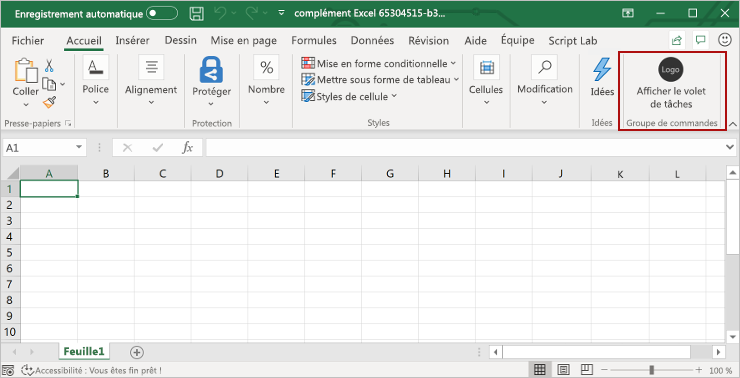

# <a name="tutorial-create-an-excel-task-pane-add-in"></a>Didacticiel : Créer un complément de volet de tâches de Excel

Dans ce tutoriel, vous allez créer un complément de volet de tâches Excel qui:

> [!div class="checklist"]
>
> - Crée un tableau
> - Filtres et tris un tableau
> - Crée un graphique (Chart)
> - Figer une en-tête de tableau
> - Protège une feuille de calcul
> - Ouvrir une boîte de dialogue

> [!TIP]
> Si vous avez déjà exécuté le démarrage rapide [Créer votre premier complément du volet des tâches d’Excel](../quickstarts/excel-quickstart-jquery.md) à l’aide du générateur Yeoman et que vous souhaitez utiliser ce projet comme point de départ pour ce didacticiel, accédez directement à la section [Créer un tableau](#create-a-table) pour commencer ce didacticiel.

## <a name="prerequisites"></a>Configuration requise

[!include[Yeoman generator prerequisites](../includes/quickstart-yo-prerequisites.md)]

- Office connecté à un abonnement Microsoft 365 (y compris Office on the web).

    > [!NOTE]
    > Si vous ne disposez pas déjà d’Office, vous pouvez [ rejoindre le programme de développement de Microsoft 365](https://developer.microsoft.com/office/dev-program) pour obtenir un abonnement Microsoft 365 de 90 jours renouvelable gratuit à utiliser pendant son développement.

## <a name="create-your-add-in-project"></a>Créer votre projet de complément

[!include[Yeoman generator create project guidance](../includes/yo-office-command-guidance.md)]

- **Sélectionnez un type de projet :** `Office Add-in Task Pane project`
- **Sélectionnez un type de script :** `JavaScript`
- **Comment souhaitez-vous nommer votre complément ?** `My Office Add-in`
- **Quelle application client Office voulez-vous prendre en charge ?** `Excel`


Après avoir exécuté l’assistant, le générateur crée le projet et installe les composants Node de prise en charge.

[!include[Yeoman generator next steps](../includes/yo-office-next-steps.md)]

## <a name="create-a-table"></a>Créer un tableau

Dans cette étape du didacticiel, vous vérifiez à l’aide de programme que votre complément prend en charge la version actuelle Excel de l’utilisateur, vous ajoutez un tableau à une feuille de calcul, vous renseignez le tableau avec des données et vous le mettez en forme.

### <a name="code-the-add-in"></a>Codage du complément

1. Ouvrez le projet dans votre éditeur de code.

1. Ouvrez le fichier **./src/taskpane/taskpane.html**.  Ce fichier contient le balisage HTML du volet des tâches.

1. Recherchez l’élément `<main>` et supprimez toutes les lignes qui apparaissent après la balise `<main>` d’ouverture et avant la balise `</main>` de fermeture.

1. Ajoutez le balisage suivant immédiatement après la balise `<main>` d’ouverture.

    ```html
    <button class="ms-Button" id="create-table">Create Table</button><br/><br/>
    ```

1. Ouvrez le fichier **./src/taskpane/taskpane.js**. Ce fichier contient le code API JavaScript pour Office qui facilite l’interaction entre le volet des tâches et l’application cliente Office.

1. Supprimez toutes les références au bouton `run` et à la fonction `run()` en procédant comme suit :

    - Recherchez et supprimez la ligne `document.getElementById("run").onclick = run;`.

    - Recherchez et supprimez la fonction `run()` entière.

1. Dans l’appel de la méthode `Office.onReady`, recherchez la ligne `if (info.host === Office.HostType.Excel) {` et ajoutez le code suivant immédiatement après cette ligne. Remarque :

    - La première partie de ce code détermine si la version d' Excel de l'utilisateur prend en charge une version d'Excel.js qui inclut toutes les API que cette série de tutoriels utilisera. Dans un complément de production, utilisez le corps du bloc conditionnel pour masquer ou désactiver l'interface utilisateur qui appellerait les API non prises en charge. Cela permettra à l'utilisateur de continuer à utiliser les parties du complément qui sont prises en charge par sa version d' Excel.

    - La deuxième partie de ce code ajoute un gestionnaire d’événements pour le bouton `create-table`.

    ```js
    // Determine if the user's version of Office supports all the Office.js APIs that are used in the tutorial.
    if (!Office.context.requirements.isSetSupported('ExcelApi', '1.7')) {
        console.log('Sorry. The tutorial add-in uses Excel.js APIs that are not available in your version of Office.');
    }

    // Assign event handlers and other initialization logic.
    document.getElementById("create-table").onclick = createTable;
    ```

1. Ajoutez la fonction suivante à la fin du fichier. Remarque :

    - Votre logique métier Excel.js est ajoutée à la fonction qui est transmise à `Excel.run`. Cette logique n’est pas exécutée immédiatement. Au lieu de cela, elle est ajoutée à une file d’attente de commandes.

    - La méthode `context.sync` envoie toutes les commandes en file d’attente vers Excel pour exécution.

    - L’élément `Excel.run` est suivi par un bloc `catch`. Il s’agit d’une meilleure pratique que vous devez toujours suivre.

    [!include[Information about the use of ES6 JavaScript](../includes/modern-js-note.md)]

    ```js
    async function createTable() {
        await Excel.run(async (context) => {

            // TODO1: Queue table creation logic here.

            // TODO2: Queue commands to populate the table with data.

            // TODO3: Queue commands to format the table.

            await context.sync();
        })
        .catch(function (error) {
            console.log("Error: " + error);
            if (error instanceof OfficeExtension.Error) {
                console.log("Debug info: " + JSON.stringify(error.debugInfo));
            }
        });
    }
    ```

1. Dans la fonction `createTable()`, remplacez `TODO1` par le code suivant. Remarque :

    - Le code crée un tableau à l’aide de la méthode `add` de collection de tableau d’une feuille de calcul, qui existe toujours même si elle est vide. Il s’agit de la méthode standard de création d’objets Excel.js. Il n’existe aucune API pour le constructeur de classe API. De plus, vous n’utilisez jamais d’opérateur `new` pour créer un objet Excel. Au lieu de cela, vous l’ajoutez à un objet de la collection parent.

    - Le premier paramètre de la méthode `add` est la plage comprenant uniquement la ligne supérieure du tableau, et non la plage entière utilisée en fin de compte par le tableau. La raison est que lorsque le complément remplit les lignes de données (dans l’étape suivante), il ajoute de nouvelles lignes au tableau au lieu d’écrire des valeurs dans les cellules des lignes existantes. Il s’agit d’un modèle courant, car le nombre de lignes contenues dans un tableau est souvent inconnu lorsque le tableau est créé.

    - Les noms de tableau doivent être uniques dans l’ensemble du classeur, pas uniquement dans la feuille de calcul.

    ```js
    const currentWorksheet = context.workbook.worksheets.getActiveWorksheet();
    const expensesTable = currentWorksheet.tables.add("A1:D1", true /*hasHeaders*/);
    expensesTable.name = "ExpensesTable";
    ```

1. Dans la fonction `createTable()`, remplacez `TODO2` par le code suivant. Remarque :

    - Les valeurs de cellule d’une plage sont définies avec un tableau de tableaux.

    - Les nouvelles lignes sont créées dans un tableau en appelant la méthode `add` de collection de ligne du tableau. Vous pouvez ajouter plusieurs lignes dans un seul appel de `add` en incluant plusieurs tableaux de valeurs de cellule dans le tableau parent transmis en tant que deuxième paramètre.

    ```js
    expensesTable.getHeaderRowRange().values =
        [["Date", "Merchant", "Category", "Amount"]];

    expensesTable.rows.add(null /*add at the end*/, [
        ["1/1/2017", "The Phone Company", "Communications", "120"],
        ["1/2/2017", "Northwind Electric Cars", "Transportation", "142.33"],
        ["1/5/2017", "Best For You Organics Company", "Groceries", "27.9"],
        ["1/10/2017", "Coho Vineyard", "Restaurant", "33"],
        ["1/11/2017", "Bellows College", "Education", "350.1"],
        ["1/15/2017", "Trey Research", "Other", "135"],
        ["1/15/2017", "Best For You Organics Company", "Groceries", "97.88"]
    ]);
    ```

1. Dans la fonction`createTable()`, remplacez `TODO3` par le code suivant. Remarque :

    - Le code recherche une référence à la colonne **Amount** en transmettant son index de base zéro à la méthode `getItemAt` de collection de colonnes du tableau.

        > [!NOTE]
        > Les objets de collection Excel.js, tels que `TableCollection`, `WorksheetCollection` et `TableColumnCollection` ont une propriété `items` qui correspond à un tableau de types d’objet enfant, comme `Table` ou `Worksheet` ou `TableColumn` ; mais un objet `*Collection` n’est pas lui-même un tableau.

    - Le code définit ensuite la plage de la colonne **Amount** sous la forme Euros à la deuxième décimale.

    - Enfin, il s’assure que la largeur des colonnes et la hauteur des lignes sont assez grandes pour contenir l’élément de données le plus long (ou le plus haut). Notez que le code doit rechercher des objets `Range` à mettre en forme. Les objets `TableColumn` et `TableRow` n’ont pas de propriétés de mise en forme.

    ```js
    expensesTable.columns.getItemAt(3).getRange().numberFormat = [['\u20AC#,##0.00']];
    expensesTable.getRange().format.autofitColumns();
    expensesTable.getRange().format.autofitRows();
    ```

1. Vérifiez que vous avez enregistré toutes les modifications que vous avez apportées au projet.

### <a name="test-the-add-in"></a>Test du complément

1. Pour démarrer le serveur web local et charger indépendamment votre complément, procédez comme suit.

    [!INCLUDE [alert use https](../includes/alert-use-https.md)]

    > [!TIP]
    > Si vous testez votre complément sur Mac, exécutez la commande suivante dans le répertoire racine de votre projet avant de continuer. Lorsque vous exécutez cette commande, le serveur web local démarre.
    >
    > ```command&nbsp;line
    > npm run dev-server
    > ```

    - Pour tester votre complément dans Excel, exécutez la commande suivante dans le répertoire racine de votre projet. Cela a pour effet de démarrer le serveur web local (s’il n’est pas déjà en cours d’exécution) et d’ouvrir Excel avec votre complément chargé.

        ```command&nbsp;line
        npm start
        ```

    - Pour tester votre complément dans Excel sur le web, exécutez la commande suivante dans le répertoire racine de votre projet. Lorsque vous exécutez cette commande, le serveur web local démarre. Remplacez « {url} » par l’URL d’un document Excel sur votre OneDrive ou une bibliothèque SharePoint sur laquelle vous disposez d’autorisations.

        [!INCLUDE [npm start:web command syntax](../includes/start-web-sideload-instructions.md)]

1. Dans Excel, sélectionnez l’onglet **Accueil**, puis choisissez le bouton **Afficher le volet Office** du ruban pour ouvrir le volet Office du complément.

    

1. Dans le volet Office, sélectionnez le bouton **Créer un tableau**.

    

## <a name="filter-and-sort-a-table"></a>Filtrer et trier un tableau

Dans cette étape du didacticiel, vous allez filtrer et trier le tableau que vous avez créé précédemment.

### <a name="filter-the-table"></a>Filtrage du tableau

1. Ouvrez le fichier **./src/taskpane/taskpane.html**.

1. Recherchez l’élément `<button>` pour le bouton `create-table`, et ajoutez le balisage suivant après cette ligne.

    ```html
    <button class="ms-Button" id="filter-table">Filter Table</button><br/><br/>
    ```

1. Ouvrez le fichier **./src/taskpane/taskpane.js**.

1. Au cours de l’appel de méthode `Office.onReady`, recherchez la ligne qui attribue un gestionnaire de clic au bouton `create-table`, puis ajoutez le code suivant après cette ligne.

    ```js
    document.getElementById("filter-table").onclick = filterTable;
    ```

1. Ajoutez la fonction suivante à la fin du fichier.

    ```js
    async function filterTable() {
        await Excel.run(async (context) => {

            // TODO1: Queue commands to filter out all expense categories except
            //        Groceries and Education.

            await context.sync();
        })
        .catch(function (error) {
            console.log("Error: " + error);
            if (error instanceof OfficeExtension.Error) {
                console.log("Debug info: " + JSON.stringify(error.debugInfo));
            }
        });
    }
    ```

1. Dans la fonction `filterTable()`, remplacez `TODO1` par le code suivant. Remarque :

   - Le code obtient tout d’abord une référence à la colonne à filtrer en transférant le nom de la colonne à la méthode `getItem`, au lieu de transmettre son index à la méthode `getItemAt` comme le fait la méthode `createTable`. Puisque les utilisateurs peuvent déplacer des colonnes de tableau, la colonne d’un index donné peut être modifiée après la création du tableau. Par conséquent, il est préférable d’utiliser le nom de la colonne pour obtenir une référence de la colonne. Dans le didacticiel précédent, nous avons utilisé la méthode `getItemAt` en toute sécurité, car nous l’avons utilisée dans la même méthode que celle qui crée le tableau, il n’y a donc aucune chance qu’un utilisateur ait déplacé la colonne.

   - La méthode `applyValuesFilter` est l’une des nombreuses méthodes de filtrage sur l’objet `Filter`.

    ```js
    const currentWorksheet = context.workbook.worksheets.getActiveWorksheet();
    const expensesTable = currentWorksheet.tables.getItem('ExpensesTable');
    const categoryFilter = expensesTable.columns.getItem('Category').filter;
    categoryFilter.applyValuesFilter(['Education', 'Groceries']);
    ```

### <a name="sort-the-table"></a>Tri du tableau

1. Ouvrez le fichier **./src/taskpane/taskpane.html**.

1. Recherchez l’élément `<button>` pour le bouton `filter-table`, et ajoutez le balisage suivant après cette ligne.

    ```html
    <button class="ms-Button" id="sort-table">Sort Table</button><br/><br/>
    ```

1. Ouvrez le fichier **./src/taskpane/taskpane.js**.

1. Au cours de l’appel de méthode `Office.onReady`, recherchez la ligne qui attribue un gestionnaire de clic au bouton `filter-table`, puis ajoutez le code suivant après cette ligne.

    ```js
    document.getElementById("sort-table").onclick = sortTable;
    ```

1. Ajoutez la fonction suivante à la fin du fichier.

    ```js
    async function sortTable() {
        await Excel.run(async (context) => {

            // TODO1: Queue commands to sort the table by Merchant name.

            await context.sync();
        })
        .catch(function (error) {
            console.log("Error: " + error);
            if (error instanceof OfficeExtension.Error) {
                console.log("Debug info: " + JSON.stringify(error.debugInfo));
            }
        });
    }
    ```

1. Dans la fonction `sortTable()`, remplacez `TODO1` par le code suivant. Remarque :

   - Le code crée un tableau d’objets `SortField` qui ne comporte qu’un seul membre puisque le complément ne trie que la colonne Merchant.

   - La propriété `key` d’un objet `SortField` est l’index de la colonne utilisée pour le tri. Les lignes du tableau sont triées sur la base des valeurs de la colonne référencée.

   - Le `sort`membre de a `Table`est un`TableSort` objet, pas une méthode. Les `SortField`s sont passés à la `TableSort`méthode de l'objet`apply`.

    ```js
    const currentWorksheet = context.workbook.worksheets.getActiveWorksheet();
    const expensesTable = currentWorksheet.tables.getItem('ExpensesTable');
    const sortFields = [
        {
            key: 1,            // Merchant column
            ascending: false,
        }
    ];

    expensesTable.sort.apply(sortFields);
    ```

1. Vérifiez que vous avez enregistré toutes les modifications que vous avez apportées au projet.

### <a name="test-the-add-in"></a>Test du complément

1. [!include[Start server and sideload add-in instructions](../includes/tutorial-excel-start-server.md)]

1. Si le volet des tâches du complément n’est pas déjà ouvert dans Excel, sélectionnez l’onglet **Accueil**, puis cliquez sur le bouton **Afficher le volet de tâches** du ruban pour l’ouvrir.

1. Si la tableau que vous avez ajoutée précédemment dans ce didacticiel ne figure pas dans la feuille de calcul ouverte, sélectionnez le bouton **Créer un tableau** dans le volet Office.

1. Choisissez le bouton **Filtrer le tableau** et le bouton **Trier le tableau** dans n’importe quel ordre.

    

## <a name="create-a-chart"></a>Création d’un graphique (chart)

Dans cette étape du didacticiel, vous créerez un graphique à l’aide de données provenant du tableau précédemment créé, puis vous mettrez en forme le graphique.

### <a name="chart-a-chart-using-table-data"></a>Un graphique à l’aide de données du tableau de graphique (chart)

1. Ouvrez le fichier **./src/taskpane/taskpane.html**.

1. Recherchez l’élément `<button>` pour le bouton `sort-table`, et ajoutez le balisage suivant après cette ligne.

    ```html
    <button class="ms-Button" id="create-chart">Create Chart</button><br/><br/>
    ```

1. Ouvrez le fichier **./src/taskpane/taskpane.js**.

1. Au cours de l’appel de méthode `Office.onReady`, recherchez la ligne qui attribue un gestionnaire de clic au bouton `sort-table`, puis ajoutez le code suivant après cette ligne.

    ```js
    document.getElementById("create-chart").onclick = createChart;
    ```

1. Ajoutez la fonction suivante à la fin du fichier.

    ```js
    async function createChart() {
        await Excel.run(async (context) => {

            // TODO1: Queue commands to get the range of data to be charted.

            // TODO2: Queue command to create the chart and define its type.

            // TODO3: Queue commands to position and format the chart.

            await context.sync();
        })
        .catch(function (error) {
            console.log("Error: " + error);
            if (error instanceof OfficeExtension.Error) {
                console.log("Debug info: " + JSON.stringify(error.debugInfo));
            }
        });
    }
    ```

1. Dans la `createChart()`fonction, remplacez-la`TODO1` par le code suivant. Notez qu'afin d'exclure la ligne d'en-tête, le code utilise la `Table.getDataBodyRange`méthode pour obtenir la plage de données que vous souhaitez mettre en graphique au lieu de la `getRange`méthode .

    ```js
    const currentWorksheet = context.workbook.worksheets.getActiveWorksheet();
    const expensesTable = currentWorksheet.tables.getItem('ExpensesTable');
    const dataRange = expensesTable.getDataBodyRange();
    ```

1. Dans la fonction `createChart()`, remplacez `TODO2` par le code suivant. Notez les paramètres suivants.

   - Le premier paramètre transmis à la méthode `add` spécifie le type de graphique. Il en existe plusieurs dizaines de types.

   - Le deuxième paramètre spécifie la plage de données à inclure dans le graphique.

   - Le troisième paramètre détermine si une série de points de données de la table doit être représentée par ligne ou par colonne. L’option `auto` indique à Excel de décider de la meilleure méthode.

    ```js
    const chart = currentWorksheet.charts.add('ColumnClustered', dataRange, 'Auto');
    ```

1. Dans la fonction `createChart()`, remplacez `TODO3` par le code suivant. La majorité de ce code est explicite. Remarque :

   - Les paramètres de la méthode `setPosition` spécifient les cellules situées en haut à gauche et en bas à droite de la zone de feuille de calcul devant contenir le graphique. Excel peut ajuster des éléments, tels que la largeur de ligne pour que le graphique s’affiche correctement dans l’espace attribué.

   - Une « série » est un ensemble de points de données dans une colonne du tableau. Étant donné qu’il n’existe qu’une seule colonne autre que de type chaîne dans le tableau, Excel déduit que la colonne est la seule colonne de points de données pour le graphique. Il interprète les autres colonnes comme des étiquettes de graphique. Par conséquent, il y aura simplement une série dans le graphique et un index 0. Il s’agit de celle à étiqueter avec « Valeur en &euro; ».

    ```js
    chart.setPosition("A15", "F30");
    chart.title.text = "Expenses";
    chart.legend.position = "Right";
    chart.legend.format.fill.setSolidColor("white");
    chart.dataLabels.format.font.size = 15;
    chart.dataLabels.format.font.color = "black";
    chart.series.getItemAt(0).name = 'Value in \u20AC';
    ```

1. Vérifiez que vous avez enregistré toutes les modifications que vous avez apportées au projet.

### <a name="test-the-add-in"></a>Test du complément

1. [!include[Start server and sideload add-in instructions](../includes/tutorial-excel-start-server.md)]

1. Si le volet des tâches du complément n’est pas déjà ouvert dans Excel, sélectionnez l’onglet **Accueil**, puis cliquez sur le bouton **Afficher le volet de tâches** du ruban pour l’ouvrir.

1. Si la tableau que vous avez ajoutée précédemment dans ce didacticiel ne figure pas dans la feuille de calcul ouverte, sélectionnez le bouton **Créer un tableau**, puis le bouton **Filtrer un tableau** et le bouton **Trier un tableau** dans n’importe quel ordre..

1. Sélectionnez le bouton **Créer un graphique**. Un graphique est créé dans lequel seules les données provenant des lignes filtrées sont incluses. Les étiquettes sur les points de données en bas sont organisées selon l’ordre de tri du graphique, à savoir les noms de marchand par ordre alphabétique inversé.

    

## <a name="freeze-a-table-header"></a>Figer un en-tête de tableau

Lorsqu’un tableau est tellement long que l’utilisateur doit le faire défiler pour afficher les lignes suivantes, la ligne d’en-tête peut être masquée. Dans cette étape du didacticiel, vous allez figer la ligne d’en-tête du tableau que vous avez créé précédemment, afin qu’elle reste visible même lorsque l’utilisateur fait défiler la feuille de calcul vers le bas.

### <a name="freeze-the-tables-header-row"></a>Figer la ligne d’en-tête du tableau

1. Ouvrez le fichier **./src/taskpane/taskpane.html**.

1. Recherchez l’élément `<button>` pour le bouton `create-chart`, et ajoutez le balisage suivant après cette ligne.

    ```html
    <button class="ms-Button" id="freeze-header">Freeze Header</button><br/><br/>
    ```

1. Ouvrez le fichier **./src/taskpane/taskpane.js**.

1. Au cours de l’appel de méthode `Office.onReady`, recherchez la ligne qui attribue un gestionnaire de clic au bouton `create-chart`, puis ajoutez le code suivant après cette ligne.

    ```js
    document.getElementById("freeze-header").onclick = freezeHeader;
    ```

1. Ajoutez la fonction suivante à la fin du fichier.

    ```js
    async function freezeHeader() {
        await Excel.run(async (context) => {

            // TODO1: Queue commands to keep the header visible when the user scrolls.

            await context.sync();
        })
        .catch(function (error) {
            console.log("Error: " + error);
            if (error instanceof OfficeExtension.Error) {
                console.log("Debug info: " + JSON.stringify(error.debugInfo));
            }
        });
    }
    ```

1. Dans la fonction `freezeHeader()`, remplacez `TODO1` par le code suivant. Remarque :

   - La collection `Worksheet.freezePanes` est un ensemble de volets de la feuille de calcul qui sont épinglés, c’est-à-dire figés, lorsque vous faites défiler la feuille de calcul.

   - La méthode `freezeRows` prend comme paramètre le nombre de lignes, à partir du haut, qui doivent être épinglées. `1` est transmis pour épingler la première rangée.

    ```js
    const currentWorksheet = context.workbook.worksheets.getActiveWorksheet();
    currentWorksheet.freezePanes.freezeRows(1);
    ```

1. Vérifiez que vous avez enregistré toutes les modifications que vous avez apportées au projet.

### <a name="test-the-add-in"></a>Test du complément

1. [!include[Start server and sideload add-in instructions](../includes/tutorial-excel-start-server.md)]

1. Si le volet des tâches du complément n’est pas déjà ouvert dans Excel, sélectionnez l’onglet **Accueil**, puis cliquez sur le bouton **Afficher le volet de tâches** du ruban pour l’ouvrir.

1. Si le tableau que vous avez ajouté précédemment dans ce didacticiel est présent dans la feuille de calcul, supprimez-le.

1. Dans le volet Office, sélectionnez le bouton **Créer un tableau**.

1. Dans le volet Office, sélectionnez le bouton **Figer l’en-tête**.

1. Faites suffisamment défiler la feuille de calcul vers le bas pour voir que l’en-tête du tableau est toujours visible dans la partie supérieure même lorsque les lignes du haut sont masquées.

    

## <a name="protect-a-worksheet"></a>Protéger une feuille de calcul

Au cours de cette étape, vous allez ajouter un bouton au ruban pour activer ou désactiver la protection de la feuille de calcul.

### <a name="configure-the-manifest-to-add-a-second-ribbon-button"></a>Configuration du manifeste pour ajouter un deuxième bouton de ruban

1. Ouvrez le fichier manifeste **./manifest.xml**.

1. Localisez `<Control>`l'élément. Cet élément définit le bouton **Afficher le volet** des tâches sur le ruban **Accueil** que vous avez utilisé pour lancer le module complémentaire. Nous allons ajouter un deuxième bouton au même groupe sur le ruban **Accueil**. Entre la balise de fermeture et la `</Control>`balise de fermeture`</Group>`, ajoutez le balisage suivant.

    ```xml
    <Control xsi:type="Button" id="<!--TODO1: Unique (in manifest) name for button -->">
        <Label resid="<!--TODO2: Button label -->" />
        <Supertip>
            <Title resid="<!-- TODO3: Button tool tip title -->" />
            <Description resid="<!-- TODO4: Button tool tip description -->" />
        </Supertip>
        <Icon>
            <bt:Image size="16" resid="Icon.16x16"/>
            <bt:Image size="32" resid="Icon.32x32"/>
            <bt:Image size="80" resid="Icon.80x80"/>
        </Icon>
        <Action xsi:type="<!-- TODO5: Specify the type of action-->">
            <!-- TODO6: Identify the function.-->
        </Action>
    </Control>
    ```

1. Dans le code XML que vous venez d’ajouter au fichier manifeste, remplacez `TODO1` par une chaîne qui attribue un ID unique au bouton au sein de ce fichier manifeste. Étant donné que notre bouton va activer ou désactiver la protection de la feuille de calcul, utilisez « ToggleProtection ». Lorsque vous avez terminé, l’étiquette d’ouverture de l’élément `Control` doit ressembler à ceci :

    ```xml
    <Control xsi:type="Button" id="ToggleProtection">
    ```

1. Les trois `TODO`s suivants définissent les ID des ressources`resid`, ou s. Une ressource est une chaîne (d'une longueur maximale de 32 caractères), et vous créerez ces trois chaînes dans une étape ultérieure. Pour l'instant, vous devez donner des *ID* aux ressources. Le libellé du bouton doit être « Toggle Protection», mais l'ID de cette chaîne doit être « ProtectionButtonLabel », de sorte que `Label`l'élément doit ressembler à ceci :

    ```xml
    <Label resid="ProtectionButtonLabel" />
    ```

1. L’élément `SuperTip` définit l’info-bulle du bouton. Le titre de l’info-bulle doit être identique à l’étiquette du bouton, nous utilisons donc le même ID de ressource : « ProtectionButtonLabel ». La description de l’info-bulle sera « Cliquez pour activer/désactiver la protection de la feuille de calcul ». Néanmoins, l’élément `resid` doit être « ProtectionButtonToolTip ». Lorsque vous avez terminé, l’élément `SuperTip` doit ressembler à ceci :

    ```xml
    <Supertip>
        <Title resid="ProtectionButtonLabel" />
        <Description resid="ProtectionButtonToolTip" />
    </Supertip>
    ```

   > [!NOTE]
   > Dans un complément de production, vous n’utiliseriez pas la même icône pour deux boutons différents, mais pour simplifier ce didacticiel, nous allons le faire. Par conséquent, le balisage `Icon` de notre nouvel élément `Control` est simplement une copie de l’élément `Icon` provenant de l’élément `Control` existant.

1. Le type de `Action`l'élément situé à l'intérieur de l'élément d'origine`Control` est défini sur`ShowTaskpane` , mais notre nouveau bouton ne va pas ouvrir un volet de tâches ; il va exécuter une fonction personnalisée que vous créerez dans une étape ultérieure. Il faut donc le remplacer `TODO5`par`ExecuteFunction` , qui est le type d'action des boutons qui déclenchent des fonctions personnalisées. La balise d'ouverture de`Action` l'élément doit ressembler à ceci :

    ```xml
    <Action xsi:type="ExecuteFunction">
    ```

1. L’élément `Action` d’origine comporte des éléments enfants qui spécifient un ID de volet Office et une URL de la page qui doit être ouverte dans le volet Office. Toutefois, un élément `Action` du type `ExecuteFunction` a un seul élément enfant qui nomme la fonction exécutée par le contrôle. Vous allez créer cette fonction dans une étape ultérieure et elle sera appelée `toggleProtection`. Par conséquent, remplacez `TODO6` par le balisage suivant.

    ```xml
    <FunctionName>toggleProtection</FunctionName>
    ```

    Le balisage `Control` complet doit à présent ressembler à ce qui suit :

    ```xml
    <Control xsi:type="Button" id="ToggleProtection">
        <Label resid="ProtectionButtonLabel" />
        <Supertip>
            <Title resid="ProtectionButtonLabel" />
            <Description resid="ProtectionButtonToolTip" />
        </Supertip>
        <Icon>
            <bt:Image size="16" resid="Icon.16x16"/>
            <bt:Image size="32" resid="Icon.32x32"/>
            <bt:Image size="80" resid="Icon.80x80"/>
        </Icon>
        <Action xsi:type="ExecuteFunction">
           <FunctionName>toggleProtection</FunctionName>
        </Action>
    </Control>
    ```

1. Faites défiler vers le bas jusqu’à la section `Resources` du manifeste.

1. Ajoutez le balisage suivant en tant qu’enfant de l’élément `bt:ShortStrings`.

    ```xml
    <bt:String id="ProtectionButtonLabel" DefaultValue="Toggle Worksheet Protection" />
    ```

1. Ajoutez le balisage suivant en tant qu’enfant de l’élément `bt:LongStrings`.

    ```xml
    <bt:String id="ProtectionButtonToolTip" DefaultValue="Click to protect or unprotect the current worksheet." />
    ```

1. Enregistrez le fichier.

### <a name="create-the-function-that-protects-the-sheet"></a>Création de la fonction qui protège la feuille

1. Ouvrez le fichier **.\commands\commands.js**.

1. Ajoutez la fonction suivante immédiatement après la fonction `action`. Notez que nous spécifions un paramètre `args` pour la fonction et que la toute dernière ligne de la fonction appelle `args.completed`. Il s’agit d’une condition requise pour toutes les commandes de type **ExecuteFunction**. Elle signale à l’application cliente Office que la fonction est terminée et que l’interface utilisateur est à nouveau réactive.

    ```js
    async function toggleProtection(args) {
        await Excel.run(async (context) => {

            // TODO1: Queue commands to reverse the protection status of the current worksheet.

            await context.sync();
        })
        .catch(function (error) {
            console.log("Error: " + error);
            if (error instanceof OfficeExtension.Error) {
                console.log("Debug info: " + JSON.stringify(error.debugInfo));
            }
        });
        args.completed();
    }
    ```

1. Ajoutez la ligne suivante à la fin du fichier :

    ```js
    g.toggleProtection = toggleProtection;
    ```

1. Dans la fonction `toggleProtection`, remplacez `TODO1` par le code suivant. Ce code utilise la propriété de protection de l’objet de feuille de calcul dans un modèle de bascule standard. La tâche `TODO2` sera expliquée dans la section suivante.

    ```js
    const sheet = context.workbook.worksheets.getActiveWorksheet();

    // TODO2: Queue command to load the sheet's "protection.protected" property from
    //        the document and re-synchronize the document and task pane.

    if (sheet.protection.protected) {
        sheet.protection.unprotect();
    } else {
        sheet.protection.protect();
    }
    ```

### <a name="add-code-to-fetch-document-properties-into-the-task-panes-script-objects"></a>Ajoutez du code pour récupérer des propriétés de document dans les objets de script du volet Office

Dans chaque fonction que vous avez créée dans ce tutoriel jusqu'à présent, vous avez mis en file d'attente des commandes à *écrire* dans le document Office. Chaque fonction se terminait par un appel à la `context.sync()`méthode, qui envoyait les commandes mises en file d'attente au document pour qu'elles soient exécutées. Toutefois, le code que vous avez ajouté à la dernière étape appelle la méthode`sheet.protection.protected property`. C'est une différence importante par rapport aux fonctions précédentes que vous avez écrites, car `sheet`l'objet n'est qu'un objet proxy qui existe dans le script de votre volet de tâches. L'objet proxy ne connaît pas l'état de protection réel du document, et sa`protection.protected` propriété ne peut donc pas avoir de valeur réelle. Pour éviter une erreur d'exception, vous devez d'abord récupérer l'état de protection du document et l'utiliser pour définir la valeur de . `sheet.protection.protected`Ce processus de récupération comporte trois étapes.

   1. Mettez en file d’attente une commande de chargement (c’est-à-dire, fetch) des propriétés que votre code doit lire.

   1. Appelez la méthode `sync` de l’objet de contexte pour envoyer la commande mise en file d’attente vers le document pour exécution, et renvoyez les informations demandées.

   1. Étant donné que la méthode `sync` est asynchrone, assurez-vous qu’elle est terminée avant que votre code appelle les propriétés qui ont été récupérées.

Ces étapes doivent être effectuées à chaque fois que votre code doit lire (*read*) des informations provenant du document Office.

1. Dans la fonction `toggleProtection`, remplacez `TODO2` par le code suivant. remarque :

   - Chaque objet Excel possède une méthode `load`. Vous spécifiez les propriétés de l’objet que vous voulez lire dans le paramètre en tant que chaîne de noms séparés par des virgules. Dans ce cas, la propriété que vous devez lire est une sous-propriété de la propriété `protection`. Pour référence la sous-propriété, procédez presque exactement de la même façon que vous le feriez à n’importe quel autre emplacement de votre code, sauf que vous devez utiliser une barre oblique (« / ») au lieu d’un point « . ».

   - Pour être sûr que la logique de basculement, qui lit la propriété `sheet.protection.protected`, ne s’exécute pas tant que la méthode `sync` n’est pas terminée et que la propriété `sheet.protection.protected` n’est pas affectée à la valeur adéquate récupérée dans le document, cette logique doit être effectuée une fois que l’opérateur `await` a vérifié que la méthode `sync` est terminée.

    ```js
    sheet.load('protection/protected');
    await context.sync();
    ```

   Lorsque vous avez terminé, la fonction entière doit ressembler à ce qui suit :

    ```js
    async function toggleProtection(args) {
        await Excel.run(async (context) => {
            const sheet = context.workbook.worksheets.getActiveWorksheet();
            sheet.load('protection/protected');

            await context.sync();

            if (sheet.protection.protected) {
                sheet.protection.unprotect();
            } else {
                sheet.protection.protect();
            }
            
            await context.sync();
        })
        .catch(function (error) {
            console.log("Error: " + error);
            if (error instanceof OfficeExtension.Error) {
                console.log("Debug info: " + JSON.stringify(error.debugInfo));
            }
        });
        args.completed();
    }
    ```

1. Vérifiez que vous avez enregistré toutes les modifications que vous avez apportées au projet.

### <a name="test-the-add-in"></a>Test du complément

1. Fermez toutes les applications Office, y compris Excel.

1. Supprimez le cache Office en supprimant le contenu (tous les fichiers et sous-dossiers) du dossier cache. Cela est nécessaire pour effacer complètement l’ancienne version du complément de l’application cliente.

    - Pour Windows : `%LOCALAPPDATA%\Microsoft\Office\16.0\Wef\`.

    - Pour Mac : `~/Library/Containers/com.Microsoft.OsfWebHost/Data/`.

      > [!NOTE]
      > Si ce dossier n’existe pas, recherchez les dossiers suivants et, le cas échéant, supprimez le contenu du dossier.
      >
      >  - `~/Library/Containers/com.microsoft.{host}/Data/Library/Caches/` où `{host}` est l’application Office (par exemple, `Excel`)
      >  - `~/Library/Containers/com.microsoft.{host}/Data/Library/Application Support/Microsoft/Office/16.0/Wef/` où `{host}` est l’application Office (par exemple, `Excel`)
      >  - `~/Library/Containers/com.microsoft.Office365ServiceV2/Data/Caches/com.microsoft.Office365ServiceV2/`
      >  - `~/Library/Containers/com.microsoft.Office365ServiceV2/Data/Library/Caches/com.microsoft.Office365ServiceV2/`

1. Si le serveur web local est déjà en cours d’exécution, arrêtez-le en fermant la fenêtre de commande du nœud.

1. Étant donné que votre fichier manifeste a été mis à jour, vous devez à nouveau charger une version test du complément à l’aide du fichier manifeste mis à jour. Démarrez le serveur web local et chargez indépendamment votre complément :

    - Pour tester votre complément dans Excel, exécutez la commande suivante dans le répertoire racine de votre projet. Cela a pour effet de démarrer le serveur web local (s’il n’est pas déjà en cours d’exécution) et d’ouvrir Excel avec votre complément chargé.

        ```command&nbsp;line
        npm start
        ```

    - Pour tester votre complément dans Excel sur le web, exécutez la commande suivante dans le répertoire racine de votre projet. Lorsque vous exécutez cette commande, le serveur web local démarre (s’il n’est pas déjà en cours d’exécution).

        ```command&nbsp;line
        npm run start:web
        ```

        Pour utiliser votre complément, ouvrez un document dans Microsoft Excel sur le web, puis chargez votre complément en suivant les instructions de la section [Charger des compléments Office dans Office sur le Web](../testing/sideload-office-add-ins-for-testing.md#sideload-an-office-add-in-in-office-on-the-web).

1. Dans l'onglet **Accueil** d' Excel, cliquez **sur le bouton Afficher la protection de la feuille de** travail. Notez que la plupart des commandes du ruban sont désactivées (et visuellement grisées) comme le montre la capture d'écran suivante.

    

1. Choisissez une cellule comme vous le feriez si vous vouliez modifier son contenu. Excel affiche un message d'erreur indiquant que la feuille de calcul est protégée.

1. Sélectionnez le bouton **Toggle Worksheet Protection** à nouveau pour réactiver les contrôles. Vous pouvez alors modifier une nouvelle fois les valeurs de cellule.

## <a name="open-a-dialog"></a>Ouvrir une boîte de dialogue

Dans cette étape finale du didacticiel, vous allez ouvrir une boîte de dialogue dans votre complément, transmettre un message du processus de boîte de dialogue au processus de volet Office et fermer la boîte de dialogue. Les boîtes de dialogue des compléments Office sont *non modales* : un utilisateur peut continuer à interagir à la fois avec le document dans l’application Office et avec la page hôte dans le volet des tâches.

### <a name="create-the-dialog-page"></a>Création de la page de boîte de dialogue

1. Dans le dossier **./src** situé à la racine du projet, créez un dossier nommé **boîtes de dialogue**.

1. Dans le dossier **./src/dialogs**, créez un fichier nommé **popup.html**.

1. Ajoutez le balisage suivant au fichier **popup.html**. Remarque :

   - La page contient un champ `<input>` dans lequel l’utilisateur doit entrer son nom et un bouton qui enverra ce nom au volet Office dans lequel il s’affiche.

   - Le balisage charge un script nommé **popup.js** que vous allez créer dans une étape ultérieure.

   - Il charge également la bibliothèque Office.js, car elle sera utilisée dans **popup.js**.

    ```html
    <!DOCTYPE html>
    <html>
        <head lang="en">
            <title>Dialog for My Office Add-in</title>
            <meta charset="UTF-8">
            <meta name="viewport" content="width=device-width, initial-scale=1">

            <!-- For more information on Fluent UI, visit https://developer.microsoft.com/fluentui. -->
            <link rel="stylesheet" href="https://static2.sharepointonline.com/files/fabric/office-ui-fabric-core/9.6.1/css/fabric.min.css"/>

            <script type="text/javascript" src="https://appsforoffice.microsoft.com/lib/1/hosted/office.js"></script>
            <script type="text/javascript" src="popup.js"></script>

        </head>
        <body style="display:flex;flex-direction:column;align-items:center;justify-content:center">
            <p class="ms-font-xl">ENTER YOUR NAME</p>
            <input id="name-box" type="text"/><br/><br/>
            <button id="ok-button" class="ms-Button">OK</button>
        </body>
    </html>
    ```

1. Dans le dossier **./src/dialogs**, créez un fichier nommé **popup.js**.

1. Ajoutez le code suivant au fichier **popup.js**. Notez ce qui suit à propos de ce code.

   - *Toutes les pages appellent les API dans la bibliothèque Office.js doivent tout d’abord vérifier que la bibliothèque est entièrement initialisée.* La meilleure façon de procéder consiste à appeler la méthode `Office.onReady()`. Si votre complément dispose de ses propres tâches d’initialisation, le code doit passer dans une méthode `then()` chaînée à l’appel de `Office.onReady()`. Le code qui appelle `Office.onReady()` doit être exécuté avant tout appel à Office.js ; l’affectation se trouve donc dans un fichier de script chargé par la page, comme dans ce cas.

    ```js
    (function () {
    "use strict";

        Office.onReady()
            .then(function() {

                // TODO1: Assign handler to the OK button.

            });

        // TODO2: Create the OK button handler

    }());
    ```

1. Remplacez `TODO1` par le code suivant. Vous allez créer la fonction `sendStringToParentPage` lors de l’étape suivante.

    ```js
    document.getElementById("ok-button").onclick = sendStringToParentPage;
    ```

1. Remplacez `TODO2` par le code suivant. La méthode `messageParent` transmet son paramètre à la page parente, qui est, dans ce cas, la page dans le volet des tâches. Le paramètre doit être une chaîne qui inclut tous les éléments qui peuvent être sérialisés en tant que chaîne, au format XML ou JSON, ou tout type pouvant être converti en chaîne.

    ```js
    function sendStringToParentPage() {
        const userName = document.getElementById("name-box").value;
        Office.context.ui.messageParent(userName);
    }
    ```

> [!NOTE]
> Le fichier **popup.html** et le fichier **popup.js** qu’il charge s’exécutent dans un processus d’exécution de navigateur entièrement distinct du volet Office du complément. Si le **popup.js** était transpilé dans le même fichier **bundle.js** en tant que fichier **app.js**, le complément devrait charger deux copies du fichier **bundle.js**, ce qui irait à l’encontre de l’objectif de groupement. Par conséquent, ce complément ne transpile pas le fichier **popup.js** du tout.

### <a name="update-webpack-config-settings"></a>Mettre à jour les paramètres de configuration webapck

Ouvrez le fichier **webpack.config.js** situé dans le répertoire racine du projet et procédez comme suit.

1. Recherchez l’objet `entry` dans l’objet `config` et ajoutez une nouvelle entrée pour `popup`.

    ```js
    popup: "./src/dialogs/popup.js"
    ```

    Une fois que vous avez terminé, le nouvel objet `entry` ressemblera à ceci.

    ```js
    entry: {
      polyfill: "@babel/polyfill",
      taskpane: "./src/taskpane/taskpane.js",
      commands: "./src/commands/commands.js",
      popup: "./src/dialogs/popup.js"
    },
    ```
  
1. Recherchez la matrice `plugins` dans l’objet `config` et ajoutez l’objet suivant à la fin de cette matrice.

    ```js
    new HtmlWebpackPlugin({
      filename: "popup.html",
      template: "./src/dialogs/popup.html",
      chunks: ["polyfill", "popup"]
    })
    ```

    Une fois que vous avez terminé, le nouveau tableau de `plugins` ressemblera à ceci.

    ```js
    plugins: [
      new CleanWebpackPlugin(),
      new HtmlWebpackPlugin({
        filename: "taskpane.html",
        template: "./src/taskpane/taskpane.html",
        chunks: ['polyfill', 'taskpane']
      }),
      new CopyWebpackPlugin([
      {
        to: "taskpane.css",
        from: "./src/taskpane/taskpane.css"
      }
      ]),
      new HtmlWebpackPlugin({
        filename: "commands.html",
        template: "./src/commands/commands.html",
        chunks: ["polyfill", "commands"]
      }),
      new HtmlWebpackPlugin({
        filename: "popup.html",
        template: "./src/dialogs/popup.html",
        chunks: ["polyfill", "popup"]
      })
    ],
    ```

1. Si le serveur web local est en cours d’exécution, arrêtez-le en fermant la fenêtre de commande du nœud.

1. Exécutez la commande suivante pour regénérer le projet.

    ```command&nbsp;line
    npm run build
    ```

### <a name="open-the-dialog-from-the-task-pane"></a>Ouverture de la boîte de dialogue à partir du volet Office

1. Ouvrez le fichier **./src/taskpane/taskpane.html**.

1. Recherchez l’élément `<button>` pour le bouton `freeze-header`, et ajoutez le balisage suivant après cette ligne.

    ```html
    <button class="ms-Button" id="open-dialog">Open Dialog</button><br/><br/>
    ```

1. La boîte de dialogue invite l'utilisateur à saisir un nom et transmet le nom de l'utilisateur au volet des tâches. Le volet des tâches l'affichera dans une étiquette. Immédiatement après `button`ce que vous venez d'ajouter, ajoutez la balise suivante.

    ```html
    <label id="user-name"></label><br/><br/>
    ```

1. Ouvrez le fichier **./src/taskpane/taskpane.js**.

1. Dans l’appel de la méthode `Office.onReady`, recherchez la ligne qui attribue un gestionnaire de clic au bouton `freeze-header` et ajoutez le code suivant après cette ligne. Vous allez créer la méthode `openDialog` lors d’une étape ultérieure.

    ```js
    document.getElementById("open-dialog").onclick = openDialog;
    ```

1. Ajoutez la déclaration suivante à la fin du fichier. Cette variable est utilisée pour contenir un objet dans le contexte d'exécution de la page parent qui agit comme un intermédiaire vers le contexte d'exécution de la page de dialogue.

    ```js
    let dialog = null;
    ```

1. Ajoutez la fonction suivante à la fin du fichier (après la déclaration de `dialog`). Le plus important à remarquer à propos de ce code est ce qui ne s’y trouve *pas* : il n’y a aucun appel de `Excel.run`. Cela est dû au fait que l’API d’ouverture d’une boîte de dialogue est partagée par toutes les applications Office, elle fait donc partie de l’API commune JavaScript Office, pas de l’API propre à Excel.

    ```js
    function openDialog() {
        // TODO1: Call the Office Common API that opens a dialog
    }
    ```

1. Remplacez `TODO1` par le code suivant. Tenez compte des informations suivantes :

   - La méthode `displayDialogAsync` ouvre une boîte de dialogue au centre de l’écran.

   - Le premier paramètre est l’URL de la page à ouvrir.

   - Le deuxième paramètre transmet les options. `height` et `width` sont des pourcentages de la taille de la fenêtre de l’application Office.

    ```js
    Office.context.ui.displayDialogAsync(
        'https://localhost:3000/popup.html',
        {height: 45, width: 55},

        // TODO2: Add callback parameter.
    );
    ```

### <a name="process-the-message-from-the-dialog-and-close-the-dialog"></a>Traitement du message à partir de la boîte de dialogue et fermeture de la boîte de dialogue

1. Dans la fonction `openDialog` du fichier **./src/taskpane/taskpane.js**, remplacez `TODO2` par le code suivant. Remarque :

   - Le rappel est exécuté immédiatement après que la boîte de dialogue s’est ouverte correctement et avant que l’utilisateur a pris une quelconque action dans la boîte de dialogue.

   - `result.value` représente l’objet qui agit comme un intermédiaire entre les contextes d’exécution des pages parent et de boîte de dialogue.

   - La fonction `processMessage` sera créée à une étape ultérieure. Ce gestionnaire traitera toutes les valeurs envoyées par la page de boîte de dialogue avec les appels de la fonction `messageParent`.

    ```js
    function (result) {
        dialog = result.value;
        dialog.addEventHandler(Office.EventType.DialogMessageReceived, processMessage);
    }
    ```

1. Ajoutez la fonction suivante après la fonction `openDialog`.

    ```js
    function processMessage(arg) {
        document.getElementById("user-name").innerHTML = arg.message;
        dialog.close();
    }
    ```

1. Vérifiez que vous avez enregistré toutes les modifications que vous avez apportées au projet.

### <a name="test-the-add-in"></a>Test du complément

1. [!include[Start server and sideload add-in instructions](../includes/tutorial-excel-start-server.md)]

1. Si le volet des tâches du complément n’est pas déjà ouvert dans Excel, sélectionnez l’onglet **Accueil**, puis cliquez sur le bouton **Afficher le volet de tâches** du ruban pour l’ouvrir.

1. Sélectionnez le bouton **Boîte de dialogue Ouvrir** dans le volet Office.

1. Lorsque la boîte de dialogue est ouverte, faites-la glisser et redimensionnez-la. Notez que vous pouvez interagir avec la feuille de calcul et appuyer sur d'autres boutons du volet des tâches, mais que vous ne pouvez pas lancer une deuxième boîte de dialogue à partir de la même page du volet des tâches.

1. Dans la boîte de dialogue, entrez un nom et sélectionnez le bouton **OK**. Le nom apparaît dans le volet des tâches et la boîte de dialogue se ferme.

1. Si vous le souhaitez, vous pouvez commenter la ligne `dialog.close();` dans la fonction `processMessage`. Ensuite, répétez les étapes de cette section. La boîte de dialogue reste ouverte et vous pouvez modifier le nom. Vous pouvez la fermer manuellement en appuyant sur la croix (**X**) en haut à droite.

    

## <a name="next-steps"></a>Étapes suivantes

Ce didacticiel vous apprend à créer un complément Excel qui interagit avec des tableaux, des graphiques (chart), des feuilles de calcul et des boîtes de dialogue dans un classeur Excel. Pour en savoir plus sur la création de compléments Excel, passez à l’article suivant.

> [!div class="nextstepaction"]
> [Présentation des compléments Excel](../excel/excel-add-ins-overview.md)

## <a name="see-also"></a>Voir aussi

- [Vue d’ensemble de la plateforme des compléments Office](../overview/office-add-ins.md)
- [Développement de compléments Office](../develop/develop-overview.md)
- [Modèle d’objet JavaScript Excel dans les compléments Office](../excel/excel-add-ins-core-concepts.md)
