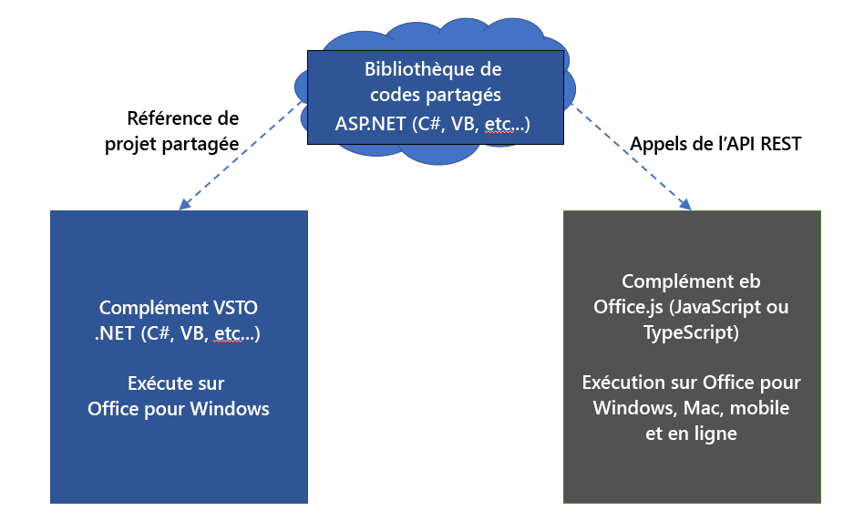
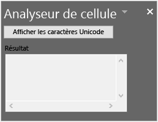

# <a name="tutorial-share-code-between-both-a-vsto-add-in-and-an-office-add-in-with-a-shared-code-library"></a>Didacticiel : partage de codes entre un complément VSTO et un complément Office avec une bibliothèque de codes partagée

Les compléments de Visual Studio Tools pour Office (VSTO) sont idéaux pour étendre Office afin de fournir des solutions aux entreprises, la vôtre ou d’autres. Ils existent depuis longtemps et des milliers de solutions sont créées avec VSTO. Cependant, ils s’exécutent uniquement avec Office sur Windows. Vous ne pouvez pas exécuter des compléments VSTO sur les plateformes Mac, Online ou mobile.

Les compléments Office utilisent HTML, JavaScript et d’autres technologies web pour créer des solutions Office sur toutes les plateformes. La migration de votre complément VSTO existant vers un complément Office est un excellent moyen de rendre votre solution accessible sur toutes les plateformes.

Vous pouvez conserver votre complément VSTO et un nouveau complément Office ayant les mêmes fonctionnalités. Cela vous permet de continuer à offrir un service à vos clients qui utilisent le complément VSTO pour Office sur Windows. Cela vous permet également de proposer aux clients la même fonctionnalité dans un complément Office pour l'ensemble des plateformes. Vous pouvez également [Rendre votre complément Office compatible avec le complément VSTO existant](../develop/make-office-add-in-compatible-with-existing-com-add-in.md).

Il est toutefois préférable d’éviter la réécriture du code entier de votre complément VSTO pour le complément Office. Ce didacticiel explique les précautions à prendre pour éviter la réécriture d'un code grâce à l'utilisation d’une bibliothèque de codes partagés pour les deux compléments.

## <a name="shared-code-library"></a>Bibliothèque de codes partagés

Ce didacticiel vous guide dans la procédure d’identification et de partage d'un code commun à votre complément VSTO et à un complément Office moderne. Ce guide utilise un exemple de complément VSTO très simple pour suivre les étapes afin que vous puissiez vous concentrer sur les compétences et les techniques dont vous aurez besoin pour utiliser vos propres compléments VSTO.

Le diagramme suivant illustre le fonctionnement de la bibliothèque de codes partagés pour la migration. Le code commun est refactorisé dans une nouvelle bibliothèque de codes partagés. Le code peut demeurer écrit dans son langage d’origine, par exemple C# ou VB. Cela signifie que vous continuez à utiliser le code dans le complément VSTO existant en créant une référence de projet. Lorsque vous créez le complément Office, celui-ci utilise également la bibliothèque de codes partagés en y appelant les API REST.



Compétences et techniques décrites dans ce didacticiel :

- Créer une bibliothèque de classes partagées en refactorisant le code dans une bibliothèque de classes .NET.
- Créez un wrapper API REST à l’aide de ASP.NET Core pour la bibliothèque de classes partagées.
- Appeler l’API REST à partir du complément Office pour accéder au code partagé.

## <a name="prerequisites"></a>Conditions préalables

Pour la configuration de votre environnement de développement :

1. Installez [Visual Studio 2019](https://visualstudio.microsoft.com/downloads/).
2. Installez les charges de travail suivantes :
    - ASP.NET et le développement web
    - Développement multiplateforme .NET Core.
    - Développement Office/SharePoint
    - Les éléments **Individuels** suivants.
        - Visual Studio Tools pour Office (VSTO).
        - .NET Core 3.0 Runtime.

Vous devez également disposer des éléments ci-après :

- Un compte Microsoft 365. Vous pouvez participer au[Programme pour les développeurs Microsoft 365](https://aka.ms/devprogramsignup) qui inclut un an d’abonnement gratuit à Office 365.
- Un locataire Microsoft Azure. Un abonnement d’évaluation peut être obtenu ici : [Microsoft Azure](https://account.windowsazure.com/SignUp).

## <a name="the-cell-analyzer-vsto-add-in"></a>Le composant VSTO d’analyseur de cellule

Ce didacticiel utilise la solution PnP pour [Bibliothèque de compléments VSTO partagés pour les compléments Office](https://github.com/OfficeDev/PnP-OfficeAddins/tree/master/Samples/VSTO-shared-code-migration). Le dossier **/Start** contient la solution de complément VSTO que vous allez migrer. Votre objectif est de migrer le complément VSTO vers un complément Office moderne en partageant le code lorsque cela est possible.

> [!NOTE]
> L’exemple utilise C# , mais vous pouvez utiliser les techniques décrites dans ce didacticiel pour appliquer un complément VSTO écrit dans n’importe quel langage .NET.

1. Téléchargez la solution PnP pour [Bibliothèque de compléments VSTO partagés pour les compléments Office](https://github.com/OfficeDev/PnP-OfficeAddins/tree/master/Samples/VSTO-shared-code-migration) vers un dossier de travail de votre ordinateur.
2. Démarrez Visual Studio 2019 et ouvrez la solution **/start/Cell-Analyzer.sln**.
3. Dans le menu **Déboguer**, choisissez **Démarrer le débogage**.
3. Dans l’**Explorateur de solutions**, cliquez à l'aide du bouton droit sur le projet **Analyseur de cellule**, puis choisissez **Propriétés**.
4. Sélectionnez la catégorie de**Signature** dans les propriétés.
5. Sélectionnez **Signer des manifestes ClickOnce**, puis choisissez **Créer un certificat de test**.
6. Dans la boîte de dialogue **Créer un certificat de test**, entrez et confirmez un mot de passe. Sélectionnez ensuite **OK**.

Le complément est un volet de tâche personnalisé Office pour Excel. Vous pouvez sélectionner n’importe quelle cellule contenant un texte, puis choisissez le bouton **Afficher les Unicodes**. Le complément affiche alors la liste de chaque caractère contenu dans le texte, ainsi que leur nombre Unicode correspondant.



## <a name="analyze-types-of-code-in-the-vsto-add-in"></a>Analyser les types de code dans le complément VSTO

La première technique à appliquer consiste à analyser le complément pour identifier les parties de code pouvant être partagées. Un projet se décompose généralement en trois types de codes.

### <a name="ui-code"></a>Code d'interface utilisateur

Le code d'interface utilisateur communique avec l’utilisateur. Dans VSTO, le code d'interface utilisation fonctionne par le biais de Windows Forms. Les compléments Office utilisent les langages HTML, CSS et JavaScript pour l'interface utilisateur. Vous ne pouvez pas, en raison de ces différences, partager le code d’interface utilisateur avec le complément Office. L’interface utilisateur doit être recréé dans JavaScript.

### <a name="document-code"></a>Code de document

Le code communique avec le document par le biais d’objets .NET tels que `Microsoft.Office.Interop.Excel.Range` dans VSTO. Les compléments Office utilisent néanmoins la bibliothèque Office.js. Ils ne sont pas exactement identiques, bien qu'ils soient similaires. Par conséquent, vous ne pouvez pas partager le code d'interaction d'un document avec le complément Office.

### <a name="logic-code"></a>Code logique

La logique métier, les algorithmes, les fonctions d’assistance et autres codes similaires constituent souvent le cœur d’un complément VSTO. Ce code fonctionne indépendamment de l’interface utilisateur et du code de document pour effectuer une analyse, se connecter à un service principale, effectuer des calculs, etc. Il s’agit du code qui peut être partagé pour que vous n’ayez pas à le réécrire dans JavaScript.

Examinez le complément VSTO. Dans le code suivant, chaque section est identifiée en tant que code de DOCUMENT, d’interface utilisateur ou d’ALGORITHME.

```csharp
// *** UI CODE ***
private void btnUnicode_Click(object sender, EventArgs e)
{
    // *** DOCUMENT CODE ***
    Microsoft.Office.Interop.Excel.Range rangeCell;
    rangeCell = Globals.ThisAddIn.Application.ActiveCell;

    string cellValue = "";

    if (null != rangeCell.Value)
    {
        cellValue = rangeCell.Value.ToString();
    }

    // *** ALGORITHM CODE ***
    //convert string to Unicode listing
    string result = "";
    foreach (char c in cellValue)
    {
        int unicode = c;

        result += $"{c}: {unicode}\r\n";
    }
    
    // *** UI CODE ***
    //Output the result
    txtResult.Text = result;
}
```

Grâce à cette approche, vous pouvez voir qu’une section de code peut être partagée avec le complément Office. Le code suivant doit être refactorisé dans une bibliothèque de classes distincte.

```csharp
// *** ALGORITHM CODE ***
//convert string to Unicode listing
string result = "";
foreach (char c in cellValue)
{
    int unicode = c;

    result += $"{c}: {unicode}\r\n";
}
```

## <a name="create-a-shared-class-library"></a>Créer une bibliothèque de classes partagées

Les compléments VSTO étant créés dans Visual Studio en tant que projets .NET, nous réutiliser .NET aussi souvent que possible pour simplifier les choses. La technique suivante consiste à créer une bibliothèque de classes et à refactoriser le code partagé dans cette bibliothèque.

1. Si ce n'est pas encore fait, démarrez Visual Studio 2019 et ouvrez la solution **/start/Cell-Analyzer.sln**.
2. Cliquez avec le bouton droit sur la solution dans l’**Explorateur de solutions** et choisissez **Ajouter > Nouvelle solution**.
3. Dans la **boîte de dialogue Ajouter un nouveau projet**, choisissez **Bibliothèque de classes (.NET Framework)**, puis sélectionnez **Suivant**.
    > [!NOTE]
    > N’utilisez pas la bibliothèque de classes .NET Core, car elle ne fonctionnera pas avec votre projet VSTO.
4. Dans la boîte de dialogue **Configurer votre nouveau projet**, définissez les champs suivants.
    - Donnez un **Nom de projet** à **CellAnalyzerSharedLibrary**.
    - Gardez l'**Emplacement** à sa valeur par défaut.
    - Configurez **Framework** sur **4.7.2**.
5. Sélectionnez **Créer**.
6. Une fois le projet créé, renommez le fichier **Class1.cs** dans **CellOperations.cs**. Une invite apparaît pour renommer la classe. Renommez le nom de classe pour qu’il corresponde au nom du fichier.
7. Ajoutez le code suivant à la classe `CellOperations` pour créer une méthode nommée `GetUnicodeFromText`.

```csharp
public class CellOperations
{
    static public string GetUnicodeFromText(string value)
    {
        string result = "";
        foreach (char c in value)
        {
            int unicode = c;

            result += $"{c}: {unicode}\r\n";
        }
        return result;
    }
}
```

### <a name="use-the-shared-class-library-in-the-vsto-add-in"></a>Utiliser la bibliothèque de classes partagées dans le complément VSTO

Vous devez maintenant mettre à jour le complément VSTO pour utiliser la bibliothèque de classes. Il est important que les compléments VSTO et Office utilisent la même bibliothèque de classes partagées pour permettre aux résolutions de bogues et aux fonctionnalités d'être réalisées au même endroit.

1. Dans l’**Explorateur de solutions**, cliquez à l'aide du bouton droit sur le projet **Analyseur de cellules**, puis choisissez **Ajouter une référence**.
2. Sélectionnez **CellAnalyzerSharedLibrary**, puis choisissez **OK**.
3. Dans l'**Explorateur de solutions**, développez l'**Analyseur de cellules** du projet, cliquez avec le bouton droit sur le fichier **CellAnalyzerPane.cs**, puis sélectionnez **Afficher le code**.
4. Dans la méthode `btnUnicode_Click`, supprimez les lignes de code suivantes.
    
    ```csharp
    //Convert to Unicode listing
    string result = "";
    foreach (char c in cellValue)
    {
      int unicode = c;
      result += $"{c}: {unicode}\r\n";
    }
    ```
    
5. Mettez à jour la ligne de code sous le commentaire à lire `//Output the result` comme suit :
    
    ```csharp
    //Output the result
    txtResult.Text = CellAnalyzerSharedLibrary.CellOperations.GetUnicodeFromText(cellValue);
    ```
    
6. Dans le menu **Déboguer**, choisissez **Démarrer le débogage**. Le volet Office personnalisé doit fonctionner comme attendu. Entrez du texte dans une cellule, puis vérifiez que vous pouvez le convertir en liste Unicode avec le complément.

## <a name="create-a-rest-api-wrapper"></a>Créer un wrapper API REST

Le complément VSTO peut utiliser directement la bibliothèque de classes partagée car tous deux sont des projets .NET. Le complément Office ne pourra toutefois pas utiliser .NET car il utilise JavaScript. Vous devez ensuite créer un wrapper API REST. Le complément Office peut ainsi appeler une API REST, qui transmet ensuite l’appel vers la bibliothèque de classes partagée.

1. Dans l’**Explorateur de solutions**, cliquez à l'aide du bouton droit sur le projet **Analyseur de cellules**, puis choisissez **Ajouter un nouveau projet**.
2. Dans la**boîte de dialogue Ajouter un nouveau projet**, choisissez **Application web ASP.NET Core**, puis sélectionnez **Suivant**.
3. Dans la boîte de dialogue **Configurer votre nouveau projet**, définissez les champs suivants :
    - Donnez un **Nom de projet** à **CellAnalyzerRESTAPI**.
    - Dans le champ **Emplacement**, conserver la valeur par défaut.
4. Sélectionnez **Créer**.
5. Dans la boîte de dialogue **Créer une application web ASP.NET Core**, sélectionnez **ASP.NET Core 3.1** pour la version, puis sélectionnez l'**API** dans la liste ds projets.
6. Conservez les valeurs par défaut dans tous les autres champs, puis sélectionnez le bouton **Créer**.
7. Une fois le projet créé, développez le projet **CellAnalyzerRESTAPI** dans l'**Explorateur de solutions**.
8. Cliquez avec le bouton droit sur **Dépendances**, puis sélectionnez **Ajouter une référence**.
9. Sélectionnez **CellAnalyzerSharedLibrary**, puis choisissez **OK**.
10. Cliquez avec le bouton droit sur le dossier **Contrôleurs**, puis choisissez **Ajouter > Contrôleur**.
11. Dans la boîte de dialogue **Ajouter un nouvel élément structuré**, sélectionnez **Contrôleur d'API – Vide**, puis **Ajouter**.
12. Dans la boîte de dialogue **Ajouter un contrôleur d'API vide**, nommez le contrôleur **AnalyzeUnicodeController**, puis sélectionnez **Ajouter**.
13. Ouvrez le fichier **AnalyzeUnicodeController.cs** et ajoutez le code suivant en tant que méthode à la classe `AnalyzeUnicodeController`.
    
    ```csharp
    [HttpGet]
    public ActionResult<string> AnalyzeUnicode(string value)
    {
      if (value == null)
      {
        return BadRequest();
      }
      return CellAnalyzerSharedLibrary.CellOperations.GetUnicodeFromText(value);
    }
    ```
    
14. Cliquez avec le bouton droit sur le projet **CellAnalyzerRESTAPI**, puis choisissez **Définir comme projet de démarrage**.
15. Dans le menu **Déboguer**, choisissez **Démarrer le débogage**.
16. Un navigateur s’ouvre. Entrez l’URL suivante pour vérifier que l’API REST fonctionne : `https://localhost:<ssl port number>/api/analyzeunicode?value=test`. Vous pouvez réutiliser le numéro de port à partir de l’URL dans le navigateur lancé par Visual Studio. Vous devriez voir une chaîne renvoyée avec des valeurs Unicode pour chaque caractère.

## <a name="create-the-office-add-in"></a>Créer le complément Office

Lorsque vous créez le complément Office, celui-ci appelle l'API REST. Mais vous devez tout d'abord obtenir le numéro de port du serveur API REST et de l’enregistrer pour plus tard.

### <a name="save-the-ssl-port-number"></a>Enregistrer le numéro de port SSL

1. Si ce n'est pas encore fait, démarrez Visual Studio 2019 et ouvrez la solution **\start\Cell-Analyzer.sln**.
2. Dans le projet **CellAnalyzerRESTAPI**, développez les **Propriétés**et ouvrez le fichier **launchSettings.json**.
3. Recherchez la ligne de code contenant la valeur de **sslPort**, copiez le numéro de port et enregistrez-le quelque part.

### <a name="add-the-office-add-in-project"></a>Ajouter le projet de complément Office

Pour simplifier les choses, conservez tous les codes dans une seule solution. Ajoutez le projet de complément Office à la solution Visual Studio existante. Toutefois, si vous avez l’habitude d’utiliser le [Générateur Yeoman pour compléments Office](https://github.com/OfficeDev/generator-office) et Visual Studio Code, vous pouvez également exécuter `yo office` pour générer le projet. Les étapes sont très semblables.

1. Dans l’**Explorateur de solutions**, cliquez à l'aide du bouton droit sur la solution **Analyseur de cellules**, puis choisissez **Ajouter > Nouveau projet**.
2. Dans la **Boîte de dialogue Ajouter un nouveau projet**, choisissez **Complément web Excel**, puis sélectionnez **Suivant**.
3. Dans la boîte de dialogue **Configurer votre nouveau projet**, définissez les champs suivants :
    - Donnez un **Nom de projet** à **CellAnalyzerOfficeAddin**.
    - Gardez l'**Emplacement** à sa valeur par défaut.
    - Configurez **Framework** sur **4.7.2** ou une version ultérieure.
4. Sélectionnez **Créer**.
5. Dans la boîte de dialogue **Choisir le type de complément**, sélectionnez **Ajouter e nouvelles fonctionnalités dans Excel**, puis choisissez **Terminer**.

Deux projets sont créés :
- **CellAnalyzerOfficeAddin** : ce projet configure les fichiers XML du manifeste qui décrivent le complément pour qu’Office puisse le charger correctement. Il contient l’ID, le nom, la description et d’autres informations sur le complément.
- **CellAnalyzerOfficeAddinWeb** : ce projet contient des ressources Web pour votre complément (par exemple, HTML, CSS et des scripts). Il configure également une instance IIS Express pour héberger votre complément en tant qu’application Web.

### <a name="add-ui-and-functionality-to-the-office-add-in"></a>Ajouter des interfaces utilisateur et des fonctionnalités au complément Office

1. Dans l'**Explorateur de solutions**, développez le projet **CellAnalyzerOfficeAddinWeb**.
2. Ouvrez le fichier **Home.html** et remplacez le contenu `<body>` par l'HTML suivant.
    
    ```html
    <button id="btnShowUnicode" onclick="showUnicode()">Show Unicode</button>
    <p>Result:</p>
    <div id="txtResult"></div>
    ```
    
3. Ouvrez ce fichier **Home.js** et remplacez l’intégralité de son contenu par le code suivant. 
    
    ```js
    (function () {
      "use strict";
      // The initialize function must be run each time a new page is loaded.
      Office.initialize = function (reason) {
        $(document).ready(function () {
        });
      };
    })();
    
    function showUnicode() {
      Excel.run(function (ctx) {
        const range = ctx.workbook.getSelectedRange();
        range.load("values");
        return ctx.sync(range).then(function (range) {
          const url = "https://localhost:<ssl port number>/api/analyzeunicode?value=" + range.values[0][0];
          $.ajax({
            type: "GET",
            url: url,
            success: function (data) {
              let htmlData = data.replace(/\r\n/g, '<br>');
              $("#txtResult").html(htmlData);
            },
            error: function (data) {
                $("#txtResult").html("error occurred in ajax call.");
            }
          });
        });
      });
    }
    ```
    
4. Dans le code précédent, entrez le numéro de **sslPort** que vous avez enregistré précédemment à partir du fichier **launchSettings.json**.

Dans le code précédent, la chaîne renvoyée est traitée pour remplacer les sauts de ligne avec retour chariot par des balises HTML `<br>`. Vous pouvez parfois être confronté(e) à des situations dans lesquelles une valeur de retour fonctionnant parfaitement pour .NET dans le complément VSTO doit être ajustée sur le côté du complément Office pour fonctionner comme attendu. Dans ce cas, l’API REST et la bibliothèque de classes partagées s'intéressent uniquement au retour de chaîne. La méthode `showUnicode()` est chargée de la mise en forme correcte des valeurs de retour pour la présentation.

### <a name="allow-cors-from-the-office-add-in"></a>Autoriser CORS à partir d'un complément Office

La bibliothèque Office.js nécessite CORS pour les appels sortants, tels que ceux effectués à partir de l’appel `ajax` vers le serveur API REST. Pour autoriser des appels du complément Office vers l’API REST, procédez comme suit.

1. Dans l'**Explorateur de solutions**, sélectionnez le projet **CellAnalyzerOfficeAddinWeb**.
2. Dans le menu **Afficher**, Choisissez **Fenêtre des Propriétés** (si la fenêtre ne s'affiche pas).
3. Dans la fenêtre des propriétés, copiez et enregistrez la valeur de l'**URL SSL**. Il s’agit de l’URL que vous devez autoriser dans CORS.
4. Dans le projet **CellAnalyzerRESTAPI**, ouvrez le fichier **Startup.cs**.
5. Ajoutez le code suivant en haut de la méthode `ConfigureServices`. Assurez-vous de remplacer l’URL SSL que vous avez copiée précédemment pour l’appel `builder.WithOrigins`.
    
    ```csharp
    services.AddCors(options =>
    {
      options.AddPolicy(MyAllowSpecificOrigins,
      builder =>
      {
        builder.WithOrigins("<your URL SSL>")
        .AllowAnyMethod()
        .AllowAnyHeader();
      });
    });
    ```
    
    > [!NOTE]
    > Enlevez le `/` qui se trouve à la fin de l’URL lorsque vous l’utilisez dans la méthode `builder.WithOrigins`Builder.WithOrigins.tr. Par exemple, il doit ressembler à `https://localhost:44000`. Dans le cas contraire, une erreur CORS se produira lors de l’exécution.
    
6. Ajoutez le champs suivant à la classe `Startup` :
    
    ```csharp
    readonly string MyAllowSpecificOrigins = "_myAllowSpecificOrigins";
    ```
    
7. Ajoutez le code suivant à la méthode `configure` juste avant la ligne de code pour `app.UseEndpoints`.
    
    ```csharp
    app.UseCors(MyAllowSpecificOrigins);
    ```

Lorsque vous avez terminé, votre classe `Startup` doit ressembler au code suivant (votre URL localhost peut être différente) :

```csharp
public class Startup
{
  public Startup(IConfiguration configuration)
    {
      Configuration = configuration;
    }

    readonly string MyAllowSpecificOrigins = "_myAllowSpecificOrigins";

    public IConfiguration Configuration { get; }

    // NOTE: The following code configures CORS for the localhost:44397 port.
    // This is for development purposes. In production code you should update this to 
    // use the appropriate allowed domains.
    public void ConfigureServices(IServiceCollection services)
    {
        services.AddCors(options =>
        {
            options.AddPolicy(MyAllowSpecificOrigins,
            builder =>
            {
                builder.WithOrigins("https://localhost:44397")
                .AllowAnyMethod()
                .AllowAnyHeader();
            });
        });
        services.AddControllers();
    }

    // This method gets called by the runtime. Use this method to configure the HTTP request pipeline.
    public void Configure(IApplicationBuilder app, IWebHostEnvironment env)
    {
        if (env.IsDevelopment())
        {
            app.UseDeveloperExceptionPage();
        }
            
        app.UseHttpsRedirection();

        app.UseRouting();

        app.UseAuthorization();

        app.UseCors(MyAllowSpecificOrigins);

        app.UseEndpoints(endpoints =>
        {
            endpoints.MapControllers();
        });
    }
}
```

### <a name="run-the-add-in"></a>Exécuter du complément

1. Dans l’**Explorateur de solutions**, cliquez à l'aide du nœud supérieur sur la **Solution de l'analyseur de cellules**, puis choisissez **Configurer les projets de départ**.
2. Dans la boîte de dialogue des **Pages de propriété de la solution de l'analyseur de cellules**, sélectionnez **Plusieurs projets de départ**.
3. Définissez la propriété **action** au **Départ** pour chacun des projets suivants.
    
    - CellAnalyzerRESTAPI
    - CellAnalyzerOfficeAddin
    - CellAnalyzerOfficeAddinWeb
    
4. Sélectionnez **OK**.
5. Dans le menu **Déboguer**, choisissez **Démarrer le débogage**.

Excel exécute et charge une version test du complément Office. Vous pouvez vérifier que le service API REST localhost fonctionne correctement en entrant une valeur de texte dans une cellule, puis en sélectionnant le bouton **Afficher l'Unicode** dans le complément Office. Il doit appeler l’API REST et afficher les valeurs Unicode pour les caractères de texte.

## <a name="publish-to-an-azure-app-service"></a>Publier vers Azure App Service

Vous voulez enfin publier le projet API REST sur le cloud. Dans les étapes suivantes, vous allez découvrir comment publier le projet **CellAnalyzerRESTAPI** dans Microsoft Azure App Service. Pour plus d’informations sur l’obtention d’un compte Azure, voir les [Conditions préalables](#prerequisites).

1. Dans l’**Explorateur de solutions**, cliquez à l'aide du bouton droit sur le projet **CellAnalyzerRESTAPI**, puis choisissez **Publier**.
2. Dans la boîte de dialogue **Sélectionner une cible de publication**, sélectionnez **Créer nouveau**, puis choisissez **Créer un profil**.
3. Dans la boîte de dialogue **App Service**, sélectionnez le compte correct, s’il n’est pas encore choisi.
4. Les valeurs par défaut sont utilisées dans les champs de la boîte de dialogue **App Service** de votre compte. Les valeurs par défaut fonctionnent correctement en général, mais vous pouvez les modifier si vous préférez définir d’autres paramètres.
5. Dans la boîte de dialogue **App Service**, sélectionnez **Créer**.
6. Le nouveau profil s’affiche dans une page **Publier**. Sélectionnez **Publier** pour créer et déployer le code vers App Service.

Vous pouvez maintenant tester le service. Ouvrez un navigateur et entrez une URL qui accède directement au nouveau service. Par exemple, utilisez `https://<myappservice>.azurewebsites.net/api/analyzeunicode?value=test` où *myappservice* est le seul nom que vous avez créé pour le nouvel App Service.

### <a name="use-the-azure-app-service-from-the-office-add-in"></a>Utiliser Azure App Service à partir du complément Office

La dernière étape consiste à mettre à jour le code dans le complément Office pour utiliser Azure App Service au lieu de localhost.

1. Dans l'**Explorateur de solutions**, développez le projet **CellAnalyzerOfficeAddinWeb** et ouvrez le fichier **Home.js**.
2. Modifiez la constante `url` afin d’utiliser l’URL d'Azure App Service, comme illustré dans la ligne de code suivante. Remplacez `<myappservice>` par le nom unique que vous avez créé pour le nouvel App Service.
    ```JavaScript
    const url = "https://<myappservice>.azurewebsites.net/api/analyzeunicode?value=" + range.values[0][0];
    ```
3. Dans l’**Explorateur de solutions**, cliquez à l'aide du nœud supérieur sur la **Solution de l'analyseur de cellules**, puis choisissez **Configurer les projets de départ**.
4. Dans la boîte de dialogue des **Pages de propriété de la solution de l'analyseur de cellules**, sélectionnez **Plusieurs projets de départ**.
5. Activez l’action **Démarrer** pour chacun des projets suivants :
    - CellAnalyzerOfficeAddinWeb
    - CellAnalyzerOfficeAddin
6. Sélectionnez **OK**.
7. Dans le menu **Déboguer**, choisissez **Démarrer le débogage**.

Excel exécute et charge une version test du complément Office. Pour vérifier que App Service fonctionne correctement, entrez une valeur de texte dans une cellule, puis choisissez **Afficher l'Unicode** dans le complément Office. Il doit appeler le service et afficher les valeurs Unicode pour les caractères de texte.

## <a name="conclusion"></a>Conclusion

Dans ce didacticiel, vous avez appris à créer un complément Office qui utilise un code partagé avec le complément VSTO d’origine. Vous avez appris à gérer le code VSTO pour Office sur Windows et un complément Office pour Office sur d’autres plateformes. Vous avez refactorisé un code C# VSTO dans une bibliothèque partagée et vous l’avez déployé dans Azure App Service. Vous avez créé un complément Office qui utilise la bibliothèque partagée pour que vous n’ayez pas à réécrire le code dans JavaScript.
