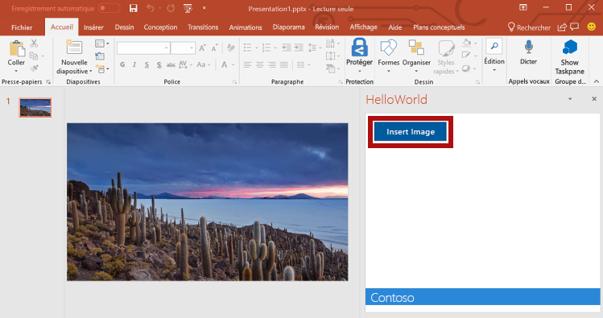
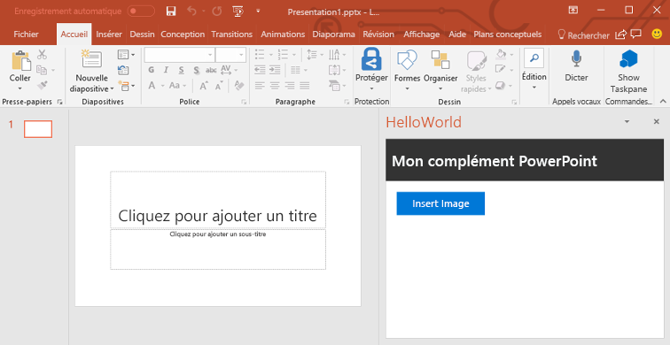
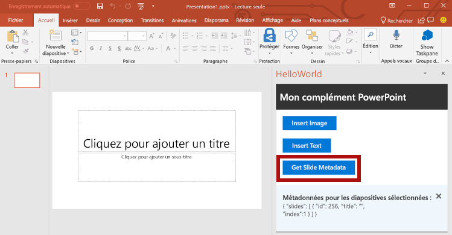
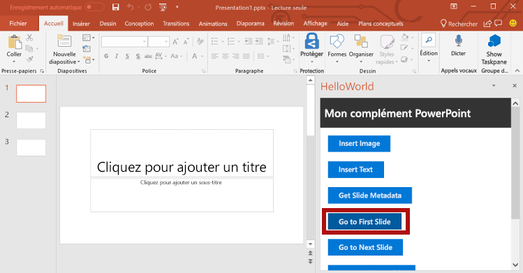
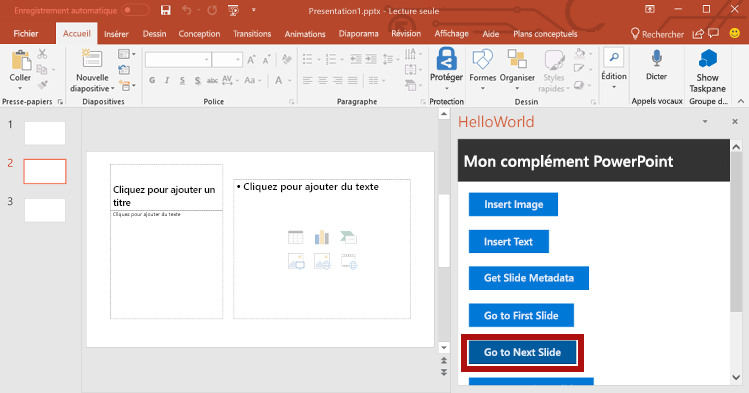
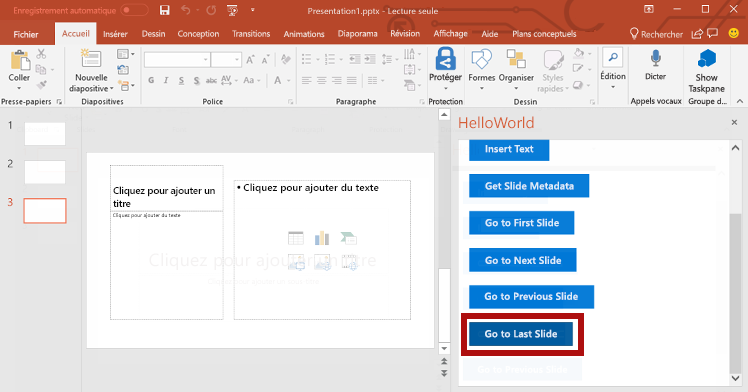

# <a name="tutorial-create-a-powerpoint-task-pane-add-in"></a><span data-ttu-id="fbf5d-103">Didacticiel : Créer un complément de volet de tâches de PowerPoint</span><span class="sxs-lookup"><span data-stu-id="fbf5d-103">Tutorial: Create a PowerPoint task pane add-in</span></span>

<span data-ttu-id="fbf5d-104">Dans ce didacticiel, vous utiliserez Visual Studio pour créer un complément de volet de tâches de PowerPoint qui:</span><span class="sxs-lookup"><span data-stu-id="fbf5d-104">In this tutorial, you'll use Visual Studio to create an PowerPoint task pane add-in that:</span></span>

> [!div class="checklist"]
> * <span data-ttu-id="fbf5d-105">Ajout de la photo [Bing](https://www.bing.com) du jour à une diapositive</span><span class="sxs-lookup"><span data-stu-id="fbf5d-105">Adds the [Bing](https://www.bing.com) photo of the day to a slide</span></span>
> * <span data-ttu-id="fbf5d-106">Ajout de texte à une diapositive</span><span class="sxs-lookup"><span data-stu-id="fbf5d-106">Adds text to a slide</span></span>
> * <span data-ttu-id="fbf5d-107">Get Slide Metadata</span><span class="sxs-lookup"><span data-stu-id="fbf5d-107">Gets slide metadata</span></span>
> * <span data-ttu-id="fbf5d-108">Naviguer entre les diapositives</span><span class="sxs-lookup"><span data-stu-id="fbf5d-108">Navigates between slides</span></span>

## <a name="prerequisites"></a><span data-ttu-id="fbf5d-109">Conditions requises</span><span class="sxs-lookup"><span data-stu-id="fbf5d-109">Prerequisites</span></span>

[!include[Quick Start prerequisites](../includes/quickstart-vs-prerequisites.md)]

## <a name="create-your-add-in-project"></a><span data-ttu-id="fbf5d-110">Créer votre projet de complément</span><span class="sxs-lookup"><span data-stu-id="fbf5d-110">Create your add-in project</span></span>

<span data-ttu-id="fbf5d-111">Procédez comme suit pour créer un projet complément PowerPoint à l’aide de Visual Studio.</span><span class="sxs-lookup"><span data-stu-id="fbf5d-111">Complete the following steps to create a PowerPoint add-in project using Visual Studio.</span></span>

1. <span data-ttu-id="fbf5d-112">Choisissez **Créer un nouveau projet**.</span><span class="sxs-lookup"><span data-stu-id="fbf5d-112">Choose **Create a new project**.</span></span>

2. <span data-ttu-id="fbf5d-113">À l’aide de la zone de recherche, entrez **complément**.</span><span class="sxs-lookup"><span data-stu-id="fbf5d-113">Using the search box, enter **add-in**.</span></span> <span data-ttu-id="fbf5d-114">Choisissez **Complément web PowerPoint**, puis sélectionnez **Suivant**.</span><span class="sxs-lookup"><span data-stu-id="fbf5d-114">Choose **PowerPoint Web Add-in**, then select **Next**.</span></span>

3. <span data-ttu-id="fbf5d-115">Nommez le projet `HelloWorld` et sélectionnez **Créer**.</span><span class="sxs-lookup"><span data-stu-id="fbf5d-115">Name the project `HelloWorld`, and select **Create**.</span></span>

4. <span data-ttu-id="fbf5d-116">Dans la fenêtre de la boîte de dialogue **Créer un complément Office**, choisissez **Ajouter de nouvelles fonctionnalités à PowerPoint**, puis sélectionnez **Terminer** pour créer le projet.</span><span class="sxs-lookup"><span data-stu-id="fbf5d-116">In the **Create Office Add-in** dialog window, choose **Add new functionalities to PowerPoint**, and then choose **Finish** to create the project.</span></span>

5. <span data-ttu-id="fbf5d-p102">Visual Studio crée une solution et ses deux projets apparaissent dans l’**explorateur de solutions**. Le fichier **Home.html** s’ouvre dans Visual Studio.</span><span class="sxs-lookup"><span data-stu-id="fbf5d-p102">Visual Studio creates a solution and its two projects appear in **Solution Explorer**. The **Home.html** file opens in Visual Studio.</span></span>

     

### <a name="explore-the-visual-studio-solution"></a><span data-ttu-id="fbf5d-120">Explorer la solution Visual Studio</span><span class="sxs-lookup"><span data-stu-id="fbf5d-120">Explore the Visual Studio solution</span></span>

[!include[Description of Visual Studio projects](../includes/quickstart-vs-solution.md)]

### <a name="update-code"></a><span data-ttu-id="fbf5d-121">Mise à jour du code</span><span class="sxs-lookup"><span data-stu-id="fbf5d-121">Update code</span></span> 

<span data-ttu-id="fbf5d-122">Modifiez le code de complément comme suit pour créer la structure que vous utiliserez pour implémenter la fonctionnalité de complément dans les étapes suivantes de ce didacticiel.</span><span class="sxs-lookup"><span data-stu-id="fbf5d-122">Edit the add-in code as follows to create the framework that you'll use to implement add-in functionality in subsequent steps of this tutorial.</span></span>

1. <span data-ttu-id="fbf5d-p103">**Home.html** spécifie le code HTML qui s’affichera dans le volet Office du complément. Dans **Home.html**, localisez la balise **div** avec `id="content-main"`, remplacez l’intégralité de la balise **div** avec le balisage suivant et enregistrez le fichier.</span><span class="sxs-lookup"><span data-stu-id="fbf5d-p103">**Home.html** specifies the HTML that will be rendered in the add-in's task pane. In **Home.html**, find the **div** with `id="content-main"`, replace that entire **div** with the following markup, and save the file.</span></span>

    ```html
    <!-- TODO2: Create the content-header div. -->
    <div id="content-main">
        <div class="padding">
            <!-- TODO1: Create the insert-image button. -->
            <!-- TODO3: Create the insert-text button. -->
            <!-- TODO4: Create the get-slide-metadata button. -->
            <!-- TODO5: Create the go-to-slide buttons. -->
        </div>
    </div>
    ```

2. <span data-ttu-id="fbf5d-p104">Ouvrez le fichier **Home.js** à la racine du projet d’application web. Ce fichier spécifie le script pour le complément. Remplacez tout le contenu par le code suivant, puis enregistrez le fichier.</span><span class="sxs-lookup"><span data-stu-id="fbf5d-p104">Open the file **Home.js** in the root of the web application project. This file specifies the script for the add-in. Replace the entire contents with the following code and save the file.</span></span>

    ```js
    (function () {
        "use strict";

        var messageBanner;

        Office.onReady(function () {
            $(document).ready(function () {
                // Initialize the FabricUI notification mechanism and hide it
                var element = document.querySelector('.MessageBanner');
                messageBanner = new components.MessageBanner(element);
                messageBanner.hideBanner();

                // TODO1: Assign event handler for insert-image button.
                // TODO4: Assign event handler for insert-text button.
                // TODO6: Assign event handler for get-slide-metadata button.
                // TODO8: Assign event handlers for the four navigation buttons.
            });
        });

        // TODO2: Define the insertImage function. 

        // TODO3: Define the insertImageFromBase64String function.

        // TODO5: Define the insertText function.

        // TODO7: Define the getSlideMetadata function.

        // TODO9: Define the navigation functions.

        // Helper function for displaying notifications
        function showNotification(header, content) {
            $("#notification-header").text(header);
            $("#notification-body").text(content);
            messageBanner.showBanner();
            messageBanner.toggleExpansion();
        }
    })();
    ```

## <a name="insert-an-image"></a><span data-ttu-id="fbf5d-128">Insérer une image</span><span class="sxs-lookup"><span data-stu-id="fbf5d-128">Insert an image</span></span>

<span data-ttu-id="fbf5d-129">Procédez comme suit pour ajouter le code qui récupère la photo[Bing](https://www.bing.com) de la journée et insère l’image dans une diapositive.</span><span class="sxs-lookup"><span data-stu-id="fbf5d-129">Complete the following steps to add code that retrieves the [Bing](https://www.bing.com) photo of the day and inserts that image into a slide.</span></span>

1. <span data-ttu-id="fbf5d-130">À l’aide de l’explorateur de solutions, ajoutez un nouveau dossier nommé **Controllers** au projet **HelloWorldWeb**.</span><span class="sxs-lookup"><span data-stu-id="fbf5d-130">Using Solution Explorer, add a new folder named **Controllers** to the **HelloWorldWeb** project.</span></span>

    

2. <span data-ttu-id="fbf5d-132">Cliquez avec le bouton droit de la souris sur le dossier **Controllers**, puis sélectionnez **Ajouter > Nouvel élément généré automatiquement...**.</span><span class="sxs-lookup"><span data-stu-id="fbf5d-132">Right-click the **Controllers** folder and select **Add > New Scaffolded Item...**.</span></span>

3. <span data-ttu-id="fbf5d-133">Dans la fenêtre de boîte de dialogue **Ajouter une structure**, sélectionnez **Contrôleur Web API 2 - Vide** et choisissez le bouton **Ajouter**.</span><span class="sxs-lookup"><span data-stu-id="fbf5d-133">In the **Add Scaffold** dialog window, select **Web API 2 Controller - Empty** and choose the **Add** button.</span></span> 

4. <span data-ttu-id="fbf5d-p105">Dans la fenêtre de boîte de dialogue **Ajouter un contrôleur**, saisissez **PhotoController** pour le nom du contrôleur, puis sélectionnez le bouton **Ajouter**. Visual Studio crée et ouvre le fichier **PhotoController.cs**.</span><span class="sxs-lookup"><span data-stu-id="fbf5d-p105">In the **Add Controller** dialog window, enter **PhotoController** as the controller name and choose the **Add** button. Visual Studio creates and opens the **PhotoController.cs** file.</span></span>

5. <span data-ttu-id="fbf5d-p106">Remplacez tout le contenu du fichier **PhotoController.cs** par le code suivant qui appelle le service Bing pour récupérer la photo du jour en tant que chaîne encodée en base 64. Lorsque vous utilisez l’API JavaScript Office pour insérer une image dans un document, les données de l’image doivent être spécifiées en tant que chaîne encodée en base 64.</span><span class="sxs-lookup"><span data-stu-id="fbf5d-p106">Replace the entire contents of the **PhotoController.cs** file with the following code that calls the Bing service to retrieve the photo of the day as a Base64 encoded string. When you use the Office JavaScript API to insert an image into a document, the image data must be specified as a Base64 encoded string.</span></span>

    ```csharp
    using System;
    using System.IO;
    using System.Net;
    using System.Text;
    using System.Web.Http;
    using System.Xml;

    namespace HelloWorldWeb.Controllers
    {
        public class PhotoController : ApiController
        {
            public string Get()
            {
                string url = "http://www.bing.com/HPImageArchive.aspx?format=xml&idx=0&n=1";

                // Create the request.
                HttpWebRequest request = (HttpWebRequest)WebRequest.Create(url);
                WebResponse response = request.GetResponse();

                using (Stream responseStream = response.GetResponseStream())
                {
                    // Process the result.
                    StreamReader reader = new StreamReader(responseStream, Encoding.UTF8);
                    string result = reader.ReadToEnd();

                    // Parse the xml response and to get the URL.
                    XmlDocument doc = new XmlDocument();
                    doc.LoadXml(result);
                    string photoURL = "http://bing.com" + doc.SelectSingleNode("/images/image/url").InnerText;

                    // Fetch the photo and return it as a Base64 encoded string.
                    return getPhotoFromURL(photoURL);
                }
            }

            private string getPhotoFromURL(string imageURL)
            {
                var webClient = new WebClient();
                byte[] imageBytes = webClient.DownloadData(imageURL);
                return Convert.ToBase64String(imageBytes);
            }
        }
    }
    ```

6. <span data-ttu-id="fbf5d-p107">Dans le fichier **Home.html**, remplacez `TODO1` par le balisage suivant. Ce balisage définit le bouton **Insert Image** (Insérer une image) qui s’affichera dans volet Office du complément.</span><span class="sxs-lookup"><span data-stu-id="fbf5d-p107">In the **Home.html** file, replace `TODO1` with the following markup. This markup defines the **Insert Image** button that will appear within the add-in's task pane.</span></span>

    ```html
    <button class="Button Button--primary" id="insert-image">
        <span class="Button-icon"><i class="ms-Icon ms-Icon--plus"></i></span>
        <span class="Button-label">Insert Image</span>
        <span class="Button-description">Gets the photo of the day that shows on the Bing home page and adds it to the slide.</span>
    </button>
    ```

7. <span data-ttu-id="fbf5d-140">Dans le fichier **Home.js**, remplacez `TODO1` par le code suivant pour attribuer le gestionnaire d’événements pour le bouton **Insert Image** (Insérer une image).</span><span class="sxs-lookup"><span data-stu-id="fbf5d-140">In the **Home.js** file, replace `TODO1` with the following code to assign the event handler for the **Insert Image** button.</span></span>

    ```js
    $('#insert-image').click(insertImage);
    ```

8. <span data-ttu-id="fbf5d-p108">Dans le fichier **Home.js**, remplacez `TODO2` par le code suivant pour définir la fonction `insertImage`. Cette fonction extrait l’image du service web Bing, puis appelle la fonction `insertImageFromBase64String` pour insérer cette image dans le document.</span><span class="sxs-lookup"><span data-stu-id="fbf5d-p108">In the **Home.js** file, replace `TODO2` with the following code to define the `insertImage` function. This function fetches the image from the Bing web service and then calls the `insertImageFromBase64String` function to insert that image into the document.</span></span>

    ```js
    function insertImage() {
        // Get image from from web service (as a Base64 encoded string).
        $.ajax({
            url: "/api/Photo/", success: function (result) {
                insertImageFromBase64String(result);
            }, error: function (xhr, status, error) {
                showNotification("Error", "Oops, something went wrong.");
            }
        });
    }
    ```

9. <span data-ttu-id="fbf5d-p109">Dans le fichier **Home.js**, remplacez `TODO3` par le code suivant pour définir la fonction `insertImageFromBase64String`. Cette fonction utilise l’API JavaScript Office pour insérer l’image dans le document. Remarque :</span><span class="sxs-lookup"><span data-stu-id="fbf5d-p109">In the **Home.js** file, replace `TODO3` with the following code to define the `insertImageFromBase64String` function. This function uses the Office JavaScript API to insert the image into the document. Note:</span></span> 

    - <span data-ttu-id="fbf5d-146">l’option `coercionType` spécifiée comme deuxième paramètre de la demande `setSelectedDataAsyc` indique le type de données insérées.</span><span class="sxs-lookup"><span data-stu-id="fbf5d-146">The `coercionType` option that's specified as the second parameter of the `setSelectedDataAsyc` request indicates the type of data being inserted.</span></span> 

    - <span data-ttu-id="fbf5d-147">L’objet `asyncResult` encapsule le résultat de la demande `setSelectedDataAsync`, y compris les informations d’état et d’erreur quand la demande a échoué.</span><span class="sxs-lookup"><span data-stu-id="fbf5d-147">The `asyncResult` object encapsulates the result of the `setSelectedDataAsync` request, including status and error information if the request failed.</span></span>

    ```js
    function insertImageFromBase64String(image) {
        // Call Office.js to insert the image into the document.
        Office.context.document.setSelectedDataAsync(image, {
            coercionType: Office.CoercionType.Image
        },
            function (asyncResult) {
                if (asyncResult.status === Office.AsyncResultStatus.Failed) {
                    showNotification("Error", asyncResult.error.message);
                }
            });
    }
    ```

### <a name="test-the-add-in"></a><span data-ttu-id="fbf5d-148">Test du complément</span><span class="sxs-lookup"><span data-stu-id="fbf5d-148">Test the add-in</span></span>

1. <span data-ttu-id="fbf5d-p110">À l’aide de Visual Studio, testez le nouveau complément PowerPoint en appuyant sur **F5** ou en choisissant le bouton **Démarrer** pour lancer PowerPoint avec le bouton du complément **Show Taskpane** (Afficher le volet Office) qui apparaît dans le ruban. Le complément sera hébergé localement sur IIS.</span><span class="sxs-lookup"><span data-stu-id="fbf5d-p110">Using Visual Studio, test the newly created PowerPoint add-in by pressing **F5** or choosing the **Start** button to launch PowerPoint with the **Show Taskpane** add-in button displayed in the ribbon. The add-in will be hosted locally on IIS.</span></span>

    

2. <span data-ttu-id="fbf5d-152">Dans PowerPoint, sélectionnez le bouton **Show Taskpane** (Afficher le volet Office) dans le ruban pour ouvrir le volet Office du complément.</span><span class="sxs-lookup"><span data-stu-id="fbf5d-152">In PowerPoint, select the **Show Taskpane** button in the ribbon to open the add-in task pane.</span></span>

    

3. <span data-ttu-id="fbf5d-154">Dans le volet Office, sélectionnez le bouton **Insert Image** (Insérer une image) permettant d’ajouter la photo Bing du jour sur la diapositive active.</span><span class="sxs-lookup"><span data-stu-id="fbf5d-154">In the task pane, choose the **Insert Image** button to add the Bing photo of the day to the current slide.</span></span>

    

4. <span data-ttu-id="fbf5d-156">Dans Visual Studio, arrêtez le complément en appuyant sur **Shift + F5** ou en choisissant le bouton**Arrêter**.</span><span class="sxs-lookup"><span data-stu-id="fbf5d-156">In Visual Studio, stop the add-in by pressing **Shift + F5** or choosing the **Stop** button.</span></span> <span data-ttu-id="fbf5d-157">PowerPoint se ferme automatiquement lorsque le complément est arrêté.</span><span class="sxs-lookup"><span data-stu-id="fbf5d-157">PowerPoint will automatically close when the add-in is stopped.</span></span>

    

## <a name="customize-user-interface-ui-elements"></a><span data-ttu-id="fbf5d-159">Personnaliser les éléments de l’interface utilisateur (IU)</span><span class="sxs-lookup"><span data-stu-id="fbf5d-159">Customize User Interface (UI) elements</span></span>

<span data-ttu-id="fbf5d-160">Procédez comme suit pour ajouter des marques de révision qui personnalisent l’interface utilisateur du volet de tâche.</span><span class="sxs-lookup"><span data-stu-id="fbf5d-160">Complete the following steps to add markup that customizes the task pane UI.</span></span>

1. <span data-ttu-id="fbf5d-p112">Dans le fichier **Home.html**, remplacez `TODO2` par le balisage suivant pour ajouter une section d’en-tête et un titre au volet Office. Remarque :</span><span class="sxs-lookup"><span data-stu-id="fbf5d-p112">In the **Home.html** file, replace `TODO2` with the following markup to add a header section and title to the task pane. Note:</span></span>

    - <span data-ttu-id="fbf5d-p113">Les styles qui commencent par `ms-` sont définis par la [structure Fabric de l’interface utilisateur Office](../design/office-ui-fabric.md), une infrastructure frontale JavaScript pour créer des expériences utilisateur pour Office et Office 365. Le fichier **Home.html** inclut une référence à la feuille de style Fabric.</span><span class="sxs-lookup"><span data-stu-id="fbf5d-p113">The styles that begin with `ms-` are defined by [Office UI Fabric](../design/office-ui-fabric.md), a JavaScript front-end framework for building user experiences for Office and Office 365. The **Home.html** file includes a reference to the Fabric stylesheet.</span></span>

    ```html
    <div id="content-header">
        <div class="ms-Grid ms-bgColor-neutralPrimary">
            <div class="ms-Grid-row">
                <div class="padding ms-Grid-col ms-u-sm12 ms-u-md12 ms-u-lg12"> <div class="ms-font-xl ms-fontColor-white ms-fontWeight-semibold">My PowerPoint add-in</div></div>
            </div>
        </div>
    </div>
    ```

2. <span data-ttu-id="fbf5d-165">Dans le fichier **Home.html**, recherchez la balise **div** avec `class="footer"` et supprimez toute la balise **div** pour retirer la section de pied de page du volet Office.</span><span class="sxs-lookup"><span data-stu-id="fbf5d-165">In the **Home.html** file, find the **div** with `class="footer"` and delete that entire **div** to remove the footer section from the task pane.</span></span>

### <a name="test-the-add-in"></a><span data-ttu-id="fbf5d-166">Test du complément</span><span class="sxs-lookup"><span data-stu-id="fbf5d-166">Test the add-in</span></span>

1. <span data-ttu-id="fbf5d-167">À l’aide de Visual Studio, testez le nouveau complément PowerPoint en appuyant sur**F5**ou en choisissant le bouton **Démarrer** pour lancer PowerPoint avec le bouton du complément**Afficher le volet Office** qui apparaît dans le ruban.</span><span class="sxs-lookup"><span data-stu-id="fbf5d-167">Using Visual Studio, test the PowerPoint add-in by pressing **F5** or choosing the **Start** button to launch PowerPoint with the **Show Taskpane** add-in button displayed in the ribbon.</span></span> <span data-ttu-id="fbf5d-168">Le complément est hébergé localement sur IIS.</span><span class="sxs-lookup"><span data-stu-id="fbf5d-168">The add-in will be hosted locally on IIS.</span></span>

    

2. <span data-ttu-id="fbf5d-170">Dans PowerPoint, sélectionnez le bouton **Show Taskpane** (Afficher le volet Office) dans le ruban pour ouvrir le volet Office du complément.</span><span class="sxs-lookup"><span data-stu-id="fbf5d-170">In PowerPoint, select the **Show Taskpane** button in the ribbon to open the add-in task pane.</span></span>

    

3. <span data-ttu-id="fbf5d-172">Notez que le volet Office contient désormais une section d’en-tête et un titre, et ne contient plus de section de pied de page.</span><span class="sxs-lookup"><span data-stu-id="fbf5d-172">Notice that the task pane now contains a header section and title, and no longer contains a footer section.</span></span>

    

4. <span data-ttu-id="fbf5d-174">Dans Visual Studio, arrêtez le complément en appuyant sur **Shift + F5** ou en choisissant le bouton**Arrêter**.</span><span class="sxs-lookup"><span data-stu-id="fbf5d-174">In Visual Studio, stop the add-in by pressing **Shift + F5** or choosing the **Stop** button.</span></span> <span data-ttu-id="fbf5d-175">PowerPoint se ferme automatiquement lorsque le complément est arrêté.</span><span class="sxs-lookup"><span data-stu-id="fbf5d-175">PowerPoint will automatically close when the add-in is stopped.</span></span>

    

## <a name="insert-text"></a><span data-ttu-id="fbf5d-177">Insérer du texte</span><span class="sxs-lookup"><span data-stu-id="fbf5d-177">Insert text</span></span>

<span data-ttu-id="fbf5d-178">Procédez comme suit pour ajouter le code qui insère le texte dans la diapositive titre qui contient l’image[Bing](https://www.bing.com) de la journée.</span><span class="sxs-lookup"><span data-stu-id="fbf5d-178">Complete the following steps to add code that inserts text into the title slide which contains the [Bing](https://www.bing.com) photo of the day.</span></span>

1. <span data-ttu-id="fbf5d-p116">Dans le fichier **Home.html**, remplacez `TODO3` par le balisage suivant. Ce balisage définit le bouton **Insert Text** (Insérer du texte) qui s’affiche dans le volet Office du complément.</span><span class="sxs-lookup"><span data-stu-id="fbf5d-p116">In the **Home.html** file, replace `TODO3` with the following markup. This markup defines the **Insert Text** button that will appear within the add-in's task pane.</span></span>

    ```html
        <br /><br />
        <button class="Button Button--primary" id="insert-text">
            <span class="Button-icon"><i class="ms-Icon ms-Icon--plus"></i></span>
            <span class="Button-label">Insert Text</span>
            <span class="Button-description">Inserts text into the slide.</span>
        </button>
    ```

2. <span data-ttu-id="fbf5d-181">Dans le fichier **Home.js**, remplacez `TODO4` par le code suivant pour attribuer le gestionnaire d’événements pour le bouton **Insert Text** (Insérer du texte).</span><span class="sxs-lookup"><span data-stu-id="fbf5d-181">In the **Home.js** file, replace `TODO4` with the following code to assign the event handler for the **Insert Text** button.</span></span>

    ```js
    $('#insert-text').click(insertText);
    ```

3. <span data-ttu-id="fbf5d-p117">Dans le fichier **Home.js**, remplacez `TODO5` par le code suivant pour définir la fonction `insertText`. Cette fonction insère du texte dans la diapositive active.</span><span class="sxs-lookup"><span data-stu-id="fbf5d-p117">In the **Home.js** file, replace `TODO5` with the following code to define the `insertText` function. This function inserts text into the current slide.</span></span>

    ```js
    function insertText() {
        Office.context.document.setSelectedDataAsync('Hello World!',
            function (asyncResult) {
                if (asyncResult.status === Office.AsyncResultStatus.Failed) {
                    showNotification("Error", asyncResult.error.message);
                }
            });
    }
    ```

### <a name="test-the-add-in"></a><span data-ttu-id="fbf5d-184">Test du complément</span><span class="sxs-lookup"><span data-stu-id="fbf5d-184">Test the add-in</span></span>

1. <span data-ttu-id="fbf5d-185">À l’aide de Visual Studio, testez le nouveau complément PowerPoint en appuyant sur **F5**ou en choisissant le bouton **Démarrer** pour lancer PowerPoint avec le bouton du complément**Afficher le volet Office** qui apparaît dans le ruban.</span><span class="sxs-lookup"><span data-stu-id="fbf5d-185">Using Visual Studio, test the add-in by pressing **F5** or choosing the **Start** button to launch PowerPoint with the **Show Taskpane** add-in button displayed in the ribbon.</span></span> <span data-ttu-id="fbf5d-186">Le complément est hébergé localement sur IIS.</span><span class="sxs-lookup"><span data-stu-id="fbf5d-186">The add-in will be hosted locally on IIS.</span></span>

    

2. <span data-ttu-id="fbf5d-188">Dans PowerPoint, sélectionnez le bouton **Show Taskpane** (Afficher le volet Office) dans le ruban pour ouvrir le volet Office du complément.</span><span class="sxs-lookup"><span data-stu-id="fbf5d-188">In PowerPoint, select the **Show Taskpane** button in the ribbon to open the add-in task pane.</span></span>

    

3. <span data-ttu-id="fbf5d-190">Dans le volet Office, sélectionnez le bouton **Insert Image** (Insérer une image) pour ajouter la photo Bing du jour sur la diapositive active et choisissez une mise en page pour la diapositive qui contient une zone de texte pour le titre.</span><span class="sxs-lookup"><span data-stu-id="fbf5d-190">In the task pane, choose the **Insert Image** button to add the Bing photo of the day to the current slide and choose a design for the slide that contains a text box for the title.</span></span>

    

4. <span data-ttu-id="fbf5d-192">Placez votre curseur dans la zone de texte sur la diapositive de titre, dans le volet Office, sélectionnez le bouton **Insert Text** (Insérer du texte) permettant d’ajouter du texte à la diapositive.</span><span class="sxs-lookup"><span data-stu-id="fbf5d-192">Put your cursor in the text box on the title slide and then in the task pane, choose the **Insert Text** button to add text to the slide.</span></span>

    


5. <span data-ttu-id="fbf5d-194">Dans Visual Studio, arrêtez le complément en appuyant sur **Shift + F5** ou en choisissant le bouton**Arrêter**.</span><span class="sxs-lookup"><span data-stu-id="fbf5d-194">In Visual Studio, stop the add-in by pressing **Shift + F5** or choosing the **Stop** button.</span></span> <span data-ttu-id="fbf5d-195">PowerPoint se ferme automatiquement lorsque le complément est arrêté.</span><span class="sxs-lookup"><span data-stu-id="fbf5d-195">PowerPoint will automatically close when the add-in is stopped.</span></span>

    

## <a name="get-slide-metadata"></a><span data-ttu-id="fbf5d-197">Obtenir les métadonnées des diapositives</span><span class="sxs-lookup"><span data-stu-id="fbf5d-197">Get slide metadata</span></span>

<span data-ttu-id="fbf5d-198">Procédez comme suit pour ajouter du code qui extrait les métadonnées pour la diapositive sélectionnée.</span><span class="sxs-lookup"><span data-stu-id="fbf5d-198">Complete the following steps to add code that retrieves metadata for the selected slide.</span></span>

1. <span data-ttu-id="fbf5d-p120">Dans le fichier **Home.html**, remplacez `TODO4` par le balisage suivant. Ce balisage définit le bouton **Get Slide Metadata** (Obtenir les métadonnées de la diapositive) qui s’affichera dans le volet Office du complément.</span><span class="sxs-lookup"><span data-stu-id="fbf5d-p120">In the **Home.html** file, replace `TODO4` with the following markup. This markup defines the **Get Slide Metadata** button that will appear within the add-in's task pane.</span></span>

    ```html
    <br /><br />
    <button class="Button Button--primary" id="get-slide-metadata">
        <span class="Button-icon"><i class="ms-Icon ms-Icon--plus"></i></span>
        <span class="Button-label">Get Slide Metadata</span>
        <span class="Button-description">Gets metadata for the selected slide(s).</span>
    </button>
    ```

2. <span data-ttu-id="fbf5d-201">Dans le fichier **Home.js**, remplacez `TODO6` par le code suivant pour attribuer le gestionnaire d’événements pour le bouton **Get Slide Metadata** (Obtenir les métadonnées de la diapositive).</span><span class="sxs-lookup"><span data-stu-id="fbf5d-201">In the **Home.js** file, replace `TODO6` with the following code to assign the event handler for the **Get Slide Metadata** button.</span></span>

    ```js
    $('#get-slide-metadata').click(getSlideMetadata);
    ```

3. <span data-ttu-id="fbf5d-p121">Dans le fichier **Home.js**, remplacez `TODO7` par le code suivant pour définir la fonction `getSlideMetadata`. Cette fonction extrait les métadonnées pour la ou les diapositives sélectionnée(s), et les écrit dans une fenêtre de boîte de dialogue contextuelle dans le volet Office du complément.</span><span class="sxs-lookup"><span data-stu-id="fbf5d-p121">In the **Home.js** file, replace `TODO7` with the following code to define the `getSlideMetadata` function. This function retrieves metadata for the selected slide(s) and writes it to a popup dialog window within the add-in task pane.</span></span>

    ```js
    function getSlideMetadata() {
        Office.context.document.getSelectedDataAsync(Office.CoercionType.SlideRange,
            function (asyncResult) {
                if (asyncResult.status === Office.AsyncResultStatus.Failed) {
                    showNotification("Error", asyncResult.error.message);
                } else {
                    showNotification("Metadata for selected slide(s):", JSON.stringify(asyncResult.value), null, 2);
                }
            }
        );
    }
    ```

### <a name="test-the-add-in"></a><span data-ttu-id="fbf5d-204">Test du complément</span><span class="sxs-lookup"><span data-stu-id="fbf5d-204">Test the add-in</span></span>

1. <span data-ttu-id="fbf5d-205">À l’aide de Visual Studio, testez le nouveau complément PowerPoint en appuyant sur **F5**ou en choisissant le bouton **Démarrer** pour lancer PowerPoint avec le bouton du complément**Afficher le volet Office** qui apparaît dans le ruban.</span><span class="sxs-lookup"><span data-stu-id="fbf5d-205">Using Visual Studio, test the add-in by pressing **F5** or choosing the **Start** button to launch PowerPoint with the **Show Taskpane** add-in button displayed in the ribbon.</span></span> <span data-ttu-id="fbf5d-206">Le complément est hébergé localement sur IIS.</span><span class="sxs-lookup"><span data-stu-id="fbf5d-206">The add-in will be hosted locally on IIS.</span></span>

    

2. <span data-ttu-id="fbf5d-208">Dans PowerPoint, sélectionnez le bouton **Show Taskpane** (Afficher le volet Office) dans le ruban pour ouvrir le volet Office du complément.</span><span class="sxs-lookup"><span data-stu-id="fbf5d-208">In PowerPoint, select the **Show Taskpane** button in the ribbon to open the add-in task pane.</span></span>

    

3. <span data-ttu-id="fbf5d-p123">Dans le volet Office, sélectionnez le bouton **Get Slide Metadata** (Obtenir les métadonnées de la diapositive) pour obtenir les métadonnées pour la diapositive sélectionnée. Les métadonnées de la diapositive sont écrites dans la fenêtre de boîte de dialogue contextuelle en bas du volet Office. Dans ce cas, le tableau `slides` figurant dans les métadonnées JSON contient un objet qui spécifie les éléments `id`, `title` et `index` de la diapositive sélectionnée. Si plusieurs diapositives étaient sélectionnées lorsque vous avez récupéré les métadonnées des diapositives, le tableau `slides` figurant dans les métadonnées JSON contiendrait un objet pour chaque diapositive sélectionnée.</span><span class="sxs-lookup"><span data-stu-id="fbf5d-p123">In the task pane, choose the **Get Slide Metadata** button to get the metadata for the selected slide. The slide metadata is written to the popup dialog window at the bottom of the task pane. In this case, the `slides` array within the JSON metadata contains one object that specifies the `id`, `title`, and `index` of the selected slide. If multiple slides had been selected when you retrieved slide metadata, the `slides` array within the JSON metadata would contain one object for each selected slide.</span></span>

    

4. <span data-ttu-id="fbf5d-215">Dans Visual Studio, arrêtez le complément en appuyant sur **Shift + F5** ou en choisissant le bouton**Arrêter**.</span><span class="sxs-lookup"><span data-stu-id="fbf5d-215">In Visual Studio, stop the add-in by pressing **Shift + F5** or choosing the **Stop** button.</span></span> <span data-ttu-id="fbf5d-216">PowerPoint se ferme automatiquement lorsque le complément est arrêté.</span><span class="sxs-lookup"><span data-stu-id="fbf5d-216">PowerPoint will automatically close when the add-in is stopped.</span></span>

    

## <a name="navigate-between-slides"></a><span data-ttu-id="fbf5d-218">Naviguer entre les diapositives</span><span class="sxs-lookup"><span data-stu-id="fbf5d-218">Navigate between slides</span></span>

<span data-ttu-id="fbf5d-219">Procédez comme suit pour ajouter le code qui navigue entre les diapositives d’un document.</span><span class="sxs-lookup"><span data-stu-id="fbf5d-219">Complete the following steps to add code that navigates between the slides of a document.</span></span>

1. <span data-ttu-id="fbf5d-p125">Dans le fichier **Home.html**, remplacez `TODO5` par le balisage suivant. Ce balisage définit les quatre boutons de navigation qui s’afficheront dans le volet Office du complément.</span><span class="sxs-lookup"><span data-stu-id="fbf5d-p125">In the **Home.html** file, replace `TODO5` with the following markup. This markup defines the four navigation buttons that will appear within the add-in's task pane.</span></span>

    ```html
    <br /><br />
    <button class="Button Button--primary" id="go-to-first-slide">
        <span class="Button-icon"><i class="ms-Icon ms-Icon--plus"></i></span>
        <span class="Button-label">Go to First Slide</span>
        <span class="Button-description">Go to the first slide.</span>
    </button>
    <br /><br />
    <button class="Button Button--primary" id="go-to-next-slide">
        <span class="Button-icon"><i class="ms-Icon ms-Icon--plus"></i></span>
        <span class="Button-label">Go to Next Slide</span>
        <span class="Button-description">Go to the next slide.</span>
    </button>
    <br /><br />
    <button class="Button Button--primary" id="go-to-previous-slide">
        <span class="Button-icon"><i class="ms-Icon ms-Icon--plus"></i></span>
        <span class="Button-label">Go to Previous Slide</span>
        <span class="Button-description">Go to the previous slide.</span>
    </button>
    <br /><br />
    <button class="Button Button--primary" id="go-to-last-slide">
        <span class="Button-icon"><i class="ms-Icon ms-Icon--plus"></i></span>
        <span class="Button-label">Go to Last Slide</span>
        <span class="Button-description">Go to the last slide.</span>
    </button>
    ```

2. <span data-ttu-id="fbf5d-222">Dans le fichier **Home.js**, remplacez `TODO8` par le code suivant pour affecter les gestionnaires d’événements pour les quatre boutons de navigation.</span><span class="sxs-lookup"><span data-stu-id="fbf5d-222">In the **Home.js** file, replace `TODO8` with the following code to assign the event handlers for the four navigation buttons.</span></span>

    ```js
    $('#go-to-first-slide').click(goToFirstSlide);
    $('#go-to-next-slide').click(goToNextSlide);
    $('#go-to-previous-slide').click(goToPreviousSlide);
    $('#go-to-last-slide').click(goToLastSlide);
    ```

3. <span data-ttu-id="fbf5d-223">Dans le fichier **Home.js**, remplacez `TODO9` par le code suivant pour définir les fonctions de navigation.</span><span class="sxs-lookup"><span data-stu-id="fbf5d-223">In the **Home.js** file, replace `TODO9` with the following code to define the navigation functions.</span></span> <span data-ttu-id="fbf5d-224">Chacune de ces fonctions utilise la fonction `goToByIdAsync` pour sélectionner une diapositive en fonction de sa position dans le document (première, dernière, précédente, suivante).</span><span class="sxs-lookup"><span data-stu-id="fbf5d-224">Each of these functions uses the `goToByIdAsync` function to select a slide based upon its position in the document (first, last, previous, and next).</span></span>

    ```js
    function goToFirstSlide() {
        Office.context.document.goToByIdAsync(Office.Index.First, Office.GoToType.Index,
            function (asyncResult) {
                if (asyncResult.status == "failed") {
                    showNotification("Error", asyncResult.error.message);
                }
            });
    }

    function goToLastSlide() {
        Office.context.document.goToByIdAsync(Office.Index.Last, Office.GoToType.Index,
            function (asyncResult) {
                if (asyncResult.status == "failed") {
                    showNotification("Error", asyncResult.error.message);
                }
            });
    }

    function goToPreviousSlide() {
        Office.context.document.goToByIdAsync(Office.Index.Previous, Office.GoToType.Index,
            function (asyncResult) {
                if (asyncResult.status == "failed") {
                    showNotification("Error", asyncResult.error.message);
                }
            });
    }

    function goToNextSlide() {
        Office.context.document.goToByIdAsync(Office.Index.Next, Office.GoToType.Index,
            function (asyncResult) {
                if (asyncResult.status == "failed") {
                    showNotification("Error", asyncResult.error.message);
                }
            });
    }
    ```

### <a name="test-the-add-in"></a><span data-ttu-id="fbf5d-225">Test du complément</span><span class="sxs-lookup"><span data-stu-id="fbf5d-225">Test the add-in</span></span>

1. <span data-ttu-id="fbf5d-226">À l’aide de Visual Studio, testez le nouveau complément PowerPoint en appuyant sur **F5**ou en choisissant le bouton **Démarrer** pour lancer PowerPoint avec le bouton du complément**Afficher le volet Office** qui apparaît dans le ruban.</span><span class="sxs-lookup"><span data-stu-id="fbf5d-226">Using Visual Studio, test the add-in by pressing **F5** or choosing the **Start** button to launch PowerPoint with the **Show Taskpane** add-in button displayed in the ribbon.</span></span> <span data-ttu-id="fbf5d-227">Le complément est hébergé localement sur IIS.</span><span class="sxs-lookup"><span data-stu-id="fbf5d-227">The add-in will be hosted locally on IIS.</span></span>

    

2. <span data-ttu-id="fbf5d-229">Dans PowerPoint, sélectionnez le bouton **Show Taskpane** (Afficher le volet Office) dans le ruban pour ouvrir le volet Office du complément.</span><span class="sxs-lookup"><span data-stu-id="fbf5d-229">In PowerPoint, select the **Show Taskpane** button in the ribbon to open the add-in task pane.</span></span>

    


3. <span data-ttu-id="fbf5d-231">Utilisez le bouton **Nouvelle diapositive** dans le ruban de l’onglet **Accueil** pour ajouter deux nouvelles diapositives au document.</span><span class="sxs-lookup"><span data-stu-id="fbf5d-231">Use the **New Slide** button in the ribbon of the **Home** tab to add two new slides to the document.</span></span> 

4. <span data-ttu-id="fbf5d-p128">Dans le volet Office, sélectionnez le bouton **Go to First Slide** (Aller à la première diapositive). La première diapositive du document est sélectionnée et affichée.</span><span class="sxs-lookup"><span data-stu-id="fbf5d-p128">In the task pane, choose the **Go to First Slide** button. The first slide in the document is selected and displayed.</span></span>

    

5. <span data-ttu-id="fbf5d-p129">Dans le volet Office, sélectionnez le bouton **Go to Next Slide** (Aller à la diapositive suivante). La diapositive suivante du document est sélectionnée et affichée.</span><span class="sxs-lookup"><span data-stu-id="fbf5d-p129">In the task pane, choose the **Go to Next Slide** button. The next slide in the document is selected and displayed.</span></span>

    

6. <span data-ttu-id="fbf5d-p130">Dans le volet Office, sélectionnez le bouton **Go to Previous Slide** (Aller à la diapositive précédente). La diapositive précédente du document est sélectionnée et affichée.</span><span class="sxs-lookup"><span data-stu-id="fbf5d-p130">In the task pane, choose the **Go to Previous Slide** button. The previous slide in the document is selected and displayed.</span></span>

    

7. <span data-ttu-id="fbf5d-p131">Dans le volet Office, sélectionnez le bouton **Go to Last Slide** (Aller à la dernière diapositive). La dernière diapositive du document est sélectionnée et affichée.</span><span class="sxs-lookup"><span data-stu-id="fbf5d-p131">In the task pane, choose the **Go to Last Slide** button. The last slide in the document is selected and displayed.</span></span>

    

8. <span data-ttu-id="fbf5d-244">Dans Visual Studio, arrêtez le complément en appuyant sur **Shift + F5** ou en choisissant le bouton**Arrêter**.</span><span class="sxs-lookup"><span data-stu-id="fbf5d-244">In Visual Studio, stop the add-in by pressing **Shift + F5** or choosing the **Stop** button.</span></span> <span data-ttu-id="fbf5d-245">PowerPoint se ferme automatiquement lorsque le complément est arrêté.</span><span class="sxs-lookup"><span data-stu-id="fbf5d-245">PowerPoint will automatically close when the add-in is stopped.</span></span>

    

## <a name="next-steps"></a><span data-ttu-id="fbf5d-247">Étapes suivantes</span><span class="sxs-lookup"><span data-stu-id="fbf5d-247">Next steps</span></span>

<span data-ttu-id="fbf5d-248">Dans ce didacticiel, vous allez créer un complément PowerPoint qui insère une image, insère du texte, obtient les métadonnées des diapositives et navigue entre les diapositives.</span><span class="sxs-lookup"><span data-stu-id="fbf5d-248">In this tutorial, you've created a PowerPoint add-in that inserts an image, inserts text, gets slide metadata, and navigates between slides.</span></span> <span data-ttu-id="fbf5d-249">Pour en savoir plus sur le développement des complément PowerPoint, passez à l’article suivant :</span><span class="sxs-lookup"><span data-stu-id="fbf5d-249">To learn more about building PowerPoint add-ins, continue to the following article:</span></span>

> [!div class="nextstepaction"]
> [<span data-ttu-id="fbf5d-250">Vue d’ensemble des compléments PowerPoint</span><span class="sxs-lookup"><span data-stu-id="fbf5d-250">PowerPoint add-ins overview</span></span>](../powerpoint/powerpoint-add-ins.md)

## <a name="see-also"></a><span data-ttu-id="fbf5d-251">Voir aussi</span><span class="sxs-lookup"><span data-stu-id="fbf5d-251">See also</span></span>

* [<span data-ttu-id="fbf5d-252">Vue d’ensemble de la plateforme des compléments Office</span><span class="sxs-lookup"><span data-stu-id="fbf5d-252">Office Add-ins platform overview</span></span>](../overview/office-add-ins.md)
* [<span data-ttu-id="fbf5d-253">Création de compléments Office</span><span class="sxs-lookup"><span data-stu-id="fbf5d-253">Building Office Add-ins</span></span>](../overview/office-add-ins-fundamentals.md)
* [<span data-ttu-id="fbf5d-254">Développement de compléments Office</span><span class="sxs-lookup"><span data-stu-id="fbf5d-254">Develop Office Add-ins</span></span>](../develop/develop-overview.md)
