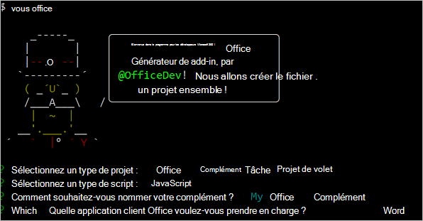
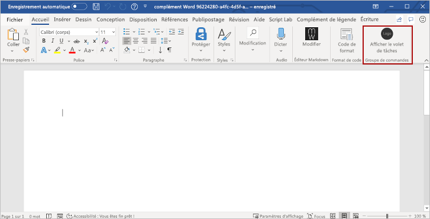

# <a name="tutorial-create-a-word-task-pane-add-in"></a><span data-ttu-id="490f6-104">Didacticiel : Créer un complément de volet de tâches Word</span><span class="sxs-lookup"><span data-stu-id="490f6-104">Tutorial: Create a Word task pane add-in</span></span>

<span data-ttu-id="490f6-105">Dans ce tutoriel, vous allez créer un complément de volet de tâches Excel qui:</span><span class="sxs-lookup"><span data-stu-id="490f6-105">In this tutorial, you'll create a Word task pane add-in that:</span></span>

> [!div class="checklist"]
>
> - <span data-ttu-id="490f6-106">Insère une plage de texte</span><span class="sxs-lookup"><span data-stu-id="490f6-106">Inserts a range of text</span></span>
> - <span data-ttu-id="490f6-107">Formats de texte</span><span class="sxs-lookup"><span data-stu-id="490f6-107">Formats text</span></span>
> - <span data-ttu-id="490f6-108">Remplacer du texte et insérer du texte à divers emplacements</span><span class="sxs-lookup"><span data-stu-id="490f6-108">Replaces text and inserts text in various locations</span></span>
> - <span data-ttu-id="490f6-109">Insère des images, du code HTML et des tableaux</span><span class="sxs-lookup"><span data-stu-id="490f6-109">Inserts images, HTML, and tables</span></span>
> - <span data-ttu-id="490f6-110">Crée et met à jour des contrôles de contenu</span><span class="sxs-lookup"><span data-stu-id="490f6-110">Creates and updates content controls</span></span>

> [!TIP]
> <span data-ttu-id="490f6-111">Si vous avez déjà exécuté le démarrage rapide [Créer votre premier complément du volet des tâches de Word](../quickstarts/word-quickstart.md) et que vous souhaitez utiliser ce projet comme point de départ pour ce didacticiel, accédez directement à la section [Insérer une plage de texte](#insert-a-range-of-text) pour commencer ce didacticiel.</span><span class="sxs-lookup"><span data-stu-id="490f6-111">If you've already completed the [Build your first Word task pane add-in](../quickstarts/word-quickstart.md) quick start, and want to use that project as a starting point for this tutorial, go directly to the [Insert a range of text](#insert-a-range-of-text) section to start this tutorial.</span></span>

## <a name="prerequisites"></a><span data-ttu-id="490f6-112">Conditions préalables</span><span class="sxs-lookup"><span data-stu-id="490f6-112">Prerequisites</span></span>

[!include[Yeoman generator prerequisites](../includes/quickstart-yo-prerequisites.md)]

## <a name="create-your-add-in-project"></a><span data-ttu-id="490f6-113">Créer votre projet de complément</span><span class="sxs-lookup"><span data-stu-id="490f6-113">Create your add-in project</span></span>

[!include[Yeoman generator create project guidance](../includes/yo-office-command-guidance.md)]

- <span data-ttu-id="490f6-114">**Sélectionnez un type de projet :** `Office Add-in Task Pane project`</span><span class="sxs-lookup"><span data-stu-id="490f6-114">**Choose a project type:** `Office Add-in Task Pane project`</span></span>
- <span data-ttu-id="490f6-115">**Sélectionnez un type de script :** `Javascript`</span><span class="sxs-lookup"><span data-stu-id="490f6-115">**Choose a script type:** `Javascript`</span></span>
- <span data-ttu-id="490f6-116">**Comment souhaitez-vous nommer votre complément ?**</span><span class="sxs-lookup"><span data-stu-id="490f6-116">**What do you want to name your add-in?**</span></span> `My Office Add-in`
- <span data-ttu-id="490f6-117">**Quelle application client Office voulez-vous prendre en charge ?**</span><span class="sxs-lookup"><span data-stu-id="490f6-117">**Which Office client application would you like to support?**</span></span> `Word`



<span data-ttu-id="490f6-119">Après avoir exécuté l’assistant, le générateur crée le projet et installe les composants Node de prise en charge.</span><span class="sxs-lookup"><span data-stu-id="490f6-119">After you complete the wizard, the generator creates the project and installs supporting Node components.</span></span>

[!include[Yeoman generator next steps](../includes/yo-office-next-steps.md)]

## <a name="insert-a-range-of-text"></a><span data-ttu-id="490f6-120">Insérer une plage de texte</span><span class="sxs-lookup"><span data-stu-id="490f6-120">Insert a range of text</span></span>

<span data-ttu-id="490f6-121">Dans cette étape du tutoriel, vous devez tester par programme que votre complément prend en charge la version actuelle de Word de l’utilisateur, puis insérer un paragraphe dans le document.</span><span class="sxs-lookup"><span data-stu-id="490f6-121">In this step of the tutorial, you'll programmatically test that your add-in supports the user's current version of Word, and then insert a paragraph into the document.</span></span>

### <a name="code-the-add-in"></a><span data-ttu-id="490f6-122">Codage du complément</span><span class="sxs-lookup"><span data-stu-id="490f6-122">Code the add-in</span></span>

1. <span data-ttu-id="490f6-123">Ouvrez le projet dans votre éditeur de code.</span><span class="sxs-lookup"><span data-stu-id="490f6-123">Open the project in your code editor.</span></span>

2. <span data-ttu-id="490f6-124">Ouvrez le fichier **./src/taskpane/taskpane.html**.</span><span class="sxs-lookup"><span data-stu-id="490f6-124">Open the file **./src/taskpane/taskpane.html**.</span></span> <span data-ttu-id="490f6-125">Ce fichier contient la balise HTML du volet des tâches.</span><span class="sxs-lookup"><span data-stu-id="490f6-125">This file contains the HTML markup for the task pane.</span></span>

3. <span data-ttu-id="490f6-126">Recherchez l’élément `<main>` et supprimez toutes les lignes qui apparaissent après la balise `<main>` d’ouverture et avant la balise `</main>` de fermeture.</span><span class="sxs-lookup"><span data-stu-id="490f6-126">Locate the `<main>` element and delete all lines that appear after the opening `<main>` tag and before the closing `</main>` tag.</span></span>

4. <span data-ttu-id="490f6-127">Ajoutez la balise suivante juste après la balise `<main>` d’ouverture :</span><span class="sxs-lookup"><span data-stu-id="490f6-127">Add the following markup immediately after the opening `<main>` tag:</span></span>

    ```html
    <button class="ms-Button" id="insert-paragraph">Insert Paragraph</button><br/><br/>
    ```

5. <span data-ttu-id="490f6-128">Ouvrez le fichier **./src/taskpane/taskpane.js**.</span><span class="sxs-lookup"><span data-stu-id="490f6-128">Open the file **./src/taskpane/taskpane.js**.</span></span> <span data-ttu-id="490f6-129">Ce fichier contient le code de l’API JavaScript pour Office qui facilite l’interaction entre le volet des tâches et l’application cliente Office.</span><span class="sxs-lookup"><span data-stu-id="490f6-129">This file contains the Office JavaScript API code that facilitates interaction between the task pane and the Office client application.</span></span>

6. <span data-ttu-id="490f6-130">Supprimez toutes les références au bouton `run` et à la fonction `run()` en procédant comme suit :</span><span class="sxs-lookup"><span data-stu-id="490f6-130">Remove all references to the `run` button and the `run()` function by doing the following:</span></span>

    - <span data-ttu-id="490f6-131">Recherchez et supprimez la ligne `document.getElementById("run").onclick = run;`.</span><span class="sxs-lookup"><span data-stu-id="490f6-131">Locate and delete the line `document.getElementById("run").onclick = run;`.</span></span>

    - <span data-ttu-id="490f6-132">Recherchez et supprimez la fonction `run()` entière.</span><span class="sxs-lookup"><span data-stu-id="490f6-132">Locate and delete the entire `run()` function.</span></span>

7. <span data-ttu-id="490f6-133">Au sein de l’appel de méthode `Office.onReady`, recherchez la ligne `if (info.host === Office.HostType.Word) {` et ajoutez le code suivant immédiatement après cette ligne.</span><span class="sxs-lookup"><span data-stu-id="490f6-133">Within the `Office.onReady` method call, locate the line `if (info.host === Office.HostType.Word) {` and add the following code immediately after that line.</span></span> <span data-ttu-id="490f6-134">Remarque :</span><span class="sxs-lookup"><span data-stu-id="490f6-134">Note:</span></span>

    - <span data-ttu-id="490f6-135">La première partie de ce code détermine si la version de Word de l’utilisateur prend en charge une version de Word.js qui inclut toutes les API utilisées dans les étapes de ce didacticiel.</span><span class="sxs-lookup"><span data-stu-id="490f6-135">The first part of this code determines whether the user's version of Word supports a version of Word.js that includes all the APIs that are used in all stages of this tutorial.</span></span> <span data-ttu-id="490f6-136">Dans un complément de production, utilisez le corps du bloc conditionnel pour masquer ou désactiver l’interface utilisateur appelant des API non prises en charge.</span><span class="sxs-lookup"><span data-stu-id="490f6-136">In a production add-in, use the body of the conditional block to hide or disable the UI that would call unsupported APIs.</span></span> <span data-ttu-id="490f6-137">Cela permet à l’utilisateur de toujours utiliser les parties du complément prises en charge par sa version d’Excel.</span><span class="sxs-lookup"><span data-stu-id="490f6-137">This will enable the user to still use the parts of the add-in that are supported by their version of Word.</span></span>
    - <span data-ttu-id="490f6-138">La deuxième partie de ce code ajoute un gestionnaire d’événements pour le bouton `insert-paragraph`.</span><span class="sxs-lookup"><span data-stu-id="490f6-138">The second part of this code adds an event handler for the `insert-paragraph` button.</span></span>

    ```js
    // Determine if the user's version of Office supports all the Office.js APIs that are used in the tutorial.
    if (!Office.context.requirements.isSetSupported('WordApi', '1.3')) {
        console.log('Sorry. The tutorial add-in uses Word.js APIs that are not available in your version of Office.');
    }

    // Assign event handlers and other initialization logic.
    document.getElementById("insert-paragraph").onclick = insertParagraph;
    ```

8. <span data-ttu-id="490f6-139">Ajoutez la fonction suivante à la fin du fichier.</span><span class="sxs-lookup"><span data-stu-id="490f6-139">Add the following function to the end of the file.</span></span> <span data-ttu-id="490f6-140">Remarque :</span><span class="sxs-lookup"><span data-stu-id="490f6-140">Note:</span></span>

   - <span data-ttu-id="490f6-p107">Votre logique métier Word.js est ajoutée à la fonction qui est transmise à `Word.run`. Cette logique n’est pas exécutée immédiatement. Au lieu de cela, elle est ajoutée à une file d’attente de commandes.</span><span class="sxs-lookup"><span data-stu-id="490f6-p107">Your Word.js business logic will be added to the function that is passed to `Word.run`. This logic does not execute immediately. Instead, it is added to a queue of pending commands.</span></span>

   - <span data-ttu-id="490f6-144">La méthode `context.sync` envoie toutes les commandes en file d’attente vers Word pour exécution.</span><span class="sxs-lookup"><span data-stu-id="490f6-144">The `context.sync` method sends all queued commands to Word for execution.</span></span>

   - <span data-ttu-id="490f6-p108">L’élément `Word.run` est suivi par un bloc `catch`. Il s’agit d’une meilleure pratique que vous devez toujours suivre.</span><span class="sxs-lookup"><span data-stu-id="490f6-p108">The `Word.run` is followed by a `catch` block. This is a best practice that you should always follow.</span></span>

    ```js
    function insertParagraph() {
        Word.run(function (context) {

            // TODO1: Queue commands to insert a paragraph into the document.

            return context.sync();
        })
        .catch(function (error) {
            console.log("Error: " + error);
            if (error instanceof OfficeExtension.Error) {
                console.log("Debug info: " + JSON.stringify(error.debugInfo));
            }
        });
    }
    ```

9. <span data-ttu-id="490f6-147">À l’intérieur de la fonction `insertParagraph()`, remplacez `TODO1` par le code suivant.</span><span class="sxs-lookup"><span data-stu-id="490f6-147">Within the `insertParagraph()` function, replace `TODO1` with the following code.</span></span> <span data-ttu-id="490f6-148">Remarque :</span><span class="sxs-lookup"><span data-stu-id="490f6-148">Note:</span></span>

   - <span data-ttu-id="490f6-149">Le premier paramètre de la méthode `insertParagraph` correspond au texte pour le nouveau paragraphe.</span><span class="sxs-lookup"><span data-stu-id="490f6-149">The first parameter to the `insertParagraph` method is the text for the new paragraph.</span></span>

   - <span data-ttu-id="490f6-p110">Le deuxième paramètre correspond à l’emplacement dans le corps où sera inséré le paragraphe. Les autres options d’insertion de paragraphe, lorsque l’objet parent est le corps, sont « Fin » et « Remplacer ».</span><span class="sxs-lookup"><span data-stu-id="490f6-p110">The second parameter is the location within the body where the paragraph will be inserted. Other options for insert paragraph, when the parent object is the body, are "End" and "Replace".</span></span>

    ```js
    var docBody = context.document.body;
    docBody.insertParagraph("Office has several versions, including Office 2016, Microsoft 365 subscription, and Office on the web.",
                            "Start");
    ```

10. <span data-ttu-id="490f6-152">Vérifiez que vous avez enregistré toutes les modifications que vous avez apportées au projet.</span><span class="sxs-lookup"><span data-stu-id="490f6-152">Verify that you've saved all of the changes you've made to the project.</span></span>

### <a name="test-the-add-in"></a><span data-ttu-id="490f6-153">Test du complément</span><span class="sxs-lookup"><span data-stu-id="490f6-153">Test the add-in</span></span>

1. <span data-ttu-id="490f6-154">Pour démarrer le serveur web local et charger indépendamment votre complément, procédez comme suit.</span><span class="sxs-lookup"><span data-stu-id="490f6-154">Complete the following steps to start the local web server and sideload your add-in.</span></span>

    > [!NOTE]
    > <span data-ttu-id="490f6-155">Les compléments Office doivent utiliser le protocole HTTPS, et non HTTP, même lorsque vous développez.</span><span class="sxs-lookup"><span data-stu-id="490f6-155">Office Add-ins should use HTTPS, not HTTP, even when you are developing.</span></span> <span data-ttu-id="490f6-156">Si vous êtes invité à installer un certificat après avoir exécuté une des commandes suivantes, acceptez d’installer le certificat fourni par le générateur Yeoman.</span><span class="sxs-lookup"><span data-stu-id="490f6-156">If you are prompted to install a certificate after you run one of the following commands, accept the prompt to install the certificate that the Yeoman generator provides.</span></span>

    > [!TIP]
    > <span data-ttu-id="490f6-157">Si vous testez votre complément sur Mac, exécutez la commande suivante dans le répertoire racine de votre projet avant de continuer.</span><span class="sxs-lookup"><span data-stu-id="490f6-157">If you're testing your add-in on Mac, run the following command in the root directory of your project before proceeding.</span></span> <span data-ttu-id="490f6-158">Lorsque vous exécutez cette commande, le serveur web local démarre.</span><span class="sxs-lookup"><span data-stu-id="490f6-158">When you run this command, the local web server starts.</span></span>
    >
    > ```command&nbsp;line
    > npm run dev-server
    > ```

    - <span data-ttu-id="490f6-159">Pour tester votre complément dans Word, exécutez la commande suivante dans le répertoire racine de votre projet.</span><span class="sxs-lookup"><span data-stu-id="490f6-159">To test your add-in in Word, run the following command in the root directory of your project.</span></span> <span data-ttu-id="490f6-160">Cela a pour effet de démarrer le serveur web local (s’il n’est pas déjà en cours d’exécution) et d’ouvrir Word avec votre complément chargé.</span><span class="sxs-lookup"><span data-stu-id="490f6-160">This starts the local web server (if it's not already running) and opens Word with your add-in loaded.</span></span>

        ```command&nbsp;line
        npm start
        ```

    - <span data-ttu-id="490f6-161">Pour tester votre complément dans Word sur le web, exécutez la commande suivante dans le répertoire racine de votre projet.</span><span class="sxs-lookup"><span data-stu-id="490f6-161">To test your add-in in Word on the web, run the following command in the root directory of your project.</span></span> <span data-ttu-id="490f6-162">Lorsque vous exécutez cette commande, le serveur web local démarre (s’il n’est pas déjà en cours d’exécution).</span><span class="sxs-lookup"><span data-stu-id="490f6-162">When you run this command, the local web server will start (if it's not already running).</span></span>

        ```command&nbsp;line
        npm run start:web
        ```

        <span data-ttu-id="490f6-163">Pour utiliser votre complément, ouvrez un nouveau document dans Word sur le web, puis chargez la version test de votre complément en suivant les instructions de l’article relatif au [chargement de version test des compléments Office dans Office sur le web](../testing/sideload-office-add-ins-for-testing.md#sideload-an-office-add-in-in-office-on-the-web).</span><span class="sxs-lookup"><span data-stu-id="490f6-163">To use your add-in, open a new document in Word on the web and then sideload your add-in by following the instructions in [Sideload Office Add-ins in Office on the web](../testing/sideload-office-add-ins-for-testing.md#sideload-an-office-add-in-in-office-on-the-web).</span></span>

2. <span data-ttu-id="490f6-164">Dans Word, sélectionnez l’onglet **Accueil**, puis choisissez le bouton **Afficher le volet Office** du ruban pour ouvrir le volet Office du complément.</span><span class="sxs-lookup"><span data-stu-id="490f6-164">In Word, choose the **Home** tab, and then choose the **Show Taskpane** button in the ribbon to open the add-in task pane.</span></span>

    

3. <span data-ttu-id="490f6-166">Dans le volet des tâches, cliquez sur le bouton **Insérer un paragraphe**.</span><span class="sxs-lookup"><span data-stu-id="490f6-166">In the task pane, choose the **Insert Paragraph** button.</span></span>

4. <span data-ttu-id="490f6-167">Apportez une modification au paragraphe.</span><span class="sxs-lookup"><span data-stu-id="490f6-167">Make a change in the paragraph.</span></span>

5. <span data-ttu-id="490f6-168">Cliquez de nouveau sur le bouton **Insérer un paragraphe**.</span><span class="sxs-lookup"><span data-stu-id="490f6-168">Choose the **Insert Paragraph** button again.</span></span> <span data-ttu-id="490f6-169">Remarque : le nouveau paragraphe apparaît au-dessus du précédent, car la méthode `insertParagraph` effectue l’insertion au début du corps du document.</span><span class="sxs-lookup"><span data-stu-id="490f6-169">Note that the new paragraph appears above the previous one because the `insertParagraph` method is inserting at the start of the document's body.</span></span>

    

## <a name="format-text"></a><span data-ttu-id="490f6-171">Mettre en forme du texte</span><span class="sxs-lookup"><span data-stu-id="490f6-171">Format text</span></span>

<span data-ttu-id="490f6-172">Dans cette étape du didacticiel, vous devez appliquer un style intégré au texte, appliquer un style personnalisé à texte et modifier la police du texte.</span><span class="sxs-lookup"><span data-stu-id="490f6-172">In this step of the tutorial, you'll apply a built-in style to text, apply a custom style to text, and change the font of text.</span></span>

### <a name="apply-a-built-in-style-to-text"></a><span data-ttu-id="490f6-173">Appliquer un style prédéfini au texte</span><span class="sxs-lookup"><span data-stu-id="490f6-173">Apply a built-in style to text</span></span>

1. <span data-ttu-id="490f6-174">Ouvrez le fichier **./src/taskpane/taskpane.html**.</span><span class="sxs-lookup"><span data-stu-id="490f6-174">Open the file **./src/taskpane/taskpane.html**.</span></span>

2. <span data-ttu-id="490f6-175">Recherchez l’élément `<button>` du bouton `insert-paragraph`, puis ajoutez la balise suivante après cette ligne :</span><span class="sxs-lookup"><span data-stu-id="490f6-175">Locate the `<button>` element for the `insert-paragraph` button, and add the following markup after that line:</span></span>

    ```html
    <button class="ms-Button" id="apply-style">Apply Style</button><br/><br/>
    ```

3. <span data-ttu-id="490f6-176">Ouvrez le fichier **./src/taskpane/taskpane.js**.</span><span class="sxs-lookup"><span data-stu-id="490f6-176">Open the file **./src/taskpane/taskpane.js**.</span></span>

4. <span data-ttu-id="490f6-177">Au cours de l’appel de méthode `Office.onReady`, recherchez la ligne qui attribue un gestionnaire de clic au bouton `insert-paragraph`, puis ajoutez le code suivant après cette ligne :</span><span class="sxs-lookup"><span data-stu-id="490f6-177">Within the `Office.onReady` method call, locate the line that assigns a click handler to the `insert-paragraph` button, and add the following code after that line:</span></span>

    ```js
    document.getElementById("apply-style").onclick = applyStyle;
    ```

5. <span data-ttu-id="490f6-178">Ajoutez la fonction suivante à la fin du fichier :</span><span class="sxs-lookup"><span data-stu-id="490f6-178">Add the following function to the end of the file:</span></span>

    ```js
    function applyStyle() {
        Word.run(function (context) {

            // TODO1: Queue commands to style text.

            return context.sync();
        })
        .catch(function (error) {
            console.log("Error: " + error);
            if (error instanceof OfficeExtension.Error) {
                console.log("Debug info: " + JSON.stringify(error.debugInfo));
            }
        });
    }
    ```

6. <span data-ttu-id="490f6-179">À l’intérieur de la fonction `applyStyle()`, remplacez `TODO1` par le code suivant.</span><span class="sxs-lookup"><span data-stu-id="490f6-179">Within the `applyStyle()` function, replace `TODO1` with the following code.</span></span> <span data-ttu-id="490f6-180">Le code applique un style à un paragraphe, mais les styles peuvent également être appliqués aux plages de texte.</span><span class="sxs-lookup"><span data-stu-id="490f6-180">Note that the code applies a style to a paragraph, but styles can also be applied to ranges of text.</span></span>

    ```js
    var firstParagraph = context.document.body.paragraphs.getFirst();
    firstParagraph.styleBuiltIn = Word.Style.intenseReference;
    ```

### <a name="apply-a-custom-style-to-text"></a><span data-ttu-id="490f6-181">Appliquer un style personnalisé au texte</span><span class="sxs-lookup"><span data-stu-id="490f6-181">Apply a custom style to text</span></span>

1. <span data-ttu-id="490f6-182">Ouvrez le fichier **./src/taskpane/taskpane.html**.</span><span class="sxs-lookup"><span data-stu-id="490f6-182">Open the file **./src/taskpane/taskpane.html**.</span></span>

2. <span data-ttu-id="490f6-183">Recherchez l’élément `<button>` du bouton `apply-style`, puis ajoutez la balise suivante après cette ligne :</span><span class="sxs-lookup"><span data-stu-id="490f6-183">Locate the `<button>` element for the `apply-style` button, and add the following markup after that line:</span></span>

    ```html
    <button class="ms-Button" id="apply-custom-style">Apply Custom Style</button><br/><br/>
    ```

3. <span data-ttu-id="490f6-184">Ouvrez le fichier **./src/taskpane/taskpane.js**.</span><span class="sxs-lookup"><span data-stu-id="490f6-184">Open the file **./src/taskpane/taskpane.js**.</span></span>

4. <span data-ttu-id="490f6-185">Au cours de l’appel de méthode `Office.onReady`, recherchez la ligne qui attribue un gestionnaire de clic au bouton `apply-style`, puis ajoutez le code suivant après cette ligne :</span><span class="sxs-lookup"><span data-stu-id="490f6-185">Within the `Office.onReady` method call, locate the line that assigns a click handler to the `apply-style` button, and add the following code after that line:</span></span>

    ```js
    document.getElementById("apply-custom-style").onclick = applyCustomStyle;
    ```

5. <span data-ttu-id="490f6-186">Ajoutez la fonction suivante à la fin du fichier :</span><span class="sxs-lookup"><span data-stu-id="490f6-186">Add the following function to the end of the file:</span></span>

    ```js
    function applyCustomStyle() {
        Word.run(function (context) {

            // TODO1: Queue commands to apply the custom style.

            return context.sync();
        })
        .catch(function (error) {
            console.log("Error: " + error);
            if (error instanceof OfficeExtension.Error) {
                console.log("Debug info: " + JSON.stringify(error.debugInfo));
            }
        });
    }
    ```

6. <span data-ttu-id="490f6-187">À l’intérieur de la fonction `applyCustomStyle()`, remplacez `TODO1` par le code suivant.</span><span class="sxs-lookup"><span data-stu-id="490f6-187">Within the `applyCustomStyle()` function, replace `TODO1` with the following code.</span></span> <span data-ttu-id="490f6-188">Le code applique un style personnalisé qui n’existe pas encore.</span><span class="sxs-lookup"><span data-stu-id="490f6-188">Note that the code applies a custom style that does not exist yet.</span></span> <span data-ttu-id="490f6-189">Vous allez créer un style nommé **MyCustomStyle** lors de l’étape [Test du complément](#test-the-add-in-1).</span><span class="sxs-lookup"><span data-stu-id="490f6-189">You'll create a style with the name **MyCustomStyle** in the [Test the add-in](#test-the-add-in-1) step.</span></span>

    ```js
    var lastParagraph = context.document.body.paragraphs.getLast();
    lastParagraph.style = "MyCustomStyle";
    ```

7. <span data-ttu-id="490f6-190">Vérifiez que vous avez enregistré toutes les modifications que vous avez apportées au projet.</span><span class="sxs-lookup"><span data-stu-id="490f6-190">Verify that you've saved all of the changes you've made to the project.</span></span>

### <a name="change-the-font-of-text"></a><span data-ttu-id="490f6-191">Modifier la police du texte</span><span class="sxs-lookup"><span data-stu-id="490f6-191">Change the font of text</span></span>

1. <span data-ttu-id="490f6-192">Ouvrez le fichier **./src/taskpane/taskpane.html**.</span><span class="sxs-lookup"><span data-stu-id="490f6-192">Open the file **./src/taskpane/taskpane.html**.</span></span>

2. <span data-ttu-id="490f6-193">Recherchez l’élément `<button>` du bouton `apply-custom-style`, puis ajoutez la balise suivante après cette ligne :</span><span class="sxs-lookup"><span data-stu-id="490f6-193">Locate the `<button>` element for the `apply-custom-style` button, and add the following markup after that line:</span></span>

    ```html
    <button class="ms-Button" id="change-font">Change Font</button><br/><br/>
    ```

3. <span data-ttu-id="490f6-194">Ouvrez le fichier **./src/taskpane/taskpane.js**.</span><span class="sxs-lookup"><span data-stu-id="490f6-194">Open the file **./src/taskpane/taskpane.js**.</span></span>

4. <span data-ttu-id="490f6-195">Au cours de l’appel de méthode `Office.onReady`, recherchez la ligne qui attribue un gestionnaire de clic au bouton `apply-custom-style`, puis ajoutez le code suivant après cette ligne :</span><span class="sxs-lookup"><span data-stu-id="490f6-195">Within the `Office.onReady` method call, locate the line that assigns a click handler to the `apply-custom-style` button, and add the following code after that line:</span></span>

    ```js
    document.getElementById("change-font").onclick = changeFont;
    ```

5. <span data-ttu-id="490f6-196">Ajoutez la fonction suivante à la fin du fichier :</span><span class="sxs-lookup"><span data-stu-id="490f6-196">Add the following function to the end of the file:</span></span>

    ```js
    function changeFont() {
        Word.run(function (context) {

            // TODO1: Queue commands to apply a different font.

            return context.sync();
        })
        .catch(function (error) {
            console.log("Error: " + error);
            if (error instanceof OfficeExtension.Error) {
                console.log("Debug info: " + JSON.stringify(error.debugInfo));
            }
        });
    }
    ```

6. <span data-ttu-id="490f6-197">À l’intérieur de la fonction `changeFont()`, remplacez `TODO1` par le code suivant.</span><span class="sxs-lookup"><span data-stu-id="490f6-197">Within the `changeFont()` function, replace `TODO1` with the following code.</span></span> <span data-ttu-id="490f6-198">Le code obtient une référence au deuxième paragraphe en utilisant la méthode `ParagraphCollection.getFirst` chaînée à la méthode `Paragraph.getNext`.</span><span class="sxs-lookup"><span data-stu-id="490f6-198">Note that the code gets a reference to the second paragraph by using the `ParagraphCollection.getFirst` method chained to the `Paragraph.getNext` method.</span></span>

    ```js
    var secondParagraph = context.document.body.paragraphs.getFirst().getNext();
    secondParagraph.font.set({
            name: "Courier New",
            bold: true,
            size: 18
        });
    ```

7. <span data-ttu-id="490f6-199">Vérifiez que vous avez enregistré toutes les modifications que vous avez apportées au projet.</span><span class="sxs-lookup"><span data-stu-id="490f6-199">Verify that you've saved all of the changes you've made to the project.</span></span>

### <a name="test-the-add-in"></a><span data-ttu-id="490f6-200">Test du complément</span><span class="sxs-lookup"><span data-stu-id="490f6-200">Test the add-in</span></span>

1. [!include[Start server and sideload add-in instructions](../includes/tutorial-word-start-server.md)]

2. <span data-ttu-id="490f6-201">Si le volet des tâches du complément n’est pas déjà ouvert dans Word, sélectionnez l’onglet **Accueil**, puis cliquez sur le bouton **Afficher le volet de tâches** du ruban pour l’ouvrir.</span><span class="sxs-lookup"><span data-stu-id="490f6-201">If the add-in task pane isn't already open in Word, go to the **Home** tab and choose the **Show Taskpane** button in the ribbon to open it.</span></span>

3. <span data-ttu-id="490f6-202">Assurez-vous qu’il existe au moins trois paragraphes dans le document.</span><span class="sxs-lookup"><span data-stu-id="490f6-202">Be sure there are at least three paragraphs in the document.</span></span> <span data-ttu-id="490f6-203">Vous pouvez cliquez trois fois sur le bouton **Insérer un paragraphe**.</span><span class="sxs-lookup"><span data-stu-id="490f6-203">You can choose the **Insert Paragraph** button three times.</span></span> <span data-ttu-id="490f6-204">*Vérifiez attentivement qu’aucun paragraphe vide n’apparaît à la fin du document. S’il y en a un, supprimez-le.*</span><span class="sxs-lookup"><span data-stu-id="490f6-204">*Check carefully that there's no blank paragraph at the end of the document. If there is, delete it.*</span></span>

4. <span data-ttu-id="490f6-205">Dans Word, créez un [style personnalisé](https://support.office.com/article/customize-or-create-new-styles-d38d6e47-f6fc-48eb-a607-1eb120dec563) nommé « MyCustomStyle ».</span><span class="sxs-lookup"><span data-stu-id="490f6-205">In Word, create a [custom style](https://support.office.com/article/customize-or-create-new-styles-d38d6e47-f6fc-48eb-a607-1eb120dec563) named "MyCustomStyle".</span></span> <span data-ttu-id="490f6-206">Vous pouvez y appliquer la mise en forme que vous souhaitez.</span><span class="sxs-lookup"><span data-stu-id="490f6-206">It can have any formatting that you want.</span></span>

5. <span data-ttu-id="490f6-p121">Sélectionnez le bouton **Appliquer le style**. Le style prédéfini **Référence intense** est appliqué au premier paragraphe.</span><span class="sxs-lookup"><span data-stu-id="490f6-p121">Choose the **Apply Style** button. The first paragraph will be styled with the built-in style **Intense Reference**.</span></span>

6. <span data-ttu-id="490f6-p122">Sélectionnez le bouton **Appliquer un style personnalisé**. Votre style personnalisé est appliqué au dernier paragraphe. (Si rien ne semble se produire, le dernier paragraphe est peut-être vide. Si c’est le cas, ajoutez-y du texte.)</span><span class="sxs-lookup"><span data-stu-id="490f6-p122">Choose the **Apply Custom Style** button. The last paragraph will be styled with your custom style. (If nothing seems to happen, the last paragraph might be blank. If so, add some text to it.)</span></span>

7. <span data-ttu-id="490f6-p123">Sélectionnez le bouton **Modifier la police**. La police Courier New, 18 pt, en gras, est appliquée au deuxième paragraphe.</span><span class="sxs-lookup"><span data-stu-id="490f6-p123">Choose the **Change Font** button. The font of the second paragraph changes to 18 pt., bold, Courier New.</span></span>

    

## <a name="replace-text-and-insert-text"></a><span data-ttu-id="490f6-216">Remplacer du texte et insérer du texte</span><span class="sxs-lookup"><span data-stu-id="490f6-216">Replace text and insert text</span></span>

<span data-ttu-id="490f6-217">Dans cette étape du didacticiel, vous ajouterez du texte dans les plages de texte sélectionnées et en dehors de celles-ci, puis remplacerez le texte de la plage sélectionnée.</span><span class="sxs-lookup"><span data-stu-id="490f6-217">In this step of the tutorial, you'll add text inside and outside of selected ranges of text, and replace the text of a selected range.</span></span>

### <a name="add-text-inside-a-range"></a><span data-ttu-id="490f6-218">Ajouter du texte dans une plage</span><span class="sxs-lookup"><span data-stu-id="490f6-218">Add text inside a range</span></span>

1. <span data-ttu-id="490f6-219">Ouvrez le fichier **./src/taskpane/taskpane.html**.</span><span class="sxs-lookup"><span data-stu-id="490f6-219">Open the file **./src/taskpane/taskpane.html**.</span></span>

2. <span data-ttu-id="490f6-220">Recherchez l’élément `<button>` du bouton `change-font`, puis ajoutez la balise suivante après cette ligne :</span><span class="sxs-lookup"><span data-stu-id="490f6-220">Locate the `<button>` element for the `change-font` button, and add the following markup after that line:</span></span>

    ```html
    <button class="ms-Button" id="insert-text-into-range">Insert Abbreviation</button><br/><br/>
    ```

3. <span data-ttu-id="490f6-221">Ouvrez le fichier **./src/taskpane/taskpane.js**.</span><span class="sxs-lookup"><span data-stu-id="490f6-221">Open the file **./src/taskpane/taskpane.js**.</span></span>

4. <span data-ttu-id="490f6-222">Au cours de l’appel de méthode `Office.onReady`, recherchez la ligne qui attribue un gestionnaire de clic au bouton `change-font`, puis ajoutez le code suivant après cette ligne :</span><span class="sxs-lookup"><span data-stu-id="490f6-222">Within the `Office.onReady` method call, locate the line that assigns a click handler to the `change-font` button, and add the following code after that line:</span></span>

    ```js
    document.getElementById("insert-text-into-range").onclick = insertTextIntoRange;
    ```

5. <span data-ttu-id="490f6-223">Ajoutez la fonction suivante à la fin du fichier :</span><span class="sxs-lookup"><span data-stu-id="490f6-223">Add the following function to the end of the file:</span></span>

    ```js
    function insertTextIntoRange() {
        Word.run(function (context) {

            // TODO1: Queue commands to insert text into a selected range.

            // TODO2: Load the text of the range and sync so that the
            //        current range text can be read.

            // TODO3: Queue commands to repeat the text of the original
            //        range at the end of the document.

            return context.sync();
        })
        .catch(function (error) {
            console.log("Error: " + error);
            if (error instanceof OfficeExtension.Error) {
                console.log("Debug info: " + JSON.stringify(error.debugInfo));
            }
        });
    }
    ```

6. <span data-ttu-id="490f6-224">À l’intérieur de la fonction `insertTextIntoRange()`, remplacez `TODO1` par le code suivant.</span><span class="sxs-lookup"><span data-stu-id="490f6-224">Within the `insertTextIntoRange()` function, replace `TODO1` with the following code.</span></span> <span data-ttu-id="490f6-225">Remarque :</span><span class="sxs-lookup"><span data-stu-id="490f6-225">Note:</span></span>

   - <span data-ttu-id="490f6-p125">La méthode est destinée à insérer l’abréviation [« (C2R) »] à la fin de la plage dont le texte est « Click-to-Run » (Démarrer en un clic). Cela permet d’émettre une hypothèse simplifiée selon laquelle la chaîne est présente et l’utilisateur l’a sélectionnée.</span><span class="sxs-lookup"><span data-stu-id="490f6-p125">The method is intended to insert the abbreviation ["(C2R)"] into the end of the Range whose text is "Click-to-Run". It makes a simplifying assumption that the string is present and the user has selected it.</span></span>

   - <span data-ttu-id="490f6-228">Le premier paramètre de la méthode `Range.insertText` correspond à la chaîne à insérer dans l’objet `Range`.</span><span class="sxs-lookup"><span data-stu-id="490f6-228">The first parameter of the `Range.insertText` method is the string to insert into the `Range` object.</span></span>

   - <span data-ttu-id="490f6-p126">Le deuxième paramètre spécifie l’emplacement où le texte supplémentaire doit être inséré dans la plage. Outre « Fin », les autres options possibles sont : « Début », « Avant », « Après » et « Remplacer ».</span><span class="sxs-lookup"><span data-stu-id="490f6-p126">The second parameter specifies where in the range the additional text should be inserted. Besides "End", the other possible options are "Start", "Before", "After", and "Replace".</span></span>

   - <span data-ttu-id="490f6-p127">La différence entre « Fin » et « Après » est que « Fin » insère le nouveau texte à la fin de la plage existante, tandis que l’option « Après » crée une plage avec la chaîne et insère la nouvelle plage après la plage existante. De même, « Début » insère le texte au début de la plage existante, tandis que l’option « Avant » insère une nouvelle plage. L’option « Remplacer » remplace le texte de la plage existante par la chaîne dans le premier paramètre.</span><span class="sxs-lookup"><span data-stu-id="490f6-p127">The difference between "End" and "After" is that "End" inserts the new text inside the end of the existing range, but "After" creates a new range with the string and inserts the new range after the existing range. Similarly, "Start" inserts text inside the beginning of the existing range and "Before" inserts a new range. "Replace" replaces the text of the existing range with the string in the first parameter.</span></span>

   - <span data-ttu-id="490f6-p128">Vous avez vu lors d’une étape précédente du didacticiel que les méthodes insert\* de l’objet corps ne disposent pas des options « Avant » et « Après ». Cela est dû au fait que vous ne pouvez pas placer de contenu en dehors du corps du document.</span><span class="sxs-lookup"><span data-stu-id="490f6-p128">You saw in an earlier stage of the tutorial that the insert\* methods of the body object do not have the "Before" and "After" options. This is because you can't put content outside of the document's body.</span></span>

    ```js
    var doc = context.document;
    var originalRange = doc.getSelection();
    originalRange.insertText(" (C2R)", "End");
    ```

7. <span data-ttu-id="490f6-236">Nous ignorerons `TODO2` jusqu’à la section suivante.</span><span class="sxs-lookup"><span data-stu-id="490f6-236">We'll skip over `TODO2` until the next section.</span></span> <span data-ttu-id="490f6-237">À l’intérieur de la fonction `insertTextIntoRange()`, remplacez `TODO3` par le code suivant.</span><span class="sxs-lookup"><span data-stu-id="490f6-237">Within the `insertTextIntoRange()` function, replace `TODO3` with the following code.</span></span> <span data-ttu-id="490f6-238">Ce code est similaire au code que vous avez créé lors de la première phase du didacticiel, sauf que, maintenant, vous insérez un nouveau paragraphe à la fin du document plutôt qu’au début.</span><span class="sxs-lookup"><span data-stu-id="490f6-238">This code is similar to the code you created in the first stage of the tutorial, except that now you are inserting a new paragraph at the end of the document instead of at the start.</span></span> <span data-ttu-id="490f6-239">Ce nouveau paragraphe montre que le nouveau texte fait désormais partie de la plage d’origine.</span><span class="sxs-lookup"><span data-stu-id="490f6-239">This new paragraph will demonstrate that the new text is now part of the original range.</span></span>

    ```js
    doc.body.insertParagraph("Original range: " + originalRange.text, "End");
    ```

### <a name="add-code-to-fetch-document-properties-into-the-task-panes-script-objects"></a><span data-ttu-id="490f6-240">Ajoutez du code pour récupérer des propriétés de document dans les objets de script du volet Office</span><span class="sxs-lookup"><span data-stu-id="490f6-240">Add code to fetch document properties into the task pane's script objects</span></span>

<span data-ttu-id="490f6-241">Dans l’ensemble des fonctions précédentes de cette série de didacticiels, vous avez mis en file d’attente des commandes pour écrire (*write*) dans le document Office.</span><span class="sxs-lookup"><span data-stu-id="490f6-241">In all previous functions in this series of tutorials, you queued commands to *write* to the Office document.</span></span> <span data-ttu-id="490f6-242">Chaque fonction se terminait par un appel de la méthode `context.sync()` qui envoie les commandes en file d’attente au document pour qu’elles soient exécutées.</span><span class="sxs-lookup"><span data-stu-id="490f6-242">Each function ended with a call to the `context.sync()` method which sends the queued commands to the document to be executed.</span></span> <span data-ttu-id="490f6-243">Cependant, le code que vous avez ajouté dans la dernière étape appelle la propriété `originalRange.text` et c’est une différence significative par rapport aux fonctions antérieures que vous avez écrites, car l’objet `originalRange` est uniquement un objet de proxy qui existe dans le script de votre volet Office.</span><span class="sxs-lookup"><span data-stu-id="490f6-243">But the code you added in the last step calls the `originalRange.text` property, and this is a significant difference from the earlier functions you wrote, because the `originalRange` object is only a proxy object that exists in your task pane's script.</span></span> <span data-ttu-id="490f6-244">Il ne connaît pas le texte réel de la plage dans le document, donc sa propriété `text` ne peut pas contenir de valeur réelle.</span><span class="sxs-lookup"><span data-stu-id="490f6-244">It doesn't know what the actual text of the range in the document is, so its `text` property can't have a real value.</span></span> <span data-ttu-id="490f6-245">Il est nécessaire de récupérer d’abord la valeur de texte de la plage à partir du document, puis de l’utiliser pour définir la valeur de `originalRange.text`.</span><span class="sxs-lookup"><span data-stu-id="490f6-245">It is necessary to first fetch the text value of the range from the document and use it to set the value of `originalRange.text`.</span></span> <span data-ttu-id="490f6-246">Seulement ensuite, la propriété `originalRange.text` peut être appelée sans générer d’exception.</span><span class="sxs-lookup"><span data-stu-id="490f6-246">Only then can `originalRange.text` be called without causing an exception to be thrown.</span></span> <span data-ttu-id="490f6-247">Ce processus de récupération comporte trois étapes :</span><span class="sxs-lookup"><span data-stu-id="490f6-247">This fetching process has three steps:</span></span>

   1. <span data-ttu-id="490f6-248">Mettez en file d’attente une commande de chargement (c’est-à-dire, fetch) des propriétés que votre code doit lire.</span><span class="sxs-lookup"><span data-stu-id="490f6-248">Queue a command to load (that is; fetch) the properties that your code needs to read.</span></span>

   2. <span data-ttu-id="490f6-249">Appelez la méthode `sync` de l’objet de contexte pour envoyer la commande mise en file d’attente vers le document pour exécution, et renvoyez les informations demandées.</span><span class="sxs-lookup"><span data-stu-id="490f6-249">Call the context object's `sync` method to send the queued command to the document for execution and return the requested information.</span></span>

   3. <span data-ttu-id="490f6-250">Étant donné que la méthode `sync` est asynchrone, assurez-vous qu’elle est terminée avant que votre code appelle les propriétés qui ont été récupérées.</span><span class="sxs-lookup"><span data-stu-id="490f6-250">Because the `sync` method is asynchronous, ensure that it has completed before your code calls the properties that were fetched.</span></span>

<span data-ttu-id="490f6-251">Ces étapes doivent être effectuées à chaque fois que votre code doit lire (*read*) des informations provenant du document Office.</span><span class="sxs-lookup"><span data-stu-id="490f6-251">These steps must be completed whenever your code needs to *read* information from the Office document.</span></span>

1. <span data-ttu-id="490f6-252">À l’intérieur de la fonction `insertTextIntoRange()`, remplacez `TODO2` par le code suivant.</span><span class="sxs-lookup"><span data-stu-id="490f6-252">Within the `insertTextIntoRange()` function, replace `TODO2` with the following code.</span></span>
  
    ```js
    originalRange.load("text");
    return context.sync()
        .then(function() {
            // TODO4: Move the doc.body.insertParagraph line here.
        })
        // TODO5: Move the final call of context.sync here and ensure
        //        that it does not run until the insertParagraph has
        //        been queued.
    ```

2. <span data-ttu-id="490f6-p131">Il est impossible que deux instructions `return` se trouvent dans le même chemin de code, supprimez donc la dernière ligne `return context.sync();` à la fin de la fonction `Word.run`. Vous ajouterez une nouvelle ligne finale `context.sync` par la suite dans ce didacticiel.</span><span class="sxs-lookup"><span data-stu-id="490f6-p131">You can't have two `return` statements in the same unbranching code path, so delete the final line `return context.sync();` at the end of the `Word.run`. You'll add a new final `context.sync` later in this tutorial.</span></span>

3. <span data-ttu-id="490f6-255">Coupez la ligne `doc.body.insertParagraph` et collez-la à la place de `TODO4`.</span><span class="sxs-lookup"><span data-stu-id="490f6-255">Cut the `doc.body.insertParagraph` line and paste in place of `TODO4`.</span></span>

4. <span data-ttu-id="490f6-p132">Remplacez `TODO5` par le code suivant. Remarque :</span><span class="sxs-lookup"><span data-stu-id="490f6-p132">Replace `TODO5` with the following code. Note:</span></span>

   - <span data-ttu-id="490f6-258">Le fait de transmettre la méthode `sync` à une fonction `then` permet de s’assurer qu’elle n’est pas exécutée tant que la logique `insertParagraph` n’a pas été mise en file d’attente.</span><span class="sxs-lookup"><span data-stu-id="490f6-258">Passing the `sync` method to a `then` function ensures that it does not run until the `insertParagraph` logic has been queued.</span></span>

   - <span data-ttu-id="490f6-259">La méthode `then` appelle n’importe quelle fonction qui lui est transmise, et vous ne souhaitez pas appeler `sync` deux fois, donc omettez les parenthèses « () » à la fin de context.sync.</span><span class="sxs-lookup"><span data-stu-id="490f6-259">The `then` method invokes whatever function is passed to it, and you don't want `sync` to be invoked twice, so omit the "()" from the end of context.sync.</span></span>

    ```js
    .then(context.sync);
    ```

<span data-ttu-id="490f6-260">Lorsque vous avez terminé, la fonction entière doit ressembler à ce qui suit :</span><span class="sxs-lookup"><span data-stu-id="490f6-260">When you're done, the entire function should look like the following:</span></span>

```js
function insertTextIntoRange() {
    Word.run(function (context) {

        var doc = context.document;
        var originalRange = doc.getSelection();
        originalRange.insertText(" (C2R)", "End");

        originalRange.load("text");
        return context.sync()
            .then(function() {
                doc.body.insertParagraph("Current text of original range: " + originalRange.text, "End");
            })
            .then(context.sync);
    })
    .catch(function (error) {
        console.log("Error: " + error);
        if (error instanceof OfficeExtension.Error) {
            console.log("Debug info: " + JSON.stringify(error.debugInfo));
        }
    });
}
```

### <a name="add-text-between-ranges"></a><span data-ttu-id="490f6-261">Ajouter du texte entre les plages</span><span class="sxs-lookup"><span data-stu-id="490f6-261">Add text between ranges</span></span>

1. <span data-ttu-id="490f6-262">Ouvrez le fichier **./src/taskpane/taskpane.html**.</span><span class="sxs-lookup"><span data-stu-id="490f6-262">Open the file **./src/taskpane/taskpane.html**.</span></span>

2. <span data-ttu-id="490f6-263">Recherchez l’élément `<button>` du bouton `insert-text-into-range`, puis ajoutez la balise suivante après cette ligne :</span><span class="sxs-lookup"><span data-stu-id="490f6-263">Locate the `<button>` element for the `insert-text-into-range` button, and add the following markup after that line:</span></span>

    ```html
    <button class="ms-Button" id="insert-text-outside-range">Add Version Info</button><br/><br/>
    ```

3. <span data-ttu-id="490f6-264">Ouvrez le fichier **./src/taskpane/taskpane.js**.</span><span class="sxs-lookup"><span data-stu-id="490f6-264">Open the file **./src/taskpane/taskpane.js**.</span></span>

4. <span data-ttu-id="490f6-265">Au cours de l’appel de méthode `Office.onReady`, recherchez la ligne qui attribue un gestionnaire de clic au bouton `insert-text-into-range`, puis ajoutez le code suivant après cette ligne :</span><span class="sxs-lookup"><span data-stu-id="490f6-265">Within the `Office.onReady` method call, locate the line that assigns a click handler to the `insert-text-into-range` button, and add the following code after that line:</span></span>

    ```js
    document.getElementById("insert-text-outside-range").onclick = insertTextBeforeRange;
    ```

5. <span data-ttu-id="490f6-266">Ajoutez la fonction suivante à la fin du fichier :</span><span class="sxs-lookup"><span data-stu-id="490f6-266">Add the following function to the end of the file:</span></span>

    ```js
    function insertTextBeforeRange() {
        Word.run(function (context) {

            // TODO1: Queue commands to insert a new range before the
            //        selected range.

            // TODO2: Load the text of the original range and sync so that the
            //        range text can be read and inserted.

        })
        .catch(function (error) {
            console.log("Error: " + error);
            if (error instanceof OfficeExtension.Error) {
                console.log("Debug info: " + JSON.stringify(error.debugInfo));
            }
        });
    }
    ```

6. <span data-ttu-id="490f6-267">À l’intérieur de la fonction `insertTextBeforeRange()`, remplacez `TODO1` par le code suivant.</span><span class="sxs-lookup"><span data-stu-id="490f6-267">Within the `insertTextBeforeRange()` function, replace `TODO1` with the following code.</span></span> <span data-ttu-id="490f6-268">Remarque :</span><span class="sxs-lookup"><span data-stu-id="490f6-268">Note:</span></span>

   - <span data-ttu-id="490f6-p134">La méthode est destinée à ajouter une plage dont le texte est « Office 2019 », avant la plage contenant le texte « Microsoft 365 ». Cela permet d’émettre une hypothèse simplifiée selon laquelle la chaîne est présente et l’utilisateur l’a sélectionnée.</span><span class="sxs-lookup"><span data-stu-id="490f6-p134">The method is intended to add a range whose text is "Office 2019, " before the range with text "Microsoft 365". It makes a simplifying assumption that the string is present and the user has selected it.</span></span>

   - <span data-ttu-id="490f6-271">Le premier paramètre de la méthode `Range.insertText` correspond à la chaîne à ajouter.</span><span class="sxs-lookup"><span data-stu-id="490f6-271">The first parameter of the `Range.insertText` method is the string to add.</span></span>

   - <span data-ttu-id="490f6-p135">Le deuxième paramètre spécifie l’emplacement où le texte supplémentaire doit être inséré dans la plage. Pour plus d’informations sur les options d’emplacement, reportez-vous à la discussion précédente sur la fonction `insertTextIntoRange`.</span><span class="sxs-lookup"><span data-stu-id="490f6-p135">The second parameter specifies where in the range the additional text should be inserted. For more details about the location options, see the previous discussion of the `insertTextIntoRange` function.</span></span>

    ```js
    var doc = context.document;
    var originalRange = doc.getSelection();
    originalRange.insertText("Office 2019, ", "Before");
    ```

7. <span data-ttu-id="490f6-274">À l’intérieur de la fonction `insertTextBeforeRange()`, remplacez `TODO2` par le code suivant.</span><span class="sxs-lookup"><span data-stu-id="490f6-274">Within the `insertTextBeforeRange()` function, replace `TODO2` with the following code.</span></span>

     ```js
    originalRange.load("text");
    return context.sync()
        .then(function() {
            // TODO3: Queue commands to insert the original range as a
            //        paragraph at the end of the document.
        })
        // TODO4: Make a final call of context.sync here and ensure
        //        that it does not run until the insertParagraph has
        //        been queued.
    ```

8. <span data-ttu-id="490f6-p136">Remplacez `TODO3` par le code suivant. Ce nouveau paragraphe montre que le nouveau texte n’entre ***pas*** dans la plage sélectionnée d’origine. La plage d’origine contient toujours le texte qu’elle contenait lorsqu’elle avait été sélectionnée uniquement.</span><span class="sxs-lookup"><span data-stu-id="490f6-p136">Replace `TODO3` with the following code. This new paragraph will demonstrate the fact that the new text is ***not*** part of the original selected range. The original range still has only the text it had when it was selected.</span></span>

    ```js
    doc.body.insertParagraph("Current text of original range: " + originalRange.text, "End");
    ```

9. <span data-ttu-id="490f6-278">Remplacez `TODO4` par le code suivant :</span><span class="sxs-lookup"><span data-stu-id="490f6-278">Replace `TODO4` with the following code:</span></span>

    ```js
    .then(context.sync);
    ```

### <a name="replace-the-text-of-a-range"></a><span data-ttu-id="490f6-279">Remplacer le texte d’une plage</span><span class="sxs-lookup"><span data-stu-id="490f6-279">Replace the text of a range</span></span>

1. <span data-ttu-id="490f6-280">Ouvrez le fichier **./src/taskpane/taskpane.html**.</span><span class="sxs-lookup"><span data-stu-id="490f6-280">Open the file **./src/taskpane/taskpane.html**.</span></span>

2. <span data-ttu-id="490f6-281">Recherchez l’élément `<button>` du bouton `insert-text-outside-range`, puis ajoutez la balise suivante après cette ligne :</span><span class="sxs-lookup"><span data-stu-id="490f6-281">Locate the `<button>` element for the `insert-text-outside-range` button, and add the following markup after that line:</span></span>

    ```html
    <button class="ms-Button" id="replace-text">Change Quantity Term</button><br/><br/>
    ```

3. <span data-ttu-id="490f6-282">Ouvrez le fichier **./src/taskpane/taskpane.js**.</span><span class="sxs-lookup"><span data-stu-id="490f6-282">Open the file **./src/taskpane/taskpane.js**.</span></span>

4. <span data-ttu-id="490f6-283">Au cours de l’appel de méthode `Office.onReady`, recherchez la ligne qui attribue un gestionnaire de clic au bouton `insert-text-outside-range`, puis ajoutez le code suivant après cette ligne :</span><span class="sxs-lookup"><span data-stu-id="490f6-283">Within the `Office.onReady` method call, locate the line that assigns a click handler to the `insert-text-outside-range` button, and add the following code after that line:</span></span>

    ```js
    document.getElementById("replace-text").onclick = replaceText;
    ```

5. <span data-ttu-id="490f6-284">Ajoutez la fonction suivante à la fin du fichier :</span><span class="sxs-lookup"><span data-stu-id="490f6-284">Add the following function to the end of the file:</span></span>

    ```js
    function replaceText() {
        Word.run(function (context) {

            // TODO1: Queue commands to replace the text.

            return context.sync();
        })
        .catch(function (error) {
            console.log("Error: " + error);
            if (error instanceof OfficeExtension.Error) {
                console.log("Debug info: " + JSON.stringify(error.debugInfo));
            }
        });
    }
    ```

6. <span data-ttu-id="490f6-285">À l’intérieur de la fonction `replaceText()`, remplacez `TODO1` par le code suivant.</span><span class="sxs-lookup"><span data-stu-id="490f6-285">Within the `replaceText()` function, replace `TODO1` with the following code.</span></span> <span data-ttu-id="490f6-286">La méthode est destinée à remplacer la chaîne « several » (plusieurs) par la chaîne « many » (beaucoup).</span><span class="sxs-lookup"><span data-stu-id="490f6-286">Note that the method is intended to replace the string "several" with the string "many".</span></span> <span data-ttu-id="490f6-287">Cela permet d’émettre une hypothèse simplifiée selon laquelle la chaîne est présente et l’utilisateur l’a sélectionnée.</span><span class="sxs-lookup"><span data-stu-id="490f6-287">It makes a simplifying assumption that the string is present and the user has selected it.</span></span>

    ```js
    var doc = context.document;
    var originalRange = doc.getSelection();
    originalRange.insertText("many", "Replace");
    ```

7. <span data-ttu-id="490f6-288">Vérifiez que vous avez enregistré toutes les modifications que vous avez apportées au projet.</span><span class="sxs-lookup"><span data-stu-id="490f6-288">Verify that you've saved all of the changes you've made to the project.</span></span>

### <a name="test-the-add-in-1"></a><span data-ttu-id="490f6-289">Test du complément</span><span class="sxs-lookup"><span data-stu-id="490f6-289">Test the add-in</span></span>

1. [!include[Start server and sideload add-in instructions](../includes/tutorial-word-start-server.md)]

2. <span data-ttu-id="490f6-290">Si le volet des tâches du complément n’est pas déjà ouvert dans Word, sélectionnez l’onglet **Accueil**, puis cliquez sur le bouton **Afficher le volet de tâches** du ruban pour l’ouvrir.</span><span class="sxs-lookup"><span data-stu-id="490f6-290">If the add-in task pane isn't already open in Word, go to the **Home** tab and choose the **Show Taskpane** button in the ribbon to open it.</span></span>

3. <span data-ttu-id="490f6-291">Dans le volet Office, cliquez sur le bouton **Insérer un paragraphe** pour vous assurer qu’un paragraphe apparaît au début du document.</span><span class="sxs-lookup"><span data-stu-id="490f6-291">In the task pane, choose the **Insert Paragraph** button to ensure that there is a paragraph at the start of the document.</span></span>

4. <span data-ttu-id="490f6-292">Dans le document, sélectionnez l’expression « Click-to-Run » (Démarrer en un clic).</span><span class="sxs-lookup"><span data-stu-id="490f6-292">Within the document, select the phrase "Click-to-Run".</span></span> <span data-ttu-id="490f6-293">*Veillez à ne pas inclure l’espace précédent ou la virgule suivante dans la sélection.*</span><span class="sxs-lookup"><span data-stu-id="490f6-293">*Be careful not to include the preceding space or following comma in the selection.*</span></span>

5. <span data-ttu-id="490f6-p139">Sélectionnez le bouton **Insérer une abréviation**. L’abréviation « (C2R) » est ajoutée. Notez également qu’en bas du document, un nouveau paragraphe est ajouté avec l’intégralité du texte développé, car la nouvelle chaîne a été ajoutée à la plage existante.</span><span class="sxs-lookup"><span data-stu-id="490f6-p139">Choose the **Insert Abbreviation** button. Note that " (C2R)" is added. Note also that at the bottom of the document a new paragraph is added with the entire expanded text because the new string was added to the existing range.</span></span>

6. <span data-ttu-id="490f6-297">Dans le document, sélectionnez l’expression « Microsoft 365 ».</span><span class="sxs-lookup"><span data-stu-id="490f6-297">Within the document, select the phrase "Microsoft 365".</span></span> <span data-ttu-id="490f6-298">*Veillez à ne pas inclure tout espace précédent ou suivant dans la sélection.*</span><span class="sxs-lookup"><span data-stu-id="490f6-298">*Be careful not to include the preceding or following space in the selection.*</span></span>

7. <span data-ttu-id="490f6-p141">Sélectionnez le bouton **Ajouter les informations de version**. L’expression « Office 2019 » est insérée entre « Office 2016 » et « Microsoft 365 ». Notez également qu’en bas du document, un nouveau paragraphe est ajouté. Celui-ci contient uniquement le texte sélectionné à l’origine, car la nouvelle chaîne est devenue une nouvelle plage plutôt que d’être ajoutée à la plage d’origine.</span><span class="sxs-lookup"><span data-stu-id="490f6-p141">Choose the **Add Version Info** button. Note that "Office 2019, " is inserted between "Office 2016" and "Microsoft 365". Note also that at the bottom of the document a new paragraph is added but it contains only the originally selected text because the new string became a new range rather than being added to the original range.</span></span>

8. <span data-ttu-id="490f6-302">Dans le document, sélectionnez l’expression « several » (plusieurs).</span><span class="sxs-lookup"><span data-stu-id="490f6-302">Within the document, select the word "several".</span></span> <span data-ttu-id="490f6-303">*Veillez à ne pas inclure tout espace précédent ou suivant dans la sélection.*</span><span class="sxs-lookup"><span data-stu-id="490f6-303">*Be careful not to include the preceding or following space in the selection.*</span></span>

9. <span data-ttu-id="490f6-p143">Sélectionnez le bouton permettant de **modifier la condition de quantité** (Change Quantity Term). Notez que « many » (beaucoup) remplace le texte sélectionné.</span><span class="sxs-lookup"><span data-stu-id="490f6-p143">Choose the **Change Quantity Term** button. Note that "many" replaces the selected text.</span></span>

    

## <a name="insert-images-html-and-tables"></a><span data-ttu-id="490f6-307">Insérer des images, du code HTML et des tableaux</span><span class="sxs-lookup"><span data-stu-id="490f6-307">Insert images, HTML, and tables</span></span>

<span data-ttu-id="490f6-308">Dans cette étape du didacticiel, vous allez découvrir comment insérer des images, du code HTML et des tableaux dans le document.</span><span class="sxs-lookup"><span data-stu-id="490f6-308">In this step of the tutorial, you'll learn how to insert images, HTML, and tables into the document.</span></span>

### <a name="define-an-image"></a><span data-ttu-id="490f6-309">Définir une image</span><span class="sxs-lookup"><span data-stu-id="490f6-309">Define an image</span></span>

<span data-ttu-id="490f6-310">Procédez comme suit pour définir l’image que vous allez insérer dans le document dans la partie suivante de ce didacticiel.</span><span class="sxs-lookup"><span data-stu-id="490f6-310">Complete the following steps to define the image that you'll insert into the document in the next part of this tutorial.</span></span>

1. <span data-ttu-id="490f6-311">À la racine du projet, créez un fichier nommé **base64Image.js**.</span><span class="sxs-lookup"><span data-stu-id="490f6-311">In the root of the project, create a new file named **base64Image.js**.</span></span>

2. <span data-ttu-id="490f6-312">Ouvrez le fichier **base64Image.js**, puis ajoutez le code suivant pour spécifier la chaîne codée au format Base64 qui représente une image.</span><span class="sxs-lookup"><span data-stu-id="490f6-312">Open the file **base64Image.js** and add the following code to specify the base64-encoded string that represents an image.</span></span>

    ```js
    export const base64Image =
        "iVBORw0KGgoAAAANSUhEUgAAAZAAAAEFCAIAAABCdiZrAAAACXBIWXMAAAsSAAALEgHS3X78AAAgAElEQVR42u2dzW9bV3rGn0w5wLBTRpSACAUDmDRowGoj1DdAtBA6suksZmtmV3Qj+i8w3XUB00X3pv8CX68Gswq96aKLhI5bCKiM+gpVphIa1qQBcQbyQB/hTJlpOHUXlyEvD885vLxfvCSfH7KIJVuUrnif+z7nPOd933v37h0IIWQe+BEvASGEgkUIIRQsQggFixBCKFiEEELBIoRQsAghhIJFCCEULEIIBYsQQihYhBBCwSKEULAIIYSCRQghFCxCCAWLEEIoWIQQQsEihCwQCV4CEgDdJvYM9C77f9x8gkyJV4UEznvs6U780rvAfgGdg5EPbr9CyuC1IbSEJGa8KopqBWC/gI7Fa0MoWCROHJZw/lxWdl3isITeBa8QoWCRyOk2JR9sVdF+qvwnnQPsF+SaRSEjFCwSCr0LNCo4rYkfb5s4vj/h33YOcFSWy59VlIsgIRQs4pHTGvYMdJvIjupOx5Ir0Tjtp5K/mTKwXsSLq2hUWG0R93CXkKg9oL0+ldnFpil+yhlicIM06NA2cXgXySyuV7Fe5CUnFCziyQO2qmg8BIDUDWzVkUiPfHY8xOCGT77EWkH84FEZbx4DwOotbJpI5nj5CQWLTOMBj8votuRqBWDP8KJWABIr2KpLwlmHpeHKff4BsmXxFQmhYBGlBxzoy7YlljxOcfFAMottS6JH+4Xh69IhEgoWcesBNdVQozLyd7whrdrGbSYdIqFgkQkecMD4epO9QB4I46v4tmbtGeK3QYdIKFhE7gEHjO/odSzsfRzkS1+5h42q+MGOhf2CuPlIh0goWPSAogcccP2RJHI1riP+kQYdVK9Fh0goWPSAk82a5xCDG4zPJaWTxnvSIVKwKFj0gEq1go8QgxtUQQeNZtEhUrB4FZbaA9pIN+98hhhcatbNpqRoGgRKpdAhUrDIMnpAjVrpJSNApK/uRi7pEClYZIk84KDGGQ+IBhhicMP6HRg1ycedgVI6RELBWl4POFCr8VWkszpe3o76G1aFs9ws+dMhUrDIInvAAeMB0ZBCDG6QBh2kgVI6RAoWWRYPqBEI9+oQEtKgg3sNpUOkYJGF8oADxgOioUauXKIKOkxV99EhUrDIgnhAG+mCUQQhBpeaNb4JgOn3AegQKVhkvj2gjXRLLrIQgxtUQYdpNYsOkYJF5tUDarQg4hCDS1u3VZd83IOw0iFSsMiceUCNWp3WYH0Wx59R6ls9W1c6RAoWmQ8PaCNdz55hiMEN4zsDNhMDpXSIFCwylx5Qo1a9C3yVi69a2ajCWZ43NOkQKVgkph5wwHi+KQ4hBs9SC9+RMTpEChaJlwfUFylWEafP5uMKqIIOPv0sHSIFi8TFAzpLiXxF/KCbdetEGutFUSa6TXQsdKypv42UgZQhfrWOhbO6q8nPqqCD/zU4OkQKFpm9B7SRbrTpQwzJHNaL/VHyiRVF0dfC2xpOzMnKlUgjW0amhGRW/ZM+w5sqzuqTNWtb9nKBZDLoEClYZGYe0EYaENWHGDaquHJv5CPnz/H9BToWkjmsFkTdOX0GS22p1ovYNEdUr9vCeR3dJlIG1gojn2o8RKPiRX+D0iw6RAoWmYEH1HioiQZqq47VW32dalUlfi1fQf7ByEdUQpMpYfOJ46UPcFweKaMSaWyaWL8z/Mibxzgqe3G4CC6pT4dIwSLReUCNWrkJMdjh8sMSuk1d3bReRGb3hy97iS/SEl+5bQ0LqM4B9gvytaptC6kbwz++vD3ZG0r3EBDoWUg6RAoWCd0D9isXReTKTYghZbhdUB/UYlKV2TSHitZtYc9QrqynDGy/GnGg+4XJr779ShJ0gNdAKR3i/PAjXoIZe8BGBS+uhqtWAF4VXUWu3G//ORVqdVRiEumhWgFoVHT7gB1LnFAvVaJxYZJ+qx/XRuo1X0+RFqzPsF/QFZuEgrVcHnDPCGbFylnajN/wAZZvqgpR8IzO275tTvjnwl/4sORC6C9xWJLoYCKNrbpuR3Jazp/jxdUJmksoWIvvAfcLsD4LuLfn5hOJhWlVQ+lyNZDFcUl636GY5/Wpyzo3FRZ+WBeT1JhpGDVlIMMbjYfYM3Ba4zuXgkUPGBD5B5Kl6LaJ4/uh/CCDTvDjW4ROxZm4gj7+dwZLY24067AkF9OtesCaRYdIwaIHDIzMrmSzv2NNTgl4fLlSXw6kjs8pWN+FfHu3n8p/xpSBjWrwL0eHSMGiB/TL+h1JnNJ+xTA6MawXh1ogTWA5S5tvLS8vMVUM6s1j+TKZEASjQ6RgkVl6wH4pcUM+zs8qBq9WyRyMGozP+5J0/nzygrrLSkS4ONPmNg/vyr1npiQG9+kQKVhkBh5woFbSI8EuQwxTkS1j2xoG0zsHeBVcRsl/RNMqyoMOG9WRjAUd4pzD4GhoHjDsMIEqchX48JuUgU1zJN+kSa4D+LnjHfXiqqsa5Oejb8J/fs9TAZjFtiXXvgADpaqXZsqUFRY94NRq1agErFbrRWzVR9Tq9JlOrWy75NncCf982n+o+sYCDJTSIVKw6AGnRhoQbZsBv3S+MlyxAtC7xPF9WMUJDsi5M+gmVCWImpvolorOgXzTMPBAKR0iBWvuPWB4+4CiWj2Rz3MPcFSXHb90NmawbWDLRVZAc2pHZTkF2fWDKugQRqBUCvcQKVj0gI6qRxYQtfvGBIUdvHQ2fmk/VR7fk5Q5jr+2fmfygrpTfM+fu8qa6lEFHcIIlGocolWkQwwcLrr79oBB9YRxg7SDXbDjJISue71LHJWnrno+vRh+BX2Xq2QOO6+Hf3TTXsYl43M3BhVcZFNjEyvIluUNvAgrrIX1gINqRdpvM0C1EhatbBvowaM5neOVe/L2VX176/jip88CUysAhyV5SRheoFRSfV+i8RAvckH+XKyweBW8qNWeEelEP1XkKqgQw3j/T3sxyNv6cSKNm02xA3KrOvLV1gq4Xh1u3vUusWcE7KESK7jZlHvSoDqU+q/4CAUrItomWtUoRvup1KpRCWxb0KiNqFXvcoreWCem/ETh+ILRYJnvJzlxz+7wrt/l9qkuHUIIrMk9bxaZEjIltl2mYMWDjoVWFae1sAouVeQq2LUYZwfRaVG1dR9PnKp802EpxG016TCOgZsOb6tk9RayZVZVFKwZ8cff4b/+Htcq8sd17wInJt5UA17SUqnVWR0vbwf5Qn5KgPO6bo0mU0K2LJetbgtvqjgxQw8uqcbthDH+OrHS/5FV19MuJDXreoSCFQC9C3yxisQK8hVk1dteZ3W8qQY2VFm68OF/emj0JNJ430DKQCKN3gU6FrrNSHf9VaMrfI68F+ynXVKpkhxndRyX0TlQzv4hFKyABWuwMPGROWxiJ6kdmmibaJu+7gTpPRbgDbZsqJa9/T8AMrvIlnWx/m4Tx+XhY4yC5RXGGjzRbeHlbd3ZsWQO+Qp2mth84nFtSBoQtS0M1cobqqCD50BpMovrj/Dpufyk1OBXZueKgyq6KVjEI/bZMf3ef6aErTp2XiOzO8UtIe0gCuCoHMWm5MLWyJfK09HTdihdvwPjc+w0J4wvbJv4KhfF2VIKFnHLm8f4KjfhkF0yh00TN5vYfDJ510wVED0qR7ENv7Sa5SZQmlhB/gF2XsOoTdj+O6tjz8Dh3Tlbaow9XMNy/153rGGpDIJ+Ycv5bm6bcvVR5YaiPFCy8Kze6s+4lj4VpIHS1Vv4sORqa09YrlL5fa5hUbBmLFiDd/am6Soi0LtAqzqyMK9Sq8BDDEQVdMBooDSxgvXihAV14RfqxgBSsChYcREsmyv3lImtcU5raJs4q8sjV/MYYpgLrj9SxlP2C/iuiXxFl1EYL4GPym5/TRQsCla8BKu/3qFNbLl80a9yVKuwUIWzpmKQrnIPBcsrXHQPT+AucXzf70l91lahclT2FV7tNmEV8fI2t24jI8FLEC52Ysv9wpbAtsVLGNNy2+VyFWGFNX+4SWyReYHpKgrWUuAmsUXiDNNVFKwlsxJBLGyRGVh7LlfFAq5hzeTd38LL27oo0ABpnykSIG766pzWYH3GS0XBWvJr7yLg8/1F1J18l4pk1lXuhM1CaQkJPixN/jvXKlGMpVpa8u7CvSkj9CGshIIV92e7tOvxeBXGhGFIrN6Sp0ZPa5Jw1gfsdEzBWmbGb4BuE4d3JbdKtszHe1jllZTjsqTBvJtymFCwFpbxpRM77nAouzE+MnnBAiazK++rYZ9Flw4B4mODgrWkpG5I1nHf1gDFrPa1gveRNmQc+5jnOL2L/pDqzoGkN2mArpChFgrWXD3eS5J38KDJjDTKsMG4aaDlrXTjr1UdJkJPTLpCChYBAEmzSqcHOX8utySZXV65AFBFGezjgULBS1dIwaIflDzehVVeVZHFiIN/VFEGoZtVtyUxbtwrpGDNDb3fheUH26Z4Nq3bkhw5TKT9dtciqihDtynpWN2mK6RgzS/vemH5QemU9kZF0tohX6Er8VteSTmWPQlOZa5w4gwRQsFaZD/Yu5APLOhdyvs6XOfqu+faVhFlOKsrfwXjRRZHzFOwlumeKbkqr2xaVUmOdL3IiEPA5ZXmhPn4b2edy1gUrOVh/O2uaY/Vu2TEITi1eiCPMrRNnD9XC9Yz0Zgnc3SFFKxl9YPd5oT+Su2nkgQjIw7TklhR7ldMbOBzQldIwVpOxu+Z8SWScY7K8iKLEQf3bFTlUYZWdZjXVT4zTLrCGD16eAlm6QfdCJZ9WEdYLbYjDmG3FU/mRqoJD90EV3+Ga//o5aUPS77m2QiFrbQm6l24+ok6B+g2R0pj2xWy9SgFa6HV6o74kO9Ykx/vNsdlyficfGVkanRIgpV/4Euw3v/E4xZBMheYYKn2VZ0HcfS0quK6YaaE4/t8U9MSLlN55X4aRedAXouxVZab54Q0ytBtTnH933KvkIJFwdIEGsaRVjeZEiMOHsurRmWKyTfdlrj1wb1CCtZy+cHT2nSjorotuWbFvMj6w6/xhxN81xL/G/zsvY7ks384wfdBDHBURRmkB3EmukIBHpOaBVzDmlF55Wa5ffyeyZZF4VsrILM79e0XGb/5JX7zS8nHt+r92rDz79gvhPPWVkcZpF0S9cgTpHf51maFtQSCpTqOo0d1WCfPQRUyVFGGs7ouKaq5+IJmJdJYv8PLTMFaDj/ojcZDyd5ZMkd7IqKKMsDHqEcGsihYS+oHT0zvX016v3FQhYBqrV1/EGeCKxw7pkPBomAtGokV8W3dbXq/Z6A4rMNpYE5Wb8mjDPA9SZuucOb3Ey9B6OVVUH5wwFEZW3Xxg5kSTkxfUmjj/MrCdz7+ovpvclxYo2HTVKqVz5xtqyo6zfWil+VIQsGaGz/4xnevBelhHQD5Cl7eDqA88fCpcX6cns0Fv3JPHmUQWrZ7Y/yYDvcKaQkX2Q+6P46j5+uS5IN2xCEO9C7xrTWbC36toiyOpgq+KS25SVfICmtpyqsTM5ivbA/7HN8Iy1emjqQKOGu0lIHrj+SfEhD+5mFJ0t85AlQDJrrNwA6Kt01xuZCukIK1sILlIS+qolGRLJDZEQc/N6dmxqfmU85dufbTANbpPKCa3wXfa+3Co6JjIWX4coWzWt2jJSRT+EGftc/4nSNdlMmWo86R5ivDg3XdlryBVwR8ZCrVIdiTACdjrnBaJx7g24CCRcIqrwKvO1pVifNKpCPtoZwyRlrQfD0jM6iJMgQuoEyQUrAWX7B6F8ELVu8S38jMTqYUXS8BZ4ag8VBnGyP7NgQb6z/qMX7ZhV/lepGnoyhYMeP/vouRHxzw5rG80V0008CcZrBzEORS0VSoogxQDBz0D6fpULAWSrAi8IPDukYmE2uF0LfbBTPooQVCIGiiDG0zrEbG7ac8pkPBWiCEwEG3GeLOd/up3IiFXWQ5Xdjx/ZntfKmiDEC4FR9dIQVrQUhmxQXgsLf5pXem0JE9PDN4/jyAELnnS62JMoTa8P7EpCukYC0EH4QZv5JiH9YZJ6SIg9MM9i5nZgY1VWQgB3EmXnNh9ZCCRcGaSz4cvYE7VhQjoaSHdUKKODjNYIDzuKZl9ZZSI76pRJF1oiukYC2CH3TGoBHccRw99mGdcQKPODjN4Omz2YTabVRa3G3izeMovoHxc+wssihYc+8H30Z1Szcq8tBmgKvv8TGDmV3xweC8DtEwPk2HgkXBmm8/eFoLd+lXuH+kCzcBRhycZtAqzibUDiCxoiyvzuqRjuQQyuf1Ilu/UrDm2Q9G7Jikh3WCKrKcZvDN41BC7X/+NzBq+Nk3yurJZnx6UPTllap8/oBFFgVrfv1gxILVu5QfnUvmcOWe3y8+CBB0DuRHgvyI1F//Cp9+i7/6Bdbv4E/zuv5/yayyH3QYB3EmVrXCr/jDEu8DCtZ8+sG2OYNz+e2n8m27a76ngQ3+eYDtrlZv9UXqp3+BRMrVP9FUi1/PQiwEwUoZdIUULPrBaZAeoAtqUEXj4SzbOWmiDG0zuuVC4bcsyDddIQVrDhCO43iblhrMLfRMmSP1+fCP4ITz//4WHUuZ7dpQJ0VndfR6vHkDXSEFa/4E68Sc5Tejuns/Mn3dmVY4tUOvg9//J379C/zbTdQ/wN7HcsHSRBla1dmUV3SFFKy5JHVD7HAS9nEcPefP5YZ0rTDd8BtBBIMKtf/oJwDwP/+N869w/Hf44n3861/iP/4WFy+U/0QTZfB/EGe9qOyo5bKkFa4MXWE4sKd7OOVVtxnFcRw9x2X5cs+miRdXXX2Fb62RwRMB5hga/4Df/2o6+dNEGfwfxLle7ddEnqOwp7WRY9gfliJK27PCIh4f0YJDmTmqwzruIw69C5zVh/8FyG//aTq10nRl8H8QJ1/pq1VmVzKIyCXCpaYrpGDNkx98W4vFN3ZUlucPrlXm7JhueE2vEukRKfS8kdo5EDdPPWsfoWBF6gfP6gEvAKcM5Cv9/zIl5a0rKZEu5bVeUBGHaFi9pbz5/R/E2aiOaHcy611oTkwKVti89+7dO14Fd49QC3sfyz+183qkwjosBXacba2AfEVcJrdlSHUKR9SmFdxsyjXuRW6WO2vu+eRL5USc/YKvaHvKwPYriZV+kfPy1ZJZ7Iz63D1DuZT5c953rLBi4gcDyYsmc9g08cmXkk29xAryD3CzqbyNBXVTzbnyE3GIrnrdVf6YpzW/B3Gc247dVl++PRdZ3Za40qf5OrM6N07Boh8U7yKfO1a2VO28njCeM7GCT750dWupDuv4iThEQ2JFZ119TsRZL478+F+Xhsthnv2ysPSu6TbzLYc/U7BmgvCm9Bm/ShnYtiRS1TlA4yEaD3H+fEQQN5+46imq2q3fqMb62mbLyvld/g/iOM8k2mcDBl/Tc5ElFNfJXHQDIilYxIVa3Rm5o3wex0kZ2KqL+3ftp3hxFXsGGhU0Ktgv4Is0Xt4eytaVe5MrAlXT95Qx9Zj1yNBEGXoXk+c5pwydZR5EGWzXPCjWfBZZvUvxicWldwrWbHjXm1xe+Vy92jRH1KpzgL2P5U3Tz+ojp2TyD5SVyADV9r+wTRYfNFGGVnWC706kYdTwyZfYqktkS4gytKrDKzxw9EEVWexBSsGaDb3fTRYsP3lRofl65wD7BV1fBGFH302RJbWrwt0bEzRRBjcHca79UECt3pLIllOju60RKXd+cW9F1umzkQV1ukIKVoz8oLME8Hkcx6l9vUvsFyZvJDnv29XC5JdQFVlOfxSf8krFUXlCeZXMiWLnlC3BBY+30BqUb56LrBO6QgpWHAUr0OV2Z49NVUJdoGMNb103iqNq+o7wx0RPV2yqowzd5uSMW7eJPUOymDiQLWc1NL6057/Icr9XSChY8ypYmnUQvWYNcBPLUk3WEfb4Z0ggUYZuE1YR1meSWmxgBp1r7SrF8VZkdQ5Glh2TubjHRyhYS+cHO5bfXXan9LhPFTrvBDfHiVWHdRCbiIMmynBWn24T9rSGr3LKo9HfXygX9Z11nLciS7jIbOlHwYpXeeW/PcP3DpHSz4xRlVQu+x84N8WcxCHikFjR7QB4OOdsByBe3pYsLyaz2H6FTVOuj4PX8lZkveVeIQUrzoI10cQl0hNaxDkrLDfbdon0yMKT+0Mqvcv4Rhw2qsqqx89BnLM69gx5CZzZxc5ryev6LLKEGauJdGCjISlYxK8fnHgcZ72Im01dh1+MtsfL7E7OVW1UR/bLT8wpvn/VYZ3ZRhxSN3S1jM+DOGuF4b6EcFoAwJV7uNkUk1+DqtlbkSUU3SyyKFhzU14Zn/crF826eO9iZP9r09S1kcmWR+zb6bOpl/xVh3VmGHHQ7FT6b9k+qJJ6l3hVxJ4h7jYOjpQPtKljDWs6D0UWE6QUrFiQWBl53gpCI7d7Pyyg6B/UDUer39Vb2KpLNCuRxkYV1x+NfHEPjX1Vh3Uwo4jD+h2lmvufiOM85m235ek2cVjCy9uizUysYPMJdn6QLT8rWcI0HbpCCtZ8lFdOd5C6oSuy7LvIaZGcD/y1AjIlbFsjDY57l97HmqpM1kwiDvryymcDDLuNcrclbpKe1bFfwOFd8esns9h80k9s+SmyGMgKGjbwc81ZvT+Rwfh85J3npodcIo2bzb4rPH+O/cIEQRQOFWqe4frjOxPZfCIvHAY/bDTkHyjlwE6BBjVAO5nTLd7lH8i+gdbQIx/endp6f3o+LJN7F/hitf//mq6EhBVWkH7QqVbdpqutK2d4WjO7eFCyfZVD4+GEgz7+1QrqoMBaIbqIw8QoQ1BqBXXyw3adL65KfpvOFT2fK1l0hRSsOfCD475m05zwdLXvnz0DL66i8VByx3YOsGcEMDJeOPo7UvVENahCE2VwcxAnQLpN7Bfw8rZygd/DShb3CilYMRKsN67Xp3sXw/Upu1mopn2KfXzXqGHnNfIPROGwTWVQM01VveGTuSgiDvoog+cpgT69/4scju8HU9kJx3TWi3M2ryhmcA1rmvexVcSnjntbM5ZCxaY5YrXsjaSOhY6FRBopA8kcUoauIUnjod8tM0kxpVhC6l0o85ZBoVnKiXgdTeJV09iojvy+vM2nEC6vPaOEa1gUrNAFq22OpNWPyl5GeAqa5Z7z52hUAh5oOkAY/DOgbeLwbmjl6h0Yak/tcyJOYDWggY1qf9vUw6I7xqbpnNZgfUbBoiWM3A96a89wWJrabpw+w8vb2C+EpVZQr75nSiFGHDRRhrYZC7Wy6+j9AqzPvKRzB3WZc7WRrpAVVhRc/AvSPxOfk37sxnoRawUkc0ikJR6w28J5HWd1nNYiGgm1/Up+cigka3blnq4/xLzMTPT2wx6WkCmxwqJghcnvj/DTDXElItgVk/cNAPjWms3QOjtbr6oKA/5h1eNdAbSqOL6/UG+exMrI6udpDYk0BYuCFSZ//B3+5M/6/9+7wFe5IPNBMUG1sBJsehPA9Ue6iTgLeW2FvHHHcttEiDjgGpZrBmqFIKalxhPVYZ1gIw6a+V0I4iBOPBEie1QrCtbM3nwLQ+dAua6cLQfWxeEjU/mpbhONh4t5bdtPOZ6egjULuk1f01JjjqrpeyLtfYC7k9VburWbwCNmfM5RsFheLbQcqyfrCJMTvaFpu9qxIj2IEz0nJu8eClb0tf2iv+1Uh3Xgu1XWlXu6TqpH5QW/sOfPAztQRcEiruhYvqalzgW9S3yjsGZrBe/9BhIruKZ2fGf1uCRFWZ5TsFjVzxlvHitrAc9FluawN3y3bGd5TsEiEt4uzRNStf6dzMkb3enRRxna5uLXrf0K/SCApkAULOK2nl+k8yITaoGnyqOL2fLUp+E+Mr2II4t0QsHyJVhLhUpH7L4r7pkYZViex8BSFekULApWpGgm60wVcdCom7N59JLQbXHp3TMJXgK3vOvBqKF3gY6FbhPdJr5rLn5p8HVppJeTk+tVV10c9ONjF/UgzshNtoKUgR+nkTKGbRqJJ3j42f8Ds4luEx2rr2XfX6BjLdRNqJqsA8AqTgj967sydJt4cXWh3gypG8M2DKsFAGzJQMGaE2wzdV7v/3/vYl43wpJZbFty0ZmoOJr5XQiha02U1+QnOSRz/ZbWdmsgTWiDULDmkt5Fv93VfPlKje40KsrjykJr4HFBn23Lds9ujoaOgkVfGWtfqXF2mvZVQgcogZi0bKebo2CRBfSVmo7G0gahmv6lsy2v6OYoWMuL7ewiftPPyleqJutA1oJd1SFe9fcXz83ZD5vvmlPPXiUUrBBpm8Pooz1gZmAr7LtlYXylZiqXUDFldnVtZAIfHTZbN6e67IkVZMvIllm+UbDiR6uKRkWuDs5HfTI39CPz6Cs10/QGa1L6KIOf4ayzdXNTFbaZXWxUKVUUrBhjh7bdJyHt289pW+LvKzUrU4OIgz7KoNlVjJub8ybxmV3kK9xJpGDNj2wdlX3Fi2LuKzV7f0dlvK3pogzjW4rxdHOef3H5CvcWKVhzSLeJ43KQrd/j4yuTOeUqsl21ae7YjoXT2tyUk1N51Y9MShUFa845q6NRCTdtNFtfGc9rjgiDIMks8hXuA1KwFojTGo7LUcfZZ+srI3Nz3/3g6aKP2nITkIK1yLRNHJVnHF6fua/06eZsVYrDYaYr93CtQqmiYC00024jRkZMfKUtSQM3B8RxLAU3ASlYSydb31Tw5vEcfKsh+cqZuznPV2OjyhHzFKylpNtEozKXzVXc+8p4ujkPpG7gepWbgBSspSeCbcRoGA+LzkX3GDdmmZuAsXpc8hLMkrUC1uo4q+Pr0nINYpiLQjJb1kX2ySzgEIp4yNZOE5tPkMzyYsSlYLzZpFpRsIiaTAnbFvIPph75R4L8Lexi5/WEIdWEgkUAIJFGvoKbTS+jlYlPVm9h5zU2TUYWKFhketnaeY3MLi9GRFL1yZfYqlOqKFjEK8kcNk1sv+qHoUgoFzmLzSfYqjOyQMEiQZAysFXHJ19OMWaZuCpjV3D9EXbYv5iCRQJnrYBti9uIgUmVvYzBIcUAAAIqSURBVAmYLfNiULBIaGRK2GlyG9HfNdzFtsVNQAoWiYrBNiJlayq4CUjBIjMyNWnkK9i2uI3oVqq4CUjBIjPG3kbcec1tRPUlysL4nJuAFCwSJ9mytxEpWyNF6Ao2n2CnqZyXQShYZGasFbBV5zZiX6rsTUDmFShYJNbY24jXHy3venxmt39omZuAFCwyH2TLy7iNuH6nvwlIqaJgkXmzRcu0jWhvAho1bgJSsMg8M9hGXL+zoD9gtp9X4CYgBYssjmwZtUXbRrQPLe80KVUULLKI2NuIxudzv41obwJuW9wEpGCRRWe92O/FPKfr8VfucROQgkWWjExp/rYR7c7FG1VKFQWLLB+DXszx30a0NwF5aJlQsChb/W3EeMpW6gY3AQkFi4xipx9itY1obwJuW5QqIj5keQkIEJuRrhxfSlhhkSlka4YjXTm+lFCwyNREP9KV40sJBYv4sGY/bCNeuRfuC63ewvYrbgISChYJQrY2qmFtIw46F6cMXmlCwSIBEfhIV44vJRQsEi6BjHTl+FJCwSLR4XmkK8eXEgoWmQ3TjnTl+FJCwSIzZjDSVQPHl5JAee/du3e8CsQX3Sa6Y730pB8khIJFCKElJIQQChYhhFCwCCEULEIIoWARQggFixBCwSKEEAoWIYRQsAghFCxCCKFgEUIIBYsQQsEihBAKFiGEULAIIRQsQgihYBFCCAWLEELBIoQQChYhhILFS0AIoWARQkjA/D87uqZQTj7xTgAAAABJRU5ErkJggg==";
    ```

### <a name="insert-an-image"></a><span data-ttu-id="490f6-313">Insérer une image</span><span class="sxs-lookup"><span data-stu-id="490f6-313">Insert an image</span></span>

1. <span data-ttu-id="490f6-314">Ouvrez le fichier **./src/taskpane/taskpane.html**.</span><span class="sxs-lookup"><span data-stu-id="490f6-314">Open the file **./src/taskpane/taskpane.html**.</span></span>

2. <span data-ttu-id="490f6-315">Recherchez l’élément `<button>` du bouton `replace-text`, puis ajoutez la balise suivante après cette ligne :</span><span class="sxs-lookup"><span data-stu-id="490f6-315">Locate the `<button>` element for the `replace-text` button, and add the following markup after that line:</span></span>

    ```html
    <button class="ms-Button" id="insert-image">Insert Image</button><br/><br/>
    ```

3. <span data-ttu-id="490f6-316">Ouvrez le fichier **./src/taskpane/taskpane.js**.</span><span class="sxs-lookup"><span data-stu-id="490f6-316">Open the file **./src/taskpane/taskpane.js**.</span></span>

4. <span data-ttu-id="490f6-317">Recherchez l’appel de méthode `Office.onReady` en haut du fichier, puis ajoutez le code suivant immédiatement avant cette ligne.</span><span class="sxs-lookup"><span data-stu-id="490f6-317">Locate the `Office.onReady` method call near the top of the file and add the following code immediately before that line.</span></span> <span data-ttu-id="490f6-318">Ce code importe la variable que vous avez définie précédemment dans le fichier **./base64Image.js**.</span><span class="sxs-lookup"><span data-stu-id="490f6-318">This code imports the variable that you defined previously in the file **./base64Image.js**.</span></span>

    ```js
    import { base64Image } from "../../base64Image";
    ```

5. <span data-ttu-id="490f6-319">Au cours de l’appel de méthode `Office.onReady`, recherchez la ligne qui attribue un gestionnaire de clic au bouton `replace-text`, puis ajoutez le code suivant après cette ligne :</span><span class="sxs-lookup"><span data-stu-id="490f6-319">Within the `Office.onReady` method call, locate the line that assigns a click handler to the `replace-text` button, and add the following code after that line:</span></span>

    ```js
    document.getElementById("insert-image").onclick = insertImage;
    ```

6. <span data-ttu-id="490f6-320">Ajoutez la fonction suivante à la fin du fichier :</span><span class="sxs-lookup"><span data-stu-id="490f6-320">Add the following function to the end of the file:</span></span>

    ```js
    function insertImage() {
        Word.run(function (context) {

            // TODO1: Queue commands to insert an image.

            return context.sync();
        })
        .catch(function (error) {
            console.log("Error: " + error);
            if (error instanceof OfficeExtension.Error) {
                console.log("Debug info: " + JSON.stringify(error.debugInfo));
            }
        });
    }
    ```

7. <span data-ttu-id="490f6-321">À l’intérieur de la fonction `insertImage()`, remplacez `TODO1` par le code suivant.</span><span class="sxs-lookup"><span data-stu-id="490f6-321">Within the `insertImage()` function, replace `TODO1` with the following code.</span></span> <span data-ttu-id="490f6-322">Cette ligne insère l’image encodée en base 64 à la fin du document.</span><span class="sxs-lookup"><span data-stu-id="490f6-322">Note that this line inserts the base 64 encoded image at the end of the document.</span></span> <span data-ttu-id="490f6-323">(L’objet `Paragraph` contient également une méthode `insertInlinePictureFromBase64` et d’autres méthodes `insert*`.</span><span class="sxs-lookup"><span data-stu-id="490f6-323">(The `Paragraph` object also has an `insertInlinePictureFromBase64` method and other `insert*` methods.</span></span> <span data-ttu-id="490f6-324">Reportez-vous à la section Insérer du code HTML suivante pour consulter un exemple.)</span><span class="sxs-lookup"><span data-stu-id="490f6-324">See the following insertHTML section for an example.)</span></span>

    ```js
    context.document.body.insertInlinePictureFromBase64(base64Image, "End");
    ```

### <a name="insert-html"></a><span data-ttu-id="490f6-325">Insérer du code HTML</span><span class="sxs-lookup"><span data-stu-id="490f6-325">Insert HTML</span></span>

1. <span data-ttu-id="490f6-326">Ouvrez le fichier **./src/taskpane/taskpane.html**.</span><span class="sxs-lookup"><span data-stu-id="490f6-326">Open the file **./src/taskpane/taskpane.html**.</span></span>

2. <span data-ttu-id="490f6-327">Recherchez l’élément `<button>` du bouton `insert-image`, puis ajoutez la balise suivante après cette ligne :</span><span class="sxs-lookup"><span data-stu-id="490f6-327">Locate the `<button>` element for the `insert-image` button, and add the following markup after that line:</span></span>

    ```html
    <button class="ms-Button" id="insert-html">Insert HTML</button><br/><br/>
    ```

3. <span data-ttu-id="490f6-328">Ouvrez le fichier **./src/taskpane/taskpane.js**.</span><span class="sxs-lookup"><span data-stu-id="490f6-328">Open the file **./src/taskpane/taskpane.js**.</span></span>

4. <span data-ttu-id="490f6-329">Au cours de l’appel de méthode `Office.onReady`, recherchez la ligne qui attribue un gestionnaire de clic au bouton `insert-image`, puis ajoutez le code suivant après cette ligne :</span><span class="sxs-lookup"><span data-stu-id="490f6-329">Within the `Office.onReady` method call, locate the line that assigns a click handler to the `insert-image` button, and add the following code after that line:</span></span>

    ```js
    document.getElementById("insert-html").onclick = insertHTML;
    ```

5. <span data-ttu-id="490f6-330">Ajoutez la fonction suivante à la fin du fichier :</span><span class="sxs-lookup"><span data-stu-id="490f6-330">Add the following function to the end of the file:</span></span>

    ```js
    function insertHTML() {
        Word.run(function (context) {

            // TODO1: Queue commands to insert a string of HTML.

            return context.sync();
        })
        .catch(function (error) {
            console.log("Error: " + error);
            if (error instanceof OfficeExtension.Error) {
                console.log("Debug info: " + JSON.stringify(error.debugInfo));
            }
        });
    }
    ```

6. <span data-ttu-id="490f6-331">À l’intérieur de la fonction `insertHTML()`, remplacez `TODO1` par le code suivant.</span><span class="sxs-lookup"><span data-stu-id="490f6-331">Within the `insertHTML()` function, replace `TODO1` with the following code.</span></span> <span data-ttu-id="490f6-332">Remarque :</span><span class="sxs-lookup"><span data-stu-id="490f6-332">Note:</span></span>

   - <span data-ttu-id="490f6-333">La première ligne ajoute un paragraphe vide à la fin du document.</span><span class="sxs-lookup"><span data-stu-id="490f6-333">The first line adds a blank paragraph to the end of the document.</span></span> 

   - <span data-ttu-id="490f6-p147">La deuxième ligne insère une chaîne de code HTML à la fin du paragraphe. Plus précisément, deux paragraphes : un paragraphe avec la police Verdana, et l’autre avec le style par défaut du document Word. (Comme pour la méthode `insertImage` précédente, l’objet `context.document.body` contient également les méthodes `insert*`.)</span><span class="sxs-lookup"><span data-stu-id="490f6-p147">The second line inserts a string of HTML at the end of the paragraph; specifically two paragraphs, one formatted with Verdana font, the other with the default styling of the Word document. (As you saw in the `insertImage` method earlier, the `context.document.body` object also has the `insert*` methods.)</span></span>

    ```js
    var blankParagraph = context.document.body.paragraphs.getLast().insertParagraph("", "After");
    blankParagraph.insertHtml('<p style="font-family: verdana;">Inserted HTML.</p><p>Another paragraph</p>', "End");
    ```

### <a name="insert-a-table"></a><span data-ttu-id="490f6-336">Insérer une forme</span><span class="sxs-lookup"><span data-stu-id="490f6-336">Insert a table</span></span>

1. <span data-ttu-id="490f6-337">Ouvrez le fichier **./src/taskpane/taskpane.html**.</span><span class="sxs-lookup"><span data-stu-id="490f6-337">Open the file **./src/taskpane/taskpane.html**.</span></span>

2. <span data-ttu-id="490f6-338">Recherchez l’élément `<button>` du bouton `insert-html`, puis ajoutez la balise suivante après cette ligne :</span><span class="sxs-lookup"><span data-stu-id="490f6-338">Locate the `<button>` element for the `insert-html` button, and add the following markup after that line:</span></span>

    ```html
    <button class="ms-Button" id="insert-table">Insert Table</button><br/><br/>
    ```

3. <span data-ttu-id="490f6-339">Ouvrez le fichier **./src/taskpane/taskpane.js**.</span><span class="sxs-lookup"><span data-stu-id="490f6-339">Open the file **./src/taskpane/taskpane.js**.</span></span>

4. <span data-ttu-id="490f6-340">Au cours de l’appel de méthode `Office.onReady`, recherchez la ligne qui attribue un gestionnaire de clic au bouton `insert-html`, puis ajoutez le code suivant après cette ligne :</span><span class="sxs-lookup"><span data-stu-id="490f6-340">Within the `Office.onReady` method call, locate the line that assigns a click handler to the `insert-html` button, and add the following code after that line:</span></span>

    ```js
    document.getElementById("insert-table").onclick = insertTable;
    ```

5. <span data-ttu-id="490f6-341">Ajoutez la fonction suivante à la fin du fichier :</span><span class="sxs-lookup"><span data-stu-id="490f6-341">Add the following function to the end of the file:</span></span>

    ```js
    function insertTable() {
        Word.run(function (context) {

            // TODO1: Queue commands to get a reference to the paragraph
            //        that will proceed the table.

            // TODO2: Queue commands to create a table and populate it with data.

            return context.sync();
        })
        .catch(function (error) {
            console.log("Error: " + error);
            if (error instanceof OfficeExtension.Error) {
                console.log("Debug info: " + JSON.stringify(error.debugInfo));
            }
        });
    }
    ```

6. <span data-ttu-id="490f6-342">À l’intérieur de la fonction `insertTable()`, remplacez `TODO1` par le code suivant.</span><span class="sxs-lookup"><span data-stu-id="490f6-342">Within the `insertTable()` function, replace `TODO1` with the following code.</span></span> <span data-ttu-id="490f6-343">Cette ligne utilise la méthode `ParagraphCollection.getFirst` pour obtenir une référence au premier paragraphe, puis utilise la méthode `Paragraph.getNext` pour obtenir une référence au deuxième paragraphe.</span><span class="sxs-lookup"><span data-stu-id="490f6-343">Note that this line uses the `ParagraphCollection.getFirst` method to get a reference ot the first paragraph and then uses the `Paragraph.getNext` method to get a reference to the second paragraph.</span></span>

    ```js
    var secondParagraph = context.document.body.paragraphs.getFirst().getNext();
    ```

7. <span data-ttu-id="490f6-344">À l’intérieur de la fonction `insertTable()`, remplacez `TODO2` par le code suivant.</span><span class="sxs-lookup"><span data-stu-id="490f6-344">Within the `insertTable()` function, replace `TODO2` with the following code.</span></span> <span data-ttu-id="490f6-345">Remarque :</span><span class="sxs-lookup"><span data-stu-id="490f6-345">Note:</span></span>

   - <span data-ttu-id="490f6-346">Les deux premiers paramètres de la méthode `insertTable` spécifient le nombre de lignes et de colonnes.</span><span class="sxs-lookup"><span data-stu-id="490f6-346">The first two parameters of the `insertTable` method specify the number of rows and columns.</span></span>

   - <span data-ttu-id="490f6-347">Le troisième paramètre indique l’emplacement où insérer le tableau, en l’occurrence après le paragraphe.</span><span class="sxs-lookup"><span data-stu-id="490f6-347">The third parameter specifies where to insert the table, in this case after the paragraph.</span></span>

   - <span data-ttu-id="490f6-348">Le quatrième paramètre est une matrice à deux dimensions qui définit les valeurs des cellules du tableau.</span><span class="sxs-lookup"><span data-stu-id="490f6-348">The fourth parameter is a two-dimensional array that sets the values of the table cells.</span></span>

   - <span data-ttu-id="490f6-349">Le tableau aura un style par défaut brut, mais la méthode `insertTable` renvoie un objet `Table` avec de nombreux membres, dont certains sont utilisés pour définir le style du tableau.</span><span class="sxs-lookup"><span data-stu-id="490f6-349">The table will have plain default styling, but the `insertTable` method returns a `Table` object with many members, some of which are used to style the table.</span></span>

    ```js
    var tableData = [
            ["Name", "ID", "Birth City"],
            ["Bob", "434", "Chicago"],
            ["Sue", "719", "Havana"],
        ];
    secondParagraph.insertTable(3, 3, "After", tableData);
    ```

8. <span data-ttu-id="490f6-350">Vérifiez que vous avez enregistré toutes les modifications que vous avez apportées au projet.</span><span class="sxs-lookup"><span data-stu-id="490f6-350">Verify that you've saved all of the changes you've made to the project.</span></span>

### <a name="test-the-add-in"></a><span data-ttu-id="490f6-351">Test du complément</span><span class="sxs-lookup"><span data-stu-id="490f6-351">Test the add-in</span></span>

1. [!include[Start server and sideload add-in instructions](../includes/tutorial-word-start-server.md)]

2. <span data-ttu-id="490f6-352">Si le volet des tâches du complément n’est pas déjà ouvert dans Word, sélectionnez l’onglet **Accueil**, puis cliquez sur le bouton **Afficher le volet de tâches** du ruban pour l’ouvrir.</span><span class="sxs-lookup"><span data-stu-id="490f6-352">If the add-in task pane isn't already open in Word, go to the **Home** tab and choose the **Show Taskpane** button in the ribbon to open it.</span></span>

3. <span data-ttu-id="490f6-353">Dans le volet des tâches, cliquez sur le bouton **Insérer un paragraphe** au moins trois fois pour vous assurer qu’il existe quelques paragraphes dans le document.</span><span class="sxs-lookup"><span data-stu-id="490f6-353">In the task pane, choose the **Insert Paragraph** button at least three times to ensure that there are a few paragraphs in the document.</span></span>

4. <span data-ttu-id="490f6-354">Sélectionnez le bouton **Insérer une image** et vous remarquerez qu’une image est insérée à la fin du document.</span><span class="sxs-lookup"><span data-stu-id="490f6-354">Choose the **Insert Image** button and note that an image is inserted at the end of the document.</span></span>

5. <span data-ttu-id="490f6-355">Sélectionnez le bouton **Insérer du code HTML**, puis notez que deux paragraphes sont insérés à la fin du document, et que le premier est affiché dans la police Verdana.</span><span class="sxs-lookup"><span data-stu-id="490f6-355">Choose the **Insert HTML** button and note that two paragraphs are inserted at the end of the document, and that the first one has Verdana font.</span></span>

6. <span data-ttu-id="490f6-356">Sélectionnez le bouton **Insérer un tableau** et notez qu’un tableau est inséré après le deuxième paragraphe.</span><span class="sxs-lookup"><span data-stu-id="490f6-356">Choose the **Insert Table** button and note that a table is inserted after the second paragraph.</span></span>

    

## <a name="create-and-update-content-controls"></a><span data-ttu-id="490f6-358">Créer et mettre à jour des contrôles de contenu</span><span class="sxs-lookup"><span data-stu-id="490f6-358">Create and update content controls</span></span>

<span data-ttu-id="490f6-359">Dans cette étape du didacticiel, vous découvrirez comment créer des contrôles de contenu de texte enrichi dans le document, puis comment insérer et remplacer du contenu dans les contrôles.</span><span class="sxs-lookup"><span data-stu-id="490f6-359">In this step of the tutorial, you'll learn how to create Rich Text content controls in the document, and then how to insert and replace content in the controls.</span></span>

> [!NOTE]
> <span data-ttu-id="490f6-360">Plusieurs types de contrôles de contenu peuvent être ajoutés à un document Word via l’interface utilisateur. Toutefois, actuellement, seuls les contrôles de contenu de texte enrichi sont pris en charge par Word.js.</span><span class="sxs-lookup"><span data-stu-id="490f6-360">There are several types of content controls that can be added to a Word document through the UI, but currently only Rich Text content controls are supported by Word.js.</span></span>
>
> <span data-ttu-id="490f6-p150">Avant de commencer cette étape du didacticiel, nous vous recommandons de créer et de manipuler des contrôles de contenu de texte enrichi via l’interface utilisateur Word afin de vous familiariser avec les contrôles et leurs propriétés. Pour plus d’informations, reportez-vous à l’article [Créer des formulaires à remplir ou imprimer dans Word](https://support.office.com/article/create-forms-that-users-complete-or-print-in-word-040c5cc1-e309-445b-94ac-542f732c8c8b).</span><span class="sxs-lookup"><span data-stu-id="490f6-p150">Before you start this step of the tutorial, we recommend that you create and manipulate Rich Text content controls through the Word UI, so you can be familiar with the controls and their properties. For details, see [Create forms that users complete or print in Word](https://support.office.com/article/create-forms-that-users-complete-or-print-in-word-040c5cc1-e309-445b-94ac-542f732c8c8b).</span></span>

### <a name="create-a-content-control"></a><span data-ttu-id="490f6-363">Créer un contrôle de contenu</span><span class="sxs-lookup"><span data-stu-id="490f6-363">Create a content control</span></span>

1. <span data-ttu-id="490f6-364">Ouvrez le fichier **./src/taskpane/taskpane.html**.</span><span class="sxs-lookup"><span data-stu-id="490f6-364">Open the file **./src/taskpane/taskpane.html**.</span></span>

2. <span data-ttu-id="490f6-365">Recherchez l’élément `<button>` du bouton `insert-table`, puis ajoutez la balise suivante après cette ligne :</span><span class="sxs-lookup"><span data-stu-id="490f6-365">Locate the `<button>` element for the `insert-table` button, and add the following markup after that line:</span></span>

    ```html
    <button class="ms-Button" id="create-content-control">Create Content Control</button><br/><br/>
    ```

3. <span data-ttu-id="490f6-366">Ouvrez le fichier **./src/taskpane/taskpane.js**.</span><span class="sxs-lookup"><span data-stu-id="490f6-366">Open the file **./src/taskpane/taskpane.js**.</span></span>

4. <span data-ttu-id="490f6-367">Au cours de l’appel de méthode `Office.onReady`, recherchez la ligne qui attribue un gestionnaire de clic au bouton `insert-table`, puis ajoutez le code suivant après cette ligne :</span><span class="sxs-lookup"><span data-stu-id="490f6-367">Within the `Office.onReady` method call, locate the line that assigns a click handler to the `insert-table` button, and add the following code after that line:</span></span>

    ```js
    document.getElementById("create-content-control").onclick = createContentControl;
    ```

5. <span data-ttu-id="490f6-368">Ajoutez la fonction suivante à la fin du fichier :</span><span class="sxs-lookup"><span data-stu-id="490f6-368">Add the following function to the end of the file:</span></span>

    ```js
    function createContentControl() {
        Word.run(function (context) {

            // TODO1: Queue commands to create a content control.

            return context.sync();
        })
        .catch(function (error) {
            console.log("Error: " + error);
            if (error instanceof OfficeExtension.Error) {
                console.log("Debug info: " + JSON.stringify(error.debugInfo));
            }
        });
    }
    ```

6. <span data-ttu-id="490f6-369">À l’intérieur de la fonction `createContentControl()`, remplacez `TODO1` par le code suivant.</span><span class="sxs-lookup"><span data-stu-id="490f6-369">Within the `createContentControl()` function, replace `TODO1` with the following code.</span></span> <span data-ttu-id="490f6-370">Remarque :</span><span class="sxs-lookup"><span data-stu-id="490f6-370">Note:</span></span>

   - <span data-ttu-id="490f6-p152">Ce code est destiné à intégrer l’expression « Microsoft 365 » dans un contrôle de contenu. Cela permet d’émettre une hypothèse simplifiée selon laquelle la chaîne est présente et l’utilisateur l’a sélectionnée.</span><span class="sxs-lookup"><span data-stu-id="490f6-p152">This code is intended to wrap the phrase "Microsoft 365" in a content control. It makes a simplifying assumption that the string is present and the user has selected it.</span></span>

   - <span data-ttu-id="490f6-373">La propriété `ContentControl.title` indique le titre visible du contrôle de contenu.</span><span class="sxs-lookup"><span data-stu-id="490f6-373">The `ContentControl.title` property specifies the visible title of the content control.</span></span>

   - <span data-ttu-id="490f6-374">La propriété `ContentControl.tag` indique une balise qui peut être utilisée pour obtenir une référence à un contrôle de contenu à l’aide de la méthode `ContentControlCollection.getByTag`, que vous utiliserez dans une fonction ultérieure.</span><span class="sxs-lookup"><span data-stu-id="490f6-374">The `ContentControl.tag` property specifies an tag that can be used to get a reference to a content control using the `ContentControlCollection.getByTag` method, which you'll use in a later function.</span></span>

   - <span data-ttu-id="490f6-p153">La propriété `ContentControl.appearance` indique l’apparence visuelle du contrôle. Utiliser la valeur « Tags » (Balises) signifie que le contrôle est intégré entre des balises de début et de fin, et que la balise de début portera le titre du contrôle de contenu. Les autres valeurs possibles sont « BoundingBox » (Cadre englobant) et « None » (Aucun).</span><span class="sxs-lookup"><span data-stu-id="490f6-p153">The `ContentControl.appearance` property specifies the visual look of the control. Using the value "Tags" means that the control will be wrapped in opening and closing tags, and the opening tag will have the content control's title. Other possible values are "BoundingBox" and "None".</span></span>

   - <span data-ttu-id="490f6-378">La propriété `ContentControl.color` spécifie la couleur des balises ou la bordure du cadre englobant.</span><span class="sxs-lookup"><span data-stu-id="490f6-378">The `ContentControl.color` property specifies the color of the tags or the border of the bounding box.</span></span>

    ```js
    var serviceNameRange = context.document.getSelection();
    var serviceNameContentControl = serviceNameRange.insertContentControl();
    serviceNameContentControl.title = "Service Name";
    serviceNameContentControl.tag = "serviceName";
    serviceNameContentControl.appearance = "Tags";
    serviceNameContentControl.color = "blue";
    ```

### <a name="replace-the-content-of-the-content-control"></a><span data-ttu-id="490f6-379">Remplacer le contenu du contrôle de contenu</span><span class="sxs-lookup"><span data-stu-id="490f6-379">Replace the content of the content control</span></span>

1. <span data-ttu-id="490f6-380">Ouvrez le fichier **./src/taskpane/taskpane.html**.</span><span class="sxs-lookup"><span data-stu-id="490f6-380">Open the file **./src/taskpane/taskpane.html**.</span></span>

2. <span data-ttu-id="490f6-381">Recherchez l’élément `<button>` du bouton `create-content-control`, puis ajoutez la balise suivante après cette ligne :</span><span class="sxs-lookup"><span data-stu-id="490f6-381">Locate the `<button>` element for the `create-content-control` button, and add the following markup after that line:</span></span>

    ```html
    <button class="ms-Button" id="replace-content-in-control">Rename Service</button><br/><br/>
    ```

3. <span data-ttu-id="490f6-382">Ouvrez le fichier **./src/taskpane/taskpane.js**.</span><span class="sxs-lookup"><span data-stu-id="490f6-382">Open the file **./src/taskpane/taskpane.js**.</span></span>

4. <span data-ttu-id="490f6-383">Au cours de l’appel de méthode `Office.onReady`, recherchez la ligne qui attribue un gestionnaire de clic au bouton `create-content-control`, puis ajoutez le code suivant après cette ligne :</span><span class="sxs-lookup"><span data-stu-id="490f6-383">Within the `Office.onReady` method call, locate the line that assigns a click handler to the `create-content-control` button, and add the following code after that line:</span></span>

    ```js
    document.getElementById("replace-content-in-control").onclick = replaceContentInControl;
    ```

5. <span data-ttu-id="490f6-384">Ajoutez la fonction suivante à la fin du fichier :</span><span class="sxs-lookup"><span data-stu-id="490f6-384">Add the following function to the end of the file:</span></span>

    ```js
    function replaceContentInControl() {
        Word.run(function (context) {

            // TODO1: Queue commands to replace the text in the Service Name
            //        content control.

            return context.sync();
        })
        .catch(function (error) {
            console.log("Error: " + error);
            if (error instanceof OfficeExtension.Error) {
                console.log("Debug info: " + JSON.stringify(error.debugInfo));
            }
        });
    }
    ```

6. <span data-ttu-id="490f6-385">À l’intérieur de la fonction `replaceContentInControl()`, remplacez `TODO1` par le code suivant.</span><span class="sxs-lookup"><span data-stu-id="490f6-385">Within the `replaceContentInControl()` function, replace `TODO1` with the following code.</span></span> <span data-ttu-id="490f6-386">Remarque :</span><span class="sxs-lookup"><span data-stu-id="490f6-386">Note:</span></span>

    - <span data-ttu-id="490f6-387">La méthode `ContentControlCollection.getByTag` renvoie un élément `ContentControlCollection` comprenant tous les contrôles de contenu de la balise spécifiée.</span><span class="sxs-lookup"><span data-stu-id="490f6-387">The `ContentControlCollection.getByTag` method returns a `ContentControlCollection` of all content controls of the specified tag.</span></span> <span data-ttu-id="490f6-388">Nous utilisons `getFirst` pour obtenir une référence pour le contrôle souhaité.</span><span class="sxs-lookup"><span data-stu-id="490f6-388">We use `getFirst` to get a reference to the desired control.</span></span>

    ```js
    var serviceNameContentControl = context.document.contentControls.getByTag("serviceName").getFirst();
    serviceNameContentControl.insertText("Fabrikam Online Productivity Suite", "Replace");
    ```

7. <span data-ttu-id="490f6-389">Vérifiez que vous avez enregistré toutes les modifications que vous avez apportées au projet.</span><span class="sxs-lookup"><span data-stu-id="490f6-389">Verify that you've saved all of the changes you've made to the project.</span></span>

### <a name="test-the-add-in"></a><span data-ttu-id="490f6-390">Test du complément</span><span class="sxs-lookup"><span data-stu-id="490f6-390">Test the add-in</span></span>

1. [!include[Start server and sideload add-in instructions](../includes/tutorial-word-start-server.md)]

2. <span data-ttu-id="490f6-391">Si le volet des tâches du complément n’est pas déjà ouvert dans Word, sélectionnez l’onglet **Accueil**, puis cliquez sur le bouton **Afficher le volet de tâches** du ruban pour l’ouvrir.</span><span class="sxs-lookup"><span data-stu-id="490f6-391">If the add-in task pane isn't already open in Word, go to the **Home** tab and choose the **Show Taskpane** button in the ribbon to open it.</span></span>

3. <span data-ttu-id="490f6-392">Dans le volet des tâches, cliquez sur le bouton **Insérer un paragraphe** pour vous assurer qu’il existe un paragraphe contenant « Microsoft 365 » en haut du document.</span><span class="sxs-lookup"><span data-stu-id="490f6-392">In the task pane, choose the **Insert Paragraph** button to ensure that there is a paragraph with "Microsoft 365" at the top of the document.</span></span>

4. <span data-ttu-id="490f6-393">Dans le document, sélectionnez le texte « Microsoft 365 », puis sélectionnez le bouton **Créer un contrôle de contenu**.</span><span class="sxs-lookup"><span data-stu-id="490f6-393">In the document, select the text "Microsoft 365" and then choose the **Create Content Control** button.</span></span> <span data-ttu-id="490f6-394">L’expression est intégrée dans des balises nommées « Service name » (Nom de service).</span><span class="sxs-lookup"><span data-stu-id="490f6-394">Note that the phrase is wrapped in tags labelled "Service Name".</span></span>

5. <span data-ttu-id="490f6-395">Sélectionnez le bouton **Renommer le service** et notez que le texte du contrôle de contenu devient « Fabrikam Online Productivity Suite ».</span><span class="sxs-lookup"><span data-stu-id="490f6-395">Choose the **Rename Service** button and note that the text of the content control changes to "Fabrikam Online Productivity Suite".</span></span>

    

## <a name="next-steps"></a><span data-ttu-id="490f6-397">Étapes suivantes</span><span class="sxs-lookup"><span data-stu-id="490f6-397">Next steps</span></span>

<span data-ttu-id="490f6-398">Dans ce didacticiel, vous avez créé un Word tâche volet complément qui insère et remplace le texte, images et autres content dans un document Word.</span><span class="sxs-lookup"><span data-stu-id="490f6-398">In this tutorial, you've created a Word task pane add-in that inserts and replaces text, images, and other content in a Word document.</span></span> <span data-ttu-id="490f6-399">Pour en savoir plus sur le développement des complément Excel, passez à l’article suivant :</span><span class="sxs-lookup"><span data-stu-id="490f6-399">To learn more about building Word add-ins, continue to the following article:</span></span>

> [!div class="nextstepaction"]
> [<span data-ttu-id="490f6-400">Présentation des compléments Word</span><span class="sxs-lookup"><span data-stu-id="490f6-400">Word add-ins overview</span></span>](../word/word-add-ins-programming-overview.md)

## <a name="see-also"></a><span data-ttu-id="490f6-401">Voir aussi</span><span class="sxs-lookup"><span data-stu-id="490f6-401">See also</span></span>

- [<span data-ttu-id="490f6-402">Vue d’ensemble de la plateforme des compléments Office</span><span class="sxs-lookup"><span data-stu-id="490f6-402">Office Add-ins platform overview</span></span>](../overview/office-add-ins.md)
- [<span data-ttu-id="490f6-403">Développement de compléments Office</span><span class="sxs-lookup"><span data-stu-id="490f6-403">Develop Office Add-ins</span></span>](../develop/develop-overview.md)
