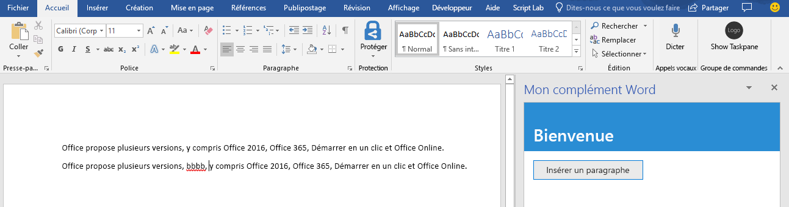
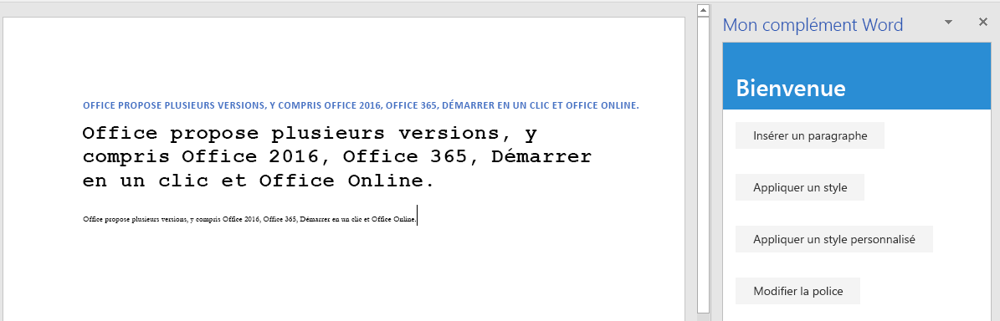
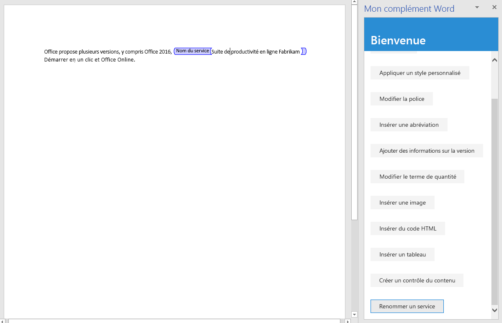

# <a name="tutorial-create-a-word-task-pane-add-in"></a><span data-ttu-id="65cc3-104">Didacticiel : Créer un complément de volet de tâches Word</span><span class="sxs-lookup"><span data-stu-id="65cc3-104">Create a dictionary task pane add-in</span></span>

<span data-ttu-id="65cc3-105">Dans ce tutoriel, vous allez créer un complément de volet de tâches Excel qui:</span><span class="sxs-lookup"><span data-stu-id="65cc3-105">In this tutorial, you'll create a Word task pane add-in that:</span></span>

> [!div class="checklist"]
> * <span data-ttu-id="65cc3-106">Insère une plage de texte</span><span class="sxs-lookup"><span data-stu-id="65cc3-106">Inserts a range of text</span></span>
> * <span data-ttu-id="65cc3-107">Formats de texte</span><span class="sxs-lookup"><span data-stu-id="65cc3-107">Formats text</span></span>
> * <span data-ttu-id="65cc3-108">Remplacer du texte et insérer du texte à divers emplacements</span><span class="sxs-lookup"><span data-stu-id="65cc3-108">Replace text and insert text in various locations</span></span>
> * <span data-ttu-id="65cc3-109">Insère des images, du code HTML et des tableaux</span><span class="sxs-lookup"><span data-stu-id="65cc3-109">Insert images, HTML, and tables</span></span>
> * <span data-ttu-id="65cc3-110">Crée et met à jour des contrôles de contenu</span><span class="sxs-lookup"><span data-stu-id="65cc3-110">Creates and updates content controls</span></span> 

## <a name="prerequisites"></a><span data-ttu-id="65cc3-111">Conditions requises</span><span class="sxs-lookup"><span data-stu-id="65cc3-111">Prerequisites</span></span>

<span data-ttu-id="65cc3-112">Pour utiliser ce didacticiel, les logiciels suivants doivent être installés.</span><span class="sxs-lookup"><span data-stu-id="65cc3-112">To use this tutorial, you need to have the following installed.</span></span> 

- <span data-ttu-id="65cc3-113">Word 2016, version 1711 (Démarrer en un clic version 8730.1000) ou version ultérieure.</span><span class="sxs-lookup"><span data-stu-id="65cc3-113">Word 2016, version 1711 (Build 8730.1000 Click-to-Run) or later.</span></span> <span data-ttu-id="65cc3-114">Vous devrez peut-être participer au programme Office Insider pour obtenir cette version.</span><span class="sxs-lookup"><span data-stu-id="65cc3-114">You might need to be an Office Insider to get this version.</span></span> <span data-ttu-id="65cc3-115">Pour plus d’informations, reportez-vous à [Participez au programme Office Insider](https://products.office.com/office-insider?tab=tab-1).</span><span class="sxs-lookup"><span data-stu-id="65cc3-115">For more information, see [Be an Office Insider](https://products.office.com/office-insider?tab=tab-1).</span></span>

- [<span data-ttu-id="65cc3-116">Node</span><span class="sxs-lookup"><span data-stu-id="65cc3-116">Node</span></span>](https://nodejs.org/en/) 

- <span data-ttu-id="65cc3-117">[Git Bash](https://git-scm.com/downloads) (ou un autre client Git)</span><span class="sxs-lookup"><span data-stu-id="65cc3-117">[Git Bash](https://git-scm.com/downloads) (or another Git client)</span></span>

## <a name="create-your-add-in-project"></a><span data-ttu-id="65cc3-118">Créer votre projet de complément</span><span class="sxs-lookup"><span data-stu-id="65cc3-118">Create your add-in project</span></span>

<span data-ttu-id="65cc3-119">Procédez comme suit pour créer le projet de complément Word que vous souhaitez utiliser comme base pour ce didacticiel.</span><span class="sxs-lookup"><span data-stu-id="65cc3-119">Complete the following steps to create the Word add-in project that you'll use as the basis for this tutorial.</span></span>

1. <span data-ttu-id="65cc3-120">Clonez le référentiel GitHub du [didacticiel sur les compléments Word](https://github.com/OfficeDev/Word-Add-in-Tutorial).</span><span class="sxs-lookup"><span data-stu-id="65cc3-120">Clone the GitHub repository [Word Add-in Tutorial](https://github.com/OfficeDev/Word-Add-in-Tutorial).</span></span>

2. <span data-ttu-id="65cc3-121">Ouvrez une fenêtre Git Bash, ou une invite système Node.JS, et accédez au dossier **Start** du projet.</span><span class="sxs-lookup"><span data-stu-id="65cc3-121">Open a Git bash window, or Node.JS-enabled system prompt, and navigate to the **Start** folder of the project.</span></span>

3. <span data-ttu-id="65cc3-122">Exécutez la commande `npm install` pour installer les outils et les bibliothèques répertoriées dans le fichier package.json.</span><span class="sxs-lookup"><span data-stu-id="65cc3-122">Run the command `npm install` to install the tools and libraries listed in the package.json file.</span></span> 

4. <span data-ttu-id="65cc3-123">Effectuez les étapes décrites dans la rubrique relative à l’[ajout de certificats auto-signés comme certificat racine approuvé](https://github.com/OfficeDev/generator-office/blob/master/src/docs/ssl.md) pour approuver le certificat pour le système d’exploitation de votre ordinateur de développement.</span><span class="sxs-lookup"><span data-stu-id="65cc3-123">Carry out the steps in [Adding Self-Signed Certificates as Trusted Root Certificate](https://github.com/OfficeDev/generator-office/blob/master/src/docs/ssl.md) to trust the certificate for your development computer's operating system.</span></span>

## <a name="insert-a-range-of-text"></a><span data-ttu-id="65cc3-124">Insérer une plage de texte</span><span class="sxs-lookup"><span data-stu-id="65cc3-124">Insert a range of cells</span></span>

<span data-ttu-id="65cc3-125">Dans cette étape du tutoriel, vous devez tester par programme que votre complément prend en charge la version actuelle de Word de l’utilisateur, puis insérer un paragraphe dans le document.</span><span class="sxs-lookup"><span data-stu-id="65cc3-125">In this step of the tutorial, you'll programmatically test that your add-in supports the user's current version of Word, and then insert a paragraph in the document.</span></span>

### <a name="code-the-add-in"></a><span data-ttu-id="65cc3-126">Codage du complément</span><span class="sxs-lookup"><span data-stu-id="65cc3-126">Code the add-in</span></span>

1. <span data-ttu-id="65cc3-127">Ouvrez le projet dans votre éditeur de code.</span><span class="sxs-lookup"><span data-stu-id="65cc3-127">Open the project in your code editor.</span></span>

2. <span data-ttu-id="65cc3-128">Ouvrez le fichier index.html.</span><span class="sxs-lookup"><span data-stu-id="65cc3-128">Open the file index.html.</span></span>

3. <span data-ttu-id="65cc3-129">Remplacez `TODO1` par le codage suivant :</span><span class="sxs-lookup"><span data-stu-id="65cc3-129">Replace the `TODO1` with the following markup:</span></span>

    ```html
    <button class="ms-Button" id="insert-paragraph">Insert Paragraph</button>
    ```

4. <span data-ttu-id="65cc3-130">Ouvrez le fichier app.js.</span><span class="sxs-lookup"><span data-stu-id="65cc3-130">Open the app.js file.</span></span>

5. <span data-ttu-id="65cc3-131">Remplacez `TODO1` par le code suivant.</span><span class="sxs-lookup"><span data-stu-id="65cc3-131">Replace the `TODO1` with the following code.</span></span> <span data-ttu-id="65cc3-132">Ce code détermine si la version de Word de l’utilisateur prend en charge une version de Word.js qui inclut toutes les API utilisées dans les étapes de ce didacticiel.</span><span class="sxs-lookup"><span data-stu-id="65cc3-132">This code determines whether the user's version of Word supports a version of Word.js that includes all the APIs that are used in all the stages of this tutorial.</span></span> <span data-ttu-id="65cc3-133">Dans un complément de production, utilisez le corps du bloc conditionnel pour masquer ou désactiver l’interface utilisateur appelant des API non prises en charge.</span><span class="sxs-lookup"><span data-stu-id="65cc3-133">In a production add-in, use the body of the conditional block to hide or disable the UI that would call unsupported APIs.</span></span> <span data-ttu-id="65cc3-134">Cela permet à l’utilisateur de toujours utiliser les parties du complément prises en charge par sa version d’Excel.</span><span class="sxs-lookup"><span data-stu-id="65cc3-134">This will enable the user to still use the parts of the add-in that are supported by their version of Word.</span></span>

    ```js
    if (!Office.context.requirements.isSetSupported('WordApi', 1.3)) {
        console.log('Sorry. The tutorial add-in uses Word.js APIs that are not available in your version of Office.');
    }
    ```

6. <span data-ttu-id="65cc3-135">Remplacez `TODO2` par le code suivant :</span><span class="sxs-lookup"><span data-stu-id="65cc3-135">Replace the `TODO2` with the following code:</span></span>

    ```js
    $('#insert-paragraph').click(insertParagraph);
    ```

7. <span data-ttu-id="65cc3-136">Remplacez `TODO3` par le code suivant.</span><span class="sxs-lookup"><span data-stu-id="65cc3-136">Replace the `TODO3` with the following code.</span></span> <span data-ttu-id="65cc3-137">Remarque:</span><span class="sxs-lookup"><span data-stu-id="65cc3-137">Note:</span></span>

   - <span data-ttu-id="65cc3-138">Votre logique métier Word.js est ajoutée à la fonction qui est transmise à `Word.run`.</span><span class="sxs-lookup"><span data-stu-id="65cc3-138">Your Word.js business logic will be added to the function that is passed to `Word.run`.</span></span> <span data-ttu-id="65cc3-139">Cette logique n’est pas exécutée immédiatement.</span><span class="sxs-lookup"><span data-stu-id="65cc3-139">This logic does not execute immediately.</span></span> <span data-ttu-id="65cc3-140">Au lieu de cela, elle est ajoutée à une file d’attente de commandes.</span><span class="sxs-lookup"><span data-stu-id="65cc3-140">Instead, it is added to a queue of pending commands.</span></span>

   - <span data-ttu-id="65cc3-141">La méthode `context.sync` envoie toutes les commandes en file d’attente vers Word pour exécution.</span><span class="sxs-lookup"><span data-stu-id="65cc3-141">The `context.sync` method sends all queued commands to Word for execution.</span></span>

   - <span data-ttu-id="65cc3-142">L’élément `Word.run` est suivi par un bloc `catch`.</span><span class="sxs-lookup"><span data-stu-id="65cc3-142">The `Word.run` is followed by a `catch` block.</span></span> <span data-ttu-id="65cc3-143">Il s’agit d’une meilleure pratique que vous devez toujours suivre.</span><span class="sxs-lookup"><span data-stu-id="65cc3-143">This is a best practice that you should always follow.</span></span> 

    ```js
    function insertParagraph() {
        Word.run(function (context) {

            // TODO4: Queue commands to insert a paragraph into the document.

            return context.sync();
        })
        .catch(function (error) {
            console.log("Error: " + error);
            if (error instanceof OfficeExtension.Error) {
                console.log("Debug info: " + JSON.stringify(error.debugInfo));
            }
        });
    }
    ```

8. <span data-ttu-id="65cc3-p107">Remplacez `TODO4` par le code suivant. Veuillez noter les informations suivantes :</span><span class="sxs-lookup"><span data-stu-id="65cc3-p107">Replace `TODO4` with the following code. Note:</span></span>

   - <span data-ttu-id="65cc3-146">Le premier paramètre de la méthode `insertParagraph` correspond au texte pour le nouveau paragraphe.</span><span class="sxs-lookup"><span data-stu-id="65cc3-146">The first parameter to the `insertParagraph` method is the text for the new paragraph.</span></span>

   - <span data-ttu-id="65cc3-147">Le deuxième paramètre correspond à l’emplacement dans le corps où sera inséré le paragraphe.</span><span class="sxs-lookup"><span data-stu-id="65cc3-147">The second parameter is the location within the body where the paragraph will be inserted.</span></span> <span data-ttu-id="65cc3-148">Les autres options d’insertion de paragraphe, lorsque l’objet parent est le corps, sont « Fin » et « Remplacer ».</span><span class="sxs-lookup"><span data-stu-id="65cc3-148">Other options for insert paragraph, when the parent object is the body, are "End" and "Replace".</span></span>

    ```js
    var docBody = context.document.body;
    docBody.insertParagraph("Office has several versions, including Office 2016, Office 365 Click-to-Run, and Office Online.",
                            "Start");
    ```

### <a name="test-the-add-in"></a><span data-ttu-id="65cc3-149">Test du complément</span><span class="sxs-lookup"><span data-stu-id="65cc3-149">Test the add-in</span></span>

1. <span data-ttu-id="65cc3-150">Ouvrez une fenêtre Git Bash, ou une invite système Node.JS, et accédez au dossier **Start** du projet.</span><span class="sxs-lookup"><span data-stu-id="65cc3-150">Open a Git bash window, or Node.JS-enabled system prompt, and navigate to the **Start** folder of the project.</span></span>

2. <span data-ttu-id="65cc3-151">Exécutez la commande `npm run build` afin de transpiler votre code source ES6 vers une version antérieure de JavaScript prise en charge par tous les hôtes sur lesquels les compléments Office peuvent être exécutés.</span><span class="sxs-lookup"><span data-stu-id="65cc3-151">Run the command `npm run build` to transpile your ES6 source code to an earlier version of JavaScript that is supported by all the hosts where Office Add-ins can run.</span></span>

3. <span data-ttu-id="65cc3-152">Exécutez la commande `npm start` pour démarrer un serveur web en cours d’exécution sur localhost.</span><span class="sxs-lookup"><span data-stu-id="65cc3-152">Run the command `npm start` to start a web server running on localhost.</span></span>

4. <span data-ttu-id="65cc3-153">Chargez une version test du complément en utilisant l’une des méthodes suivantes :</span><span class="sxs-lookup"><span data-stu-id="65cc3-153">Sideload the add-in by using one of the following methods:</span></span>

    - <span data-ttu-id="65cc3-154">Windows : [Chargement de version test des compléments Office sur Windows](../testing/create-a-network-shared-folder-catalog-for-task-pane-and-content-add-ins.md)</span><span class="sxs-lookup"><span data-stu-id="65cc3-154">Windows: [Sideload Office Add-ins on Windows](../testing/create-a-network-shared-folder-catalog-for-task-pane-and-content-add-ins.md)</span></span>

    - <span data-ttu-id="65cc3-155">Word Online : [Chargement d’une version test des compléments Office dans Office Online](../testing/sideload-office-add-ins-for-testing.md#sideload-an-office-add-in-in-office-online)</span><span class="sxs-lookup"><span data-stu-id="65cc3-155">Word Online: [Sideload Office Add-ins in Office Online](../testing/sideload-office-add-ins-for-testing.md#sideload-an-office-add-in-in-office-online)</span></span>

    - <span data-ttu-id="65cc3-156">iPad et Mac : [Chargement de version test des compléments Office sur iPad et Mac](../testing/sideload-an-office-add-in-on-ipad-and-mac.md)</span><span class="sxs-lookup"><span data-stu-id="65cc3-156">iPad and Mac: [Sideload Office Add-ins on iPad and Mac](../testing/sideload-an-office-add-in-on-ipad-and-mac.md)</span></span>

5. <span data-ttu-id="65cc3-157">Dans le menu **Accueil** de Word, sélectionnez **Afficher le volet des tâches**.</span><span class="sxs-lookup"><span data-stu-id="65cc3-157">On the **Home** menu of Word, select **Show Taskpane**.</span></span>

6. <span data-ttu-id="65cc3-158">Dans le volet Office, sélectionnez **Insérer un paragraphe**.</span><span class="sxs-lookup"><span data-stu-id="65cc3-158">In the task pane, choose **Insert Paragraph**.</span></span>

7. <span data-ttu-id="65cc3-159">Apportez une modification au paragraphe.</span><span class="sxs-lookup"><span data-stu-id="65cc3-159">Make a change in the paragraph.</span></span>

8. <span data-ttu-id="65cc3-160">Sélectionnez à nouveau **Insérer un paragraphe**.</span><span class="sxs-lookup"><span data-stu-id="65cc3-160">Choose **Insert Paragraph** again.</span></span> <span data-ttu-id="65cc3-161">Notez que le nouveau paragraphe se trouve au-dessus du précédent, car la méthode `insertParagraph` effectue l’insertion au « début » du corps du document.</span><span class="sxs-lookup"><span data-stu-id="65cc3-161">Note that the new paragraph is above the previous one because the `insertParagraph` method is inserting at the "start" of the document's body.</span></span>

    

## <a name="format-text"></a><span data-ttu-id="65cc3-163">Mettre en forme du texte</span><span class="sxs-lookup"><span data-stu-id="65cc3-163">Format text</span></span>

<span data-ttu-id="65cc3-164">Dans cette étape du didacticiel, vous devez appliquer un style intégré au texte, appliquer un style personnalisé à texte et modifier la police du texte.</span><span class="sxs-lookup"><span data-stu-id="65cc3-164">In this step of the tutorial, you'll apply a built-in style to text, apply a custom style to text, and change the font of text.</span></span>

### <a name="apply-a-built-in-style-to-text"></a><span data-ttu-id="65cc3-165">Appliquer un style prédéfini au texte</span><span class="sxs-lookup"><span data-stu-id="65cc3-165">Apply a built-in style to text</span></span>

1. <span data-ttu-id="65cc3-166">Ouvrez le projet dans votre éditeur de code.</span><span class="sxs-lookup"><span data-stu-id="65cc3-166">Open the project in your code editor.</span></span> 

2. <span data-ttu-id="65cc3-167">Ouvrez le fichier index.html.</span><span class="sxs-lookup"><span data-stu-id="65cc3-167">Open the file index.html.</span></span>

3. <span data-ttu-id="65cc3-168">Juste en dessous de la balise `div` qui contient le bouton `insert-paragraph`, ajoutez le balisage suivant :</span><span class="sxs-lookup"><span data-stu-id="65cc3-168">Just below the `div` that contains the `insert-paragraph` button, add the following markup:</span></span>

    ```html
    <div class="padding">            
        <button class="ms-Button" id="apply-style">Apply Style</button>            
    </div>
    ```

4. <span data-ttu-id="65cc3-169">Ouvrez le fichier app.js.</span><span class="sxs-lookup"><span data-stu-id="65cc3-169">Open the app.js file.</span></span>

5. <span data-ttu-id="65cc3-170">Juste en dessous de la ligne qui attribue un gestionnaire de clic au bouton `insert-paragraph`, ajoutez le code suivant :</span><span class="sxs-lookup"><span data-stu-id="65cc3-170">Just below the line that assigns a click handler to the `insert-paragraph` button, add the following code:</span></span>

    ```js
    $('#apply-style').click(applyStyle);
    ```

6. <span data-ttu-id="65cc3-171">Ajoutez la fonction suivante juste après la fonction `insertParagraph` :</span><span class="sxs-lookup"><span data-stu-id="65cc3-171">Just below the `insertParagraph` function, add the following function:</span></span>

    ```js
    function applyStyle() {
        Word.run(function (context) {
            
            // TODO1: Queue commands to style text.

            return context.sync();
        })
        .catch(function (error) {
            console.log("Error: " + error);
            if (error instanceof OfficeExtension.Error) {
                console.log("Debug info: " + JSON.stringify(error.debugInfo));
            }
        });
    }
    ``` 

7. <span data-ttu-id="65cc3-172">Remplacez `TODO1` par le code suivant.</span><span class="sxs-lookup"><span data-stu-id="65cc3-172">Replace `TODO1` with the following code.</span></span> <span data-ttu-id="65cc3-173">Le code applique un style à un paragraphe, mais les styles peuvent également être appliqués aux plages de texte.</span><span class="sxs-lookup"><span data-stu-id="65cc3-173">Note that the code applies a style to a paragraph, but styles can also be applied to ranges of text.</span></span>

    ```js
    var firstParagraph = context.document.body.paragraphs.getFirst();
    firstParagraph.styleBuiltIn = Word.Style.intenseReference;
    ``` 

### <a name="apply-a-custom-style-to-text"></a><span data-ttu-id="65cc3-174">Appliquer un style personnalisé au texte</span><span class="sxs-lookup"><span data-stu-id="65cc3-174">Apply a custom style to text</span></span>

1. <span data-ttu-id="65cc3-175">Ouvrez le fichier index.html.</span><span class="sxs-lookup"><span data-stu-id="65cc3-175">Open the file index.html.</span></span>

2. <span data-ttu-id="65cc3-176">En dessous de la balise `div` qui contient le bouton `apply-style`, ajoutez le balisage suivant :</span><span class="sxs-lookup"><span data-stu-id="65cc3-176">Below the `div` that contains the `apply-style` button, add the following markup:</span></span>

    ```html
    <div class="padding">            
        <button class="ms-Button" id="apply-custom-style">Apply Custom Style</button>            
    </div>
    ```

3. <span data-ttu-id="65cc3-177">Ouvrez le fichier app.js.</span><span class="sxs-lookup"><span data-stu-id="65cc3-177">Open the app.js file.</span></span>

4. <span data-ttu-id="65cc3-178">Sous la ligne qui attribue un gestionnaire de clics au bouton `apply-style`, ajoutez le code suivant :</span><span class="sxs-lookup"><span data-stu-id="65cc3-178">Below the line that assigns a click handler to the `apply-style` button, add the following code:</span></span>

    ```js
    $('#apply-custom-style').click(applyCustomStyle);
    ```

5. <span data-ttu-id="65cc3-179">Sous la fonction `applyStyle`, ajoutez la fonction suivante :</span><span class="sxs-lookup"><span data-stu-id="65cc3-179">Below the `applyStyle` function, add the following function:</span></span>

    ```js
    function applyCustomStyle() {
        Word.run(function (context) {
            
            // TODO1: Queue commands to apply the custom style.

            return context.sync();
        })
        .catch(function (error) {
            console.log("Error: " + error);
            if (error instanceof OfficeExtension.Error) {
                console.log("Debug info: " + JSON.stringify(error.debugInfo));
            }
        });
    }
    ``` 

6. <span data-ttu-id="65cc3-180">Remplacez `TODO1` par le code suivant.</span><span class="sxs-lookup"><span data-stu-id="65cc3-180">Replace `TODO1` with the following code.</span></span> <span data-ttu-id="65cc3-181">Le code applique un style personnalisé qui n’existe pas encore.</span><span class="sxs-lookup"><span data-stu-id="65cc3-181">Note that the code applies a custom style that does not exist yet.</span></span> <span data-ttu-id="65cc3-182">Vous allez créer un style nommé **MyCustomStyle** lors de l’étape [Test du complément](#test-the-add-in).</span><span class="sxs-lookup"><span data-stu-id="65cc3-182">You'll create a style with the name **MyCustomStyle** in the [Test the add-in](#test-the-add-in) step.</span></span>

    ```js
    var lastParagraph = context.document.body.paragraphs.getLast();
    lastParagraph.style = "MyCustomStyle";
    ``` 

### <a name="change-the-font-of-text"></a><span data-ttu-id="65cc3-183">Modifier la police du texte</span><span class="sxs-lookup"><span data-stu-id="65cc3-183">Change the font of text</span></span>

1. <span data-ttu-id="65cc3-184">Ouvrez le fichier index.html.</span><span class="sxs-lookup"><span data-stu-id="65cc3-184">Open the file index.html.</span></span>

2. <span data-ttu-id="65cc3-185">En dessous de la balise `div` qui contient le bouton `apply-custom-style`, ajoutez le balisage suivant :</span><span class="sxs-lookup"><span data-stu-id="65cc3-185">Below the `div` that contains the `apply-custom-style` button, add the following markup:</span></span>

    ```html
    <div class="padding">            
        <button class="ms-Button" id="change-font">Change Font</button>            
    </div>
    ```

3. <span data-ttu-id="65cc3-186">Ouvrez le fichier app.js.</span><span class="sxs-lookup"><span data-stu-id="65cc3-186">Open the app.js file.</span></span>

4. <span data-ttu-id="65cc3-187">Sous la ligne qui attribue un gestionnaire de clics au bouton `apply-custom-style`, ajoutez le code suivant :</span><span class="sxs-lookup"><span data-stu-id="65cc3-187">Below the line that assigns a click handler to the `apply-custom-style` button, add the following code:</span></span>

    ```js
    $('#change-font').click(changeFont);
    ```

5. <span data-ttu-id="65cc3-188">Sous la fonction `applyCustomStyle`, ajoutez la fonction suivante :</span><span class="sxs-lookup"><span data-stu-id="65cc3-188">Below the `applyCustomStyle` function, add the following function:</span></span>

    ```js
    function changeFont() {
        Word.run(function (context) {
            
            // TODO1: Queue commands to apply a different font.

            return context.sync();
        })
        .catch(function (error) {
            console.log("Error: " + error);
            if (error instanceof OfficeExtension.Error) {
                console.log("Debug info: " + JSON.stringify(error.debugInfo));
            }
        });
    }
    ``` 

6. <span data-ttu-id="65cc3-189">Remplacez `TODO1` par le code suivant.</span><span class="sxs-lookup"><span data-stu-id="65cc3-189">Replace `TODO1` with the following code.</span></span> <span data-ttu-id="65cc3-190">Le code obtient une référence au deuxième paragraphe en utilisant la méthode `ParagraphCollection.getFirst` chaînée à la méthode `Paragraph.getNext`.</span><span class="sxs-lookup"><span data-stu-id="65cc3-190">Note that the code gets a reference to the second paragraph by using the `ParagraphCollection.getFirst` method chained to the `Paragraph.getNext` method.</span></span>

    ```js
    var secondParagraph = context.document.body.paragraphs.getFirst().getNext();
    secondParagraph.font.set({
            name: "Courier New",
            bold: true,
            size: 18
        });
    ``` 

### <a name="test-the-add-in"></a><span data-ttu-id="65cc3-191">Test du complément</span><span class="sxs-lookup"><span data-stu-id="65cc3-191">Test the add-in</span></span>

1. <span data-ttu-id="65cc3-192">Si la fenêtre Git Bash, ou l’invite système Node.JS, de l’étape précédente du didacticiel est encore ouverte, appuyez sur Ctrl+C à deux reprises pour arrêter le serveur web en cours d’exécution.</span><span class="sxs-lookup"><span data-stu-id="65cc3-192">If the Git bash window, or Node.JS-enabled system prompt, from the previous stage tutorial is still open, enter Ctrl+C twice to stop the running web server.</span></span> <span data-ttu-id="65cc3-193">Sinon, ouvrez une fenêtre Git Bash, ou une invite système Node.JS, et accédez au dossier **Start** du projet.</span><span class="sxs-lookup"><span data-stu-id="65cc3-193">Otherwise, open a Git bash window, or Node.JS-enabled system prompt, and navigate to the **Start** folder of the project.</span></span>

     > [!NOTE]
     > <span data-ttu-id="65cc3-194">Bien que le serveur synchronisé au navigateur recharge votre complément dans le volet Office chaque fois que vous apportez une modification à un fichier, y compris le fichier app.js, il ne retranspile pas le code JavaScript. Vous devez donc de nouveau utiliser la commande build afin que les modifications apportées à app.js prennent effet.</span><span class="sxs-lookup"><span data-stu-id="65cc3-194">Although the browser-sync server reloads your add-in in the task pane every time you make a change to any file, including the app.js file, it does not retranspile the JavaScript, so you must repeat the build command in order for your changes to app.js to take effect.</span></span> <span data-ttu-id="65cc3-195">Pour ce faire, vous devez arrêter le processus du serveur pour pouvoir obtenir une invite et saisir la commande build.</span><span class="sxs-lookup"><span data-stu-id="65cc3-195">In order to do this, you need to kill the server process so that the prompt appears and you can enter the build command.</span></span> <span data-ttu-id="65cc3-196">Après la commande build, redémarrez le serveur.</span><span class="sxs-lookup"><span data-stu-id="65cc3-196">After the build, you restart the server.</span></span> <span data-ttu-id="65cc3-197">Les prochaines étapes vous permettent d’effectuer ce processus.</span><span class="sxs-lookup"><span data-stu-id="65cc3-197">The next few steps carry out this process.</span></span>

2. <span data-ttu-id="65cc3-198">Exécutez la commande `npm run build` afin de transpiler votre code source ES6 vers une version antérieure de JavaScript prise en charge par tous les hôtes sur lesquels les compléments Office peuvent être exécutés.</span><span class="sxs-lookup"><span data-stu-id="65cc3-198">Run the command `npm run build` to transpile your ES6 source code to an earlier version of JavaScript that is supported by all the hosts where Office Add-ins can run.</span></span>

3. <span data-ttu-id="65cc3-199">Exécutez la commande `npm start` pour démarrer un serveur web en cours d’exécution sur localhost.</span><span class="sxs-lookup"><span data-stu-id="65cc3-199">Run the command `npm start` to start a web server running on localhost.</span></span>   

4. <span data-ttu-id="65cc3-200">Rechargez le volet des tâches en le fermant, puis dans le menu **Accueil**, sélectionnez **Afficher le volet des tâches** pour rouvrir le complément.</span><span class="sxs-lookup"><span data-stu-id="65cc3-200">Reload the task pane by closing it, and then on the **Home** menu select **Show Taskpane** to reopen the add-in.</span></span>

5. <span data-ttu-id="65cc3-201">Assurez-vous qu’il existe au moins trois paragraphes dans le document.</span><span class="sxs-lookup"><span data-stu-id="65cc3-201">Be sure there are at least three paragraphs in the document.</span></span> <span data-ttu-id="65cc3-202">Vous pouvez sélectionner trois fois l’option **Insérer un paragraphe**.</span><span class="sxs-lookup"><span data-stu-id="65cc3-202">You can choose **Insert Paragraph** three times.</span></span> <span data-ttu-id="65cc3-203">*Vérifiez attentivement qu’aucun paragraphe vide n’apparaît à la fin du document. S’il y en a un, supprimez-le.*</span><span class="sxs-lookup"><span data-stu-id="65cc3-203">*Check carefully that there's no blank paragraph at the end of the document. If there is, delete it.*</span></span>

6. <span data-ttu-id="65cc3-204">Dans Word, créez un style personnalisé nommé « MyCustomStyle ».</span><span class="sxs-lookup"><span data-stu-id="65cc3-204">In Word, create a custom style named "MyCustomStyle".</span></span> <span data-ttu-id="65cc3-205">Vous pouvez y appliquer la mise en forme que vous souhaitez.</span><span class="sxs-lookup"><span data-stu-id="65cc3-205">It can have any formatting that you want.</span></span>

7. <span data-ttu-id="65cc3-206">Sélectionnez le bouton **Appliquer le style**.</span><span class="sxs-lookup"><span data-stu-id="65cc3-206">Choose the **Apply Style** button.</span></span> <span data-ttu-id="65cc3-207">Le style prédéfini **Référence intense** est appliqué au premier paragraphe.</span><span class="sxs-lookup"><span data-stu-id="65cc3-207">The first paragraph will be styled with the built-in style **Intense Reference**.</span></span>

8. <span data-ttu-id="65cc3-208">Sélectionnez le bouton **Appliquer un style personnalisé**.</span><span class="sxs-lookup"><span data-stu-id="65cc3-208">Choose the **Apply Custom Style** button.</span></span> <span data-ttu-id="65cc3-209">Votre style personnalisé est appliqué au dernier paragraphe.</span><span class="sxs-lookup"><span data-stu-id="65cc3-209">The last paragraph will be styled with your custom style.</span></span> <span data-ttu-id="65cc3-210">(Si rien ne semble se produire, le dernier paragraphe est peut-être vide.</span><span class="sxs-lookup"><span data-stu-id="65cc3-210">(If nothing seems to happen, the last paragraph might be blank.</span></span> <span data-ttu-id="65cc3-211">Si c’est le cas, ajoutez-y du texte.)</span><span class="sxs-lookup"><span data-stu-id="65cc3-211">If so, add some text to it.)</span></span>

9. <span data-ttu-id="65cc3-212">Sélectionnez le bouton **Modifier la police**.</span><span class="sxs-lookup"><span data-stu-id="65cc3-212">Choose the **Change Font** button.</span></span> <span data-ttu-id="65cc3-213">La police Courier New, 18 pt, en gras, est appliquée au deuxième paragraphe.</span><span class="sxs-lookup"><span data-stu-id="65cc3-213">The font of the second paragraph changes to 18 pt., bold, Courier New.</span></span>

    

## <a name="replace-text-and-insert-text"></a><span data-ttu-id="65cc3-215">Remplacer du texte et insérer du texte</span><span class="sxs-lookup"><span data-stu-id="65cc3-215">Replace text and insert text in various locations</span></span>

<span data-ttu-id="65cc3-216">Dans cette étape du didacticiel, vous ajouterez du texte dans les plages de texte sélectionnées et en dehors de celles-ci, puis remplacerez le texte de la plage sélectionnée.</span><span class="sxs-lookup"><span data-stu-id="65cc3-216">In this step of the tutorial, you'll add text inside and outside of selected ranges of text, and replace the text of a selected range.</span></span>

### <a name="add-text-inside-a-range"></a><span data-ttu-id="65cc3-217">Ajouter du texte dans une plage</span><span class="sxs-lookup"><span data-stu-id="65cc3-217">Add text inside a range</span></span>

1. <span data-ttu-id="65cc3-218">Ouvrez le projet dans votre éditeur de code.</span><span class="sxs-lookup"><span data-stu-id="65cc3-218">Open the project in your code editor.</span></span>

2. <span data-ttu-id="65cc3-219">Ouvrez le fichier index.html.</span><span class="sxs-lookup"><span data-stu-id="65cc3-219">Open the file index.html.</span></span>

3. <span data-ttu-id="65cc3-220">En dessous de la balise `div` qui contient le bouton `change-font`, ajoutez le balisage suivant :</span><span class="sxs-lookup"><span data-stu-id="65cc3-220">Below the `div` that contains the `change-font` button, add the following markup:</span></span>

    ```html
    <div class="padding">
        <button class="ms-Button" id="insert-text-into-range">Insert Abbreviation</button>
    </div>
    ```

4. <span data-ttu-id="65cc3-221">Ouvrez le fichier app.js.</span><span class="sxs-lookup"><span data-stu-id="65cc3-221">Open the app.js file.</span></span>

5. <span data-ttu-id="65cc3-222">Sous la ligne qui attribue un gestionnaire de clics au bouton `change-font`, ajoutez le code suivant :</span><span class="sxs-lookup"><span data-stu-id="65cc3-222">Below the line that assigns a click handler to the `change-font` button, add the following code:</span></span>

    ```js
    $('#insert-text-into-range').click(insertTextIntoRange);
    ```

6. <span data-ttu-id="65cc3-223">Sous la fonction `changeFont`, ajoutez la fonction suivante :</span><span class="sxs-lookup"><span data-stu-id="65cc3-223">Below the `changeFont` function, add the following function:</span></span>

    ```js
    function insertTextIntoRange() {
        Word.run(function (context) {

            // TODO1: Queue commands to insert text into a selected range.

            // TODO2: Load the text of the range and sync so that the
            //        current range text can be read.

            // TODO3: Queue commands to repeat the text of the original
            //        range at the end of the document.

            return context.sync();
        })
        .catch(function (error) {
            console.log("Error: " + error);
            if (error instanceof OfficeExtension.Error) {
                console.log("Debug info: " + JSON.stringify(error.debugInfo));
            }
        });
    }
    ``` 

7. <span data-ttu-id="65cc3-p120">Remplacez `TODO1` par le code suivant. Tenez compte des informations suivantes :</span><span class="sxs-lookup"><span data-stu-id="65cc3-p120">Replace `TODO1` with the following code. Note:</span></span>

   - <span data-ttu-id="65cc3-226">La méthode est destinée à insérer l’abréviation [« (C2R) »] à la fin de la plage dont le texte est « Click-to-Run » (Démarrer en un clic).</span><span class="sxs-lookup"><span data-stu-id="65cc3-226">The method is intended to insert the abbreviation ["(C2R)"] into the end of the Range whose text is "Click-to-Run".</span></span> <span data-ttu-id="65cc3-227">Cela permet d’émettre une hypothèse simplifiée selon laquelle la chaîne est présente et l’utilisateur l’a sélectionnée.</span><span class="sxs-lookup"><span data-stu-id="65cc3-227">It makes a simplifying assumption that the string is present and the user has selected it.</span></span>

   - <span data-ttu-id="65cc3-228">Le premier paramètre de la méthode `Range.insertText` correspond à la chaîne à insérer dans l’objet `Range`.</span><span class="sxs-lookup"><span data-stu-id="65cc3-228">The first parameter of the `Range.insertText` method is the string to insert into the `Range` object.</span></span>

   - <span data-ttu-id="65cc3-229">Le deuxième paramètre spécifie l’emplacement où le texte supplémentaire doit être inséré dans la plage.</span><span class="sxs-lookup"><span data-stu-id="65cc3-229">The second parameter specifies where in the range the additional text should be inserted.</span></span> <span data-ttu-id="65cc3-230">Outre « Fin », les autres options possibles sont : « Début », « Avant », « Après » et « Remplacer ».</span><span class="sxs-lookup"><span data-stu-id="65cc3-230">Besides "End", the other possible options are "Start", "Before", "After", and "Replace".</span></span> 

   - <span data-ttu-id="65cc3-231">La différence entre « Fin » et « Après » est que « Fin » insère le nouveau texte à la fin de la plage existante, tandis que l’option « Après » crée une plage avec la chaîne et insère la nouvelle plage après la plage existante.</span><span class="sxs-lookup"><span data-stu-id="65cc3-231">The difference between "End" and "After" is that "End" inserts the new text inside the end of the existing range, but "After" creates a new range with the string and inserts the new range after the existing range.</span></span> <span data-ttu-id="65cc3-232">De même, « Début » insère le texte au début de la plage existante, tandis que l’option « Avant » insère une nouvelle plage.</span><span class="sxs-lookup"><span data-stu-id="65cc3-232">Similarly, "Start" inserts text inside the beginning of the existing range and "Before" inserts a new range.</span></span> <span data-ttu-id="65cc3-233">L’option « Remplacer » remplace le texte de la plage existante par la chaîne dans le premier paramètre.</span><span class="sxs-lookup"><span data-stu-id="65cc3-233">"Replace" replaces the text of the existing range with the string in the first parameter.</span></span>

   - <span data-ttu-id="65cc3-234">Vous avez vu lors d’une étape précédente du didacticiel que les méthodes insert\* de l’objet corps ne disposent pas des options « Avant » et « Après ».</span><span class="sxs-lookup"><span data-stu-id="65cc3-234">You saw in an earlier stage of the tutorial that the insert\* methods of the body object do not have the "Before" and "After" options.</span></span> <span data-ttu-id="65cc3-235">Cela est dû au fait que vous ne pouvez pas placer de contenu en dehors du corps du document.</span><span class="sxs-lookup"><span data-stu-id="65cc3-235">This is because you can't put content outside of the document's body.</span></span>

    ```js
    var doc = context.document;
    var originalRange = doc.getSelection();
    originalRange.insertText(" (C2R)", "End");
    ```

8. <span data-ttu-id="65cc3-236">Nous ignorerons `TODO2` jusqu’à la section suivante.</span><span class="sxs-lookup"><span data-stu-id="65cc3-236">We'll skip over `TODO2` until the next section.</span></span> <span data-ttu-id="65cc3-237">Remplacez `TODO3` par le code suivant.</span><span class="sxs-lookup"><span data-stu-id="65cc3-237">Replace `TODO3` with the following code.</span></span> <span data-ttu-id="65cc3-238">Ce code est similaire au code que vous avez créé lors de la première phase du didacticiel, sauf que, maintenant, vous insérez un nouveau paragraphe à la fin du document plutôt qu’au début.</span><span class="sxs-lookup"><span data-stu-id="65cc3-238">This code is similar to the code you created in the first stage of the tutorial, except that now you are inserting a new paragraph at the end of the document instead of at the start.</span></span> <span data-ttu-id="65cc3-239">Ce nouveau paragraphe montre que le nouveau texte fait désormais partie de la plage d’origine.</span><span class="sxs-lookup"><span data-stu-id="65cc3-239">This new paragraph will demonstrate that the new text is now part of the original range.</span></span>

    ```js
    doc.body.insertParagraph("Original range: " + originalRange.text, "End");
    ```

### <a name="add-code-to-fetch-document-properties-into-the-task-panes-script-objects"></a><span data-ttu-id="65cc3-240">Ajouter du code pour récupérer des propriétés de document dans les objets de script du volet Office</span><span class="sxs-lookup"><span data-stu-id="65cc3-240">Add code to fetch document properties into the task pane's script objects</span></span>

<span data-ttu-id="65cc3-241">Dans toutes les fonctions précédentes de cette série de didacticiels, vous avez mis en file d’attente des commandes pour écrire (*write*) dans le document Office.</span><span class="sxs-lookup"><span data-stu-id="65cc3-241">In all the previous functions in this series of tutorials, you queued commands to *write* to the Office document.</span></span> <span data-ttu-id="65cc3-242">Chaque fonction se terminait par un appel de la méthode `context.sync()` qui envoie les commandes en file d’attente au document pour qu’elles soient exécutées.</span><span class="sxs-lookup"><span data-stu-id="65cc3-242">Each function ended with a call to the `context.sync()` method which sends the queued commands to the document to be executed.</span></span> <span data-ttu-id="65cc3-243">Cependant, le code que vous avez ajouté dans la dernière étape appelle la propriété `originalRange.text` et c’est une différence significative par rapport aux fonctions antérieures que vous avez écrites, car l’objet `originalRange` est uniquement un objet de proxy qui existe dans le script de votre volet Office.</span><span class="sxs-lookup"><span data-stu-id="65cc3-243">But the code you added in the last step calls the `originalRange.text` property, and this is a significant difference from the earlier functions you wrote, because the `originalRange` object is only a proxy object that exists in your task pane's script.</span></span> <span data-ttu-id="65cc3-244">Il ne connaît pas le texte réel de la plage dans le document, donc sa propriété `text` ne peut pas contenir de valeur réelle.</span><span class="sxs-lookup"><span data-stu-id="65cc3-244">It doesn't know what the actual text of the range in the document is, so its `text` property can't have a real value.</span></span> <span data-ttu-id="65cc3-245">Il est nécessaire de récupérer d’abord la valeur de texte de la plage à partir du document, puis de l’utiliser pour définir la valeur de `originalRange.text`.</span><span class="sxs-lookup"><span data-stu-id="65cc3-245">It is necessary to first fetch the text value of the range from the document and use it to set the value of `originalRange.text`.</span></span> <span data-ttu-id="65cc3-246">Seulement ensuite, la propriété `originalRange.text` peut être appelée sans générer d’exception.</span><span class="sxs-lookup"><span data-stu-id="65cc3-246">Only then can `originalRange.text` be called without causing an exception to be thrown.</span></span> <span data-ttu-id="65cc3-247">Ce processus de récupération comporte trois étapes :</span><span class="sxs-lookup"><span data-stu-id="65cc3-247">This fetching process has three steps:</span></span>

   1. <span data-ttu-id="65cc3-248">Mettez en file d’attente une commande de chargement (c’est-à-dire, fetch) des propriétés que votre code doit lire.</span><span class="sxs-lookup"><span data-stu-id="65cc3-248">Queue a command to load (that is; fetch) the properties that your code needs to read.</span></span>

   2. <span data-ttu-id="65cc3-249">Appelez la méthode `sync` de l’objet de contexte pour envoyer la commande mise en file d’attente vers le document pour exécution, et renvoyez les informations demandées.</span><span class="sxs-lookup"><span data-stu-id="65cc3-249">Call the context object's `sync` method to send the queued command to the document for execution and return the requested information.</span></span>

   3. <span data-ttu-id="65cc3-250">Étant donné que la méthode `sync` est asynchrone, assurez-vous qu’elle est terminée avant que votre code appelle les propriétés qui ont été récupérées.</span><span class="sxs-lookup"><span data-stu-id="65cc3-250">Because the `sync` method is asynchronous, ensure that it has completed before your code calls the properties that were fetched.</span></span>

<span data-ttu-id="65cc3-251">Ces étapes doivent être effectuées à chaque fois que votre code doit lire (*read*) des informations provenant du document Office.</span><span class="sxs-lookup"><span data-stu-id="65cc3-251">These steps must be completed whenever your code needs to *read* information from the Office document.</span></span>

1. <span data-ttu-id="65cc3-252">Remplacez `TODO2` par le code suivant.</span><span class="sxs-lookup"><span data-stu-id="65cc3-252">Replace `TODO2` with the following code.</span></span>
  
    ```js
    originalRange.load("text");
    return context.sync()
        .then(function() {

                // TODO4: Move the doc.body.insertParagraph line here.

            }
        )
            // TODO5: Move the final call of context.sync here and ensure
            //        that it does not run until the insertParagraph has
            //        been queued.
    ```

2. <span data-ttu-id="65cc3-p127">Il est impossible que deux instructions `return` se trouvent dans le même chemin de code, supprimez donc la dernière ligne `return context.sync();` à la fin de la fonction `Word.run`. Vous ajouterez une nouvelle ligne finale `context.sync` par la suite dans ce didacticiel.</span><span class="sxs-lookup"><span data-stu-id="65cc3-p127">You can't have two `return` statements in the same unbranching code path, so delete the final line `return context.sync();` at the end of the `Word.run`. You'll add a new final `context.sync` later in this tutorial.</span></span>

3. <span data-ttu-id="65cc3-255">Coupez la ligne `doc.body.insertParagraph` et collez-la à la place de `TODO4`.</span><span class="sxs-lookup"><span data-stu-id="65cc3-255">Cut the `doc.body.insertParagraph` line and paste in place of `TODO4`.</span></span>

4. <span data-ttu-id="65cc3-p128">Remplacez `TODO5` par le code suivant. Remarque :</span><span class="sxs-lookup"><span data-stu-id="65cc3-p128">Replace `TODO5` with the following code. Note:</span></span>

   - <span data-ttu-id="65cc3-258">Le fait de transmettre la méthode `sync` à une fonction `then` permet de s’assurer qu’elle n’est pas exécutée tant que la logique `insertParagraph` n’a pas été mise en file d’attente.</span><span class="sxs-lookup"><span data-stu-id="65cc3-258">Passing the `sync` method to a `then` function ensures that it does not run until the `insertParagraph` logic has been queued.</span></span>

   - <span data-ttu-id="65cc3-259">La méthode `then` appelle n’importe quelle fonction qui lui est transmise, et vous ne souhaitez pas appeler `sync` deux fois, donc omettez les parenthèses « () » à la fin de context.sync.</span><span class="sxs-lookup"><span data-stu-id="65cc3-259">The `then` method invokes whatever function is passed to it, and you don't want `sync` to be invoked twice, so leave off the "()" from the end of context.sync.</span></span>

    ```js
    .then(context.sync);
    ```

<span data-ttu-id="65cc3-260">Lorsque vous avez terminé, la fonction entière doit ressembler à ce qui suit :</span><span class="sxs-lookup"><span data-stu-id="65cc3-260">When you are done, the entire function should look like the following:</span></span>

```js
function insertTextIntoRange() {
    Word.run(function (context) {

        var doc = context.document;
        var originalRange = doc.getSelection();
        originalRange.insertText(" (C2R)", "End");

        originalRange.load("text");
        return context.sync()
            .then(function() {
                        doc.body.insertParagraph("Current text of original range: " + originalRange.text,
                                                "End");
                }
            )
            .then(context.sync);
    })
    .catch(function (error) {
        console.log("Error: " + error);
        if (error instanceof OfficeExtension.Error) {
            console.log("Debug info: " + JSON.stringify(error.debugInfo));
        }
    });
}
```

### <a name="add-text-between-ranges"></a><span data-ttu-id="65cc3-261">Ajouter du texte entre les plages</span><span class="sxs-lookup"><span data-stu-id="65cc3-261">Add text between ranges</span></span>

1. <span data-ttu-id="65cc3-262">Ouvrez le fichier index.html.</span><span class="sxs-lookup"><span data-stu-id="65cc3-262">Open the file index.html.</span></span>

2. <span data-ttu-id="65cc3-263">En dessous de la balise `div` qui contient le bouton `insert-text-into-range`, ajoutez le balisage suivant :</span><span class="sxs-lookup"><span data-stu-id="65cc3-263">Below the `div` that contains the `insert-text-into-range` button, add the following markup:</span></span>

    ```html
    <div class="padding">
        <button class="ms-Button" id="insert-text-outside-range">Add Version Info</button>
    </div>
    ```

3. <span data-ttu-id="65cc3-264">Ouvrez le fichier app.js.</span><span class="sxs-lookup"><span data-stu-id="65cc3-264">Open the app.js file.</span></span>

4. <span data-ttu-id="65cc3-265">Sous la ligne qui attribue un gestionnaire de clics au bouton `insert-text-into-range`, ajoutez le code suivant :</span><span class="sxs-lookup"><span data-stu-id="65cc3-265">Below the line that assigns a click handler to the `insert-text-into-range` button, add the following code:</span></span>

    ```js
    $('#insert-text-outside-range').click(insertTextBeforeRange);
    ```

5. <span data-ttu-id="65cc3-266">Sous la fonction `insertTextIntoRange`, ajoutez la fonction suivante :</span><span class="sxs-lookup"><span data-stu-id="65cc3-266">Below the `insertTextIntoRange` function, add the following function:</span></span>

    ```js
    function insertTextBeforeRange() {
        Word.run(function (context) {

            // TODO1: Queue commands to insert a new range before the
            //        selected range.

            // TODO2: Load the text of the original range and sync so that the
            //        range text can be read and inserted.

        })
        .catch(function (error) {
            console.log("Error: " + error);
            if (error instanceof OfficeExtension.Error) {
                console.log("Debug info: " + JSON.stringify(error.debugInfo));
            }
        });
    }
    ```

6. <span data-ttu-id="65cc3-p129">Remplacez `TODO1` par le code suivant. Tenez compte des informations suivantes :</span><span class="sxs-lookup"><span data-stu-id="65cc3-p129">Replace `TODO1` with the following code. Note:</span></span>

   - <span data-ttu-id="65cc3-269">La méthode est destinée à ajouter une plage dont le texte est « Office 2019 », avant la plage contenant le texte « Office 365 ».</span><span class="sxs-lookup"><span data-stu-id="65cc3-269">The method is intended to add a range whose text is "Office 2019, " before the range with text "Office 365".</span></span> <span data-ttu-id="65cc3-270">Cela permet d’émettre une hypothèse simplifiée selon laquelle la chaîne est présente et l’utilisateur l’a sélectionnée.</span><span class="sxs-lookup"><span data-stu-id="65cc3-270">It makes a simplifying assumption that the string is present and the user has selected it.</span></span>

   - <span data-ttu-id="65cc3-271">Le premier paramètre de la méthode `Range.insertText` correspond à la chaîne à ajouter.</span><span class="sxs-lookup"><span data-stu-id="65cc3-271">The first parameter of the `Range.insertText` method is the string to add.</span></span>

   - <span data-ttu-id="65cc3-272">Le deuxième paramètre spécifie l’emplacement où le texte supplémentaire doit être inséré dans la plage.</span><span class="sxs-lookup"><span data-stu-id="65cc3-272">The second parameter specifies where in the range the additional text should be inserted.</span></span> <span data-ttu-id="65cc3-273">Pour plus d’informations sur les options d’emplacement, reportez-vous à la discussion précédente sur la fonction `insertTextIntoRange`.</span><span class="sxs-lookup"><span data-stu-id="65cc3-273">For more details about the location options, see the previous discussion of the `insertTextIntoRange` function.</span></span>

    ```js
    var doc = context.document;
    var originalRange = doc.getSelection();
    originalRange.insertText("Office 2019, ", "Before");
    ```

7. <span data-ttu-id="65cc3-274">Remplacez `TODO2` par le code suivant.</span><span class="sxs-lookup"><span data-stu-id="65cc3-274">Replace `TODO2` with the following code.</span></span>

     ```js
    originalRange.load("text");
    return context.sync()
        .then(function() {

                // TODO3: Queue commands to insert the original range as a
                //        paragraph at the end of the document.

                }
            )

            // TODO4: Make a final call of context.sync here and ensure
            //        that it does not run until the insertParagraph has
            //        been queued.
    ```

8. <span data-ttu-id="65cc3-275">Remplacez `TODO3` par le code suivant.</span><span class="sxs-lookup"><span data-stu-id="65cc3-275">Replace `TODO3` with the following code.</span></span> <span data-ttu-id="65cc3-276">Ce nouveau paragraphe montre que le nouveau texte n’entre ***pas*** dans la plage sélectionnée d’origine.</span><span class="sxs-lookup"><span data-stu-id="65cc3-276">This new paragraph will demonstrate the fact that the new text is ***not*** part of the original selected range.</span></span> <span data-ttu-id="65cc3-277">La plage d’origine contient toujours le texte qu’elle contenait lorsqu’elle avait été sélectionnée uniquement.</span><span class="sxs-lookup"><span data-stu-id="65cc3-277">The original range still has only the text it had when it was selected.</span></span>

    ```js
    doc.body.insertParagraph("Current text of original range: " + originalRange.text,
                             "End");
    ```

9. <span data-ttu-id="65cc3-278">Remplacez `TODO4` par le code suivant :</span><span class="sxs-lookup"><span data-stu-id="65cc3-278">Replace `TODO4` with the following code:</span></span>

    ```js
    .then(context.sync);
    ```

### <a name="replace-the-text-of-a-range"></a><span data-ttu-id="65cc3-279">Remplacer le texte d’une plage</span><span class="sxs-lookup"><span data-stu-id="65cc3-279">Replace the text of a range</span></span>

1. <span data-ttu-id="65cc3-280">Ouvrez le fichier index.html.</span><span class="sxs-lookup"><span data-stu-id="65cc3-280">Open the file index.html.</span></span>

2. <span data-ttu-id="65cc3-281">En dessous de la balise `div` qui contient le bouton `insert-text-outside-range`, ajoutez le balisage suivant :</span><span class="sxs-lookup"><span data-stu-id="65cc3-281">Below the `div` that contains the `insert-text-outside-range` button, add the following markup:</span></span>

    ```html
    <div class="padding">
        <button class="ms-Button" id="replace-text">Change Quantity Term</button>
    </div>
    ```

3. <span data-ttu-id="65cc3-282">Ouvrez le fichier app.js.</span><span class="sxs-lookup"><span data-stu-id="65cc3-282">Open the app.js file.</span></span>

4. <span data-ttu-id="65cc3-283">Sous la ligne qui attribue un gestionnaire de clics au bouton `insert-text-outside-range`, ajoutez le code suivant :</span><span class="sxs-lookup"><span data-stu-id="65cc3-283">Below the line that assigns a click handler to the `insert-text-outside-range` button, add the following code:</span></span>

    ```js
    $('#replace-text').click(replaceText);
    ```

5. <span data-ttu-id="65cc3-284">Sous la fonction `insertTextBeforeRange`, ajoutez la fonction suivante :</span><span class="sxs-lookup"><span data-stu-id="65cc3-284">Below the `insertTextBeforeRange` function, add the following function:</span></span>

    ```js
    function replaceText() {
        Word.run(function (context) {

            // TODO1: Queue commands to replace the text.

            return context.sync();
        })
        .catch(function (error) {
            console.log("Error: " + error);
            if (error instanceof OfficeExtension.Error) {
                console.log("Debug info: " + JSON.stringify(error.debugInfo));
            }
        });
    }
    ```

6. <span data-ttu-id="65cc3-285">Remplacez `TODO1` par le code suivant.</span><span class="sxs-lookup"><span data-stu-id="65cc3-285">Replace `TODO1` with the following code.</span></span> <span data-ttu-id="65cc3-286">La méthode est destinée à remplacer la chaîne « several » (plusieurs) par la chaîne « many » (beaucoup).</span><span class="sxs-lookup"><span data-stu-id="65cc3-286">Note that the method is intended to replace the string "several" with the string "many".</span></span> <span data-ttu-id="65cc3-287">Cela permet d’émettre une hypothèse simplifiée selon laquelle la chaîne est présente et l’utilisateur l’a sélectionnée.</span><span class="sxs-lookup"><span data-stu-id="65cc3-287">It makes a simplifying assumption that the string is present and the user has selected it.</span></span>

    ```js
    var doc = context.document;
    var originalRange = doc.getSelection();
    originalRange.insertText("many", "Replace");
    ```

### <a name="test-the-add-in"></a><span data-ttu-id="65cc3-288">Test du complément</span><span class="sxs-lookup"><span data-stu-id="65cc3-288">Test the add-in</span></span>

1. <span data-ttu-id="65cc3-289">Si la fenêtre Git Bash, ou l’invite système Node.JS, de l’étape précédente du didacticiel est encore ouverte, appuyez sur Ctrl+C à deux reprises pour arrêter le serveur web en cours d’exécution.</span><span class="sxs-lookup"><span data-stu-id="65cc3-289">If the Git bash window, or Node.JS-enabled system prompt, from the previous stage tutorial is still open, enter Ctrl-C twice to stop the running web server.</span></span> <span data-ttu-id="65cc3-290">Sinon, ouvrez une fenêtre Git Bash, ou une invite système Node.JS, et accédez au dossier **Start** du projet.</span><span class="sxs-lookup"><span data-stu-id="65cc3-290">Otherwise, open a Git bash window, or Node.JS-enabled system prompt, and navigate to the **Start** folder of the project.</span></span>

     > [!NOTE]
     > <span data-ttu-id="65cc3-291">Bien que le serveur synchronisé au navigateur recharge votre complément dans le volet Office chaque fois que vous apportez une modification à un fichier, y compris le fichier app.js, il ne retranspile pas le code JavaScript. Vous devez donc de nouveau utiliser la commande build afin que les modifications apportées à app.js prennent effet.</span><span class="sxs-lookup"><span data-stu-id="65cc3-291">Although the browser-sync server reloads your add-in in the task pane every time you make a change to any file, including the app.js file, it does not retranspile the JavaScript, so you must repeat the build command in order for your changes to app.js to take effect.</span></span> <span data-ttu-id="65cc3-292">Pour ce faire, vous devez arrêter le processus du serveur pour pouvoir obtenir une invite et saisir la commande build.</span><span class="sxs-lookup"><span data-stu-id="65cc3-292">In order to do this, you need to kill the server process so that the prompt appears and you can enter the build command.</span></span> <span data-ttu-id="65cc3-293">Après la commande build, redémarrez le serveur.</span><span class="sxs-lookup"><span data-stu-id="65cc3-293">After the build, restart the server.</span></span> <span data-ttu-id="65cc3-294">Les prochaines étapes vous permettent d’effectuer ce processus.</span><span class="sxs-lookup"><span data-stu-id="65cc3-294">The next few steps carry out this process.</span></span>

2. <span data-ttu-id="65cc3-295">Exécutez la commande `npm run build` afin de transpiler votre code source ES6 vers une version antérieure de JavaScript prise en charge par tous les hôtes sur lesquels les compléments Office peuvent être exécutés.</span><span class="sxs-lookup"><span data-stu-id="65cc3-295">Run the command `npm run build` to transpile your ES6 source code to an earlier version of JavaScript that is supported by all the hosts where Office Add-ins can run.</span></span>

3. <span data-ttu-id="65cc3-296">Exécutez la commande `npm start` pour démarrer un serveur web en cours d’exécution sur localhost.</span><span class="sxs-lookup"><span data-stu-id="65cc3-296">Run the command `npm start` to start a web server running on localhost.</span></span>

4. <span data-ttu-id="65cc3-297">Rechargez le volet des tâches en le fermant, puis dans le menu **Accueil**, sélectionnez **Afficher le volet des tâches** pour rouvrir le complément.</span><span class="sxs-lookup"><span data-stu-id="65cc3-297">Reload the task pane by closing it, and then on the **Home** menu, select **Show Taskpane** to reopen the add-in.</span></span>

5. <span data-ttu-id="65cc3-298">Dans le volet Office, sélectionnez **Insérer un paragraphe** pour vous assurer qu’un paragraphe apparaît au début du document.</span><span class="sxs-lookup"><span data-stu-id="65cc3-298">In the task pane, choose **Insert Paragraph** to ensure that there is a paragraph at the start of the document.</span></span>

6. <span data-ttu-id="65cc3-299">Sélectionnez du texte.</span><span class="sxs-lookup"><span data-stu-id="65cc3-299">Select some text.</span></span> <span data-ttu-id="65cc3-300">Sélectionner l’expression « Click-to-Run » (Démarrer en un clic) semble le plus approprié.</span><span class="sxs-lookup"><span data-stu-id="65cc3-300">Selecting the phrase "Click-to-Run" will make the most sense.</span></span> <span data-ttu-id="65cc3-301">*Veillez à ne pas inclure tout espace précédent ou suivant dans la sélection.*</span><span class="sxs-lookup"><span data-stu-id="65cc3-301">*Be careful not to include the preceding or following space in the selection.*</span></span>

7. <span data-ttu-id="65cc3-302">Sélectionnez le bouton **Insérer une abréviation**.</span><span class="sxs-lookup"><span data-stu-id="65cc3-302">Choose the **Insert Abbreviation** button.</span></span> <span data-ttu-id="65cc3-303">L’abréviation « (C2R) » est ajoutée.</span><span class="sxs-lookup"><span data-stu-id="65cc3-303">Note that " (C2R)" is added.</span></span> <span data-ttu-id="65cc3-304">Notez également qu’en bas du document, un nouveau paragraphe est ajouté avec l’intégralité du texte développé, car la nouvelle chaîne a été ajoutée à la plage existante.</span><span class="sxs-lookup"><span data-stu-id="65cc3-304">Note also that at the bottom of the document a new paragraph is added with the entire expanded text because the new string was added to the existing range.</span></span>

8. <span data-ttu-id="65cc3-305">Sélectionnez du texte.</span><span class="sxs-lookup"><span data-stu-id="65cc3-305">Select some text.</span></span> <span data-ttu-id="65cc3-306">Sélectionner l’expression « Office 365 » semble le plus approprié.</span><span class="sxs-lookup"><span data-stu-id="65cc3-306">Selecting the phrase "Office 365" will make the most sense.</span></span> <span data-ttu-id="65cc3-307">*Veillez à ne pas inclure tout espace précédent ou suivant dans la sélection.*</span><span class="sxs-lookup"><span data-stu-id="65cc3-307">*Be careful not to include the preceding or following space in the selection.*</span></span>

9. <span data-ttu-id="65cc3-308">Sélectionnez le bouton **Ajouter les informations de version**.</span><span class="sxs-lookup"><span data-stu-id="65cc3-308">Choose the **Add Version Info** button.</span></span> <span data-ttu-id="65cc3-309">L’expression « Office 2019 » est insérée entre « Office 2016 » et « Office 365 ».</span><span class="sxs-lookup"><span data-stu-id="65cc3-309">Note that "Office 2019, " is inserted between "Office 2016" and "Office 365".</span></span> <span data-ttu-id="65cc3-310">Notez également qu’en bas du document, un nouveau paragraphe est ajouté. Celui-ci contient uniquement le texte sélectionné à l’origine, car la nouvelle chaîne est devenue une nouvelle plage plutôt que d’être ajoutée à la plage d’origine.</span><span class="sxs-lookup"><span data-stu-id="65cc3-310">Note also that at the bottom of the document a new paragraph is added but it contains only the originally selected text because the new string became a new range rather than being added to the original range.</span></span>

10. <span data-ttu-id="65cc3-311">Sélectionnez du texte.</span><span class="sxs-lookup"><span data-stu-id="65cc3-311">Select some text.</span></span> <span data-ttu-id="65cc3-312">Sélectionner le mot « several » (plusieurs) semble le plus approprié.</span><span class="sxs-lookup"><span data-stu-id="65cc3-312">Selecting the word "several" will make the most sense.</span></span> <span data-ttu-id="65cc3-313">*Veillez à ne pas inclure tout espace précédent ou suivant dans la sélection.*</span><span class="sxs-lookup"><span data-stu-id="65cc3-313">*Be careful not to include the preceding or following space in the selection.*</span></span>

11. <span data-ttu-id="65cc3-314">Sélectionnez le bouton permettant de **modifier la condition de quantité** (Change Quantity Term).</span><span class="sxs-lookup"><span data-stu-id="65cc3-314">Choose the **Change Quantity Term** button.</span></span> <span data-ttu-id="65cc3-315">Notez que « many » (beaucoup) remplace le texte sélectionné.</span><span class="sxs-lookup"><span data-stu-id="65cc3-315">Note that "many" replaces the selected text.</span></span>

    

## <a name="insert-images-html-and-tables"></a><span data-ttu-id="65cc3-317">Insérer des images, du code HTML et des tableaux</span><span class="sxs-lookup"><span data-stu-id="65cc3-317">Insert images, HTML, and tables</span></span>

<span data-ttu-id="65cc3-318">Dans cette étape du didacticiel, vous allez découvrir comment insérer des images, du code HTML et des tableaux dans le document.</span><span class="sxs-lookup"><span data-stu-id="65cc3-318">In this step of the tutorial, you'll learn how to insert images, HTML, and tables into the document.</span></span>

### <a name="insert-an-image"></a><span data-ttu-id="65cc3-319">Insérer une image</span><span class="sxs-lookup"><span data-stu-id="65cc3-319">Insert an image</span></span>

1. <span data-ttu-id="65cc3-320">Ouvrez le projet dans votre éditeur de code.</span><span class="sxs-lookup"><span data-stu-id="65cc3-320">Open the project in your code editor.</span></span>

2. <span data-ttu-id="65cc3-321">Ouvrez le fichier index.html.</span><span class="sxs-lookup"><span data-stu-id="65cc3-321">Open the file index.html.</span></span>

3. <span data-ttu-id="65cc3-322">En dessous de la balise `div` qui contient le bouton `replace-text`, ajoutez le balisage suivant :</span><span class="sxs-lookup"><span data-stu-id="65cc3-322">Below the `div` that contains the `replace-text` button, add the following markup:</span></span>

    ```html
    <div class="padding">
        <button class="ms-Button" id="insert-image">Insert Image</button>
    </div>
    ```

4. <span data-ttu-id="65cc3-323">Ouvrez le fichier app.js.</span><span class="sxs-lookup"><span data-stu-id="65cc3-323">Open the app.js file.</span></span>

5. <span data-ttu-id="65cc3-324">Dans la partie supérieure du fichier, juste en dessous de la ligne stricte, ajoutez la ligne suivante.</span><span class="sxs-lookup"><span data-stu-id="65cc3-324">Near the top of the file, just below the use-strict line, add the following line.</span></span> <span data-ttu-id="65cc3-325">Cette ligne importe une variable à partir d’un autre fichier.</span><span class="sxs-lookup"><span data-stu-id="65cc3-325">This line imports a variable from another file.</span></span> <span data-ttu-id="65cc3-326">La variable est une chaîne en base 64 qui encode une image.</span><span class="sxs-lookup"><span data-stu-id="65cc3-326">The variable is a base 64 string that encodes an image.</span></span> <span data-ttu-id="65cc3-327">Pour afficher la chaîne encodée, ouvrez le fichier base64Image.js dans la racine du projet.</span><span class="sxs-lookup"><span data-stu-id="65cc3-327">To see the encoded string, open the base64Image.js file in the root of the project.</span></span>

    ```js
    import { base64Image } from "./base64Image";
    ```

6. <span data-ttu-id="65cc3-328">Sous la ligne qui attribue un gestionnaire de clics au bouton `replace-text`, ajoutez le code suivant :</span><span class="sxs-lookup"><span data-stu-id="65cc3-328">Below the line that assigns a click handler to the `replace-text` button, add the following code:</span></span>

    ```js
    $('#insert-image').click(insertImage);
    ```

7. <span data-ttu-id="65cc3-329">Sous la fonction `replaceText`, ajoutez la fonction suivante :</span><span class="sxs-lookup"><span data-stu-id="65cc3-329">Below the `replaceText` function, add the following function:</span></span>

    ```js
    function insertImage() {
        Word.run(function (context) {

            // TODO1: Queue commands to insert an image.

            return context.sync();
        })
        .catch(function (error) {
            console.log("Error: " + error);
            if (error instanceof OfficeExtension.Error) {
                console.log("Debug info: " + JSON.stringify(error.debugInfo));
            }
        });
    }
    ```

8. <span data-ttu-id="65cc3-330">Remplacez `TODO1` par le code suivant.</span><span class="sxs-lookup"><span data-stu-id="65cc3-330">Replace `TODO1` with the following code.</span></span> <span data-ttu-id="65cc3-331">Cette ligne insère l’image encodée en base 64 à la fin du document.</span><span class="sxs-lookup"><span data-stu-id="65cc3-331">Note that this line inserts the base 64 encoded image at the end of the document.</span></span> <span data-ttu-id="65cc3-332">(L’objet `Paragraph` contient également une méthode `insertInlinePictureFromBase64` et d’autres méthodes `insert*`.</span><span class="sxs-lookup"><span data-stu-id="65cc3-332">(The `Paragraph` object also has an `insertInlinePictureFromBase64` method and other `insert*` methods.</span></span> <span data-ttu-id="65cc3-333">Reportez-vous à la section Insérer du code HTML suivante pour consulter un exemple.)</span><span class="sxs-lookup"><span data-stu-id="65cc3-333">See the following insertHTML section for an example.)</span></span>

    ```js
    context.document.body.insertInlinePictureFromBase64(base64Image, "End");
    ```

### <a name="insert-html"></a><span data-ttu-id="65cc3-334">Insérer du code HTML</span><span class="sxs-lookup"><span data-stu-id="65cc3-334">Insert HTML</span></span>

1. <span data-ttu-id="65cc3-335">Ouvrez le fichier index.html.</span><span class="sxs-lookup"><span data-stu-id="65cc3-335">Open the file index.html.</span></span>

2. <span data-ttu-id="65cc3-336">En dessous de la balise `div` qui contient le bouton `insert-image`, ajoutez le balisage suivant :</span><span class="sxs-lookup"><span data-stu-id="65cc3-336">Below the `div` that contains the `insert-image` button, add the following markup:</span></span>

    ```html
    <div class="padding">
        <button class="ms-Button" id="insert-html">Insert HTML</button>
    </div>
    ```

3. <span data-ttu-id="65cc3-337">Ouvrez le fichier app.js.</span><span class="sxs-lookup"><span data-stu-id="65cc3-337">Open the app.js file.</span></span>

4. <span data-ttu-id="65cc3-338">Sous la ligne qui attribue un gestionnaire de clics au bouton `insert-image`, ajoutez le code suivant :</span><span class="sxs-lookup"><span data-stu-id="65cc3-338">Below the line that assigns a click handler to the `insert-image` button, add the following code:</span></span>

    ```js
    $('#insert-html').click(insertHTML);
    ```

5. <span data-ttu-id="65cc3-339">Sous la fonction `insertImage`, ajoutez la fonction suivante :</span><span class="sxs-lookup"><span data-stu-id="65cc3-339">Below the `insertImage` function, add the following function:</span></span>

    ```js
    function insertHTML() {
        Word.run(function (context) {

            // TODO1: Queue commands to insert a string of HTML.

            return context.sync();
        })
        .catch(function (error) {
            console.log("Error: " + error);
            if (error instanceof OfficeExtension.Error) {
                console.log("Debug info: " + JSON.stringify(error.debugInfo));
            }
        });
    }
    ```

6. <span data-ttu-id="65cc3-p144">Remplacez `TODO1` par le code suivant. Tenez compte des informations suivantes :</span><span class="sxs-lookup"><span data-stu-id="65cc3-p144">Replace `TODO1` with the following code. Note:</span></span>

   - <span data-ttu-id="65cc3-342">La première ligne ajoute un paragraphe vide à la fin du document.</span><span class="sxs-lookup"><span data-stu-id="65cc3-342">The first line adds a blank paragraph to the end of the document.</span></span> 

   - <span data-ttu-id="65cc3-343">La deuxième ligne insère une chaîne de code HTML à la fin du paragraphe. Plus précisément, deux paragraphes : un paragraphe avec la police Verdana, et l’autre avec le style par défaut du document Word.</span><span class="sxs-lookup"><span data-stu-id="65cc3-343">The second line inserts a string of HTML at the end of the paragraph; specifically two paragraphs, one formatted with Verdana font, the other with the default styling of the Word document.</span></span> <span data-ttu-id="65cc3-344">(Comme dans la méthode `insertImage` précédente, l’objet `context.document.body` dispose également des méthodes `insert*`.)</span><span class="sxs-lookup"><span data-stu-id="65cc3-344">(As you saw in the `insertImage` method earlier, the `context.document.body` object also has the `insert*` methods.)</span></span>

    ```js
    var blankParagraph = context.document.body.paragraphs.getLast().insertParagraph("", "After");
    blankParagraph.insertHtml('<p style="font-family: verdana;">Inserted HTML.</p><p>Another paragraph</p>', "End");
    ```

### <a name="insert-a-table"></a><span data-ttu-id="65cc3-345">Insérer une forme</span><span class="sxs-lookup"><span data-stu-id="65cc3-345">Insert a table</span></span>

1. <span data-ttu-id="65cc3-346">Ouvrez le fichier index.html.</span><span class="sxs-lookup"><span data-stu-id="65cc3-346">Open the file index.html.</span></span>

2. <span data-ttu-id="65cc3-347">En dessous de la balise `div` qui contient le bouton `insert-html`, ajoutez le balisage suivant :</span><span class="sxs-lookup"><span data-stu-id="65cc3-347">Below the `div` that contains the `insert-html` button, add the following markup:</span></span>

    ```html
    <div class="padding">
        <button class="ms-Button" id="insert-table">Insert Table</button>
    </div>
    ```

3. <span data-ttu-id="65cc3-348">Ouvrez le fichier app.js.</span><span class="sxs-lookup"><span data-stu-id="65cc3-348">Open the app.js file.</span></span>

4. <span data-ttu-id="65cc3-349">Sous la ligne qui attribue un gestionnaire de clics au bouton `insert-html`, ajoutez le code suivant :</span><span class="sxs-lookup"><span data-stu-id="65cc3-349">Below the line that assigns a click handler to the `insert-html` button, add the following code:</span></span>

    ```js
    $('#insert-table').click(insertTable);
    ```

5. <span data-ttu-id="65cc3-350">Sous la fonction `insertHTML`, ajoutez la fonction suivante :</span><span class="sxs-lookup"><span data-stu-id="65cc3-350">Below the `insertHTML` function, add the following function:</span></span>

    ```js
    function insertTable() {
        Word.run(function (context) {

            // TODO1: Queue commands to get a reference to the paragraph
            //        that will proceed the table.

            // TODO2: Queue commands to create a table and populate it with data.

            return context.sync();
        })
        .catch(function (error) {
            console.log("Error: " + error);
            if (error instanceof OfficeExtension.Error) {
                console.log("Debug info: " + JSON.stringify(error.debugInfo));
            }
        });
    }
    ```

6. <span data-ttu-id="65cc3-351">Remplacez `TODO1` par le code suivant.</span><span class="sxs-lookup"><span data-stu-id="65cc3-351">Replace `TODO1` with the following code.</span></span> <span data-ttu-id="65cc3-352">Cette ligne utilise la méthode `ParagraphCollection.getFirst` pour obtenir une référence au premier paragraphe, puis utilise la méthode `Paragraph.getNext` pour obtenir une référence au deuxième paragraphe.</span><span class="sxs-lookup"><span data-stu-id="65cc3-352">Note that this line uses the `ParagraphCollection.getFirst` method to get a reference ot the first paragraph and then uses the `Paragraph.getNext` method to get a reference to the second paragraph.</span></span>

    ```js
    var secondParagraph = context.document.body.paragraphs.getFirst().getNext();
    ```

7. <span data-ttu-id="65cc3-p147">Remplacez `TODO2` par le code suivant. Veuillez noter les informations suivantes :</span><span class="sxs-lookup"><span data-stu-id="65cc3-p147">Replace `TODO2` with the following code. Note:</span></span>

   - <span data-ttu-id="65cc3-355">Les deux premiers paramètres de la méthode `insertTable` spécifient le nombre de lignes et de colonnes.</span><span class="sxs-lookup"><span data-stu-id="65cc3-355">The first two parameters of the `insertTable` method specify the number of rows and columns.</span></span>

   - <span data-ttu-id="65cc3-356">Le troisième paramètre indique l’emplacement où insérer le tableau, en l’occurrence après le paragraphe.</span><span class="sxs-lookup"><span data-stu-id="65cc3-356">The third parameter specifies where to insert the table, in this case after the paragraph.</span></span>

   - <span data-ttu-id="65cc3-357">Le quatrième paramètre est une matrice à deux dimensions qui définit les valeurs des cellules du tableau.</span><span class="sxs-lookup"><span data-stu-id="65cc3-357">The fourth parameter is a two-dimensional array that sets the values of the table cells.</span></span>

   - <span data-ttu-id="65cc3-358">Le tableau aura un style par défaut brut, mais la méthode `insertTable` renvoie un objet `Table` avec de nombreux membres, dont certains sont utilisés pour définir le style du tableau.</span><span class="sxs-lookup"><span data-stu-id="65cc3-358">The table will have plain default styling, but the `insertTable` method returns a `Table` object with many members, some of which are used to style the table.</span></span>

    ```js
    var tableData = [
            ["Name", "ID", "Birth City"],
            ["Bob", "434", "Chicago"],
            ["Sue", "719", "Havana"],
        ];
    secondParagraph.insertTable(3, 3, "After", tableData);
    ```

### <a name="test-the-add-in"></a><span data-ttu-id="65cc3-359">Test du complément</span><span class="sxs-lookup"><span data-stu-id="65cc3-359">Test the add-in</span></span>

1. <span data-ttu-id="65cc3-360">Si la fenêtre Git Bash, ou l’invite système Node.JS, de l’étape précédente du didacticiel est encore ouverte, appuyez sur Ctrl+C à deux reprises pour arrêter le serveur web en cours d’exécution.</span><span class="sxs-lookup"><span data-stu-id="65cc3-360">If the Git bash window, or Node.JS-enabled system prompt, from the previous stage tutorial is still open, enter Ctrl+C twice to stop the running web server.</span></span> <span data-ttu-id="65cc3-361">Sinon, ouvrez une fenêtre Git Bash, ou une invite système Node.JS, et accédez au dossier **Start** du projet.</span><span class="sxs-lookup"><span data-stu-id="65cc3-361">Otherwise, open a Git bash window, or Node.JS-enabled system prompt, and navigate to the **Start** folder of the project.</span></span>

     > [!NOTE]
     > <span data-ttu-id="65cc3-362">Bien que le serveur synchronisé au navigateur recharge votre complément dans le volet Office chaque fois que vous apportez une modification à un fichier, y compris le fichier app.js, il ne retranspile pas le code JavaScript. Vous devez donc de nouveau utiliser la commande build afin que les modifications apportées à app.js prennent effet.</span><span class="sxs-lookup"><span data-stu-id="65cc3-362">Although the browser-sync server reloads your add-in in the task pane every time you make a change to any file, including the app.js file, it does not retranspile the JavaScript, so you must repeat the build command in order for your changes to app.js to take effect.</span></span> <span data-ttu-id="65cc3-363">Pour ce faire, vous devez arrêter le processus du serveur pour pouvoir obtenir une invite et saisir la commande build.</span><span class="sxs-lookup"><span data-stu-id="65cc3-363">In order to do this, you need to kill the server process so that the prompt appears and you can enter the build command.</span></span> <span data-ttu-id="65cc3-364">Après la commande build, redémarrez le serveur.</span><span class="sxs-lookup"><span data-stu-id="65cc3-364">After the build, restart the server.</span></span> <span data-ttu-id="65cc3-365">Les prochaines étapes vous permettent d’effectuer ce processus.</span><span class="sxs-lookup"><span data-stu-id="65cc3-365">The next few steps carry out this process.</span></span>

2. <span data-ttu-id="65cc3-366">Exécutez la commande `npm run build` afin de transpiler votre code source ES6 vers une version antérieure de JavaScript prise en charge par tous les hôtes sur lesquels les compléments Office peuvent être exécutés.</span><span class="sxs-lookup"><span data-stu-id="65cc3-366">Run the command `npm run build` to transpile your ES6 source code to an earlier version of JavaScript that is supported by all the hosts where Office Add-ins can run.</span></span>

3. <span data-ttu-id="65cc3-367">Exécutez la commande `npm start` pour démarrer un serveur web en cours d’exécution sur localhost.</span><span class="sxs-lookup"><span data-stu-id="65cc3-367">Run the command `npm start` to start a web server running on localhost.</span></span>

4. <span data-ttu-id="65cc3-368">Rechargez le volet des tâches en le fermant, puis dans le menu **Accueil**, sélectionnez **Afficher le volet des tâches** pour rouvrir le complément.</span><span class="sxs-lookup"><span data-stu-id="65cc3-368">Reload the task pane by closing it, and then on the **Home** menu, select **Show Taskpane** to reopen the add-in.</span></span>

5. <span data-ttu-id="65cc3-369">Dans le volet Office, sélectionnez **Insérer un paragraphe** au moins trois fois pour vous assurer qu’il existe quelques paragraphes dans le document.</span><span class="sxs-lookup"><span data-stu-id="65cc3-369">In the task pane, choose **Insert Paragraph** at least three times to ensure that there are a few paragraphs in the document.</span></span>

6. <span data-ttu-id="65cc3-370">Sélectionnez le bouton **Insérer une image** et vous remarquerez qu’une image est insérée à la fin du document.</span><span class="sxs-lookup"><span data-stu-id="65cc3-370">Choose the **Insert Image** button and note that an image is inserted at the end of the document.</span></span>

7. <span data-ttu-id="65cc3-371">Sélectionnez le bouton **Insérer du code HTML**, puis notez que deux paragraphes sont insérés à la fin du document, et que le premier est affiché dans la police Verdana.</span><span class="sxs-lookup"><span data-stu-id="65cc3-371">Choose the **Insert HTML** button and note that two paragraphs are inserted at the end of the document, and that the first one has Verdana font.</span></span>

8. <span data-ttu-id="65cc3-372">Sélectionnez le bouton **Insérer un tableau** et notez qu’un tableau est inséré après le deuxième paragraphe.</span><span class="sxs-lookup"><span data-stu-id="65cc3-372">Choose the **Insert Table** button and note that a table is inserted after the second paragraph.</span></span>

    

## <a name="create-and-update-content-controls"></a><span data-ttu-id="65cc3-374">Créer et mettre à jour des contrôles de contenu</span><span class="sxs-lookup"><span data-stu-id="65cc3-374">Create and update content controls</span></span>

<span data-ttu-id="65cc3-375">Dans cette étape du didacticiel, vous découvrirez comment créer des contrôles de contenu de texte enrichi dans le document, puis comment insérer et remplacer du contenu dans les contrôles.</span><span class="sxs-lookup"><span data-stu-id="65cc3-375">In this step of the tutorial, you'll learn how to create Rich Text content controls in the document, and then how to insert and replace content in the controls.</span></span>

> [!NOTE]
> <span data-ttu-id="65cc3-376">Il existe plusieurs types de contrôles de contenu pouvant être ajoutés à un document Word via l’interface utilisateur. Toutefois, actuellement, seuls les contrôles de contenu de texte enrichi sont pris en charge par Word.js.</span><span class="sxs-lookup"><span data-stu-id="65cc3-376">There are several types of content controls that can be added to a Word document through the UI; but currently only Rich Text content controls are supported by Word.js.</span></span>
>
> <span data-ttu-id="65cc3-377">Avant de commencer cette étape du didacticiel, nous vous recommandons de créer et de manipuler des contrôles de contenu de texte enrichi via l’interface utilisateur Word afin de vous familiariser avec les contrôles et leurs propriétés.</span><span class="sxs-lookup"><span data-stu-id="65cc3-377">Before you start this step of the tutorial, we recommend that you create and manipulate Rich Text content controls through the Word UI, so you can be familiar with the controls and their properties.</span></span> <span data-ttu-id="65cc3-378">Pour plus d’informations, reportez-vous à l’article [Créer des formulaires à remplir ou imprimer dans Word](https://support.office.com/article/create-forms-that-users-complete-or-print-in-word-040c5cc1-e309-445b-94ac-542f732c8c8b).</span><span class="sxs-lookup"><span data-stu-id="65cc3-378">For details, see [Create forms that users complete or print in Word](https://support.office.com/article/create-forms-that-users-complete-or-print-in-word-040c5cc1-e309-445b-94ac-542f732c8c8b).</span></span>

### <a name="create-a-content-control"></a><span data-ttu-id="65cc3-379">Créer un contrôle de contenu</span><span class="sxs-lookup"><span data-stu-id="65cc3-379">Create a content control</span></span>

1. <span data-ttu-id="65cc3-380">Ouvrez le projet dans votre éditeur de code.</span><span class="sxs-lookup"><span data-stu-id="65cc3-380">Open the project in your code editor.</span></span>

2. <span data-ttu-id="65cc3-381">Ouvrez le fichier index.html.</span><span class="sxs-lookup"><span data-stu-id="65cc3-381">Open the file index.html.</span></span>

3. <span data-ttu-id="65cc3-382">En dessous de la balise `div` qui contient le bouton `replace-text`, ajoutez le balisage suivant :</span><span class="sxs-lookup"><span data-stu-id="65cc3-382">Below the `div` that contains the `replace-text` button, add the following markup:</span></span>

    ```html
    <div class="padding">
        <button class="ms-Button" id="create-content-control">Create Content Control</button>
    </div>
    ```

4. <span data-ttu-id="65cc3-383">Ouvrez le fichier app.js.</span><span class="sxs-lookup"><span data-stu-id="65cc3-383">Open the app.js file.</span></span>

5. <span data-ttu-id="65cc3-384">Sous la ligne qui attribue un gestionnaire de clics au bouton `insert-table`, ajoutez le code suivant :</span><span class="sxs-lookup"><span data-stu-id="65cc3-384">Below the line that assigns a click handler to the `insert-table` button, add the following code:</span></span>

    ```js
    $('#create-content-control').click(createContentControl);
    ```

6. <span data-ttu-id="65cc3-385">Sous la fonction `insertTable`, ajoutez la fonction suivante :</span><span class="sxs-lookup"><span data-stu-id="65cc3-385">Below the `insertTable` function, add the following function:</span></span>

    ```js
    function createContentControl() {
        Word.run(function (context) {

            // TODO1: Queue commands to create a content control.

            return context.sync();
        })
        .catch(function (error) {
            console.log("Error: " + error);
            if (error instanceof OfficeExtension.Error) {
                console.log("Debug info: " + JSON.stringify(error.debugInfo));
            }
        });
    }
    ```

7. <span data-ttu-id="65cc3-p151">Remplacez `TODO1` par le code suivant. Tenez compte des informations suivantes :</span><span class="sxs-lookup"><span data-stu-id="65cc3-p151">Replace `TODO1` with the following code. Note:</span></span>

   - <span data-ttu-id="65cc3-388">Ce code est destiné à intégrer l’expression « Office 365 » dans un contrôle de contenu.</span><span class="sxs-lookup"><span data-stu-id="65cc3-388">This code is intended to wrap the phrase "Office 365" in a content control.</span></span> <span data-ttu-id="65cc3-389">Cela permet d’émettre une hypothèse simplifiée selon laquelle la chaîne est présente et l’utilisateur l’a sélectionnée.</span><span class="sxs-lookup"><span data-stu-id="65cc3-389">It makes a simplifying assumption that the string is present and the user has selected it.</span></span>

   - <span data-ttu-id="65cc3-390">La propriété `ContentControl.title` indique le titre visible du contrôle de contenu.</span><span class="sxs-lookup"><span data-stu-id="65cc3-390">The `ContentControl.title` property specifies the visible title of the content control.</span></span>

   - <span data-ttu-id="65cc3-391">La propriété `ContentControl.tag` indique une balise qui peut être utilisée pour obtenir une référence à un contrôle de contenu à l’aide de la méthode `ContentControlCollection.getByTag`, que vous utiliserez dans une fonction ultérieure.</span><span class="sxs-lookup"><span data-stu-id="65cc3-391">The `ContentControl.tag` property specifies an tag that can be used to get a reference to a content control using the `ContentControlCollection.getByTag` method, which you'll use in a later function.</span></span>

   - <span data-ttu-id="65cc3-392">La propriété `ContentControl.appearance` indique l’apparence visuelle du contrôle.</span><span class="sxs-lookup"><span data-stu-id="65cc3-392">The `ContentControl.appearance` property specifies the visual look of the control.</span></span> <span data-ttu-id="65cc3-393">Utiliser la valeur « Tags » (Balises) signifie que le contrôle est intégré entre des balises de début et de fin, et que la balise de début portera le titre du contrôle de contenu.</span><span class="sxs-lookup"><span data-stu-id="65cc3-393">Using the value "Tags" means that the control will be wrapped in opening and closing tags, and the opening tag will have the content control's title.</span></span> <span data-ttu-id="65cc3-394">Les autres valeurs possibles sont « BoundingBox » (Cadre englobant) et « None » (Aucun).</span><span class="sxs-lookup"><span data-stu-id="65cc3-394">Other possible values are "BoundingBox" and "None".</span></span>

   - <span data-ttu-id="65cc3-395">La propriété `ContentControl.color` spécifie la couleur des balises ou la bordure du cadre englobant.</span><span class="sxs-lookup"><span data-stu-id="65cc3-395">The `ContentControl.color` property specifies the color of the tags or the border of the bounding box.</span></span>

    ```js
    var serviceNameRange = context.document.getSelection();
    var serviceNameContentControl = serviceNameRange.insertContentControl();
    serviceNameContentControl.title = "Service Name";
    serviceNameContentControl.tag = "serviceName";
    serviceNameContentControl.appearance = "Tags";
    serviceNameContentControl.color = "blue";
    ```

### <a name="replace-the-content-of-the-content-control"></a><span data-ttu-id="65cc3-396">Remplacer le contenu du contrôle de contenu</span><span class="sxs-lookup"><span data-stu-id="65cc3-396">Replace the content of the content control</span></span>

1. <span data-ttu-id="65cc3-397">Ouvrez le fichier index.html.</span><span class="sxs-lookup"><span data-stu-id="65cc3-397">Open the file index.html.</span></span>

2. <span data-ttu-id="65cc3-398">En dessous de la balise `div` qui contient le bouton `create-content-control`, ajoutez le balisage suivant :</span><span class="sxs-lookup"><span data-stu-id="65cc3-398">Below the `div` that contains the `create-content-control` button, add the following markup:</span></span>

    ```html
    <div class="padding">
        <button class="ms-Button" id="replace-content-in-control">Rename Service</button>
    </div>
    ```

3. <span data-ttu-id="65cc3-399">Ouvrez le fichier app.js.</span><span class="sxs-lookup"><span data-stu-id="65cc3-399">Open the app.js file.</span></span>

4. <span data-ttu-id="65cc3-400">Sous la ligne qui attribue un gestionnaire de clics au bouton `create-content-control`, ajoutez le code suivant :</span><span class="sxs-lookup"><span data-stu-id="65cc3-400">Below the line that assigns a click handler to the `create-content-control` button, add the following code:</span></span>

    ```js
    $('#replace-content-in-control').click(replaceContentInControl);
    ```

5. <span data-ttu-id="65cc3-401">Sous la fonction `createContentControl`, ajoutez la fonction suivante :</span><span class="sxs-lookup"><span data-stu-id="65cc3-401">Below the `createContentControl` function, add the following function:</span></span>

    ```js
    function replaceContentInControl() {
        Word.run(function (context) {

            // TODO1: Queue commands to replace the text in the Service Name
            //        content control.

            return context.sync();
        })
        .catch(function (error) {
            console.log("Error: " + error);
            if (error instanceof OfficeExtension.Error) {
                console.log("Debug info: " + JSON.stringify(error.debugInfo));
            }
        });
    }
    ```

6. <span data-ttu-id="65cc3-p154">Remplacez `TODO1` par le code suivant. Remarque:</span><span class="sxs-lookup"><span data-stu-id="65cc3-p154">Replace `TODO1` with the following code. Note:</span></span>

    - <span data-ttu-id="65cc3-404">La méthode `ContentControlCollection.getByTag` renvoie un élément `ContentControlCollection` comprenant tous les contrôles de contenu de la balise spécifiée.</span><span class="sxs-lookup"><span data-stu-id="65cc3-404">The `ContentControlCollection.getByTag` method returns a `ContentControlCollection` of all content controls of the specified tag.</span></span> <span data-ttu-id="65cc3-405">Nous utilisons `getFirst` pour obtenir une référence pour le contrôle souhaité.</span><span class="sxs-lookup"><span data-stu-id="65cc3-405">We use `getFirst` to get a reference to the desired control.</span></span>

    ```js
    var serviceNameContentControl = context.document.contentControls.getByTag("serviceName").getFirst();
    serviceNameContentControl.insertText("Fabrikam Online Productivity Suite", "Replace");
    ```

### <a name="test-the-add-in"></a><span data-ttu-id="65cc3-406">Test du complément</span><span class="sxs-lookup"><span data-stu-id="65cc3-406">Test the add-in</span></span>

1. <span data-ttu-id="65cc3-407">Si la fenêtre Git Bash, ou l’invite système Node.JS, de l’étape précédente du didacticiel est encore ouverte, appuyez sur Ctrl+C à deux reprises pour arrêter le serveur web en cours d’exécution.</span><span class="sxs-lookup"><span data-stu-id="65cc3-407">If the Git bash window, or Node.JS-enabled system prompt, from the previous stage tutorial is still open, enter Ctrl+C twice to stop the running web server.</span></span> <span data-ttu-id="65cc3-408">Sinon, ouvrez une fenêtre Git Bash, ou une invite système Node.JS, et accédez au dossier **Start** du projet.</span><span class="sxs-lookup"><span data-stu-id="65cc3-408">Otherwise, open a Git bash window, or Node.JS-enabled system prompt, and navigate to the **Start** folder of the project.</span></span>

     > [!NOTE]
     > <span data-ttu-id="65cc3-409">Bien que le serveur synchronisé au navigateur recharge votre complément dans le volet Office chaque fois que vous apportez une modification à un fichier, y compris le fichier app.js, il ne retranspile pas le code JavaScript. Vous devez donc de nouveau utiliser la commande build afin que les modifications apportées à app.js prennent effet.</span><span class="sxs-lookup"><span data-stu-id="65cc3-409">Although the browser-sync server reloads your add-in in the task pane every time you make a change to any file, including the app.js file, it does not retranspile the JavaScript, so you must repeat the build command in order for your changes to app.js to take effect.</span></span> <span data-ttu-id="65cc3-410">Pour ce faire, vous devez arrêter le processus du serveur pour pouvoir obtenir une invite et saisir la commande build.</span><span class="sxs-lookup"><span data-stu-id="65cc3-410">In order to do this, you need to kill the server process so that the prompt appears and you can enter the build command.</span></span> <span data-ttu-id="65cc3-411">Après la commande build, redémarrez le serveur.</span><span class="sxs-lookup"><span data-stu-id="65cc3-411">After the build, restart the server.</span></span> <span data-ttu-id="65cc3-412">Les prochaines étapes vous permettent d’effectuer ce processus.</span><span class="sxs-lookup"><span data-stu-id="65cc3-412">The next few steps carry out this process.</span></span>

2. <span data-ttu-id="65cc3-413">Exécutez la commande `npm run build` afin de transpiler votre code source ES6 vers une version antérieure de JavaScript prise en charge par tous les hôtes sur lesquels les compléments Office peuvent être exécutés.</span><span class="sxs-lookup"><span data-stu-id="65cc3-413">Run the command `npm run build` to transpile your ES6 source code to an earlier version of JavaScript that is supported by all the hosts where Office Add-ins can run.</span></span>

3. <span data-ttu-id="65cc3-414">Exécutez la commande `npm start` pour démarrer un serveur web en cours d’exécution sur localhost.</span><span class="sxs-lookup"><span data-stu-id="65cc3-414">Run the command `npm start` to start a web server running on localhost.</span></span>

4. <span data-ttu-id="65cc3-415">Rechargez le volet des tâches en le fermant, puis dans le menu **Accueil**, sélectionnez **Afficher le volet des tâches** pour rouvrir le complément.</span><span class="sxs-lookup"><span data-stu-id="65cc3-415">Reload the task pane by closing it, and then on the **Home** menu, select **Show Taskpane** to reopen the add-in.</span></span>

5. <span data-ttu-id="65cc3-416">Dans le volet des tâches, sélectionnez **Insérer un paragraphe** pour vous assurer qu’il existe un paragraphe contenant « Office 365 » en haut du document.</span><span class="sxs-lookup"><span data-stu-id="65cc3-416">In the task pane, choose **Insert Paragraph** to ensure that there is a paragraph with "Office 365" at the top of the document.</span></span>

6. <span data-ttu-id="65cc3-417">Sélectionnez l’expression « Office 365 » dans le paragraphe que vous venez d’ajouter, puis sélectionnez le bouton **Créer un contrôle de contenu**.</span><span class="sxs-lookup"><span data-stu-id="65cc3-417">Select the phrase "Office 365" in the paragraph you just added, and then choose the **Create Content Control** button.</span></span> <span data-ttu-id="65cc3-418">L’expression est intégrée dans des balises nommées « Service name » (Nom de service).</span><span class="sxs-lookup"><span data-stu-id="65cc3-418">Note that the phrase is wrapped in tags labelled "Service Name".</span></span>

7. <span data-ttu-id="65cc3-419">Sélectionnez le bouton **Renommer le service** et notez que le texte du contrôle de contenu devient « Fabrikam Online Productivity Suite ».</span><span class="sxs-lookup"><span data-stu-id="65cc3-419">Choose the **Rename Service** button and note that the text of the content control changes to "Fabrikam Online Productivity Suite".</span></span>

    

## <a name="next-steps"></a><span data-ttu-id="65cc3-421">Étapes suivantes</span><span class="sxs-lookup"><span data-stu-id="65cc3-421">Next steps</span></span>

<span data-ttu-id="65cc3-422">Dans ce didacticiel, vous avez créé un Word tâche volet complément qui insère et remplace le texte, images et autres content dans un document Word.</span><span class="sxs-lookup"><span data-stu-id="65cc3-422">In this tutorial, you've created a Word task pane add-in that inserts and replaces text, images, and other content in a Word document.</span></span> <span data-ttu-id="65cc3-423">Pour en savoir plus sur le développement des complément Excel, passez à l’article suivant :</span><span class="sxs-lookup"><span data-stu-id="65cc3-423">To learn more about developing Outlook add-ins, continue to the following article:</span></span>

> [!div class="nextstepaction"]
> [<span data-ttu-id="65cc3-424">Présentation des compléments Word</span><span class="sxs-lookup"><span data-stu-id="65cc3-424">Word add-ins overview</span></span>](../word/word-add-ins-programming-overview.md)
