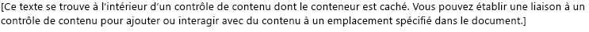
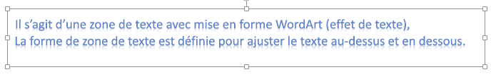
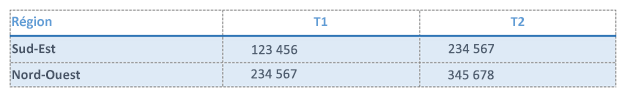
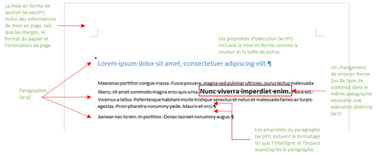
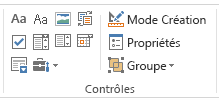

# <a name="create-better-add-ins-for-word-with-office-open-xml"></a><span data-ttu-id="0c605-102">Créer de meilleurs compléments pour Word avec Office Open XML</span><span class="sxs-lookup"><span data-stu-id="0c605-102">Create better add-ins for Word with Office Open XML</span></span>

<span data-ttu-id="0c605-103">**Fourni par :**    Stephanie Krieger Microsoft Corporation | Juan Balmori Labra, Microsoft Corporation</span><span class="sxs-lookup"><span data-stu-id="0c605-103">**Provided by:** Stephanie Krieger, Microsoft Corporation | Juan Balmori Labra, Microsoft Corporation</span></span>

<span data-ttu-id="0c605-p101">Si vous créez des compléments Office à exécuter dans Word, vous savez peut-être déjà que l’API JavaScript pour Office (Office. js) offre plusieurs formats de lecture et d’écriture de contenu de document. Il s’agit de types de forçage de type, qui incluent du texte brut, des tableaux, du code HTML et Office Open XML.</span><span class="sxs-lookup"><span data-stu-id="0c605-p101">If you're building Office Add-ins to run in Word, you might already know that the Office JavaScript API (Office.js) offers several formats for reading and writing document content. These are called coercion types, and they include plain text, tables, HTML, and Office Open XML.</span></span>

<span data-ttu-id="0c605-p102">Quelles sont donc les options disponibles pour ajouter du contenu riche à un document, tel que des images, des tableaux mis en forme, des graphiques ou simplement du texte mis en forme ? Vous pouvez utiliser le format HTML pour insérer certains types de contenu riche, comme des images. En fonction de votre scénario, le forçage HTML peut présenter des inconvénients, tels que les limites de la mise en forme et des options de positionnement disponibles pour votre contenu. Office Open XML étant le langage dans lequel les documents Word (notamment .docx et .dotx) sont écrits, vous pouvez insérer quasiment tous les types de contenu qu’un utilisateur peut ajouter à un document Word, avec n’importe quel type de mise en forme applicable. Déterminer le balisage Office Open XML nécessaire pour y parvenir est bien plus facile que vous ne le pensez.</span><span class="sxs-lookup"><span data-stu-id="0c605-p102">So what are your options when you need to add rich content to a document, such as images, formatted tables, charts, or even just formatted text? You can use HTML for inserting some types of rich content, such as pictures. Depending on your scenario, there can be drawbacks to HTML coercion, such as limitations in the formatting and positioning options available to your content. Because Office Open XML is the language in which Word documents (such as .docx and .dotx) are written, you can insert virtually any type of content that a user can add to a Word document, with virtually any type of formatting the user can apply. Determining the Office Open XML markup you need to get it done is easier than you might think.</span></span>

> [!NOTE]
> <span data-ttu-id="0c605-p103">Office Open XML est également le langage utilisé pour les documents PowerPoint et Excel (et pour Visio depuis Office 2013). Cependant, vous pouvez actuellement forcer le contenu au format Office Open XML uniquement dans les compléments Office créés pour Word. Pour plus d’informations sur Office Open XML, notamment pour consulter la documentation de référence du langage complète, reportez-vous à la rubrique [Ressources supplémentaires](#see-also).</span><span class="sxs-lookup"><span data-stu-id="0c605-p103">Office Open XML is also the language behind PowerPoint and Excel (and, as of Office 2013, Visio) documents. However, currently, you can coerce content as Office Open XML only in Office Add-ins created for Word. For more information about Office Open XML, including the complete language reference documentation, see [Additional resources](#see-also).</span></span>

<span data-ttu-id="0c605-p104">Pour commencer, jetez un œil à quelques-uns des types de contenu que vous pouvez insérer à l’aide du forçage Office Open XML. Téléchargez l’exemple de code [Word-Add-in-Load-and-write-Open-XML](https://github.com/OfficeDev/Word-Add-in-Load-and-write-Open-XML), qui contient le balisage Office Open XML et le code Office.js nécessaires pour insérer l’un des exemples suivants dans Word.</span><span class="sxs-lookup"><span data-stu-id="0c605-p104">To begin, take a look at some of the content types you can insert using Office Open XML coercion. Download the code sample [Word-Add-in-Load-and-write-Open-XML](https://github.com/OfficeDev/Word-Add-in-Load-and-write-Open-XML), which contains the Office Open XML markup and Office.js code required for inserting any of the following examples into Word.</span></span>

> [!NOTE]
> <span data-ttu-id="0c605-116">Tout au long de cet article, les termes **types de contenu** et **contenu riche** font référence aux types de contenu riche que vous pouvez insérer dans un document Word.</span><span class="sxs-lookup"><span data-stu-id="0c605-116">Throughout this article, the terms **content types** and **rich content** refer to the types of rich content you can insert into a Word document.</span></span>


<span data-ttu-id="0c605-117">*Figure 1. Texte avec mise en forme directe*</span><span class="sxs-lookup"><span data-stu-id="0c605-117">*Figure 1. Text with direct formatting*</span></span>


<span data-ttu-id="0c605-119">Vous pouvez utiliser la mise en forme directe pour spécifier l’apparence du texte de manière exacte, indépendamment de la mise en forme existante dans le document de l’utilisateur.</span><span class="sxs-lookup"><span data-stu-id="0c605-119">You can use direct formatting to specify exactly what the text will look like regardless of existing formatting in the user's document.</span></span>

<span data-ttu-id="0c605-120">*Figure 2. Texte mis en forme avec un style*</span><span class="sxs-lookup"><span data-stu-id="0c605-120">*Figure 2. Text formatted using a style*</span></span>


<span data-ttu-id="0c605-122">Vous pouvez utiliser un style pour coordonner automatiquement l’apparence du texte inséré avec le document de l’utilisateur.</span><span class="sxs-lookup"><span data-stu-id="0c605-122">You can use a style to automatically coordinate the look of text you insert with the user's document.</span></span>

<span data-ttu-id="0c605-123">*Figure 3. Image simple*</span><span class="sxs-lookup"><span data-stu-id="0c605-123">*Figure 3. A simple image*</span></span>


<span data-ttu-id="0c605-125">Vous pouvez utiliser la même méthode pour insérer n’importe quel format d’image pris en charge par Office.</span><span class="sxs-lookup"><span data-stu-id="0c605-125">You can use the same method for inserting any Office-supported image format.</span></span>

<span data-ttu-id="0c605-126">*Figure 4. Image mise en forme avec des styles d’image et des effets*</span><span class="sxs-lookup"><span data-stu-id="0c605-126">*Figure 4. An image formatted using picture styles and effects*</span></span>


<span data-ttu-id="0c605-128">L’ajout d’une mise en forme et d’effets de haute qualité à vos images nécessite beaucoup moins de balises que vous ne le pensez.</span><span class="sxs-lookup"><span data-stu-id="0c605-128">Adding high quality formatting and effects to your images requires much less markup than you might expect.</span></span>

<span data-ttu-id="0c605-129">*Figure 5. Contrôle de contenu*</span><span class="sxs-lookup"><span data-stu-id="0c605-129">*Figure 5. A content control*</span></span>




<span data-ttu-id="0c605-131">Vous pouvez utiliser des contrôles de contenu avec votre complément afin d’ajouter du contenu à un emplacement spécifié (lié) plutôt qu’à l’emplacement de sélection.</span><span class="sxs-lookup"><span data-stu-id="0c605-131">You can use content controls with your add-in to add content at a specified (bound) location rather than at the selection.</span></span>

<span data-ttu-id="0c605-132">*Figure 6. Zone de texte avec mise en forme WordArt*</span><span class="sxs-lookup"><span data-stu-id="0c605-132">*Figure 6. A text box with WordArt formatting*</span></span>




<span data-ttu-id="0c605-134">Les effets de texte sont disponibles dans Word pour le texte situé à l’intérieur d’une zone de texte (comme ici) ou pour un corps de texte classique.</span><span class="sxs-lookup"><span data-stu-id="0c605-134">Text effects are available in Word for text inside a text box (as shown here) or for regular body text.</span></span>

<span data-ttu-id="0c605-135">*Figure 7. Forme*</span><span class="sxs-lookup"><span data-stu-id="0c605-135">*Figure 7. A shape*</span></span>


<span data-ttu-id="0c605-137">Vous pouvez insérer des formes de dessin intégrées ou personnalisées, avec ou sans texte et effets de mise en forme.</span><span class="sxs-lookup"><span data-stu-id="0c605-137">You can insert built-in or custom drawing shapes, with or without text and formatting effects.</span></span>

<span data-ttu-id="0c605-138">*Figure 8. Tableau avec une mise en forme directe*</span><span class="sxs-lookup"><span data-stu-id="0c605-138">*Figure 8. A table with direct formatting*</span></span>




<span data-ttu-id="0c605-140">Vous pouvez inclure la mise en forme du texte, des bordures, une trame de fond, le dimensionnement des cellules ou toute mise en forme de tableau dont vous avez besoin.</span><span class="sxs-lookup"><span data-stu-id="0c605-140">You can include text formatting, borders, shading, cell sizing, or any table formatting you need.</span></span>

<span data-ttu-id="0c605-141">*Figure 9. Tableau mis en forme avec un style de tableau*</span><span class="sxs-lookup"><span data-stu-id="0c605-141">*Figure 9. A table formatted using a table style*</span></span>


<span data-ttu-id="0c605-143">Vous pouvez utiliser des styles de tableau intégrés ou personnalisés aussi facilement pour un paragraphe de texte.</span><span class="sxs-lookup"><span data-stu-id="0c605-143">You can use built-in or custom table styles just as easily as using a paragraph style for text.</span></span>

<span data-ttu-id="0c605-144">*Figure 10. Graphique SmartArt*</span><span class="sxs-lookup"><span data-stu-id="0c605-144">*Figure 10. A SmartArt diagram*</span></span>


<span data-ttu-id="0c605-146">Microsoft Office offre un large éventail de dispositions pour les diagrammes SmartArt (et vous pouvez utiliser Office Open XML pour créer les vôtres).</span><span class="sxs-lookup"><span data-stu-id="0c605-146">Microsoft Office offers a wide array of SmartArt diagram layouts (and you can use Office Open XML to create your own).</span></span>

<span data-ttu-id="0c605-147">*Figure 11. Graphique*</span><span class="sxs-lookup"><span data-stu-id="0c605-147">*Figure 11. A chart*</span></span>


<span data-ttu-id="0c605-p105">Vous pouvez insérer des graphiques Excel sous forme de graphiques dynamiques dans des documents Word, ce qui signifie également que vous pouvez les utiliser dans votre complément pour Word. Comme vous pouvez le constater avec les exemples précédents, vous pouvez utiliser le forçage Office Open XML pour insérer pratiquement n’importe quel type de contenu dans un document. Il existe deux façons simples d’obtenir le balisage Office Open XML dont vous avez besoin. Vous pouvez ajouter votre contenu riche à un document Word vierge, puis enregistrer ce fichier au format Document XML Word, ou utiliser un complément de test avec la méthode [getSelectedDataAsync](/javascript/api/office/office.document#getselecteddataasync-coerciontype--options--callback-) pour récupérer le balisage. Les deux approches fournissent globalement le même résultat.</span><span class="sxs-lookup"><span data-stu-id="0c605-p105">You can insert Excel charts as live charts in Word documents, which also means you can use them in your add-in for Word. As you can see by the preceding examples, you can use Office Open XML coercion to insert essentially any type of content that a user can insert into their own document. There are two simple ways to get theOffice Open XML markup you need. Either add your rich content to an otherwise blank Word document and then save the file in Word XML Document format or use a test add-in with the [getSelectedDataAsync](/javascript/api/office/office.document#getselecteddataasync-coerciontype--options--callback-) method to grab the markup. Both approaches provide essentially the same result.</span></span>


> [!NOTE]
> <span data-ttu-id="0c605-p106">Un document Office Open XML est en fait un package compressé de fichiers qui représentent le contenu du document. L’enregistrement du fichier au format de document XML Word vous permet d’aplatir le package Open XML entireOffice en un seul fichier XML, ce qui est également ce `getSelectedDataAsync` que vous obtenez lorsque vous utilisez pour récupérer le balisage Office Open XML.</span><span class="sxs-lookup"><span data-stu-id="0c605-p106">An Office Open XML document is actually a compressed package of files that represent the document contents. Saving the file in the Word XML Document format gives you the entireOffice Open XML package flattened into one XML file, which is also what you get when using `getSelectedDataAsync` to retrieve the Office Open XML markup.</span></span>

<span data-ttu-id="0c605-p107">Si vous enregistrez le fichier au format XML à partir de Word, Notez qu’il existe deux options dans la liste type de fichier de la boîte de dialogue Enregistrer sous pour les fichiers au format. Xml. Veillez à choisir **document XML Word** et non l’option Word 2003. Téléchargez l’exemple de code nommé [Word-Add-in-get-set-EditOpen-XML](https://github.com/OfficeDev/Word-Add-in-Get-Set-EditOpen-XML), que vous pouvez utiliser comme outil pour récupérer et tester votre balisage. Est-ce tout ce qu’il y a ? Eh bien, pas tout à fait. Oui, pour de nombreux scénarios, vous pouvez utiliser le résultat Office Open XML complet et aplati que vous voyez à l’aide de l’une des méthodes ci-dessus et cela fonctionnerait. La bonne nouvelle est que vous n’avez probablement pas besoin de la plupart de ces balises. Si vous êtes l’un des nombreux développeurs de compléments qui visualisent Office Open XML Markup pour la première fois, vous pouvez vous rendre compte de l’énorme quantité de balises que vous obtenez pour la plus simple partie de contenu, mais ce n’est pas obligatoire. Dans cette rubrique, nous allons utiliser certains scénarios courants que nous avons entendus de la communauté des développeurs de compléments Office pour vous montrer des techniques permettant de simplifier le code Office Open XML à utiliser dans votre complément. Nous explorerons le balisage pour certains types de contenu affichés précédemment, ainsi que les informations dont vous avez besoin pour réduire la charge utile Office Open XML. Nous examinerons également le code dont vous avez besoin pour insérer du contenu enrichi dans un document au niveau de la sélection active et comment utiliser Office Open XML avec l’objet bindings pour ajouter ou remplacer du contenu à des emplacements spécifiques.</span><span class="sxs-lookup"><span data-stu-id="0c605-p107">If you save the file to an XML format from Word, note that there are two options under the Save as Type list in the Save As dialog box for .xml format files. Be sure to choose **Word XML Document** and not the Word 2003 option. Download the code sample named [Word-Add-in-Get-Set-EditOpen-XML](https://github.com/OfficeDev/Word-Add-in-Get-Set-EditOpen-XML), which you can use as a tool to retrieve and test your markup. So is that all there is to it? Well, not quite. Yes, for many scenarios, you could use the full, flattened Office Open XML result you see with either of the preceding methods and it would work. The good news is that you probably don't need most of that markup. If you're one of the many add-in developers seeing Office Open XML markup for the first time, trying to make sense of the massive amount of markup you get for the simplest piece of content might seem overwhelming, but it doesn't have to be. In this topic, we'll use some common scenarios we've been hearing from the Office Add-ins developer community to show you techniques for simplifying Office Open XML for use in your add-in. We'll explore the markup for some types of content shown earlier along with the information you need for minimizing the Office Open XML payload. We'll also look at the code you need for inserting rich content into a document at the active selection and how to use Office Open XML with the bindings object to add or replace content at specified locations.</span></span>

## <a name="exploring-the-office-open-xml-document-package"></a><span data-ttu-id="0c605-167">Exploration du package de document Office Open XML</span><span class="sxs-lookup"><span data-stu-id="0c605-167">Exploring the Office Open XML document package</span></span>


<span data-ttu-id="0c605-p108">Lorsque vous utilisez [getSelectedDataAsync](/javascript/api/office/office.document#getselecteddataasync-coerciontype--options--callback-) pour récupérer une sélection de contenu Office Open XML (ou lorsque vous enregistrez le document au format Document XML Word), ce que vous obtenez n’est pas seulement le balisage qui décrit le contenu sélectionné, mais un document entier avec de nombreux paramètres et options dont vous n’aurez certainement pas besoin. En fait, si vous utilisez cette méthode à partir d’un document qui contient un complément de volet de tâches, le balisage que vous obtenez comprend également votre volet de tâches.</span><span class="sxs-lookup"><span data-stu-id="0c605-p108">When you use [getSelectedDataAsync](/javascript/api/office/office.document#getselecteddataasync-coerciontype--options--callback-) to retrieve the Office Open XML for a selection of content (or when you save the document in Word XML Document format), what you're getting is not just the markup that describes your selected content; it's an entire document with many options and settings that you almost certainly don't need. In fact, if you use that method from a document that contains a task pane add-in, the markup you get even includes your task pane.</span></span>

<span data-ttu-id="0c605-170">Même un simple package de document Word comprend des composants pour les propriétés du document, les styles, le thème (paramètres de mise en forme), les paramètres web, les polices, en plus d’autres composants pour le contenu réel.</span><span class="sxs-lookup"><span data-stu-id="0c605-170">Even a simple Word document package includes parts for document properties, styles, theme (formatting settings), web settings, fonts, and then some, in addition to parts for the actual content.</span></span>

<span data-ttu-id="0c605-p109">Par exemple, supposons que vous vouliez insérer uniquement un paragraphe de texte avec mise en forme directe, comme illustré à la figure 1. Lorsque vous récupérez le XML ouvert Office pour le texte mis `getSelectedDataAsync`en forme à l’aide de, vous voyez un grand nombre de balises. Ce balisage inclut un élément de package qui représente un document entier, qui contient plusieurs parties (communément appelées composants de document ou, dans le code Office Open XML, comme composants de package), comme indiqué dans la figure 13. Chaque composant représente un fichier distinct dans le package.</span><span class="sxs-lookup"><span data-stu-id="0c605-p109">For example, say that you want to insert just a paragraph of text with direct formatting, as shown earlier in Figure 1. When you grab the Office Open XML for the formatted text using  `getSelectedDataAsync`, you see a large amount of markup. That markup includes a package element that represents an entire document, which contains several parts (commonly referred to as document parts or, in the Office Open XML, as package parts), as you see listed in Figure 13. Each part represents a separate file within the package.</span></span>

> [!TIP]
> <span data-ttu-id="0c605-p110">Vous pouvez modifier le balisage Office Open XML dans un éditeur de texte tel que le bloc-notes. Si vous l’ouvrez dans Visual Studio, vous pouvez utiliser **modifier >Advanced > format document** (Ctrl + K, Ctrl + D) pour mettre en forme le package afin de le modifier plus facilement. Vous pouvez ensuite réduire ou développer des parties de document ou des sections de celles-ci, comme illustré à la figure 12, afin de réviser et de modifier plus facilement le contenu du package Office Open XML. Chaque composant de document commence par une balise **pkg : part** .</span><span class="sxs-lookup"><span data-stu-id="0c605-p110">You can edit Office Open XML markup in a text editor like Notepad. If you open it in Visual Studio, you can use **Edit >Advanced > Format Document** (Ctrl+K, Ctrl+D) to format the package for easier editing. Then you can collapse or expand document parts or sections of them, as shown in Figure 12, to more easily review and edit the content of the Office Open XML package. Each document part begins with a **pkg:part** tag.</span></span>


<span data-ttu-id="0c605-179">*Figure 12. Réduction et développement des composants de package pour faciliter la modification dans Visual Studio*</span><span class="sxs-lookup"><span data-stu-id="0c605-179">*Figure 12. Collapse and expand package parts for easier editing in Visual Studio*</span></span>


<span data-ttu-id="0c605-181">*Figure 13. Composants inclus dans un package de document Word Office Open XML de base*</span><span class="sxs-lookup"><span data-stu-id="0c605-181">*Figure 13. The parts included in a basic Word Office Open XML document package*</span></span>


<span data-ttu-id="0c605-183">Avec toutes ces balises, vous serez surpris de découvrir que les seuls éléments dont vous avez réellement besoin pour insérer l’exemple de texte mis en forme sont des parties des composants .rels et document.xml.</span><span class="sxs-lookup"><span data-stu-id="0c605-183">With all that markup, you might be surprised to discover that the only elements you actually need to insert the formatted text example are pieces of the .rels part and the document.xml part.</span></span>


> [!NOTE]
> <span data-ttu-id="0c605-p111">Les deux lignes de balisage situées au-dessus de la balise package (déclarations XML pour la version et l’ID de programme Office) sont supposées lorsque vous utilisez le type de forçage Office Open XML. Vous n’avez donc pas à les inclure. Conservez-les si vous voulez ouvrir le balisage modifié en tant que document Word afin de le tester.</span><span class="sxs-lookup"><span data-stu-id="0c605-p111">The two lines of markup above the package tag (the XML declarations for version and Office program ID) are assumed when you use the Office Open XML coercion type, so you don't need to include them. Keep them if you want to open your edited markup as a Word document to test it.</span></span>

<span data-ttu-id="0c605-p112">Plusieurs des autres types de contenu présentés au début de cette rubrique nécessitent également des composants supplémentaires (en plus de ceux de la figure 13). Nous aborderons ce sujet plus loin dans cette rubrique. En attendant, puisque vous voyez la plupart des composants représentés sur la figure 13 dans le balisage pour un package de document Word, voici un résumé rapide de l’objet de chacun de ces composants et des moments où vous en avez besoin :</span><span class="sxs-lookup"><span data-stu-id="0c605-p112">Several of the other types of content shown at the start of this topic require additional parts as well (beyond those shown in Figure 13), and we'll address those later in this topic. Meanwhile, since you'll see most of the parts shown in Figure 13 in the markup for any Word document package, here's a quick summary of what each of these parts is for and when you need it:</span></span>


- <span data-ttu-id="0c605-p113">À l’intérieur de la balise package, le premier composant est le fichier .rels, qui définit les relations entre les composants de niveau supérieur du package (généralement les propriétés du document, la miniature (le cas échéant) et le corps du document principal). Une partie du contenu de ce composant est toujours nécessaire dans votre balisage car vous devez définir la relation entre le composant de document principal (où réside votre contenu) et le package de document.</span><span class="sxs-lookup"><span data-stu-id="0c605-p113">Inside the package tag, the first part is the .rels file, which defines relationships between the top-level parts of the package (these are typically the document properties, thumbnail (if any), and main document body). Some of the content in this part is always required in your markup because you need to define the relationship of the main document part (where your content resides) to the document package.</span></span>

- <span data-ttu-id="0c605-190">Le composant document.xml.rels définit les relations pour les composants supplémentaires requis par le composant document.xml (corps principal), le cas échéant.</span><span class="sxs-lookup"><span data-stu-id="0c605-190">The document.xml.rels part defines relationships for additional parts required by the document.xml (main body) part, if any.</span></span>


   > [!IMPORTANT]
   > <span data-ttu-id="0c605-p114">Les fichiers .rels de votre package (comme les fichiers .rels de niveau supérieur, document.xml.rels et autres qui s’affichent pour certains types de contenu) représentent un outil extrêmement important que vous pouvez utiliser comme guide pour vous aider à modifier rapidement votre package Office Open XML. Pour en savoir plus sur la façon de procéder, voir [Creating your own markup: best practices](#creating-your-own-markup-best-practices) plus loin dans cette rubrique.</span><span class="sxs-lookup"><span data-stu-id="0c605-p114">The .rels files in your package (such as the top-level .rels, document.xml.rels, and others you may see for specific types of content) are an extremely important tool that you can use as a guide for helping you quickly edit down your Office Open XML package. To learn more about how to do this, see [Creating your own markup: best practices](#creating-your-own-markup-best-practices) later in this topic.</span></span>


- <span data-ttu-id="0c605-p115">Le composant document.xml est le contenu du corps principal du document. Les éléments de ce composant sont évidemment nécessaires, car votre contenu apparaît dans ces éléments. Mais vous n’avez pas besoin de tout ce que vous voyez dans ce composant. Nous étudierons cela plus en détail ultérieurement.</span><span class="sxs-lookup"><span data-stu-id="0c605-p115">The document.xml part is the content in the main body of the document. You need elements of this part, of course, since that's where your content appears. But, you don't need everything you see in this part. We'll look at that in more detail later.</span></span>

- <span data-ttu-id="0c605-p116">De nombreux composants sont automatiquement ignorés par les méthodes Set lors de l’insertion de contenu dans un document à l’aide du forçage Office Open XML. Vous pouvez également les supprimer. Il s’agit notamment du fichier theme1.xml (thème de mise en forme du document), les composants des propriétés du document (principales, de complément et de miniature) et les fichiers de paramètres (settings, WebSettings et fontTable).</span><span class="sxs-lookup"><span data-stu-id="0c605-p116">Many parts are automatically ignored by the Set methods when inserting content into a document using Office Open XML coercion, so you might as well remove them. These include the theme1.xml file (the document's formatting theme), the document properties parts (core, add-in, and thumbnail), and setting files (including settings, webSettings, and fontTable).</span></span>

- <span data-ttu-id="0c605-p117">Dans l’exemple de la figure 1, la mise en forme du texte est appliquée directement (c’est-à-dire que chaque paramètre de police et de mise en forme de paragraphe est appliqué individuellement). Cependant, si vous utilisez un style (par exemple, si vous voulez que votre texte suive automatiquement la mise en forme du style Titre 1 dans le document de destination) comme indiqué précédemment dans la figure 2, vous aurez besoin d’une partie du composant styles.xml, ainsi que de la définition de relation correspondante. Pour plus d’informations, voir la rubrique [Ajout d’objets qui utilisent des composants Office Open XML supplémentaires](#adding-objects-that-use-additional-office-open-xml-parts).</span><span class="sxs-lookup"><span data-stu-id="0c605-p117">In the Figure 1 example, text formatting is directly applied (that is, each font and paragraph formatting setting applied individually). But, if you use a style (such as if you want your text to automatically take on the formatting of the Heading 1 style in the destination document) as shown earlier in Figure 2, then you would need part of the styles.xml part as well as a relationship definition for it. For more information, see the topic section [Adding objects that use additional Office Open XML parts](#adding-objects-that-use-additional-office-open-xml-parts).</span></span>


## <a name="inserting-document-content-at-the-selection"></a><span data-ttu-id="0c605-202">Insertion de contenu de document à l’emplacement de sélection</span><span class="sxs-lookup"><span data-stu-id="0c605-202">Inserting document content at the selection</span></span>


<span data-ttu-id="0c605-203">Jetons un œil aux exigences minimales de balisage Office Open XML pour l’exemple de texte mis en forme de la figure 1 et au code JavaScript nécessaire pour l’insérer à l’emplacement de sélection actif du document.</span><span class="sxs-lookup"><span data-stu-id="0c605-203">Let's take a look at the minimal Office Open XML markup required for the formatted text example shown in Figure 1 and the JavaScript required for inserting it at the active selection in the document.</span></span>


### <a name="simplified-office-open-xml-markup"></a><span data-ttu-id="0c605-204">Balisage Office Open XML simplifié</span><span class="sxs-lookup"><span data-stu-id="0c605-204">Simplified Office Open XML markup</span></span>

<span data-ttu-id="0c605-p118">Nous avons modifié l’exemple Office Open XML affiché ici, comme décrit dans la section précédente, afin de laisser uniquement les composants de document requis et les éléments requis pour chacun de ces composants. Dans la prochaine section de cette rubrique, nous vous expliquerons comment modifier vous-même le balisage (et nous vous fournirons plus d’informations sur les parties restantes).</span><span class="sxs-lookup"><span data-stu-id="0c605-p118">We've edited the Office Open XML example shown here, as described in the preceding section, to leave just required document parts and only required elements within each of those parts. We'll walk through how to edit the markup yourself (and explain a bit more about the pieces that remain here) in the next section of the topic.</span></span>


```XML
<pkg:package xmlns:pkg="http://schemas.microsoft.com/office/2006/xmlPackage">
  <pkg:part pkg:name="/_rels/.rels" pkg:contentType="application/vnd.openxmlformats-package.relationships+xml" pkg:padding="512">
    <pkg:xmlData>
      <Relationships xmlns="http://schemas.openxmlformats.org/package/2006/relationships">
        <Relationship Id="rId1" Type="http://schemas.openxmlformats.org/officeDocument/2006/relationships/officeDocument" Target="word/document.xml"/>
      </Relationships>
    </pkg:xmlData>
  </pkg:part>
  <pkg:part pkg:name="/word/document.xml" pkg:contentType="application/vnd.openxmlformats-officedocument.wordprocessingml.document.main+xml">
    <pkg:xmlData>
      <w:document xmlns:w="http://schemas.openxmlformats.org/wordprocessingml/2006/main" >
        <w:body>
          <w:p>
            <w:pPr>
              <w:spacing w:before="360" w:after="0" w:line="480" w:lineRule="auto"/>
              <w:rPr>
                <w:color w:val="70AD47" w:themeColor="accent6"/>
                <w:sz w:val="28"/>
              </w:rPr>
            </w:pPr>
            <w:r>
              <w:rPr>
                <w:color w:val="70AD47" w:themeColor="accent6"/>
                <w:sz w:val="28"/>
              </w:rPr>
              <w:t>This text has formatting directly applied to achieve its font size, color, line spacing, and paragraph spacing.</w:t>
            </w:r>
          </w:p>
        </w:body>
      </w:document>
    </pkg:xmlData>
  </pkg:part>
</pkg:package>
```


> [!NOTE]
> <span data-ttu-id="0c605-p119">Si vous ajoutez le balisage indiqué ici à un fichier XML avec les balises de déclaration XML pour version et mso-application en haut du fichier (illustré à la figure 13), vous pouvez l’ouvrir dans Word en tant que document Word. Ou, sans ces balises, vous pouvez toujours l’ouvrir à l’aide du **fichier> ouvrir** dans Word. Le mode de **compatibilité** est affiché dans la barre de titre de Word, car vous avez supprimé les paramètres qui indiquent à Word qu’il s’agit d’un document Word. Étant donné que vous ajoutez ce balisage à un document Word existant, cela n’a aucune incidence sur votre contenu.</span><span class="sxs-lookup"><span data-stu-id="0c605-p119">If you add the markup shown here to an XML file along with the XML declaration tags for version and mso-application at the top of the file (shown in Figure 13), you can open it in Word as a Word document. Or, without those tags, you can still open it using **File> Open** in Word. You'll see **Compatibility Mode** on the title bar in Word, because you removed the settings that tell Word this is a Word document. Since you're adding this markup to an existing Word document, that won't affect your content at all.</span></span>


### <a name="javascript-for-using-setselecteddataasync"></a><span data-ttu-id="0c605-211">JavaScript pour l’utilisation de setSelectedDataAsync</span><span class="sxs-lookup"><span data-stu-id="0c605-211">JavaScript for using setSelectedDataAsync</span></span>


<span data-ttu-id="0c605-212">Une fois que vous avez enregistré le code Office Open XML précédent dans un fichier XML accessible à partir de votre solution, vous pouvez utiliser la fonction suivante pour définir le contenu du texte mis en forme dans le document à l’aide du forçage Office Open XML.</span><span class="sxs-lookup"><span data-stu-id="0c605-212">Once you save the preceding Office Open XML as an XML file that's accessible from your solution, you can use the following function to set the formatted text content in the document using Office Open XML coercion.</span></span> 

<span data-ttu-id="0c605-p120">Dans cette fonction, Notez que toutes les lignes sauf la dernière sont utilisées pour obtenir votre balisage enregistré afin de l’utiliser dans l’appel de méthode [setSelectedDataAsync](/javascript/api/office/office.document#setselecteddataasync-data--options--callback-) à la fin de la fonction. `setSelectedDataASync` nécessite uniquement de spécifier le contenu à insérer et le type de forçage de type.</span><span class="sxs-lookup"><span data-stu-id="0c605-p120">In this function, notice that all but the last line are used to get your saved markup for use in the [setSelectedDataAsync](/javascript/api/office/office.document#setselecteddataasync-data--options--callback-) method call at the end of the function. `setSelectedDataASync` requires only that you specify the content to be inserted and the coercion type.</span></span>


> [!NOTE]
> <span data-ttu-id="0c605-p121">Remplacez _yourXMLfilename_ par le nom et le chemin du fichier XML que vous avez enregistré dans votre solution. Si vous n’êtes pas sûr de l’endroit où inclure les fichiers XML dans votre solution ou de la façon de les référencer dans votre code, reportez-vous à l’exemple de code [Word-Add-in-Load-and-write-Open-XML](https://github.com/OfficeDev/Word-Add-in-Load-and-write-Open-XML) pour obtenir des exemples correspondants et un exemple pratique du balisage et du code JavaScript indiqués dans cette rubrique.</span><span class="sxs-lookup"><span data-stu-id="0c605-p121">Replace  _yourXMLfilename_ with the name and path of the XML file as you've saved it in your solution. If you're not sure where to include XML files in your solution or how to reference them in your code, see the [Word-Add-in-Load-and-write-Open-XML](https://github.com/OfficeDev/Word-Add-in-Load-and-write-Open-XML) code sample for examples of that and a working example of the markup and JavaScript shown here.</span></span>


```js
function writeContent() {
    var myOOXMLRequest = new XMLHttpRequest();
    var myXML;
    myOOXMLRequest.open('GET', 'yourXMLfilename', false);
    myOOXMLRequest.send();
    if (myOOXMLRequest.status === 200) {
        myXML = myOOXMLRequest.responseText;
    }
    Office.context.document.setSelectedDataAsync(myXML, { coercionType: 'ooxml' });
}
```


## <a name="creating-your-own-markup-best-practices"></a><span data-ttu-id="0c605-217">Création de votre propre balisage : meilleures pratiques</span><span class="sxs-lookup"><span data-stu-id="0c605-217">Creating your own markup: best practices</span></span>


<span data-ttu-id="0c605-218">Étudions de plus près le balisage que vous devez insérer dans l’exemple de texte mis en forme précédent.</span><span class="sxs-lookup"><span data-stu-id="0c605-218">Let's take a closer look at the markup you need to insert the preceding formatted text example.</span></span>

<span data-ttu-id="0c605-p122">Pour cet exemple, commencez par supprimer simplement tous les composants de document du package autres que .rels et document.xml. Nous modifierons ensuite les deux composants requis pour les simplifier davantage.</span><span class="sxs-lookup"><span data-stu-id="0c605-p122">For this example, start by simply deleting all document parts from the package other than .rels and document.xml. Then, we'll edit those two required parts to simplify things further.</span></span>


> [!IMPORTANT]
> <span data-ttu-id="0c605-p123">Utilisez les composants .rels comme une carte afin d’évaluer rapidement les éléments inclus dans le package et de déterminer les composants que vous pouvez supprimer complètement (c’est-à-dire, tous les composants non liés à votre contenu ou référencés par votre contenu). N’oubliez pas que chaque composant de document doit avoir une relation définie dans le package et que ces relations apparaissent dans les fichiers .rels. Elles doivent donc toutes être listées dans un fichier .rels, document.xml.rels ou un fichier .rels propre au contenu.</span><span class="sxs-lookup"><span data-stu-id="0c605-p123">Use the .rels parts as a map to quickly gauge what's included in the package and determine what parts you can delete completely (that is, any parts not related to or referenced by your content). Remember that every document part must have a relationship defined in the package and those relationships appear in the .rels files. So you should see all of them listed in either .rels, document.xml.rels, or a content-specific .rels file.</span></span>

<span data-ttu-id="0c605-p124">Le balisage suivant montre le composant .rels requis avant la modification. Puisque nous supprimons les composants de propriété de document principale et de complément, ainsi que le composant de miniature, nous devons également supprimer ces relations du fichier .rels. Vous remarquerez que cette opération maintient uniquement la relation (avec l’ID de relation « rID1 » dans l’exemple suivant) pour document.xml.</span><span class="sxs-lookup"><span data-stu-id="0c605-p124">The following markup shows the required .rels part before editing. Since we're deleting the add-in and core document property parts, and the thumbnail part, we need to delete those relationships from .rels as well. Notice that this will leave only the relationship (with the relationship ID "rID1" in the following example) for document.xml.</span></span>


```XML
<pkg:part pkg:name="/_rels/.rels" pkg:contentType="application/vnd.openxmlformats-package.relationships+xml" pkg:padding="512">
  <pkg:xmlData>
    <Relationships xmlns="http://schemas.openxmlformats.org/package/2006/relationships">
      <Relationship Id="rId3" Type="http://schemas.openxmlformats.org/package/2006/relationships/metadata/core-properties" Target="docProps/core.xml"/>
      <Relationship Id="rId2" Type="http://schemas.openxmlformats.org/package/2006/relationships/metadata/thumbnail" Target="docProps/thumbnail.emf"/>
      <Relationship Id="rId1" Type="http://schemas.openxmlformats.org/officeDocument/2006/relationships/officeDocument" Target="word/document.xml"/>
      <Relationship Id="rId4" Type="http://schemas.openxmlformats.org/officeDocument/2006/relationships/extended-properties" Target="docProps/app.xml"/>
    </Relationships>
  </pkg:xmlData>
</pkg:part>
```


> [!IMPORTANT]
> <span data-ttu-id="0c605-p125">Supprimez les relations (c’est-à-dire, la balise **Relationship**) pour tous les composants que vous supprimez complètement du package. L’ajout d’un composant sans relation correspondante ou l’exclusion d’un composant tout en maintenant sa relation dans le package génère une erreur.</span><span class="sxs-lookup"><span data-stu-id="0c605-p125">Remove the relationships (that is, the **Relationship** tag) for any parts that you completely remove from the package. Including a part without a corresponding relationship, or excluding a part and leaving its relationship in the package, will result in an error.</span></span>

<span data-ttu-id="0c605-229">Le balisage suivant présente le composant document.xml, qui contient notre exemple de contenu de texte mis en forme, avant la modification.</span><span class="sxs-lookup"><span data-stu-id="0c605-229">The following markup shows the document.xml part, which includes our sample formatted text content before editing.</span></span>

```XML
<pkg:part pkg:name="/word/document.xml" pkg:contentType="application/vnd.openxmlformats-officedocument.wordprocessingml.document.main+xml">
    <pkg:xmlData>
      <w:document mc:Ignorable="w14 w15 wp14" xmlns:wpc="http://schemas.microsoft.com/office/word/2010/wordprocessingCanvas" xmlns:mc="http://schemas.openxmlformats.org/markup-compatibility/2006" xmlns:o="urn:schemas-microsoft-com:office:office" xmlns:r="http://schemas.openxmlformats.org/officeDocument/2006/relationships" xmlns:m="http://schemas.openxmlformats.org/officeDocument/2006/math" xmlns:v="urn:schemas-microsoft-com:vml" xmlns:wp14="http://schemas.microsoft.com/office/word/2010/wordprocessingDrawing" xmlns:wp="http://schemas.openxmlformats.org/drawingml/2006/wordprocessingDrawing" xmlns:w10="urn:schemas-microsoft-com:office:word" xmlns:w="http://schemas.openxmlformats.org/wordprocessingml/2006/main" xmlns:w14="http://schemas.microsoft.com/office/word/2010/wordml" xmlns:w15="http://schemas.microsoft.com/office/word/2012/wordml" xmlns:wpg="http://schemas.microsoft.com/office/word/2010/wordprocessingGroup" xmlns:wpi="http://schemas.microsoft.com/office/word/2010/wordprocessingInk" xmlns:wne="http://schemas.microsoft.com/office/word/2006/wordml" xmlns:wps="http://schemas.microsoft.com/office/word/2010/wordprocessingShape">
        <w:body>
          <w:p>
            <w:pPr>
              <w:spacing w:before="360" w:after="0" w:line="480" w:lineRule="auto"/>
              <w:rPr>
                <w:color w:val="70AD47" w:themeColor="accent6"/>
                <w:sz w:val="28"/>
              </w:rPr>
            </w:pPr>
            <w:r>
              <w:rPr>
                <w:color w:val="70AD47" w:themeColor="accent6"/>
                <w:sz w:val="28"/>
              </w:rPr>
              <w:t>This text has formatting directly applied to achieve its font size, color, line spacing, and paragraph spacing.</w:t>
            </w:r>
            <w:bookmarkStart w:id="0" w:name="_GoBack"/>
            <w:bookmarkEnd w:id="0"/>
          </w:p>
          <w:p/>
          <w:sectPr>
            <w:pgSz w:w="12240" w:h="15840"/>
            <w:pgMar w:top="1440" w:right="1440" w:bottom="1440" w:left="1440" w:header="720" w:footer="720" w:gutter="0"/>
            <w:cols w:space="720"/>
          </w:sectPr>
        </w:body>
      </w:document>
    </pkg:xmlData>
</pkg:part>
```

<span data-ttu-id="0c605-p126">Étant donné que document.xml est le composant de document principal dans lequel vous placez votre contenu, examinons rapidement ce composant. (La figure 14, qui suit cette liste, représente visuellement le rapport entre une partie du contenu de base et les balises de mise en forme, qui font l’objet de cette rubrique, et ce qui apparaît dans un document Word.)</span><span class="sxs-lookup"><span data-stu-id="0c605-p126">Since document.xml is the primary document part where you place your content, let's take a quick walk through that part. (Figure 14, which follows this list, provides a visual reference to show how some of the core content and formatting tags explained here relate to what you see in a Word document.)</span></span>


- <span data-ttu-id="0c605-p127">La balise de début  **w:document** comprend plusieurs listes d’espaces de noms (**xmlns**). Un grand nombre de ces espaces de noms se réfèrent à des types de contenu spécifiques, dont vous avez besoin uniquement s’ils correspondent à votre contenu.</span><span class="sxs-lookup"><span data-stu-id="0c605-p127">The opening **w:document** tag includes several namespace ( **xmlns** ) listings. Many of those namespaces refer to specific types of content and you only need them if they're relevant to your content.</span></span>

    <span data-ttu-id="0c605-p128">Notez que le préfixe pour les balises dans un composant de document fait référence aux espaces de noms. Dans cet exemple, le seul préfixe utilisé dans les balises de la partie document. xml est **w :**, de sorte que le seul espace de noms que nous devons laisser dans la balise **w :document** d’ouverture est **xmlns : w**.</span><span class="sxs-lookup"><span data-stu-id="0c605-p128">Notice that the prefix for the tags throughout a document part refers back to the namespaces. In this example, the only prefix used in the tags throughout the document.xml part is **w:**, so the only namespace that we need to leave in the opening **w:document** tag is **xmlns:w**.</span></span>


> [!TIP]
> <span data-ttu-id="0c605-p129">Si vous modifiez votre balisage dans Visual Studio, après la suppression d’espaces de noms dans un composant, examinez toutes les balises de ce composant. Si vous avez supprimé un espace de noms requis pour votre balisage, un soulignement rouge ondulé apparaît au niveau du préfixe en question pour les balises affectées. Si vous supprimez l’espace de noms **xmlns:mc**, vous devez aussi supprimer l’attribut **mc:Ignorable** qui précède les listes d’espaces de noms.</span><span class="sxs-lookup"><span data-stu-id="0c605-p129">If you're editing your markup in Visual Studio, after you delete namespaces in any part, look through all tags of that part. If you've removed a namespace that's required for your markup, you'll see a red squiggly underline on the relevant prefix for affected tags. If you remove the **xmlns:mc** namespace, you must also remove the **mc:Ignorable** attribute that precedes the namespace listings.</span></span>


- <span data-ttu-id="0c605-239">Dans la balise Body de début, se trouve une balise de paragraphe (**w:p**) qui comprend le contenu de cet exemple.</span><span class="sxs-lookup"><span data-stu-id="0c605-239">Inside the opening body tag, you see a paragraph tag ( **w:p** ), which includes our sample content for this example.</span></span>

- <span data-ttu-id="0c605-p130">La balise **w:pPr** contient les propriétés de mise en forme directe de paragraphe, comme l’espace avant ou après le paragraphe, l’alignement du paragraphe ou les retraits. (La mise en forme directe se réfère aux attributs que vous appliquez individuellement au contenu plutôt qu’à une partie d’un style). Cette balise comprend également la mise en forme directe de police qui est appliquée à l’ensemble d’un paragraphe, dans une balise imbriquée **w:rPr** (propriétés d’exécution) qui contient la couleur et la taille de la police pour notre exemple.</span><span class="sxs-lookup"><span data-stu-id="0c605-p130">The **w:pPr** tag includes properties for directly-applied paragraph formatting, such as space before or after the paragraph, paragraph alignment, or indents. (Direct formatting refers to attributes that you apply individually to content rather than as part of a style.) This tag also includes direct font formatting that's applied to the entire paragraph, in a nested **w:rPr** (run properties) tag, which contains the font color and size set in our sample.</span></span>


   > [!NOTE]
   > <span data-ttu-id="0c605-p131">Vous remarquerez que les tailles de police et les autres paramètres de mise en forme du balisage Word Office Open XML semblent deux fois plus grands que la taille réelle. Ceci est dû au fait que le paragraphe et l’espacement des lignes, ainsi que certaines propriétés de mise en forme de section figurant dans le balisage précédent, sont indiqués en twips (un vingtième de point). Selon les types de contenu avec lesquels vous travaillez dans Office Open XML, vous pouvez voir plusieurs unités de mesure supplémentaires, y compris les unités métriques anglaises (914 400 EMU pour 1 pouce), qui sont utilisées pour certaines valeurs Office Art (drawingML), et la valeur réelle multipliée par 100 000, qui est utilisée pour le balisage drawingML et PowerPoint. PowerPoint exprime également certaines valeurs à 100 fois la valeur réelle, et Excel utilise fréquemment des valeurs réelles.</span><span class="sxs-lookup"><span data-stu-id="0c605-p131">You might notice that font sizes and some other formatting settings in Word Office Open XML markup look like they're double the actual size. That's because paragraph and line spacing, as well some section formatting properties shown in the preceding markup, are specified in twips (one-twentieth of a point). Depending on the types of content you work with in Office Open XML, you may see several additional units of measure, including English Metric Units (914,400 EMUs to an inch), which are used for some Office Art (drawingML) values and 100,000 times actual value, which is used in both drawingML and PowerPoint markup. PowerPoint also expresses some values as 100 times actual and Excel commonly uses actual values.</span></span>


- <span data-ttu-id="0c605-p132">Dans un paragraphe, tout contenu avec des propriétés similaires est inclus dans une exécution (**w:r**), comme c’est le cas pour le texte d’exemple. À chaque modification du type de mise en forme ou de contenu, une nouvelle exécution démarre. (C’est-à-dire que si un seul mot du texte d’exemple est en gras, il sera mis de côté pour avoir sa propre exécution.) Dans cet exemple, le contenu inclut uniquement l’exécution de texte.</span><span class="sxs-lookup"><span data-stu-id="0c605-p132">Within a paragraph, any content with like properties is included in a run ( **w:r** ), such as is the case with the sample text. Each time there's a change in formatting or content type, a new run starts. (That is, if just one word in the sample text was bold, it would be separated into its own run.) In this example, the content includes just the one text run.</span></span>

    <span data-ttu-id="0c605-249">Notez que, du fait que la mise en forme incluse dans cet exemple est une mise en forme de police (mise en forme qui peut être appliquée à un seul caractère), elle apparaît également dans les propriétés d’exécution individuelle.</span><span class="sxs-lookup"><span data-stu-id="0c605-249">Notice that, because the formatting included in this sample is font formatting (that is, formatting that can be applied to as little as one character), it also appears in the properties for the individual run.</span></span>

- <span data-ttu-id="0c605-p133">Examinez également les balises du signet masqué « _GoBack » (**w:bookmarkStart** et **w:bookmarkEnd**), qui apparaissent dans les documents Word par défaut. Vous pouvez toujours supprimer les balises de début et de fin pour le signet GoBack dans votre balisage.</span><span class="sxs-lookup"><span data-stu-id="0c605-p133">Also notice the tags for the hidden "_GoBack" bookmark (**w:bookmarkStart** and **w:bookmarkEnd** ), which appear in Word documents by default. You can always delete the start and end tags for the GoBack bookmark from your markup.</span></span>

- <span data-ttu-id="0c605-p134">La dernière partie du corps du document est la balise **w:sectPr**, ou propriétés de section. Cette balise inclut des paramètres tels que les marges et l’orientation de la page. Le contenu que vous insérez à l’aide de **setSelectedDataAsync** applique les propriétés de section actives dans le document de destination par défaut. Ainsi, sauf si votre contenu comprend un saut de section (dans ce cas, vous devez voir plusieurs balises **w:sectPr**), vous pouvez supprimer cette balise.</span><span class="sxs-lookup"><span data-stu-id="0c605-p134">The last piece of the document body is the **w:sectPr** tag, or section properties. This tag includes settings such as margins and page orientation. The content you insert using **setSelectedDataAsync** will take on the active section properties in the destination document by default. So, unless your content includes a section break (in which case you'll see more than one **w:sectPr** tag), you can delete this tag.</span></span>


<span data-ttu-id="0c605-256">*Figure 14. Lien entre les balises communes dans document.xml et le contenu ainsi que la mise en page d’un document Word*</span><span class="sxs-lookup"><span data-stu-id="0c605-256">*Figure 14. How common tags in document.xml relate to the content and layout of a Word document*</span></span>



> [!TIP]
> <span data-ttu-id="0c605-p135">Dans le balisage que vous créez, vous pouvez voir un autre attribut dans plusieurs balises, qui comprend les caractères **w:rsid** qui n’apparaissent pas dans les exemples utilisés dans cette rubrique. Il s’agit d’identificateurs de révision. Ils sont utilisés dans Word pour la fonctionnalité Combiner des documents et ils sont activés par défaut. Vous n’en aurez jamais besoin dans le balisage que vous insérez avec votre complément. Les désactiver permet de rendre votre balisage plus lisible. Vous pouvez facilement supprimer les balises RSID existantes ou désactiver la fonctionnalité (comme décrit dans la procédure ci-dessous) pour éviter qu’elles ne soient ajoutées à votre balisage pour le nouveau contenu.</span><span class="sxs-lookup"><span data-stu-id="0c605-p135">In markup you create, you might see another attribute in several tags that includes the characters **w:rsid**, which you don't see in the examples used in this topic. These are revision identifiers. They're used in Word for the Combine Documents feature and they're on by default. You'll never need them in markup you're inserting with your add-in and turning them off makes for much cleaner markup. You can easily remove existing RSID tags or disable the feature (as described in the following procedure) so that they're not added to your markup for new content.</span></span>

<span data-ttu-id="0c605-263">N’oubliez pas que si vous utilisez les fonctionnalités de co-création dans Word (comme la possibilité de modifier simultanément des documents avec d’autres personnes), vous devez activer à nouveau la fonctionnalité lorsque la génération de balisage pour votre complément est terminée.</span><span class="sxs-lookup"><span data-stu-id="0c605-263">Be aware that if you use the co-authoring capabilities in Word (such as the ability to simultaneously edit documents with others), you should enable the feature again when finished generating the markup for your add-in.</span></span>

<span data-ttu-id="0c605-264">Pour désactiver les attributs RSID dans Word pour les documents que vous créerez à l’avenir, procédez comme suit :</span><span class="sxs-lookup"><span data-stu-id="0c605-264">To turn off RSID attributes in Word for documents you create going forward, do the following:</span></span> 

1. <span data-ttu-id="0c605-265">Dans Word, sélectionnez**Fichier**, puis sélectionnez **Options**.</span><span class="sxs-lookup"><span data-stu-id="0c605-265">In Word, choose **File** and then choose **Options**.</span></span>
2. <span data-ttu-id="0c605-266">Dans la boîte de dialogue Options Word, choisissez **Centre de gestion de la confidentialité**, puis **Paramètres du Centre de gestion de la confidentialité**.</span><span class="sxs-lookup"><span data-stu-id="0c605-266">In the Word Options dialog box, choose **Trust Center** and then choose **Trust Center Settings**.</span></span>
3. <span data-ttu-id="0c605-267">Dans la boîte de dialogue Centre de gestion de la confidentialité, sélectionnez **Options de confidentialité**, puis désactivez le paramètre **Stocker un nombre aléatoire pour améliorer l’exactitude de la combinaison**.</span><span class="sxs-lookup"><span data-stu-id="0c605-267">In the Trust Center dialog box, choose **Privacy Options** and then disable the setting **Store random numbers to improve Combine accuracy**.</span></span>

<span data-ttu-id="0c605-268">Pour supprimer les balises RSID d’un document existant, essayez le raccourci suivant avec le document ouvert dans Office Open XML :</span><span class="sxs-lookup"><span data-stu-id="0c605-268">To remove RSID tags from an existing document, try the following shortcut with the document open in Office Open XML:</span></span>


1. <span data-ttu-id="0c605-269">Avec le point d’insertion dans le corps principal du document, appuyez sur **Ctrl+Origine** pour accéder au haut du document.</span><span class="sxs-lookup"><span data-stu-id="0c605-269">With your insertion point in the main body of the document, press **Ctrl+Home** to go to the top of the document.</span></span>
2. <span data-ttu-id="0c605-p136">Sur le clavier, appuyez sur les touches **Barre d’espace**, **Supprimer**, **Barre d’espace**, puis enregistrez le document.</span><span class="sxs-lookup"><span data-stu-id="0c605-p136">On the keyboard, press **Spacebar**, **Delete**, **Spacebar**. Then, save the document.</span></span>

<span data-ttu-id="0c605-272">Après avoir supprimé la majorité du balisage de ce package, nous nous retrouvons avec le balisage minimal qui doit être inséré pour l’exemple, comme indiqué dans la section précédente.</span><span class="sxs-lookup"><span data-stu-id="0c605-272">After removing the majority of the markup from this package, we're left with the minimal markup that needs to be inserted for the sample, as shown in the preceding section.</span></span>


## <a name="using-the-same-office-open-xml-structure-for-different-content-types"></a><span data-ttu-id="0c605-273">À l’aide de la même structure Office Open XML pour différents types de contenu</span><span class="sxs-lookup"><span data-stu-id="0c605-273">Using the same Office Open XML structure for different content types</span></span>


<span data-ttu-id="0c605-p137">Plusieurs types de contenu riche exigent uniquement les composants .rels et document.xml indiqués dans l’exemple précédent, notamment les contrôles de contenu, les formes de dessin et les zones de texte Office, ainsi que les tableaux (sauf si un style est appliqué au tableau). En effet, vous pouvez réutiliser les mêmes composants de package modifiés et transférer uniquement le contenu **body** de document.xml pour le balisage de votre contenu.</span><span class="sxs-lookup"><span data-stu-id="0c605-p137">Several types of rich content require only the .rels and document.xml components shown in the preceding example, including content controls, Office drawing shapes and text boxes, and tables (unless a style is applied to the table). In fact, you can reuse the same edited package parts and swap out just the **body** content in document.xml for the markup of your content.</span></span>

<span data-ttu-id="0c605-276">Pour vérifier le balisage Office Open XML pour les exemples de chacun des types de contenu présentés précédemment dans les figures 5 à 8, explorez l’exemple de code [Word-Add-in-Load-and-write-Open-XML](https://github.com/OfficeDev/Word-Add-in-Load-and-write-Open-XML) mentionné dans la section de présentation.</span><span class="sxs-lookup"><span data-stu-id="0c605-276">To check out the Office Open XML markup for the examples of each of these content types shown earlier in Figures 5 through 8, explore the [Word-Add-in-Load-and-write-Open-XML](https://github.com/OfficeDev/Word-Add-in-Load-and-write-Open-XML) code sample referenced in the overview section.</span></span>

<span data-ttu-id="0c605-277">Avant de poursuivre, jetons un œil aux différences existantes pour deux de ces types de contenu et voyons comment transférer les parties dont vous avez besoin.</span><span class="sxs-lookup"><span data-stu-id="0c605-277">Before we move on, let's take a look at differences to note for a couple of these content types and how to swap out the pieces you need.</span></span>


### <a name="understanding-drawingml-markup-office-graphics-in-word-what-are-fallbacks"></a><span data-ttu-id="0c605-278">Compréhension du balisage drawingML (graphiques Office) dans Word : quelles sont les solutions de secours ?</span><span class="sxs-lookup"><span data-stu-id="0c605-278">Understanding drawingML markup (Office graphics) in Word: What are fallbacks?</span></span>

<span data-ttu-id="0c605-p138">Si le balisage pour votre forme ou zone de texte semble beaucoup plus complexe que ce à quoi vous vous attendiez, il y a une raison. Avec la version Office 2007, nous avons introduit les formats Office Open XML ainsi qu’un nouveau logiciel graphique Office totalement adopté par PowerPoint et Excel. Dans la version 2007, Word n’utilise qu’une partie de ce logiciel graphique, puisqu’il adopte le logiciel graphique Excel mis à jour, les graphiques SmartArt et des outils d’image avancés. Pour les formes et les zones de texte, Word 2007 a continué à utiliser les anciens objets dessin (VML). C’est dans la version 2010 que Word est passé à l’étape supérieure avec le logiciel graphique qui incorpore les formes et les outils de dessin mis à jour.</span><span class="sxs-lookup"><span data-stu-id="0c605-p138">If the markup for your shape or text box looks far more complex than you would expect, there is a reason for it. With the release of Office 2007, we saw the introduction of the Office Open XML Formats as well as the introduction of a new Office graphics engine that PowerPoint and Excel fully adopted. In the 2007 release, Word only incorporated part of that graphics engine, adopting the updated Excel charting engine, SmartArt graphics, and advanced picture tools. For shapes and text boxes, Word 2007 continued to use legacy drawing objects (VML). It was in the 2010 release that Word took the additional steps with the graphics engine to incorporate updated shapes and drawing tools.</span></span>

<span data-ttu-id="0c605-284">Donc, pour prendre en charge les formes et les zones de texte dans des documents Word au format Office Open XML sous Word 2007, les formes (y compris les zones de texte) nécessitent un balisage VML de secours.</span><span class="sxs-lookup"><span data-stu-id="0c605-284">So, to support shapes and text boxes in Office Open XML Format Word documents when opened in Word 2007, shapes (including text boxes) require fallback VML markup.</span></span>

<span data-ttu-id="0c605-p139">En général, comme vous pouvez le voir pour les exemples de forme et de zone de texte inclus dans l’exemple de code [Word-Add-in-Load-and-write-Open-XML](https://github.com/OfficeDev/Word-Add-in-Load-and-write-Open-XML), le balisage de secours peut être supprimé. Word ajoute automatiquement le balisage de secours manquant aux formes lorsqu’un document est enregistré. Mais si vous préférez conserver le balisage de secours pour garantir la prise en charge de tous les scénarios utilisateur, c’est tout à fait possible.</span><span class="sxs-lookup"><span data-stu-id="0c605-p139">Typically, as you see for the shape and text box examples included in the [Word-Add-in-Load-and-write-Open-XML](https://github.com/OfficeDev/Word-Add-in-Load-and-write-Open-XML) code sample, the fallback markup can be removed. Word automatically adds missing fallback markup to shapes when a document is saved. However, if you prefer to keep the fallback markup to ensure that you're supporting all user scenarios, there's no harm in retaining it.</span></span>

<span data-ttu-id="0c605-p140">Si vous avez regroupé des objets dessin inclus dans votre contenu, un balisage supplémentaire (apparemment répétitif) s’affiche. Celui-ci doit être conservé. Des portions du balisage pour les formes de dessin sont dupliquées lorsque l’objet est inclus dans un groupe.</span><span class="sxs-lookup"><span data-stu-id="0c605-p140">If you have grouped drawing objects included in your content, you'll see additional (and apparently repetitive) markup, but this must be retained. Portions of the markup for drawing shapes are duplicated when the object is included in a group.</span></span>


> [!IMPORTANT]
> <span data-ttu-id="0c605-p141">Lorsque vous travaillez avec des zones de texte et des formes de dessin, n’oubliez pas de vérifier soigneusement les espaces de noms avant de les supprimer de document.xml. (Si vous réutilisez le balisage d’un autre type d’objet, veillez à rajouter les espaces de noms requis, que vous avez peut-être déjà supprimés de document.xml.) Une grande partie des espaces de noms inclus par défaut dans document.xml sont là pour satisfaire aux exigences des objets dessin.</span><span class="sxs-lookup"><span data-stu-id="0c605-p141">When working with text boxes and drawing shapes, be sure to check namespaces carefully before removing them from document.xml. (Or, if you're reusing markup from another object type, be sure to add back any required namespaces you might have previously removed from document.xml.) A substantial portion of the namespaces included by default in document.xml are there for drawing object requirements.</span></span>


#### <a name="about-graphic-positioning"></a><span data-ttu-id="0c605-292">Remarque à propos du positionnement des graphiques</span><span class="sxs-lookup"><span data-stu-id="0c605-292">About graphic positioning</span></span>

<span data-ttu-id="0c605-p142">Dans les exemples de code [Word-Add-in-Load-and-write-Open-XML](https://github.com/OfficeDev/Word-Add-in-Load-and-write-Open-XML) et [Word-Add-in-Get-Set-EditOpen-XML](https://github.com/OfficeDev/Word-Add-in-Get-Set-EditOpen-XML), la zone de texte et la forme sont configurées à l’aide de différents types d’habillage du texte et paramètres de positionnement. (Sachez aussi que les exemples d’image dans ces exemples de code sont configurés en ligne avec la mise en forme du texte, qui positionne un objet graphique sur la ligne de base du texte.)</span><span class="sxs-lookup"><span data-stu-id="0c605-p142">In the code samples [Word-Add-in-Load-and-write-Open-XML](https://github.com/OfficeDev/Word-Add-in-Load-and-write-Open-XML) and [Word-Add-in-Get-Set-EditOpen-XML](https://github.com/OfficeDev/Word-Add-in-Get-Set-EditOpen-XML), the text box and shape are setup using different types of text wrapping and positioning settings. (Also be aware that the image examples in those code samples are setup using in line with text formatting, which positions a graphic object on the text baseline.)</span></span>

<span data-ttu-id="0c605-p143">La forme de ces exemples de code est positionnée par rapport aux marges droite et inférieure de la page. Le positionnement relatif permet une coordination plus facile avec la configuration de document inconnu d’un utilisateur, car le système s’adapte aux marges de l’utilisateur. La mise en page risque alors de paraître moins déséquilibrée à cause de paramètres de marges, d’orientation ou de taille du papier non adaptés. Pour conserver les paramètres de positionnement relatif lorsque vous insérez un objet graphique, vous devez conserver la marque de paragraphe (w:p) dans laquelle est stocké le positionnement (désigné dans Word par le terme point d’ancrage). Si vous insérez le contenu dans une marque de paragraphe existante plutôt que d’inclure la vôtre, vous pourriez être en mesure de conserver le même visuel initial, mais de nombreux types de références relatives qui permettent l’ajustement automatique du positionnement par rapport à la mise en page de l’utilisateur peuvent être perdus.</span><span class="sxs-lookup"><span data-stu-id="0c605-p143">The shape in those code samples is positioned relative to the right and bottom page margins. Relative positioning lets you more easily coordinate with a user's unknown document setup because it will adjust to the user's margins and run less risk of looking awkward because of paper size, orientation, or margin settings. To retain relative positioning settings when you insert a graphic object, you must retain the paragraph mark (w:p) in which the positioning (known in Word as an anchor) is stored. If you insert the content into an existing paragraph mark rather than including your own, you may be able to retain the same initial visual, but many types of relative references that enable the positioning to automatically adjust to the user's layout may be lost.</span></span>


### <a name="working-with-content-controls"></a><span data-ttu-id="0c605-299">Utilisation des contrôles de contenu</span><span class="sxs-lookup"><span data-stu-id="0c605-299">Working with content controls</span></span>

<span data-ttu-id="0c605-300">Les contrôles de contenu représentent une fonctionnalité importante dans Word, car ils peuvent grandement améliorer la puissance de votre complément pour Word de multiples façons, y compris en vous donnant la possibilité d’insérer du contenu à des endroits désignés dans le document plutôt qu’à l’emplacement de sélection uniquement.</span><span class="sxs-lookup"><span data-stu-id="0c605-300">Content controls are an important feature in Word that can greatly enhance the power of your add-in for Word in multiple ways, including giving you the ability to insert content at designated places in the document rather than only at the selection.</span></span>

<span data-ttu-id="0c605-301">Dans Word, retrouvez les contrôles de contenu sur l’onglet Développeur du ruban, comme indiqué dans la figure 15.</span><span class="sxs-lookup"><span data-stu-id="0c605-301">In Word, find content controls on the Developer tab of the ribbon, as shown here in Figure 15.</span></span>


<span data-ttu-id="0c605-302">*Figure 15. Groupe Contrôles de l’onglet Développeur dans Word*</span><span class="sxs-lookup"><span data-stu-id="0c605-302">*Figure 15. The Controls group on the Developer tab in Word*</span></span>



<span data-ttu-id="0c605-304">Les types de contrôles de contenu dans Word comprennent du texte enrichi, du texte brut, des images, des galeries de blocs de construction, des cases à cocher, des listes déroulantes, des zones de liste modifiable, un sélecteur de dates et des sections extensibles.</span><span class="sxs-lookup"><span data-stu-id="0c605-304">Types of content controls in Word include rich text, plain text, picture, building block gallery, check box, dropdown list, combo box, date picker, and repeating section.</span></span>


- <span data-ttu-id="0c605-305">Utilisez la commande **Propriétés**, indiquée sur la figure 15, pour modifier le titre du contrôle et pour définir des préférences, comme le masquage du conteneur de contrôle.</span><span class="sxs-lookup"><span data-stu-id="0c605-305">Use the **Properties** command, shown in Figure 15, to edit the title of the control and to set preferences such as hiding the control container.</span></span>

- <span data-ttu-id="0c605-306">Activez le **mode Création** pour modifier le contenu d’espace réservé dans le contrôle.</span><span class="sxs-lookup"><span data-stu-id="0c605-306">Enable **Design Mode** to edit placeholder content in the control.</span></span>

<span data-ttu-id="0c605-p144">Si votre complément fonctionne avec un modèle Word, vous pouvez inclure des contrôles dans ce modèle pour améliorer le comportement du contenu. Vous pouvez également utiliser la liaison de données XML dans un document Word pour lier des contrôles de contenu à des données, telles que des propriétés de document, pour effectuer des tâches similaires ou des tâches similaires. (Recherchez les contrôles qui sont déjà liés à des propriétés de document prédéfinies dans Word sous l’onglet **insertion** , sous **composants QuickPart**.)</span><span class="sxs-lookup"><span data-stu-id="0c605-p144">If your add-in works with a Word template, you can include controls in that template to enhance the behavior of the content. You can also use XML data binding in a Word document to bind content controls to data, such as document properties, for easy form completion or similar tasks. (Find controls that are already bound to built-in document properties in Word on the **Insert** tab, under **Quick Parts**.)</span></span>

<span data-ttu-id="0c605-p145">Lorsque vous utilisez des contrôles de contenu avec votre complément, vous pouvez aussi étendre considérablement les actions que votre complément peut effectuer à l’aide d’un autre type de liaison. Vous pouvez réaliser une liaison avec un contrôle de contenu à partir du complément, puis écrire le contenu dans la liaison plutôt que dans la sélection active.</span><span class="sxs-lookup"><span data-stu-id="0c605-p145">When you use content controls with your add-in, you can also greatly expand the options for what your add-in can do using a different type of binding. You can bind to a content control from within the add-in and then write content to the binding rather than to the active selection.</span></span>


> [!NOTE]
> <span data-ttu-id="0c605-p146">Ne confondez pas la liaison de données XML dans Word et la capacité de liaison avec un contrôle via votre complément. Ce sont des fonctionnalités complètement différentes. Cependant, vous pouvez inclure des contrôles de contenu nommés dans le contenu que vous insérez via votre complément à l’aide du forçage OOXML. Utilisez ensuite le code du complément pour effectuer une liaison avec ces contrôles.</span><span class="sxs-lookup"><span data-stu-id="0c605-p146">Don't confuse XML data binding in Word with the ability to bind to a control via your add-in. These are completely separate features. However, you can include named content controls in the content you insert via your add-in using OOXML coercion and then use code in the add-in to bind to those controls.</span></span>

<span data-ttu-id="0c605-p147">Notez également que les liaisons de données XML et Office.js peuvent interagir avec des composants XML personnalisés de votre application. Il est donc possible d’intégrer ces outils puissants. Pour en savoir plus sur le travail avec les composants XML personnalisés dans l’interface API JavaScript Office, voir [Ressources supplémentaires](#see-also) dans cette rubrique.</span><span class="sxs-lookup"><span data-stu-id="0c605-p147">Also be aware that both XML data binding and Office.js can interact with custom XML parts in your app, so it is possible to integrate these powerful tools. To learn about working with custom XML parts in the Office JavaScript API, see the [Additional resources](#see-also) section of this topic.</span></span>

<span data-ttu-id="0c605-p148">L’utilisation des liaisons dans votre complément Word est traitée dans la section suivante de cette rubrique. Tout d’abord, jetons un œil à un exemple de code Office Open XML requis pour l’insertion d’un contrôle de contenu de texte enrichi que vous pouvez lier à l’aide de votre complément.</span><span class="sxs-lookup"><span data-stu-id="0c605-p148">Working with bindings in your Word add-in is covered in the next section of the topic. First, let's take a look at an example of the Office Open XML required for inserting a rich text content control that you can bind to using your add-in.</span></span>


> [!IMPORTANT]
> <span data-ttu-id="0c605-319">Les contrôles de texte enrichi sont le seul type de contrôle de contenu que vous pouvez utiliser pour effectuer une liaison avec un contrôle de contenu provenant de votre complément.</span><span class="sxs-lookup"><span data-stu-id="0c605-319">Rich text controls are the only type of content control you can use to bind to a content control from within your add-in.</span></span>


```XML
<pkg:package xmlns:pkg="http://schemas.microsoft.com/office/2006/xmlPackage">
  <pkg:part pkg:name="/_rels/.rels" pkg:contentType="application/vnd.openxmlformats-package.relationships+xml" pkg:padding="512">
    <pkg:xmlData>
      <Relationships xmlns="http://schemas.openxmlformats.org/package/2006/relationships">
        <Relationship Id="rId1" Type="http://schemas.openxmlformats.org/officeDocument/2006/relationships/officeDocument" Target="word/document.xml"/>
      </Relationships>
    </pkg:xmlData>
  </pkg:part>
  <pkg:part pkg:name="/word/document.xml" pkg:contentType="application/vnd.openxmlformats-officedocument.wordprocessingml.document.main+xml">
    <pkg:xmlData>
      <w:document xmlns:w="http://schemas.openxmlformats.org/wordprocessingml/2006/main" xmlns:w15="http://schemas.microsoft.com/office/word/2012/wordml" >
        <w:body>
          <w:p/>
          <w:sdt>
              <w:sdtPr>
                <w:alias w:val="MyContentControlTitle"/>
                <w:id w:val="1382295294"/>
                <w15:appearance w15:val="hidden"/>
                <w:showingPlcHdr/>
              </w:sdtPr>
              <w:sdtContent>
                <w:p>
                  <w:r>
                  <w:t>[This text is inside a content control that has its container hidden. You can bind to a content control to add or interact with content at a specified location in the document.]</w:t>
                </w:r>
                </w:p>
              </w:sdtContent>
            </w:sdt>
          </w:body>
      </w:document>
    </pkg:xmlData>
  </pkg:part>
 </pkg:package>
```

<span data-ttu-id="0c605-320">Comme mentionné précédemment, les contrôles de contenu, comme le texte mis en forme, ne nécessitent aucun composant de document supplémentaire, de sorte que seules les versions modifiées des composants .rels et document.xml sont incluses.</span><span class="sxs-lookup"><span data-stu-id="0c605-320">As already mentioned, content controls, like formatted text, don't require additional document parts, so only edited versions of the .rels and document.xml parts are included here.</span></span>

<span data-ttu-id="0c605-p149">La balise **w:sdt** dans le corps de document.xml représente le contrôle de contenu. Si vous générez le balisage Office Open XML pour un contrôle de contenu, vous verrez que plusieurs attributs ont été supprimés de cet exemple, y compris la balise et les propriétés de composant de document. Seuls les éléments essentiels (et quelques éléments recommandés) ont été conservés, notamment les éléments suivants :</span><span class="sxs-lookup"><span data-stu-id="0c605-p149">The **w:sdt** tag that you see within the document.xml body represents the content control. If you generate the Office Open XML markup for a content control, you'll see that several attributes have been removed from this example, including the tag and document part properties. Only essential (and a couple of best practice) elements have been retained, including the following:</span></span>


- <span data-ttu-id="0c605-p150">L' **alias** est la propriété Title de la boîte de dialogue Propriétés du contrôle de contenu de Word. Il s’agit d’une propriété obligatoire (représentant le nom de l’élément) si vous envisagez de créer une liaison avec le contrôle à partir de votre complément.</span><span class="sxs-lookup"><span data-stu-id="0c605-p150">The **alias** is the title property from the Content Control Properties dialog box in Word. This is a required property (representing the name of the item) if you plan to bind to the control from within your add-in.</span></span>

- <span data-ttu-id="0c605-p151">
            \*\*id\*\* (unique) est une propriété obligatoire. Si vous liez le contrôle à partir de votre complément, l’ID est la propriété que la liaison utilise dans le document pour identifier le contrôle de contenu nommé applicable.</span><span class="sxs-lookup"><span data-stu-id="0c605-p151">The unique **id** is a required property. If you bind to the control from within your add-in, the ID is the property the binding uses in the document to identify the applicable named content control.</span></span>

- <span data-ttu-id="0c605-p152">L’attribut **Appearance** est utilisé pour masquer le conteneur de contrôles, pour un aspect plus propre. Cette fonctionnalité a été introduite dans Word 2013, comme vous pouvez le constater par l’utilisation de l’espace de noms W15 Étant donné que cette propriété est utilisée, l’espace de noms W15 est conservé au début de la partie document. Xml.</span><span class="sxs-lookup"><span data-stu-id="0c605-p152">The **appearance** attribute is used to hide the control container, for a cleaner look. This feature was introduced in Word 2013, as you see by the use of the w15 namespace. Because this property is used, the w15 namespace is retained at the start of the document.xml part.</span></span>

- <span data-ttu-id="0c605-p153">L’attribut **showingPlcHdr** est un paramètre facultatif qui définit le contenu par défaut que vous incluez dans le contrôle (texte dans cet exemple) comme contenu d’espace réservé. Par conséquent, si l’utilisateur clique ou appuie sur la zone de contrôle, tout le contenu est sélectionné au lieu de se comporter comme du contenu modifiable dans lequel l’utilisateur peut modifier.</span><span class="sxs-lookup"><span data-stu-id="0c605-p153">The **showingPlcHdr** attribute is an optional setting that sets the default content you include inside the control (text in this example) as placeholder content. So, if the user clicks or taps in the control area, the entire content is selected rather than behaving like editable content in which the user can make changes.</span></span>

- <span data-ttu-id="0c605-p154">Bien que la marque de paragraphe vide (**w:p/**) qui précède la balise **sdt** ne soit pas nécessaire pour ajouter un contrôle de contenu (et ajoute un espace vertical au-dessus du contrôle dans le document Word), elle garantit que le contrôle est placé dans son propre paragraphe. Cela peut être important, selon le type et la mise en forme du contenu qui sera ajouté dans le contrôle.</span><span class="sxs-lookup"><span data-stu-id="0c605-p154">Although the empty paragraph mark ( **w:p/** ) that precedes the **sdt** tag is not required for adding a content control (and will add vertical space above the control in the Word document), it ensures that the control is placed in its own paragraph. This may be important, depending upon the type and formatting of content that will be added in the control.</span></span>

- <span data-ttu-id="0c605-335">Si vous envisagez de lier le contrôle, le contenu par défaut du contrôle (à l’intérieur de la balise **sdtContent**) doit comprendre au moins un paragraphe complet (comme dans cet exemple), pour que votre liaison accepte le contenu riche à plusieurs paragraphes.</span><span class="sxs-lookup"><span data-stu-id="0c605-335">If you intend to bind to the control, the default content for the control (what's inside the **sdtContent** tag) must include at least one complete paragraph (as in this example), in order for your binding to accept multi-paragraph rich content.</span></span>


> [!NOTE]
> <span data-ttu-id="0c605-p155">L’attribut de composant de document qui a été supprimé de cette balise d’exemple **w:sdt** peut apparaître dans un contrôle de contenu pour référencer un composant distinct dans le package où les informations de contenu d’espace réservé peuvent être stockées (composants situés dans un répertoire de glossaire du package Office Open XML). Bien que « composant de document » soit le terme utilisé pour les composants XML (autrement dit, les fichiers) d’un package Office Open XML, le terme « composants de document » tel qu’il est utilisé dans la propriété sdt fait référence au même terme dans Word, utilisé pour décrire des types de contenu, notamment les blocs de construction et les composants QuickPart des propriétés de document (par exemple, les contrôles XML liés aux données et intégrés). Si des composants existent sous un répertoire de glossaire dans votre package Office Open XML, il se peut que vous deviez les conserver si le contenu que vous insérez comprend ces fonctionnalités. Pour un contrôle de contenu typique que vous souhaitez utiliser pour une liaison à partir de votre complément, celles-ci ne sont pas requises. N’oubliez pas que si vous supprimez les composants de glossaire du package, vous devez également supprimer l’attribut de composant de document de la balise w:sdt.</span><span class="sxs-lookup"><span data-stu-id="0c605-p155">The document part attribute that was removed from this sample **w:sdt** tag may appear in a content control to reference a separate part in the package where placeholder content information can be stored (parts located in a glossary directory in the Office Open XML package). Although document part is the term used for XML parts (that is, files) within an Office Open XML package, the term document parts as used in the sdt property refers to the same term in Word that is used to describe some content types including building blocks and document property quick parts (for example, built-in XML data-bound controls). If you see parts under a glossary directory in your Office Open XML package, you may need to retain them if the content you're inserting includes these features. For a typical content control that you intend to use to bind to from your add-in, they're not required. Just remember that, if you do delete the glossary parts from the package, you must also remove the document part attribute from the w:sdt tag.</span></span>

<span data-ttu-id="0c605-341">La section suivante sera consacrée à la création et à l’utilisation de liaisons dans votre complément Word.</span><span class="sxs-lookup"><span data-stu-id="0c605-341">The next section will discuss how to create and use bindings in your Word add-in.</span></span>


## <a name="inserting-content-at-a-designated-location"></a><span data-ttu-id="0c605-342">Insertion de contenu à un emplacement désigné</span><span class="sxs-lookup"><span data-stu-id="0c605-342">Inserting content at a designated location</span></span>


<span data-ttu-id="0c605-p156">Nous avons déjà vu comment insérer du contenu à l’emplacement de sélection actif dans un document Word. Si vous établissez une liaison avec un contrôle de contenu nommé qui figure dans le document, vous pouvez insérer n’importe lequel de ces types de contenu dans ce contrôle.</span><span class="sxs-lookup"><span data-stu-id="0c605-p156">We've already looked at how to insert content at the active selection in a Word document. If you bind to a named content control that's in the document, you can insert any of the same content types into that control.</span></span> 

<span data-ttu-id="0c605-345">Quand utiliser cette approche ?</span><span class="sxs-lookup"><span data-stu-id="0c605-345">So when might you want to use this approach?</span></span>


- <span data-ttu-id="0c605-346">Lorsque vous avez besoin d’ajouter ou de remplacer du contenu à des emplacements spécifiés dans un modèle, notamment pour remplir des parties du document à partir d’une base de données</span><span class="sxs-lookup"><span data-stu-id="0c605-346">When you need to add or replace content at specified locations in a template, such as to populate portions of the document from a database</span></span>

- <span data-ttu-id="0c605-347">Lorsque vous voulez avoir la possibilité de remplacer le contenu que vous insérez à l’emplacement de sélection actif, notamment pour fournir des options d’élément de conception à l’utilisateur</span><span class="sxs-lookup"><span data-stu-id="0c605-347">When you want the option to replace content that you're inserting at the active selection, such as to provide design element options to the user</span></span>

- <span data-ttu-id="0c605-348">Lorsque vous voulez que l’utilisateur ajoute au document des données auxquelles vous pouvez accéder pour une utilisation avec votre complément, notamment pour remplir les champs dans le volet de tâches en fonction des informations que l’utilisateur ajoute dans le document</span><span class="sxs-lookup"><span data-stu-id="0c605-348">When you want the user to add data in the document that you can access for use with your add-in, such as to populate fields in the task pane based upon information the user adds in the document</span></span>

<span data-ttu-id="0c605-349">Téléchargez l’exemple de code [Word-Add-in-JavaScript-AddPopulateBindings](https://github.com/OfficeDev/Word-Add-in-JavaScript-AddPopulateBindings), qui fournit un exemple pratique décrivant comment insérer et lier un contrôle de contenu, et comment remplir la liaison.</span><span class="sxs-lookup"><span data-stu-id="0c605-349">Download the code sample [Word-Add-in-JavaScript-AddPopulateBindings](https://github.com/OfficeDev/Word-Add-in-JavaScript-AddPopulateBindings), which provides a working example of how to insert and bind to a content control, and how to populate the binding.</span></span>


### <a name="add-and-bind-to-a-named-content-control"></a><span data-ttu-id="0c605-350">Ajout et liaison à un contrôle de contenu nommé</span><span class="sxs-lookup"><span data-stu-id="0c605-350">Add and bind to a named content control</span></span>


<span data-ttu-id="0c605-351">En examinant le code JavaScript qui suit, prenez en compte ces exigences :</span><span class="sxs-lookup"><span data-stu-id="0c605-351">As you examine the JavaScript that follows, consider these requirements:</span></span>


- <span data-ttu-id="0c605-352">Comme mentionné précédemment, vous devez utiliser un contrôle de contenu de texte enrichi afin d’établir une liaison avec le contrôle à partir de votre complément Word.</span><span class="sxs-lookup"><span data-stu-id="0c605-352">As previously mentioned, you must use a rich text content control in order to bind to the control from your Word add-in.</span></span>

- <span data-ttu-id="0c605-p157">Le contrôle de contenu doit avoir un nom (il s’agit du champ **titre** de la boîte de dialogue Propriétés du contrôle de contenu, qui correspond à la balise d' **alias** dans le balisage Office Open XML). Voici comment le code identifie l’emplacement de la liaison.</span><span class="sxs-lookup"><span data-stu-id="0c605-p157">The content control must have a name (this is the **Title** field in the Content Control Properties dialog box, which corresponds to the **Alias** tag in the Office Open XML markup). This is how the code identifies where to place the binding.</span></span>

- <span data-ttu-id="0c605-p158">Vous pouvez disposer de plusieurs contrôles nommés et les lier en fonction de vos besoins. Utilisez un nom de contrôle de contenu unique, des ID de contrôle de contenu uniques et un ID de liaison unique.</span><span class="sxs-lookup"><span data-stu-id="0c605-p158">You can have several named controls and bind to them as needed. Use a unique content control name, unique content control ID, and a unique binding ID.</span></span>


```js
function addAndBindControl() {
    Office.context.document.bindings.addFromNamedItemAsync("MyContentControlTitle", "text", { id: 'myBinding' }, function (result) {
        if (result.status == "failed") {
            if (result.error.message == "The named item does not exist.")
                var myOOXMLRequest = new XMLHttpRequest();
                var myXML;
                myOOXMLRequest.open('GET', '../../Snippets_BindAndPopulate/ContentControl.xml', false);
                myOOXMLRequest.send();
                if (myOOXMLRequest.status === 200) {
                    myXML = myOOXMLRequest.responseText;
                }
                Office.context.document.setSelectedDataAsync(myXML, { coercionType: 'ooxml' }, function (result) {
                    Office.context.document.bindings.addFromNamedItemAsync("MyContentControlTitle", "text", { id: 'myBinding' });
                });
        }
    });
}
```

<span data-ttu-id="0c605-357">Le code présenté ici effectue les étapes suivantes :</span><span class="sxs-lookup"><span data-stu-id="0c605-357">The code shown here takes the following steps:</span></span>


- <span data-ttu-id="0c605-358">Tentative de création d’une liaison avec le contrôle de contenu nommé, à l’aide de [addFromNamedItemAsync](/javascript/api/office/office.bindings#addfromnameditemasync-itemname--bindingtype--options--callback-).</span><span class="sxs-lookup"><span data-stu-id="0c605-358">Attempts to bind to the named content control, using [addFromNamedItemAsync](/javascript/api/office/office.bindings#addfromnameditemasync-itemname--bindingtype--options--callback-).</span></span>

  <span data-ttu-id="0c605-p159">Effectuez d’abord cette opération s’il est possible que le contrôle nommé existe déjà dans le document lors de l’exécution du code. Par exemple, vous devez procéder de cette façon si le complément a été inséré et enregistré dans un modèle conçu pour fonctionner avec le complément dans lequel le contrôle a été placé à l’avance. Vous devez également procéder ainsi si vous devez créer une liaison à un contrôle qui a été placé précédemment par le complément.</span><span class="sxs-lookup"><span data-stu-id="0c605-p159">Take this step first if there is a possible scenario for your add-in where the named control could already exist in the document when the code executes. For example, you'll want to do this if the add-in was inserted into and saved with a template that's been designed to work with the add-in, where the control was placed in advance. You also need to do this if you need to bind to a control that was placed earlier by the add-in.</span></span>

- <span data-ttu-id="0c605-p160">Le rappel dans le premier appel à la `addFromNamedItemAsync` méthode vérifie l’état du résultat pour voir si la liaison a échoué parce que l’élément nommé n’existe pas dans le document (autrement dit, le contrôle de contenu nommé MyContentControlTitle dans cet exemple). Si c’est le cas, le code ajoute le contrôle au point de sélection `setSelectedDataAsync`actif (à l’aide de), puis il y est lié.</span><span class="sxs-lookup"><span data-stu-id="0c605-p160">The callback in the first call to the `addFromNamedItemAsync` method checks the status of the result to see if the binding failed because the named item doesn't exist in the document (that is, the content control named MyContentControlTitle in this example). If so, the code adds the control at the active selection point (using `setSelectedDataAsync`) and then binds to it.</span></span>


> [!NOTE]
> <span data-ttu-id="0c605-p161">Comme mentionné plus haut et illustré dans le code précédent, le nom du contrôle de contenu est utilisé pour déterminer où créer la liaison. Cependant, dans le balisage Office Open XML, le code ajoute la liaison au document en utilisant à la fois le nom et l’attribut ID du contrôle de contenu.</span><span class="sxs-lookup"><span data-stu-id="0c605-p161">As mentioned earlier and shown in the preceding code, the name of the content control is used to determine where to create the binding. However, in the Office Open XML markup, the code adds the binding to the document using both the name and the ID attribute of the content control.</span></span>

<span data-ttu-id="0c605-p162">Après l’exécution du code, si vous examinez le balisage du document dans lequel votre complément a créé des liaisons, vous verrez deux parties à chaque liaison. Dans le balisage du contrôle de contenu dans lequel une liaison a été ajoutée (dans document. Xml), vous verrez l’attribut **W15 : webExtensionLinked/**.</span><span class="sxs-lookup"><span data-stu-id="0c605-p162">After code execution, if you examine the markup of the document in which your add-in created bindings, you'll see two parts to each binding. In the markup for the content control where a binding was added (in document.xml), you'll see the attribute **w15:webExtensionLinked/**.</span></span>

<span data-ttu-id="0c605-p163">Dans la partie de document nommée webExtensions1.xml, vous voyez la liste des liaisons que vous avez créées. Chaque liaison est identifiée à l’aide de son ID de liaison et de l’attribut ID du contrôle applicable, comme suit, où l’attribut **appref** est l’ID de contrôle de contenu : \*\* **we:binding id="myBinding" type="text" appref="1382295294"/**.</span><span class="sxs-lookup"><span data-stu-id="0c605-p163">In the document part named webExtensions1.xml, you'll see a list of the bindings you've created. Each is identified using the binding ID and the ID attribute of the applicable control, such as the following, where the **appref** attribute is the content control ID: \*\* **we:binding id="myBinding" type="text" appref="1382295294"/**.</span></span>


> [!IMPORTANT]
> <span data-ttu-id="0c605-p164">Vous devez ajouter la liaison au moment où vous avez l’intention d’agir dessus. N’incluez pas le balisage pour la liaison dans le code Office Open XML pour l’insertion du contrôle de contenu car le processus d’insertion de ce balisage supprimera la liaison.</span><span class="sxs-lookup"><span data-stu-id="0c605-p164">You must add the binding at the time you intend to act upon it. Don't include the markup for the binding in the Office Open XML for inserting the content control because the process of inserting that markup will strip the binding.</span></span>


### <a name="populate-a-binding"></a><span data-ttu-id="0c605-372">Remplissage d’une liaison</span><span class="sxs-lookup"><span data-stu-id="0c605-372">Populate a binding</span></span>


<span data-ttu-id="0c605-373">Le code pour l’écriture du contenu d’une liaison est semblable à celui de l’écriture du contenu d’une sélection.</span><span class="sxs-lookup"><span data-stu-id="0c605-373">The code for writing content to a binding is similar to that for writing content to a selection.</span></span>


```js
function populateBinding(filename) {
  var myOOXMLRequest = new XMLHttpRequest();
  var myXML;
  myOOXMLRequest.open('GET', filename, false);
  myOOXMLRequest.send();
  if (myOOXMLRequest.status === 200) {
      myXML = myOOXMLRequest.responseText;
  }
  Office.select("bindings#myBinding").setDataAsync(myXML, { coercionType: 'ooxml' });
}
```

<span data-ttu-id="0c605-p165">Comme avec `setSelectedDataAsync`, vous spécifiez le contenu à insérer et le type de forçage de type. La seule condition supplémentaire pour l’écriture dans une liaison est d’identifier la liaison par ID. Notez la façon dont l’ID de liaison utilisé dans ce code (Bindings # myBinding) correspond à l’ID de liaison établi (myBinding) lors de la création de la liaison dans la fonction précédente.</span><span class="sxs-lookup"><span data-stu-id="0c605-p165">As with `setSelectedDataAsync`, you specify the content to be inserted and the coercion type. The only additional requirement for writing to a binding is to identify the binding by ID. Notice how the binding ID used in this code (bindings#myBinding) corresponds to the binding ID established (myBinding) when the binding was created in the previous function.</span></span>


> [!NOTE]
> <span data-ttu-id="0c605-p166">Le code précédent est l’unique élément nécessaire pour le remplissage initial ou le remplacement du contenu dans une liaison. Lorsque vous insérez un contenu nouveau à un emplacement lié, le contenu existant de cette liaison est automatiquement remplacé. Découvrez un exemple de cette opération dans l’exemple de code précédemment cité [Word-Add-in-JavaScript-AddPopulateBindings](https://github.com/OfficeDev/Word-Add-in-JavaScript-AddPopulateBindings), qui fournit deux exemples de contenu distincts que vous pouvez utiliser indifféremment pour remplir la même liaison.</span><span class="sxs-lookup"><span data-stu-id="0c605-p166">The preceding code is all you need whether you are initially populating or replacing the content in a binding. When you insert a new piece of content at a bound location, the existing content in that binding is automatically replaced. Check out an example of this in the previously-referenced code sample [Word-Add-in-JavaScript-AddPopulateBindings](https://github.com/OfficeDev/Word-Add-in-JavaScript-AddPopulateBindings), which provides two separate content samples that you can use interchangeably to populate the same binding.</span></span>


## <a name="adding-objects-that-use-additional-office-open-xml-parts"></a><span data-ttu-id="0c605-380">Ajout d’objets qui utilisent des composants Office Open XML supplémentaires</span><span class="sxs-lookup"><span data-stu-id="0c605-380">Adding objects that use additional Office Open XML parts</span></span>


<span data-ttu-id="0c605-381">De nombreux types de contenu nécessitent des composants de document supplémentaires dans le package Office Open XML, ce qui signifie qu’ils référencent des informations dans un autre composant ou que le contenu lui-même est stocké dans un ou plusieurs composants supplémentaires et référencé dans document.xml.</span><span class="sxs-lookup"><span data-stu-id="0c605-381">Many types of content require additional document parts in the Office Open XML package, meaning that they either reference information in another part or the content itself is stored in one or more additional parts and referenced in document.xml.</span></span>

<span data-ttu-id="0c605-382">Par exemple, tenez compte des éléments suivants :</span><span class="sxs-lookup"><span data-stu-id="0c605-382">For example, consider the following:</span></span>


- <span data-ttu-id="0c605-383">Le contenu qui utilise des styles de mise en forme (comme le texte avec style de la figure 2 ou le tableau avec style de la figure 9) nécessite le composant styles.xml.</span><span class="sxs-lookup"><span data-stu-id="0c605-383">Content that uses styles for formatting (such as the styled text shown earlier in Figure 2 or the styled table shown in Figure 9) requires the styles.xml part.</span></span>

- <span data-ttu-id="0c605-384">Les images (comme celles des figures 3 et 4) comprennent des données d’image binaires dans un (et parfois deux) composant supplémentaire.</span><span class="sxs-lookup"><span data-stu-id="0c605-384">Images (such as those shown in Figures 3 and 4) include the binary image data in one (and sometimes two) additional parts.</span></span>

- <span data-ttu-id="0c605-385">Les diagrammes SmartArt (comme celui de la figure 10) nécessitent plusieurs composants supplémentaires pour décrire la mise en page et le contenu.</span><span class="sxs-lookup"><span data-stu-id="0c605-385">SmartArt diagrams (such as the one shown in Figure 10) require multiple additional parts to describe the layout and content.</span></span>

- <span data-ttu-id="0c605-386">Les graphiques (comme celui de la figure 11) nécessitent plusieurs composants supplémentaires, y compris leur propre composant de relation (.rels).</span><span class="sxs-lookup"><span data-stu-id="0c605-386">Charts (such as the one shown in Figure 11) require multiple additional parts, including their own relationship (.rels) part.</span></span>

<span data-ttu-id="0c605-p167">Vous pouvez voir des exemples modifiés de balisage pour tous ces types de contenu dans l’exemple de code précédemment cité [Word-Add-in-Load-and-write-Open-XML](https://github.com/OfficeDev/Word-Add-in-Load-and-write-Open-XML). Vous pouvez insérer tous ces types de contenu avec le code JavaScript mentionné plus haut (et indiqué dans les exemples de code référencés) pour l’insertion de contenu à l’emplacement de sélection actif et l’écriture de contenu sur un emplacement spécifié à l’aide des liaisons.</span><span class="sxs-lookup"><span data-stu-id="0c605-p167">You can see edited examples of the markup for all of these content types in the previously-referenced code sample [Word-Add-in-Load-and-write-Open-XML](https://github.com/OfficeDev/Word-Add-in-Load-and-write-Open-XML). You can insert all of these content types using the same JavaScript code shown earlier (and provided in the referenced code samples) for inserting content at the active selection and writing content to a specified location using bindings.</span></span>

<span data-ttu-id="0c605-389">Avant d’étudier les exemples, examinons quelques conseils permettant de travailler avec chacun de ces types de contenu.</span><span class="sxs-lookup"><span data-stu-id="0c605-389">Before you explore the samples, let's take a look at few tips for working with each of these content types.</span></span>


> [!IMPORTANT]
> <span data-ttu-id="0c605-390">N’oubliez pas que si vous conservez des composants supplémentaires référencés dans document.xml, vous devrez conserver document.xml.rels et les définitions de relation pour les composants applicables que vous conservez, comme styles.xml ou un fichier image.</span><span class="sxs-lookup"><span data-stu-id="0c605-390">Remember, if you are retaining any additional parts referenced in document.xml, you will need to retain document.xml.rels and the relationship definitions for the applicable parts you're keeping, such as styles.xml or an image file.</span></span>


### <a name="working-with-styles"></a><span data-ttu-id="0c605-391">Utilisation des styles</span><span class="sxs-lookup"><span data-stu-id="0c605-391">Working with styles</span></span>

<span data-ttu-id="0c605-p168">L’approche de modification du balisage décrite pour l’exemple précédent avec le texte directement mis en forme s’applique lorsque vous utilisez les styles de paragraphe ou de tableau pour mettre en forme votre contenu. Toutefois, le balisage utilisé pour les styles de paragraphe est bien plus simple, comme le montre l’exemple décrit ici.</span><span class="sxs-lookup"><span data-stu-id="0c605-p168">The same approach to editing the markup that we looked at for the preceding example with directly-formatted text applies when using paragraph styles or table styles to format your content. However, the markup for working with paragraph styles is considerably simpler, so that is the example described here.</span></span>


#### <a name="editing-the-markup-for-content-using-paragraph-styles"></a><span data-ttu-id="0c605-394">Modification du balisage du contenu avec des styles de paragraphe</span><span class="sxs-lookup"><span data-stu-id="0c605-394">Editing the markup for content using paragraph styles</span></span>

<span data-ttu-id="0c605-395">Le balisage suivant représente le contenu du corps pour l’exemple de texte avec le style indiqué sur la figure 2.</span><span class="sxs-lookup"><span data-stu-id="0c605-395">The following markup represents the body content for the styled text example shown in Figure 2.</span></span>


```XML
<w:body>
  <w:p>
    <w:pPr>
      <w:pStyle w:val="Heading1"/>
    </w:pPr>
    <w:r>
      <w:t>This text is formatted using the Heading 1 paragraph style.</w:t>
    </w:r>
  </w:p>
</w:body>
```


> [!NOTE]
> <span data-ttu-id="0c605-p169">Comme vous pouvez le voir, le balisage du texte mis en forme dans document.xml est beaucoup plus simple lorsque vous utilisez un style, car ce dernier contient l’ensemble de la mise en forme de paragraphe et de police qu’il vous faudrait sinon référencer individuellement. Cependant, comme expliqué précédemment, si vous voulez utiliser des styles ou une mise en forme directe à des fins différentes : utilisez la mise en forme directe pour spécifier l’apparence de votre texte indépendamment de la mise en forme dans le document de l’utilisateur ; utilisez un style de paragraphe (notamment un nom de style de paragraphe intégré, comme Heading 1 ici) pour obtenir la coordination automatique de la mise en forme du texte avec le document de l’utilisateur.</span><span class="sxs-lookup"><span data-stu-id="0c605-p169">As you see, the markup for formatted text in document.xml is considerably simpler when you use a style, because the style contains all of the paragraph and font formatting that you otherwise need to reference individually. However, as explained earlier, you might want to use styles or direct formatting for different purposes: use direct formatting to specify the appearance of your text regardless of the formatting in the user's document; use a paragraph style (particularly a built-in paragraph style name, such as Heading 1 shown here) to have the text formatting automatically coordinate with the user's document.</span></span>

<span data-ttu-id="0c605-p170">L’utilisation d’un style illustre très bien l’importance de la lecture et de la compréhension du balisage pour le contenu que vous insérez, car le fait qu’un autre composant de document soit référencé ici n’est pas explicite. Si vous incluez la définition de style dans ce balisage sans inclure le composant styles.xml, les informations de style dans document.xml seront ignorées, indépendamment de l’utilisation ou non de ce style dans le document de l’utilisateur.</span><span class="sxs-lookup"><span data-stu-id="0c605-p170">Use of a style is a good example of how important it is to read and understand the markup for the content you're inserting, because it's not explicit that another document part is referenced here. If you include the style definition in this markup and don't include the styles.xml part, the style information in document.xml will be ignored regardless of whether or not that style is in use in the user's document.</span></span>

<span data-ttu-id="0c605-400">Toutefois, si vous regardez le composant styles.xml, vous verrez que seule une petite partie de ce long élément de balisage est nécessaire lors de la modification du balisage pour utilisation dans votre complément :</span><span class="sxs-lookup"><span data-stu-id="0c605-400">However, if you take a look at the styles.xml part, you'll see that only a small portion of this long piece of markup is required when editing markup for use in your add-in:</span></span>


- <span data-ttu-id="0c605-p171">Le composant styles.xml inclut plusieurs espaces de noms par défaut. Si vous conservez uniquement les informations de style nécessaires pour votre contenu, dans la plupart des cas, vous ne devrez garder que l’espace de noms **xmlns:w**.</span><span class="sxs-lookup"><span data-stu-id="0c605-p171">The styles.xml part includes several namespaces by default. If you are only retaining the required style information for your content, in most cases you only need to keep the **xmlns:w** namespace.</span></span>

- <span data-ttu-id="0c605-403">Le contenu de la balise **w:docDefaults** qui se trouve au début du composant styles sera ignoré lors de l’insertion de votre balisage par le biais du composant. Il peut donc être supprimé.</span><span class="sxs-lookup"><span data-stu-id="0c605-403">The **w:docDefaults** tag content that falls at the top of the styles part will be ignored when your markup is inserted via the add-in and can be removed.</span></span>

- <span data-ttu-id="0c605-p172">Le plus grand élément de balisage dans un composant styles.xml est destiné à la balise **w:latentStyles** qui apparaît après docDefaults, qui fournit des informations (telles que les attributs d’apparence pour le volet Styles et la galerie Styles) pour chaque style disponible. Ces informations sont également ignorées lors de l’insertion de contenu par le biais de votre complément. Elles peuvent donc être supprimées.</span><span class="sxs-lookup"><span data-stu-id="0c605-p172">The largest piece of markup in a styles.xml part is for the **w:latentStyles** tag that appears after docDefaults, which provides information (such as appearance attributes for the Styles pane and Styles gallery) for every available style. This information is also ignored when inserting content via your add-in and so it can be removed.</span></span>

- <span data-ttu-id="0c605-p173">Après les informations de styles latentes, vous voyez une définition pour chaque style utilisé dans le document à partir duquel votre balisage a été généré. Cela inclut certains styles par défaut utilisés lors de la création d’un document et qui peuvent ne pas être appropriés pour votre contenu. Vous pouvez supprimer les définitions de tous les styles qui ne sont pas utilisés par votre contenu.</span><span class="sxs-lookup"><span data-stu-id="0c605-p173">Following the latent styles information, you see a definition for each style in use in the document from which you're markup was generated. This includes some default styles that are in use when you create a new document and may not be relevant to your content. You can delete the definitions for any styles that aren't used by your content.</span></span>


   > [!NOTE]
   > <span data-ttu-id="0c605-p174">Chaque style de titre intégré possède un style de caractère associé, qui est une version de style de caractère du même format de titre. Sauf si vous avez appliqué le style de titre en tant que style de caractère, vous pouvez le supprimer. Si le style est utilisé en tant que style de caractère, il apparaît dans document.xml, dans une balise de propriétés d’exécution (**w:rPr**) et non dans la balise de propriétés de paragraphe (**w:pPr**). Cela se produit uniquement si vous avez appliqué le style à une partie d’un paragraphe seulement, mais cela peut arriver si vous avez appliqué le style de façon incorrecte par mégarde.</span><span class="sxs-lookup"><span data-stu-id="0c605-p174">Each built-in heading style has an associated Char style that is a character style version of the same heading format. Unless you've applied the heading style as a character style, you can remove it. If the style is used as a character style, it appears in document.xml in a run properties tag ( **w:rPr** ) rather than a paragraph properties ( **w:pPr** ) tag. This should only be the case if you've applied the style to just part of a paragraph, but it can occur inadvertently if the style was incorrectly applied.</span></span>


- <span data-ttu-id="0c605-p175">Si vous utilisez un style intégré pour votre contenu, vous n’avez pas à inclure une définition complète. Vous devez inclure uniquement le nom du style, l’ID du style et au moins un attribut de mise en forme pour que le code Office Open XML forcé applique le style à votre contenu lors de l’insertion.</span><span class="sxs-lookup"><span data-stu-id="0c605-p175">If you're using a built-in style for your content, you don't have to include a full definition. You only must include the style name, style ID, and at least one formatting attribute in order for the coerced Office Open XML to apply the style to your content upon insertion.</span></span>

    <span data-ttu-id="0c605-p176">Toutefois, il est recommandé d’inclure une définition de style complète (même s’il s’agit de la valeur par défaut pour les styles intégrés). Si un style est déjà utilisé dans le document de destination, votre contenu prend la définition résidente pour le style, indépendamment de ce que vous incluez dans le fichier styles.xml. Si le style n’est pas encore utilisé dans le document de destination, votre contenu utilisera la définition de style que vous fournissez dans les marques.</span><span class="sxs-lookup"><span data-stu-id="0c605-p176">However, it's a best practice to include a complete style definition (even if it's the default for built-in styles). If a style is already in use in the destination document, your content will take on the resident definition for the style, regardless of what you include in styles.xml. If the style isn't yet in use in the destination document, your content will use the style definition you provide in the markup.</span></span>

<span data-ttu-id="0c605-418">Ainsi, par exemple, le seul contenu que nous devions conserver dans le composant styles.xml pour le texte d’exemple de la figure 2, qui est mis en forme avec le style Heading 1, est le suivant.</span><span class="sxs-lookup"><span data-stu-id="0c605-418">So, for example, the only content we needed to retain from the styles.xml part for the sample text shown in Figure 2, which is formatted using Heading 1 style, is the following.</span></span>


> [!NOTE]
> <span data-ttu-id="0c605-419">Une définition Word complète pour le style Heading 1 a été conservée dans cet exemple.</span><span class="sxs-lookup"><span data-stu-id="0c605-419">A complete Word definition for the Heading 1 style has been retained in this example.</span></span>


```XML
<pkg:part pkg:name="/word/styles.xml" pkg:contentType="application/vnd.openxmlformats-officedocument.wordprocessingml.styles+xml">
  <pkg:xmlData>
    <w:styles xmlns:w="http://schemas.openxmlformats.org/wordprocessingml/2006/main" >
      <w:style w:type="paragraph" w:styleId="Heading1">
        <w:name w:val="heading 1"/>
        <w:basedOn w:val="Normal"/>
        <w:next w:val="Normal"/>
        <w:link w:val="Heading1Char"/>
        <w:uiPriority w:val="9"/>
        <w:qFormat/>
        <w:pPr>
          <w:keepNext/>
          <w:keepLines/>
          <w:spacing w:before="240" w:after="0" w:line="259" w:lineRule="auto"/>
          <w:outlineLvl w:val="0"/>
        </w:pPr>
        <w:rPr>
          <w:rFonts w:asciiTheme="majorHAnsi" w:eastAsiaTheme="majorEastAsia" w:hAnsiTheme="majorHAnsi" w:cstheme="majorBidi"/>
          <w:color w:val="2E74B5" w:themeColor="accent1" w:themeShade="BF"/>
          <w:sz w:val="32"/>
          <w:szCs w:val="32"/>
        </w:rPr>
      </w:style>
    </w:styles>
  </pkg:xmlData>
</pkg:part>
```


#### <a name="editing-the-markup-for-content-using-table-styles"></a><span data-ttu-id="0c605-420">Modification du balisage du contenu avec des styles de tableau</span><span class="sxs-lookup"><span data-stu-id="0c605-420">Editing the markup for content using table styles</span></span>


<span data-ttu-id="0c605-p177">Lorsque votre contenu utilise un style de tableau, le même composant relatif de styles.xml est nécessaire, comme décrit pour l’utilisation des styles de paragraphe. Autrement dit, il vous suffit de conserver les informations pour le style que vous utilisez dans votre contenu, puis d’inclure le nom, l’ID et au moins un attribut de mise en forme, mais il est préférable d’inclure une définition de style complète pour traiter tous les scénarios utilisateur possibles.</span><span class="sxs-lookup"><span data-stu-id="0c605-p177">When your content uses a table style, you need the same relative part of styles.xml as described for working with paragraph styles. That is, you only need to retain the information for the style you're using in your content, and you must include the name, ID, and at least one formatting attribute, but are better off including a complete style definition to address all potential user scenarios.</span></span>

<span data-ttu-id="0c605-423">Cependant, lorsque vous examinez le balisage de votre tableau dans document.xml et de votre définition de style de tableau dans styles.xml, vous remarquez que les balises sont beaucoup plus nombreuses que pour les styles de paragraphe.</span><span class="sxs-lookup"><span data-stu-id="0c605-423">However, when you look at the markup both for your table in document.xml and for your table style definition in styles.xml, you see enormously more markup than when working with paragraph styles.</span></span>


- <span data-ttu-id="0c605-p178">Dans document.xml, la mise en forme est appliquée par cellule même si elle est incluse dans un style. L’utilisation d’un style de tableau ne réduit pas le volume du balisage. L’utilisation de styles de tableau pour le contenu a pour avantage de faciliter la mise à jour et la coordination de l’apparence de plusieurs tableaux.</span><span class="sxs-lookup"><span data-stu-id="0c605-p178">In document.xml, formatting is applied by cell even if it's included in a style. Using a table style won't reduce the volume of markup. The benefit of using table styles for the content is for easy updating and easily coordinating the look of multiple tables.</span></span>

- <span data-ttu-id="0c605-427">Dans styles.xml, vous remarquerez également une quantité importante de balisage pour un seul style de tableau, car les styles de tableau comprennent plusieurs types d’attributs de mise en forme possibles pour chacune des différentes zones de table, comme l’ensemble du tableau, les lignes de titre, les colonnes et lignes à bandes paires et impaires (séparément), la première colonne, etc.</span><span class="sxs-lookup"><span data-stu-id="0c605-427">In styles.xml, you'll see a substantial amount of markup for a single table style as well, because table styles include several types of possible formatting attributes for each of several table areas, such as the entire table, heading rows, odd and even banded rows and columns (separately), the first column, etc.</span></span>


### <a name="working-with-images"></a><span data-ttu-id="0c605-428">Utilisation d’images</span><span class="sxs-lookup"><span data-stu-id="0c605-428">Working with images</span></span>


<span data-ttu-id="0c605-p179">Le balisage d’une image inclut une référence à au moins un composant qui contient les données binaires permettant de décrire votre image. Pour une image complexe, on peut compter des centaines de pages de balisage non modifiable. Puisque vous n’avez pas à modifier les composants binaires, vous pouvez simplement les réduire si vous utilisez un éditeur structuré tel que Visual Studio, de sorte que vous pouvez toujours facilement vérifier et modifier le reste du package.</span><span class="sxs-lookup"><span data-stu-id="0c605-p179">The markup for an image includes a reference to at least one part that includes the binary data to describe your image. For a complex image, this can be hundreds of pages of markup and you can't edit it. Since you don't ever have to touch the binary part(s), you can simply collapse it if you're using a structured editor such as Visual Studio, so that you can still easily review and edit the rest of the package.</span></span>

<span data-ttu-id="0c605-p180">Si vous observez l’exemple de balisage de l’image simple montré plus haut sur la figure 3, disponible dans l’exemple de code référencé précédemment [Word-Add-in-Load-and-write-Open-XML](https://github.com/OfficeDev/Word-Add-in-Load-and-write-Open-XML), vous verrez que le balisage de l’image dans document.xml comprend des informations sur la taille et la position, ainsi qu’une référence de relation avec le composant qui contient les données d’image binaires. Cette référence est incluse dans la balise **a:blip**, comme suit :</span><span class="sxs-lookup"><span data-stu-id="0c605-p180">If you check out the example markup for the simple image shown earlier in Figure 3, available in the previously-referenced code sample [Word-Add-in-Load-and-write-Open-XML](https://github.com/OfficeDev/Word-Add-in-Load-and-write-Open-XML), you'll see that the markup for the image in document.xml includes size and position information as well as a relationship reference to the part that contains the binary image data. That reference is included in the **a:blip** tag, as follows:</span></span>


```XML
<a:blip r:embed="rId4" cstate="print">
```

<span data-ttu-id="0c605-p181">Notez que, du fait qu’une référence de relation est explicitement utilisée ( **r:embed="rID4"** ) et que le composant associé est obligatoire pour l’affichage de l’image, si vous n’incluez pas les données binaires dans votre package Office Open XML, une erreur sera générée. Ce cas de figure ne se présente pas avec styles.xml, comme expliqué précédemment, qui ne générera pas d’erreur en cas d’omission car la relation n’est pas explicitement référencée et est établie avec un composant qui fournit des attributs au contenu (mise en forme) plutôt que d’appartenir au contenu lui-même.</span><span class="sxs-lookup"><span data-stu-id="0c605-p181">Be aware that, because a relationship reference is explicitly used ( **r:embed="rID4"** ) and that related part is required in order to render the image, if you don't include the binary data in your Office Open XML package, you will get an error. This is different from styles.xml, explained previously, which won't throw an error if omitted since the relationship is not explicitly referenced and the relationship is to a part that provides attributes to the content (formatting) rather than being part of the content itself.</span></span>


> [!NOTE]
> <span data-ttu-id="0c605-p182">Lorsque vous examinez le balisage, notez les espaces de noms supplémentaires utilisés dans la balise a :blip. Vous verrez dans document. XML que l’espace de noms **xlmns : a** (l’espace de noms DrawingML principal) est placé de manière dynamique au début de l’utilisation de références DrawingML plutôt qu’en haut de la partie document. Xml. Toutefois, l’espace de noms relations (r) doit être conservé là où il apparaît au début du document. Xml. Vérifiez votre balisage d’image pour les besoins supplémentaires des espaces de noms. N’oubliez pas que vous ne devez pas mémoriser les types de contenu qui requièrent les espaces de noms, mais vous pouvez facilement en examiner les préfixes dans document. Xml.</span><span class="sxs-lookup"><span data-stu-id="0c605-p182">When you review the markup, notice the additional namespaces used in the a:blip tag. You'll see in document.xml that the **xlmns:a** namespace (the main drawingML namespace) is dynamically placed at the beginning of the use of drawingML references rather than at the top of the document.xml part. However, the relationships namespace (r) must be retained where it appears at the start of document.xml. Check your picture markup for additional namespace requirements. Remember that you don't have to memorize which types of content require what namespaces, you can easily tell by reviewing the prefixes of the tags throughout document.xml.</span></span>


### <a name="understanding-additional-image-parts-and-formatting"></a><span data-ttu-id="0c605-441">Présentation des composants d’image supplémentaires et de la mise en forme</span><span class="sxs-lookup"><span data-stu-id="0c605-441">Understanding additional image parts and formatting</span></span>


<span data-ttu-id="0c605-p183">Lorsque vous utilisez des effets de mise en forme d’image Office sur votre image, comme pour l’image de la figure 4, qui utilise la luminosité ajustée et les paramètres de contraste (en plus des styles d’image), un second composant de données binaires pour une copie au format HD des données d’image peut être nécessaire. Ce format HD supplémentaire est requis pour la mise en forme considérée comme un effet de superposition et la référence apparaît dans document.xml, comme suit :</span><span class="sxs-lookup"><span data-stu-id="0c605-p183">When you use some Office picture formatting effects on your image, such as for the image shown in Figure 4, which uses adjusted brightness and contrast settings (in addition to picture styling), a second binary data part for an HD format copy of the image data may be required. This additional HD format is required for formatting considered a layering effect, and the reference to it appears in document.xml similar to the following:</span></span>


```XML
<a14:imgLayer r:embed="rId5">
```

<span data-ttu-id="0c605-444">Voir le balisage nécessaire pour l’image mise en forme sur la figure 4 (qui utilise notamment des effets de superposition) dans l’exemple de code [Word-Add-in-Load-and-write-Open-XML](https://github.com/OfficeDev/Word-Add-in-Load-and-write-Open-XML).</span><span class="sxs-lookup"><span data-stu-id="0c605-444">See the required markup for the formatted image shown in Figure 4 (which uses layering effects among others) in the [Word-Add-in-Load-and-write-Open-XML](https://github.com/OfficeDev/Word-Add-in-Load-and-write-Open-XML) code sample.</span></span>


### <a name="working-with-smartart-diagrams"></a><span data-ttu-id="0c605-445">Utilisation de diagrammes SmartArt</span><span class="sxs-lookup"><span data-stu-id="0c605-445">Working with SmartArt diagrams</span></span>


<span data-ttu-id="0c605-p184">Un diagramme SmartArt possède quatre composants associés, mais seulement deux sont toujours requis. Vous pouvez examiner un exemple de balisage SmartArt dans l’exemple de code [Word-Add-in-Load-and-write-Open-XML](https://github.com/OfficeDev/Word-Add-in-Load-and-write-Open-XML). Lisez d’abord une brève description de chacun des composants et découvrez pourquoi ils sont requis ou non :</span><span class="sxs-lookup"><span data-stu-id="0c605-p184">A SmartArt diagram has four associated parts, but only two are always required. You can examine an example of SmartArt markup in the [Word-Add-in-Load-and-write-Open-XML](https://github.com/OfficeDev/Word-Add-in-Load-and-write-Open-XML) code sample. First, take a look at a brief description of each of the parts and why they are or are not required:</span></span>


> [!NOTE]
> <span data-ttu-id="0c605-449">Si votre contenu comprend plusieurs diagrammes, ils seront numérotés les uns à la suite des autres, en remplaçant le chiffre 1 dans les noms de fichier répertoriés ici.</span><span class="sxs-lookup"><span data-stu-id="0c605-449">If your content includes more than one diagram, they will be numbered consecutively, replacing the 1 in the file names listed here.</span></span>


- <span data-ttu-id="0c605-p185">layout1.xml : ce composant est requis. Il inclut la définition de balisage pour l’apparence et les fonctionnalités de la mise en page.</span><span class="sxs-lookup"><span data-stu-id="0c605-p185">layout1.xml: This part is required. It includes the markup definition for the layout appearance and functionality.</span></span>

- <span data-ttu-id="0c605-p186">data1.xml : ce composant est requis. Il comprend les données utilisées dans votre instance du diagramme.</span><span class="sxs-lookup"><span data-stu-id="0c605-p186">data1.xml: This part is required. It includes the data in use in your instance of the diagram.</span></span>

- <span data-ttu-id="0c605-454">drawing1.xml : ce composant n’est pas toujours requis, mais si vous appliquez une mise en forme personnalisée aux éléments dans l’instance d’un diagramme, tel que la mise en forme directe de formes individuelles, vous devrez peut-être le conserver.</span><span class="sxs-lookup"><span data-stu-id="0c605-454">drawing1.xml: This part is not always required but if you apply custom formatting to elements in your instance of a diagram, such as directly formatting individual shapes, you might need to retain it.</span></span>

- <span data-ttu-id="0c605-p187">colors1.xml : ce composant n’est pas requis. Il comprend des informations sur le style de couleur, mais les couleurs de votre diagramme seront coordonnées par défaut avec les couleurs du thème de mise en forme actif dans le document de destination, en fonction du style de couleur SmartArt que vous appliquez à partir des outils SmartArt disponibles dans l’onglet Création dans Word avant l’enregistrement de votre balisage Office Open XML.</span><span class="sxs-lookup"><span data-stu-id="0c605-p187">colors1.xml: This part is not required. It includes color style information, but the colors of your diagram will coordinate by default with the colors of the active formatting theme in the destination document, based on the SmartArt color style you apply from the SmartArt Tools design tab in Word before saving out your Office Open XML markup.</span></span>

- <span data-ttu-id="0c605-p188">quickStyles1.xml : ce composant n’est pas requis. Comme le composant des couleurs, vous pouvez le supprimer car votre diagramme suivra la définition du style SmartArt appliqué disponible dans le document de destination (autrement dit, la coordination sera automatique avec le thème de mise en forme dans le document de destination).</span><span class="sxs-lookup"><span data-stu-id="0c605-p188">quickStyles1.xml: This part is not required. Similar to the colors part, you can remove this as your diagram will take on the definition of the applied SmartArt style that's available in the destination document (that is, it will automatically coordinate with the formatting theme in the destination document).</span></span>


> [!TIP]
> <span data-ttu-id="0c605-p189">Le fichier SmartArt layout1.xml est un bon exemple pour illustrer les parties que vous pouvez supprimer de votre balisage, mais il peut être inutile de consacrer davantage de temps à cela (car cette opération supprime une petite quantité de balisage par rapport à la totalité du package). Si vous voulez vous débarrasser de toutes les lignes possibles de balisage, vous pouvez supprimer la balise **dgm:sampData** et son contenu. Ces données d’exemple définissent l’apparence de la miniature d’aperçu pour le diagramme dans les galeries de styles SmartArt. Toutefois, si elles sont omises, les exemples de données par défaut sont utilisés.</span><span class="sxs-lookup"><span data-stu-id="0c605-p189">The SmartArt layout1.xml file is a good example of places you may be able to further trim your markup but might not be worth the extra time to do so (because it removes such a small amount of markup relative to the entire package). If you would like to get rid of every last line you can of markup, you can delete the **dgm:sampData** tag and its contents. This sample data defines how the thumbnail preview for the diagram will appear in the SmartArt styles galleries. However, if it's omitted, default sample data is used.</span></span>

<span data-ttu-id="0c605-p190">N’oubliez pas que le balisage d’un diagramme SmartArt dans document. xml contient des références ID de relation aux parties mise en page, données, couleurs et styles rapides. Vous pouvez supprimer les références dans document. XML aux parties couleurs et styles lorsque vous supprimez ces parties et leurs définitions de relation (et il est certainement préférable de le faire, puisque vous supprimez ces relations), mais vous n’obtiendrez pas d’erreur si vous les laissez, car elles ne sont pas requises pour que votre diagramme soit inséré dans un document. Recherchez ces références dans document. xml dans la balise **DGM : Recouvercles** . Que vous preniez ou non cette étape, conservez les références d’ID de relation pour les parties de disposition et de données requises.</span><span class="sxs-lookup"><span data-stu-id="0c605-p190">Be aware that the markup for a SmartArt diagram in document.xml contains relationship ID references to the layout, data, colors, and quick styles parts. You can delete the references in document.xml to the colors and styles parts when you delete those parts and their relationship definitions (and it's certainly a best practice to do so, since you're deleting those relationships), but you won't get an error if you leave them, since they aren't required for your diagram to be inserted into a document. Find these references in document.xml in the **dgm:relIds** tag. Regardless of whether or not you take this step, retain the relationship ID references for the required layout and data parts.</span></span>


### <a name="working-with-charts"></a><span data-ttu-id="0c605-467">Utilisation de graphiques</span><span class="sxs-lookup"><span data-stu-id="0c605-467">Working with charts</span></span>


<span data-ttu-id="0c605-p191">Comme les diagrammes SmartArt, les graphiques contiennent plusieurs composants supplémentaires. Cependant, la configuration de ces graphiques est légèrement différente de la configuration SmartArt car les graphiques ont leur propre fichier de relation. Vous trouverez ci-dessous une description des composants de document requis et facultatifs pour un graphique :</span><span class="sxs-lookup"><span data-stu-id="0c605-p191">Similar to SmartArt diagrams, charts contain several additional parts. However, the setup for charts is a bit different from SmartArt, in that a chart has its own relationship file. Following is a description of required and removable document parts for a chart:</span></span>


> [!NOTE]
> <span data-ttu-id="0c605-471">Comme pour les diagrammes SmartArt, si votre contenu comprend plusieurs graphiques, ils seront numérotés les uns à la suite des autres, le chiffre 1 étant remplacé dans les noms de fichier répertoriés ici.</span><span class="sxs-lookup"><span data-stu-id="0c605-471">As with SmartArt diagrams, if your content includes more than one chart, they will be numbered consecutively, replacing the 1 in the file names listed here.</span></span>


- <span data-ttu-id="0c605-472">Dans document.xml.rels, vous verrez une référence au composant requis qui contient les données décrivant le graphique (chart1.xml).</span><span class="sxs-lookup"><span data-stu-id="0c605-472">In document.xml.rels, you'll see a reference to the required part that contains the data that describes the chart (chart1.xml).</span></span>

- <span data-ttu-id="0c605-473">Vous noterez également un fichier de relation distinct pour chaque graphique de votre package Office Open XML, comme chart1.xml.rels.</span><span class="sxs-lookup"><span data-stu-id="0c605-473">You also see a separate relationship file for each chart in your Office Open XML package, such as chart1.xml.rels.</span></span>

    <span data-ttu-id="0c605-p192">Il existe trois fichiers référencés dans chart1.xml.rels, mais un seul est requis. Ils comprennent les données de classeur Excel binaires (requises) et les composants de couleurs et de styles (colors1.xml et styles1.xml), que vous pouvez supprimer.</span><span class="sxs-lookup"><span data-stu-id="0c605-p192">There are three files referenced in chart1.xml.rels, but only one is required. These include the binary Excel workbook data (required) and the color and style parts (colors1.xml and styles1.xml) that you can remove.</span></span>

<span data-ttu-id="0c605-p193">Les graphiques que vous pouvez créer et modifier en mode natif dans Word sont des graphiques Excel. Leurs données sont conservées sur une feuille de calcul Excel qui est incorporée sous forme de données binaires dans votre package Office Open XML. Comme les composants de données binaires pour les images, ces données binaires Excel sont obligatoires, mais rien n’est à modifier dans ce composant. Ainsi, vous pouvez simplement réduire le composant dans l’éditeur pour éviter de devoir tout faire défiler manuellement afin d’examiner le reste de votre package Office Open XML.</span><span class="sxs-lookup"><span data-stu-id="0c605-p193">Charts that you can create and edit natively in Word are Excel charts, and their data is maintained on an Excel worksheet that's embedded as binary data in your Office Open XML package. Like the binary data parts for images, this Excel binary data is required, but there's nothing to edit in this part. So you can just collapse the part in the editor to avoid having to manually scroll through it all to examine the rest of your Office Open XML package.</span></span>

<span data-ttu-id="0c605-p194">Toutefois, comme pour SmartArt, vous pouvez supprimer les composants de couleurs et de styles. Si vous avez utilisé les styles de graphique et les styles de couleurs disponibles dans pour mettre en forme votre graphique, celui-ci adoptera automatiquement la mise en forme applicable lors de son insertion dans le document de destination.</span><span class="sxs-lookup"><span data-stu-id="0c605-p194">However, similar to SmartArt, you can delete the colors and styles parts. If you've used the chart styles and color styles available in to format your chart, the chart will take on the applicable formatting automatically when it is inserted into the destination document.</span></span>

<span data-ttu-id="0c605-481">Voir le balisage modifié pour l’exemple de graphique de la figure 11 dans l’exemple de code [Word-Add-in-Load-and-write-Open-XML](https://github.com/OfficeDev/Word-Add-in-Load-and-write-Open-XML).</span><span class="sxs-lookup"><span data-stu-id="0c605-481">See the edited markup for the example chart shown in Figure 11 in the [Word-Add-in-Load-and-write-Open-XML](https://github.com/OfficeDev/Word-Add-in-Load-and-write-Open-XML) code sample.</span></span>


## <a name="editing-the-office-open-xml-for-use-in-your-task-pane-add-in"></a><span data-ttu-id="0c605-482">Modification du format Office Open XML pour une utilisation dans votre complément de volet de tâches</span><span class="sxs-lookup"><span data-stu-id="0c605-482">Editing the Office Open XML for use in your task pane add-in</span></span>


<span data-ttu-id="0c605-p195">Nous avons déjà vu comment identifier et modifier le contenu de votre balisage. Si cela vous semble trop compliqué pour le package Office Open XML massif généré pour votre document, voici un résumé rapide des étapes conseillées pour alléger rapidement ce package :</span><span class="sxs-lookup"><span data-stu-id="0c605-p195">You've already seen how to identify and edit the content in your markup. If the task still seems difficult when you take a look at the massive Office Open XML package generated for your document, following is a quick summary of recommended steps to help you edit that package down quickly:</span></span>


> [!NOTE]
> <span data-ttu-id="0c605-485">N’oubliez pas que vous pouvez utiliser tous les composants .rels du package comme une carte pour rechercher rapidement les composants de document que vous pouvez supprimer.</span><span class="sxs-lookup"><span data-stu-id="0c605-485">Remember that you can use all .rels parts in the package as a map to quickly check for document parts that you can remove.</span></span>


1. <span data-ttu-id="0c605-p196">Ouvrez le fichier XML aplati dans Visual Studio et appuyez sur Ctrl+K ou Ctrl+D pour mettre en forme le fichier. Ensuite, utilisez les boutons Réduire/Développer situés sur la gauche pour réduire les composants que vous devez supprimer. Vous pouvez également réduire les longs composants dont vous avez besoin, mais que vous n’avez pas à modifier (par exemple, les données binaires encodées en base64 pour un fichier image), cela vous permet de lire le balisage plus rapidement et plus facilement.</span><span class="sxs-lookup"><span data-stu-id="0c605-p196">Open the flattened XML file in Visual Studio and press Ctrl+K, Ctrl+D to format the file. Then use the collapse/expand buttons on the left to collapse the parts you know you need to remove. You might also want to collapse long parts you need, but know you won't need to edit (such as the base64 binary data for an image file), making the markup faster and easier to visually scan.</span></span>

2. <span data-ttu-id="0c605-489">Plusieurs composants du package de document peuvent être quasi systématiquement supprimés quand vous préparez le balisage Office Open XML pour l’utiliser dans votre complément.</span><span class="sxs-lookup"><span data-stu-id="0c605-489">There are several parts of the document package that you can almost always remove when you are preparing Office Open XML markup for use in your add-in.</span></span> <span data-ttu-id="0c605-490">Commencez d’abord par supprimer ces composants (et leurs définitions de relation associées). Ceci va déjà considérablement réduire la taille du package.</span><span class="sxs-lookup"><span data-stu-id="0c605-490">You might want to start by removing these (and their associated relationship definitions), which will greatly reduce the package right away.</span></span> <span data-ttu-id="0c605-491">Parmi ces composants figurent theme1, fontTable, settings, webSettings, la miniature, les fichiers de propriétés principales et de complément, et tous les composants `taskpane` ou `webExtension`.</span><span class="sxs-lookup"><span data-stu-id="0c605-491">These include the theme1, fontTable, settings, webSettings, thumbnail, both the core and add-in properties files, and any `taskpane` or `webExtension` parts.</span></span>

3. <span data-ttu-id="0c605-p198">Supprimez tous les composants qui ne sont pas liés à votre contenu, comme les notes de bas de page, les en-têtes ou les pieds de page dont vous n’avez pas besoin. Là encore, n’oubliez pas de supprimer également les relations associées.</span><span class="sxs-lookup"><span data-stu-id="0c605-p198">Remove any parts that don't relate to your content, such as footnotes, headers, or footers that you don't require. Again, remember to also delete their associated relationships.</span></span>

4. <span data-ttu-id="0c605-p199">Vérifiez le composant document.xml.rels pour déterminer si des fichiers référencés dans ce composant sont requis pour votre contenu, comme un fichier image, le composant styles ou des composants de diagramme SmartArt. La suppression des relations des composants de votre contenu n’exige pas que vous ayez également supprimé le composant associé, et ne confirme pas cette suppression. Si votre contenu ne nécessite aucun des composants de document référencés dans document.xml.rels, vous pouvez également supprimer ce fichier.</span><span class="sxs-lookup"><span data-stu-id="0c605-p199">Review the document.xml.rels part to see if any files referenced in that part are required for your content, such as an image file, the styles part, or SmartArt diagram parts. Delete the relationships for any parts your content doesn't require and confirm that you have also deleted the associated part. If your content doesn't require any of the document parts referenced in document.xml.rels, you can delete that file also.</span></span>

5. <span data-ttu-id="0c605-497">Si votre contenu possède un composant .rels supplémentaire (comme chart#.xml.rels), vérifiez s’il existe d’autres composants référencés que vous pouvez supprimer (comme les styles rapides pour les graphiques) et supprimez la relation de ce fichier, ainsi que le composant associé.</span><span class="sxs-lookup"><span data-stu-id="0c605-497">If your content has an additional .rels part (such as chart#.xml.rels), review it to see if there are other parts referenced there that you can remove (such as quick styles for charts) and delete both the relationship from that file as well as the associated part.</span></span>

6. <span data-ttu-id="0c605-p200">Modifiez document.xml pour supprimer les espaces de noms non référencés dans le composant, les propriétés de section si votre contenu ne comprend pas de saut de section et tout balisage qui n’est pas lié au contenu à insérer. Si vous insérez des formes ou des zones de texte, vous pouvez également supprimer le balisage complet de secours.</span><span class="sxs-lookup"><span data-stu-id="0c605-p200">Edit document.xml to remove namespaces not referenced in the part, section properties if your content doesn't include a section break, and any markup that's not related to the content that you want to insert. If inserting shapes or text boxes, you might also want to remove extensive fallback markup.</span></span>

7. <span data-ttu-id="0c605-500">Modifiez tous les composants supplémentaires requis lorsque vous savez que vous pouvez supprimer le balisage important sans affecter votre contenu, comme le composant styles.</span><span class="sxs-lookup"><span data-stu-id="0c605-500">Edit any additional required parts where you know that you can remove substantial markup without affecting your content, such as the styles part.</span></span>

<span data-ttu-id="0c605-p201">Après les sept étapes précédentes, vous avez supprimé probablement entre 90 et 100 % du balisage supprimable, en fonction de votre contenu. Dans la plupart des cas, vous avez probablement atteint la quantité voulue d’éléments supprimés.</span><span class="sxs-lookup"><span data-stu-id="0c605-p201">After you've taken the preceding seven steps, you've likely cut between about 90 and 100 percent of the markup you can remove, depending on your content. In most cases, this is likely to be as far as you want to trim.</span></span>

<span data-ttu-id="0c605-503">Que vous vous arrêtiez à cette étape ou que vous décidiez de continuer à explorer votre contenu pour trouver les dernières lignes de balisage que vous pouvez supprimer, n’oubliez pas que vous pouvez utiliser l’exemple de code précédemment référencé [Word-Add-in-Get-Set-EditOpen-XML](https://github.com/OfficeDev/Word-Add-in-Get-Set-EditOpen-XML) comme complément de travail pour tester rapidement et facilement votre balisage modifié.</span><span class="sxs-lookup"><span data-stu-id="0c605-503">Regardless of whether you leave it here or choose to delve further into your content to find every last line of markup you can cut, remember that you can use the previously-referenced code sample [Word-Add-in-Get-Set-EditOpen-XML](https://github.com/OfficeDev/Word-Add-in-Get-Set-EditOpen-XML) as a scratch pad to quickly and easily test your edited markup.</span></span>

> [!TIP]
> <span data-ttu-id="0c605-p202">Si vous mettez à jour un extrait Office Open XML dans une solution existante lors du développement, effacez les fichiers Internet temporaires avant d’exécuter à nouveau la solution pour mettre à jour le fichier Office Open XML utilisé par votre code. Le balisage inclus dans votre solution dans les fichiers XML est mis en cache sur votre ordinateur. Vous pouvez, bien sûr, effacer les fichiers Internet temporaires de votre navigateur Web par défaut. Pour accéder aux options Internet et supprimer ces paramètres de l’intérieur de Visual Studio 2019, dans le menu **Déboguer** , choisissez **options**. Ensuite, sous **environnement**, choisissez **navigateur Web** , puis choisissez **Options Internet Explorer**.</span><span class="sxs-lookup"><span data-stu-id="0c605-p202">If you update an Office Open XML snippet in an existing solution while developing, clear temporary Internet files before you run the solution again to update the Office Open XML used by your code. Markup that's included in your solution in XML files is cached on your computer. You can, of course, clear temporary Internet files from your default web browser. To access Internet options and delete these settings from inside Visual Studio 2019, on the **Debug** menu, choose **Options**. Then, under **Environment**, choose **Web Browser** and then choose **Internet Explorer Options**.</span></span>

## <a name="creating-an-add-in-for-both-template-and-stand-alone-use"></a><span data-ttu-id="0c605-509">Création d’un complément pour une utilisation autonome et en modèle</span><span class="sxs-lookup"><span data-stu-id="0c605-509">Creating an add-in for both template and stand-alone use</span></span>

<span data-ttu-id="0c605-p203">Dans cette rubrique, vous avez découvert plusieurs exemples de ce que vous pouvez faire avec Office Open XML dans vos compléments pour . Nous avons étudié un large éventail d’exemples de type de contenu riche que vous pouvez insérer dans des documents à l’aide du type de forçage Office Open XML, avec les méthodes JavaScript pour insérer ce contenu à l’emplacement de sélection ou à un emplacement spécifié (lié).</span><span class="sxs-lookup"><span data-stu-id="0c605-p203">In this topic, you've seen several examples of what you can do with Office Open XML in your add-ins for . We've looked at a wide range of rich content type examples that you can insert into documents by using the Office Open XML coercion type, together with the JavaScript methods for inserting that content at the selection or to a specified (bound) location.</span></span>

<span data-ttu-id="0c605-p204">Alors, qu’avez-vous besoin de savoir en plus si vous créez votre complément pour une utilisation autonome (c’est-à-dire, insérée à partir de l’ Store ou d’un emplacement de serveur propriétaire) et pour une utilisation dans un modèle pré-créé, conçu pour travailler avec votre complément ? En réalité, vous savez déjà tout.</span><span class="sxs-lookup"><span data-stu-id="0c605-p204">So, what else do you need to know if you're creating your add-in both for stand-alone use (that is, inserted from the Store or a proprietary server location) and for use in a pre-created template that's designed to work with your add-in? The answer might be that you already know all you need.</span></span>

<span data-ttu-id="0c605-p205">Le balisage pour un type de contenu donné et les méthodes pour l’insérer sont les mêmes que votre complément soit conçu pour une utilisation autonome ou avec un modèle. Si vous utilisez des modèles conçus pour fonctionner avec votre complément, assurez-vous simplement que votre code JavaScript comprend des rappels prenant en compte les scénarios dans lesquels le contenu référencé est susceptible d’être déjà présent dans le document (comme démontré dans l’exemple de liaison présenté dans la section [Ajout et liaison à un contrôle de contenu nommé](#add-and-bind-to-a-named-content-control)).</span><span class="sxs-lookup"><span data-stu-id="0c605-p205">The markup for a given content type and methods for inserting it are the same whether your add-in is designed to stand-alone or work with a template. If you are using templates designed to work with your add-in, just be sure that your JavaScript includes callbacks that account for scenarios where referenced content might already exist in the document (such as demonstrated in the binding example shown in the section [Add and bind to a named content control](#add-and-bind-to-a-named-content-control)).</span></span>

<span data-ttu-id="0c605-p206">Lorsque vous utilisez des modèles avec votre application, que le complément réside dans le modèle au moment où l’utilisateur a créé le document ou que le complément insère un modèle, vous pouvez également incorporer d’autres éléments de l’API pour vous aider à créer une expérience plus interactive et robuste. Par exemple, vous pouvez inclure des données d’identification dans un composant customXML que vous pouvez utiliser pour déterminer le type de modèle, afin de fournir à l’utilisateur des options propres au modèle. Pour en savoir plus sur la façon de travailler avec customXML dans vos compléments, voir les ressources supplémentaires qui suivent.</span><span class="sxs-lookup"><span data-stu-id="0c605-p206">When using templates with your app, whether the add-in will be resident in the template at the time that the user created the document or the add-in will be inserting a template, you might also want to incorporate other elements of the API to help you create a more robust, interactive experience. For example, you may want to include identifying data in a customXML part that you can use to determine the template type in order to provide template-specific options to the user. To learn more about how to work with custom XML in your add-ins, see the additional resources that follow.</span></span>


## <a name="see-also"></a><span data-ttu-id="0c605-519">Voir aussi</span><span class="sxs-lookup"><span data-stu-id="0c605-519">See also</span></span>

- [<span data-ttu-id="0c605-520">API JavaScript pour Office</span><span class="sxs-lookup"><span data-stu-id="0c605-520">Office JavaScript API</span></span>](../reference/javascript-api-for-office.md)
- <span data-ttu-id="0c605-521">[Norme ECMA-376 : Formats de fichier Office Open XML](https://www.ecma-international.org/publications/standards/Ecma-376.htm) (accéder ici au guide de langage complet et à la documentation correspondante sur Open XML)</span><span class="sxs-lookup"><span data-stu-id="0c605-521">[Standard ECMA-376: Office Open XML File Formats](https://www.ecma-international.org/publications/standards/Ecma-376.htm) (access the complete language reference and related documentation on Open XML here)</span></span>
- [<span data-ttu-id="0c605-522">Exploration de l’API JavaScript pour Office : liaisons de données et parties XML personnalisées</span><span class="sxs-lookup"><span data-stu-id="0c605-522">Exploring the Office JavaScript API: Data Binding and Custom XML Parts</span></span>](https://msdn.microsoft.com/magazine/dn166930.aspx)
