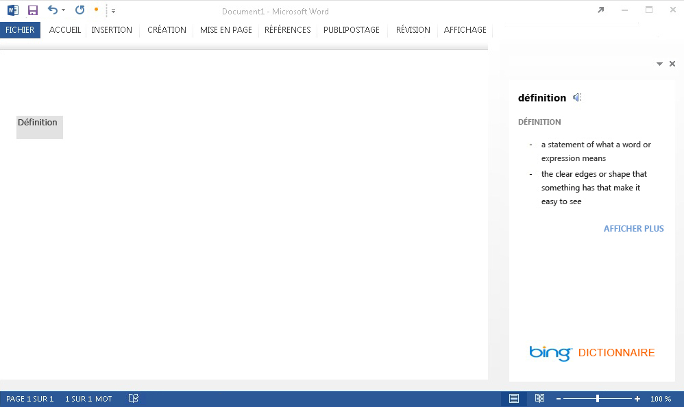
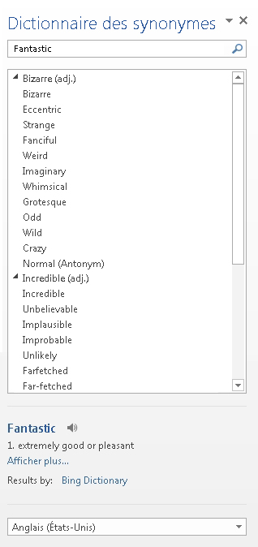

# <a name="create-a-dictionary-task-pane-add-in"></a><span data-ttu-id="d666e-102">Créer un complément dictionnaire du volet Office</span><span class="sxs-lookup"><span data-stu-id="d666e-102">Create a dictionary task pane add-in</span></span>


<span data-ttu-id="d666e-103">Cet article présente un exemple de complément du volet Office et d’un service web associé qui fournissent des définitions de dictionnaire ou des entrées du dictionnaire des synonymes sur la sélection actuelle de l’utilisateur dans un document Word 2013.</span><span class="sxs-lookup"><span data-stu-id="d666e-103">This article shows you an example of a task pane add-in with an accompanying web service that provides dictionary definitions or thesaurus synonyms for the user's current selection in a Word 2013 document.</span></span> 

<span data-ttu-id="d666e-104">Une Complément Office de dictionnaire est basée sur le complément du volet Office standard avec des fonctionnalités supplémentaires pour prendre en charge l’interrogation et l’affichage de définitions à partir d’un service web XML de dictionnaire à des endroits supplémentaires dans l’interface utilisateur du complément Office.</span><span class="sxs-lookup"><span data-stu-id="d666e-104">A dictionary Office Add-in is based on the standard task pane add-in with additional features to support querying and displaying definitions from a dictionary XML web service in additional places in the Office application's UI.</span></span> 

<span data-ttu-id="d666e-p101">Dans un complément du volet Office classique, un utilisateur sélectionne un mot ou une expression dans son document, puis la logique JavaScript sous-jacente du complément transmet cette sélection au service web XML du fournisseur de dictionnaire. La page web du fournisseur de dictionnaire s’actualise ensuite pour afficher les définitions de la sélection pour l’utilisateur. Le composant du service web XML renvoie jusqu’à trois définitions dans le format défini par le schéma XML OfficeDefinitions, qui sont ensuite affichées à l’utilisateur à d’autres endroits dans l’interface utilisateur de l’application Office d’hébergement. La figure 1 illustre l’expérience de sélection et d’affichage pour un complément de dictionnaire Bing s’exécutant dans Word 2013.</span><span class="sxs-lookup"><span data-stu-id="d666e-p101">In a typical dictionary task pane add-in, a user selects a word or phrase in their document, and the JavaScript logic behind the add-in passes this selection to the dictionary provider's XML web service. The dictionary provider's webpage then updates to show the definitions for the selection to the user. The XML web service component returns up to three definitions in the format defined by the OfficeDefinitions XML schema, which are then displayed to the user in other places in the hosting Office application's UI. Figure 1 shows the selection and display experience for a Bing-branded dictionary add-in that is running in Word 2013.</span></span>

<span data-ttu-id="d666e-109">*Figure 1. Complément de dictionnaire affichant des définitions pour le mot sélectionné*</span><span class="sxs-lookup"><span data-stu-id="d666e-109">*Figure 1. Dictionary add-in displaying definitions for the selected word*</span></span>



<span data-ttu-id="d666e-p102">Il vous incombe de déterminer si le fait de cliquer sur le lien **Afficher d’autres résultats** dans l’interface utilisateur HTML du complément de dictionnaire affiche d’autres informations dans le volet Office ou ouvre une fenêtre de navigateur séparée dans la page web complète pour le mot ou l’expression sélectionné. La figure 2 illustre la commande de menu contextuel **Définir** qui permet aux utilisateurs de lancer rapidement des dictionnaires installés. Les figures 3 à 5 montrent les endroits dans l’interface utilisateur d’Office où les services XML de dictionnaire sont utilisés pour fournir des définitions dans Word 2013.</span><span class="sxs-lookup"><span data-stu-id="d666e-p102">It is up to you to determine if clicking the  **See More** link in the dictionary add-in's HTML UI displays more information within the task pane or opens a separate browser window to the full webpage for the selected word or phrase. Figure 2 shows the  **Define** context menu command that enables users to quickly launch installed dictionaries. Figures 3 through 5 show the places in the Office UI where the dictionary XML services are used to provide definitions in Word 2013.</span></span>

<span data-ttu-id="d666e-114">*Figure 2. Commande Définir dans le menu contextuel*</span><span class="sxs-lookup"><span data-stu-id="d666e-114">*Figure 2. Define command in the context menu*</span></span>


<span data-ttu-id="d666e-116">*Figure 3. Définitions dans les volets Orthographe et Grammaire*</span><span class="sxs-lookup"><span data-stu-id="d666e-116">*Figure 3. Definitions in the Spelling and Grammar panes*</span></span>


<span data-ttu-id="d666e-118">*Figure 4. Définitions dans le volet Synonymes*</span><span class="sxs-lookup"><span data-stu-id="d666e-118">*Figure 4. Definitions in the Thesaurus pane*</span></span>




<span data-ttu-id="d666e-120">*Figure 5. Définitions dans le mode Lecture*</span><span class="sxs-lookup"><span data-stu-id="d666e-120">*Figure 5. Definitions in Reading Mode*</span></span>


<span data-ttu-id="d666e-122">Pour créer un complément du volet Office qui fournit une recherche de dictionnaire, vous créez deux composants principaux :</span><span class="sxs-lookup"><span data-stu-id="d666e-122">To create a task pane add-in that provides a dictionary lookup, you create two main components:</span></span> 


- <span data-ttu-id="d666e-123">Un service web XML qui recherche des définitions dans un service de dictionnaire, puis renvoie ces valeurs dans un format XML pouvant être consommé et affiché par le complément de dictionnaire.</span><span class="sxs-lookup"><span data-stu-id="d666e-123">An XML web service that looks up definitions from a dictionary service, and then returns those values in an XML format that can be consumed and displayed by the dictionary add-in.</span></span>
    
- <span data-ttu-id="d666e-124">Un complément du volet Office qui soumet la sélection actuelle de l’utilisateur au service web de dictionnaire, affiche des définitions, puis insère facultativement ces valeurs dans le document.</span><span class="sxs-lookup"><span data-stu-id="d666e-124">A task pane add-in that submits the user's current selection to the dictionary web service, displays definitions, and can optionally insert those values into the document.</span></span>
    
<span data-ttu-id="d666e-125">Les sections suivantes fournissent des exemples sur la création de ces composants.</span><span class="sxs-lookup"><span data-stu-id="d666e-125">The following sections provide examples of how to create these components.</span></span>

## <a name="creating-a-dictionary-xml-web-service"></a><span data-ttu-id="d666e-126">Création d’un service web XML de dictionnaire</span><span class="sxs-lookup"><span data-stu-id="d666e-126">Creating a dictionary XML web service</span></span>


<span data-ttu-id="d666e-p103">Le service web XML doit renvoyer des requêtes au service web sous la forme de code XML conforme au schéma XML OfficeDefinitions. Les deux sections suivantes décrivent le schéma XML OfficeDefinitions, et fournissent un exemple illustrant comment coder un service web XML qui renvoie des requêtes dans ce format XML.</span><span class="sxs-lookup"><span data-stu-id="d666e-p103">The XML web service must return queries to the web service as XML that conforms to the OfficeDefinitions XML schema. The following two sections describe the OfficeDefinitions XML schema, and provide an example of how to code an XML web service that returns queries in that XML format.</span></span>


### <a name="officedefinitions-xml-schema"></a><span data-ttu-id="d666e-129">Schéma XML OfficeDefinitions</span><span class="sxs-lookup"><span data-stu-id="d666e-129">OfficeDefinitions XML schema</span></span>

<span data-ttu-id="d666e-130">Le code suivant illustre le XSD pour le schéma XML OfficeDefinitions.</span><span class="sxs-lookup"><span data-stu-id="d666e-130">The following code shows the XSD for the OfficeDefinitions XML Schema.</span></span>


```XML
<?xml version="1.0" encoding="utf-8"?>
<xs:schema
  xmlns:xsi="https://www.w3.org/2001/XMLSchema-instance"
  xmlns:xs="https://www.w3.org/2001/XMLSchema"
  targetNamespace="http://schemas.microsoft.com/NLG/2011/OfficeDefinitions"
  xmlns="http://schemas.microsoft.com/NLG/2011/OfficeDefinitions">
  <xs:element name="Result">
    <xs:complexType>
      <xs:sequence>
        <xs:element name="SeeMoreURL" type="xs:anyURI"/>
        <xs:element name="Definitions" type="DefinitionListType"/>
      </xs:sequence>
    </xs:complexType>
  </xs:element>
  <xs:complexType name="DefinitionListType">
    <xs:sequence>
      <xs:element name="Definition" maxOccurs="3">
        <xs:simpleType>
          <xs:restriction base="xs:normalizedString">
            <xs:maxLength value="400"/>
          </xs:restriction>
        </xs:simpleType>
      </xs:element>
    </xs:sequence>
  </xs:complexType>
</xs:schema>
```

<span data-ttu-id="d666e-p104">Le XML renvoyé conforme au schéma OfficeDefinitions consiste en un élément racine  **Result** qui contient un élément **Definitions** comportant de zéro à trois éléments enfants **Definition**, chacun contenant des définitions ne comportant pas plus de 400 caractères. En outre, l’URL de la page complète sur le site de dictionnaire doit être fournie dans l’élément  **SeeMoreURL**. L’exemple suivant illustre la structure du code XML renvoyé conforme au schéma OfficeDefinitions.</span><span class="sxs-lookup"><span data-stu-id="d666e-p104">Returned XML that conforms to the OfficeDefinitions schema consists of a root  **Result** element that contains a **Definitions** element with from zero to three **Definition** child elements, each of which contains definitions that are no more than 400 characters in length. Additionally, the URL to the full page on the dictionary site must be provided in the **SeeMoreURL** element. The following example shows the structure of returned XML that conforms to the OfficeDefinitions schema.</span></span>

```XML
<?xml version="1.0" encoding="utf-8"?>
<Result xmlns="http://schemas.microsoft.com/NLG/2011/OfficeDefinitions">
  <SeeMoreURL xmlns="">www.bing.com/dictionary/search?q=example</SeeMoreURL>
  <Definitions xmlns="">
    <Definition>Definition1</Definition>
    <Definition>Definition2</Definition>
    <Definition>Definition3</Definition>
  </Definitions>
 </Result>

```


### <a name="sample-dictionary-xml-web-service"></a><span data-ttu-id="d666e-134">Exemple de service web XML de dictionnaire</span><span class="sxs-lookup"><span data-stu-id="d666e-134">Sample dictionary XML web service</span></span>

<span data-ttu-id="d666e-135">Le code C# suivant fournit un exemple simple d’écriture de code pour un service web XML qui renvoie le résultat d’une interrogation de dictionnaire dans le format XML OfficeDefinitions.</span><span class="sxs-lookup"><span data-stu-id="d666e-135">The following C# code provides a simple example of how to write code for an XML web service that returns the result of a dictionary query in the OfficeDefinitions XML format.</span></span>


```cs
using System;
using System.Collections.Generic;
using System.Linq;
using System.Web;
using System.Web.Services;
using System.Xml;
using System.Text;
using System.IO;
using System.Net;

/// <summary>
/// Summary description for _Default
/// </summary>
[WebService(Namespace = "http://tempuri.org/")]
[WebServiceBinding(ConformsTo = WsiProfiles.BasicProfile1_1)]
// To allow this web service to be called from script, using ASP.NET AJAX, uncomment the following line. 
// [System.Web.Script.Services.ScriptService]
public class WebService : System.Web.Services.WebService {

    public WebService () {

        // Uncomment the following line if using designed components 
        // InitializeComponent(); 
    }

    // You can replace this method entirely with your own method that gets definitions
    // from your data source, and then formats it into the OfficeDefinitions XML format. 
    // If you need a reference for constructing the returned XML, you can use this example as a basis.
    [WebMethod]
    public XmlDocument Define(string word)
    {

        StringBuilder sb = new StringBuilder();
        XmlWriter writer = XmlWriter.Create(sb);
        {
            writer.WriteStartDocument();
            
                writer.WriteStartElement("Result", "http://schemas.microsoft.com/NLG/2011/OfficeDefinitions");

            // See More URL should be changed to the dictionary publisher's page for that word on their website.
                    writer.WriteElementString("SeeMoreURL", "http://www.bing.com/search?q=" + word);

                    writer.WriteStartElement("Definitions");
            
                        writer.WriteElementString("Definition", "Definition 1 of " + word);
                        writer.WriteElementString("Definition", "Definition 2 of " + word);
                        writer.WriteElementString("Definition", "Definition 3 of " + word);
                   
                    writer.WriteEndElement();


                writer.WriteEndElement();
            
            writer.WriteEndDocument();
        }
        writer.Close();

        XmlDocument doc = new XmlDocument();
        doc.LoadXml(sb.ToString());

        return doc;
    }
}
```


## <a name="creating-the-components-of-a-dictionary-add-in"></a><span data-ttu-id="d666e-136">Création des composants d’un complément de dictionnaire</span><span class="sxs-lookup"><span data-stu-id="d666e-136">Creating the components of a dictionary add-in</span></span>


<span data-ttu-id="d666e-137">Un complément de dictionnaire est composé de trois fichiers de composants principaux :</span><span class="sxs-lookup"><span data-stu-id="d666e-137">A dictionary add-in consists of three main component files:</span></span>


- <span data-ttu-id="d666e-138">Un fichier de manifeste XML qui décrit le complément.</span><span class="sxs-lookup"><span data-stu-id="d666e-138">An XML manifest file that describes the add-in.</span></span>
    
- <span data-ttu-id="d666e-139">Un fichier HTML qui fournit l’interface utilisateur du complément.</span><span class="sxs-lookup"><span data-stu-id="d666e-139">An HTML file that provides the add-in's UI.</span></span>
    
- <span data-ttu-id="d666e-140">Un fichier JavaScript qui fournit la logique pour obtenir la sélection de l’utilisateur dans le document, envoie la sélection sous forme de requête au service web, puis affiche les résultats renvoyés dans l’interface utilisateur du complément.</span><span class="sxs-lookup"><span data-stu-id="d666e-140">A JavaScript file that provides logic to get the user's selection from the document, sends the selection as a query to the web service, and then displays returned results in the add-in's UI.</span></span>
    

### <a name="creating-a-dictionary-add-ins-manifest-file"></a><span data-ttu-id="d666e-141">Création du fichier de manifeste d’un complément de dictionnaire</span><span class="sxs-lookup"><span data-stu-id="d666e-141">Creating a dictionary add-in's manifest file</span></span>

<span data-ttu-id="d666e-142">L’exemple suivant illustre un fichier de manifeste pour un complément de dictionnaire.</span><span class="sxs-lookup"><span data-stu-id="d666e-142">The following is an example manifest file for a dictionary add-in.</span></span>


```XML
<?xml version="1.0" encoding="utf-8"?>
<OfficeApp xmlns="http://schemas.microsoft.com/office/appforoffice/1.0" xmlns:xsi="https://www.w3.org/2001/XMLSchema-instance" xsi:type="TaskPaneApp">
  <Id>7164e750-dc86-49c0-b548-1bac57abdc7c</Id>
  <Version>15.0</Version>
  <ProviderName>Microsoft Office Demo Dictionary</ProviderName>
  <DefaultLocale>en-us</DefaultLocale>
  <!--DisplayName is the name that will appear in the user's list of applications.-->
  <DisplayName DefaultValue="Microsoft Office Demo Dictionary" />
  <!--Description is a 2-3 sentence description of this dictionary. -->
  <Description DefaultValue="The Microsoft Office Demo Dictionary is an example built to demonstrate how a publisher could create a dictionary that integrates with Office. It does not return real definitions." />
  <!--IconUrl is the URI for the icon that will appear in the user's list of applications.-->
  <IconUrl DefaultValue="http://officeimg.vo.msecnd.net/_layouts/images/general/office_logo.jpg" />
  <!--Capabilities specifies the kind of host application your dictionary add-in will support. You shouldn't have to modify this area.-->
  <Capabilities>
    <Capability Name="Workbook"/>
    <Capability Name="Document"/>
    <Capability Name="Project"/>
  </Capabilities>
  <DefaultSettings>
    <!--SourceLocation is the URL for your dictionary-->
    <SourceLocation DefaultValue="http://christophernlg/ExampleDictionary/DictionaryHome.html" />
  </DefaultSettings>
  <!--Permissions is the set of permissions a user will have to give your dictionary. If you need write access, such as to allow a user to replace the highlighted word with a synonym, use ReadWriteDocument. -->
  <Permissions>ReadDocument</Permissions>
  <Dictionary>
    <!--TargetDialects is the set of regional languages your dictionary contains. For example, if your dictionary applies to Spanish (Mexico) and Spanish (Peru), but not Spanish (Spain), you can specify that here. Do not put more than one language (for example, Spanish and English) here. Publish separate languages as separate dictionaries. -->
    <TargetDialects>
      <TargetDialect>EN-AU</TargetDialect>
      <TargetDialect>EN-BZ</TargetDialect>
      <TargetDialect>EN-CA</TargetDialect>
      <TargetDialect>EN-029</TargetDialect>
      <TargetDialect>EN-HK</TargetDialect>
      <TargetDialect>EN-IN</TargetDialect>
      <TargetDialect>EN-ID</TargetDialect>
      <TargetDialect>EN-IE</TargetDialect>
      <TargetDialect>EN-JM</TargetDialect>
      <TargetDialect>EN-MY</TargetDialect>
      <TargetDialect>EN-NZ</TargetDialect>
      <TargetDialect>EN-PH</TargetDialect>
      <TargetDialect>EN-SG</TargetDialect>
      <TargetDialect>EN-ZA</TargetDialect>
      <TargetDialect>EN-TT</TargetDialect>
      <TargetDialect>EN-GB</TargetDialect>
      <TargetDialect>EN-US</TargetDialect>
      <TargetDialect>EN-ZW</TargetDialect>
    </TargetDialects>
    <!--QueryUri is the address of this dictionary's XML web service (which is used to put definitions in additional contexts, such as the spelling checker.)-->
    <QueryUri DefaultValue="http://christophernlg/ExampleDictionary/WebService.asmx/Define?word="/>
    <!--Citation Text, Dictionary Name, and Dictionary Home Page will be combined to form the citation line (for example, this would produce "Examples by: Microsoft", where "Microsoft" is a hyperlink to http://www.microsoft.com).-->
    <CitationText DefaultValue="Examples by: " />
    <DictionaryName DefaultValue="Microsoft" />
    <DictionaryHomePage DefaultValue="http://www.microsoft.com" />
  </Dictionary>
</OfficeApp>
```

<span data-ttu-id="d666e-p105">L’élément  **Dictionary** et ses éléments enfants qui sont spécifiques à la création d’un fichier de manifeste de complément de dictionnaire sont décrits dans les sections suivantes. Pour plus d’informations sur les autres éléments du fichier de manifeste, voir [Manifeste XML des compléments Office](../develop/add-in-manifests.md).</span><span class="sxs-lookup"><span data-stu-id="d666e-p105">The  **Dictionary** element and its child elements that are specific to creating a dictionary add-in's manifest file are described in the following sections. For information about the other elements in the manifest file, see [Office Add-ins XML manifest](../develop/add-in-manifests.md).</span></span>


### <a name="dictionary-element"></a><span data-ttu-id="d666e-145">Élément Dictionary</span><span class="sxs-lookup"><span data-stu-id="d666e-145">Dictionary element</span></span>


<span data-ttu-id="d666e-146">Spécifie les paramètres pour les compléments de dictionnaire.</span><span class="sxs-lookup"><span data-stu-id="d666e-146">Specifies settings for dictionary add-ins.</span></span>

 <span data-ttu-id="d666e-147">**Élément parent**</span><span class="sxs-lookup"><span data-stu-id="d666e-147">**Parent element**</span></span>

 `<OfficeApp>`

 <span data-ttu-id="d666e-148">**Éléments enfants**</span><span class="sxs-lookup"><span data-stu-id="d666e-148">**Child elements**</span></span>

 <span data-ttu-id="d666e-149">`<TargetDialects>`,  `<QueryUri>`,  `<CitationText>`,  `<DictionaryName>`,  `<DictionaryHomePage>`</span><span class="sxs-lookup"><span data-stu-id="d666e-149"></span></span>

 <span data-ttu-id="d666e-150">**Notes**</span><span class="sxs-lookup"><span data-stu-id="d666e-150">**Remarks**</span></span>

<span data-ttu-id="d666e-151">L’élément **Dictionary** et ses éléments enfants sont ajoutés au manifeste d’un complément du volet Office quand vous créez un complément de dictionnaire.</span><span class="sxs-lookup"><span data-stu-id="d666e-151">The  **Dictionary** element and its child elements are added to the manifest of a task pane add-in when you create a dictionary add-in.</span></span>


#### <a name="targetdialects-element"></a><span data-ttu-id="d666e-152">Élément TargetDialects</span><span class="sxs-lookup"><span data-stu-id="d666e-152">TargetDialects element</span></span>


<span data-ttu-id="d666e-p106">Indique les langues régionales prises en charge par ce dictionnaire. Requis pour les compléments de dictionnaire.</span><span class="sxs-lookup"><span data-stu-id="d666e-p106">Specifies the regional languages that this dictionary supports. Required for dictionary add-ins.</span></span>

 <span data-ttu-id="d666e-155">**Élément parent**</span><span class="sxs-lookup"><span data-stu-id="d666e-155">**Parent element**</span></span>

 `<Dictionary>`

 <span data-ttu-id="d666e-156">**Élément enfant**</span><span class="sxs-lookup"><span data-stu-id="d666e-156">**Child element**</span></span>

 `<TargetDialect>`

 <span data-ttu-id="d666e-157">**Notes**</span><span class="sxs-lookup"><span data-stu-id="d666e-157">**Remarks**</span></span>

<span data-ttu-id="d666e-p107">L’élément**TargetDialects** et ses éléments enfant indiquent l’ensemble de langues régionales disponibles dans votre dictionnaire. Par exemple, si votre dictionnaire s’applique à l’espagnol (Mexique) et à l’espagnol (Pérou), mais pas à l’espagnol (Espagne), vous pouvez le préciser dans cet élément. N’indiquez pas plus d’une langue (par exemple, espagnol et anglais) dans ce manifeste. Publiez les langues distinctes dans des dictionnaires différents.</span><span class="sxs-lookup"><span data-stu-id="d666e-p107">The  **TargetDialects** element and its child elements specify the set of regional languages your dictionary contains. For example, if your dictionary applies to both Spanish (Mexico) and Spanish (Peru), but not Spanish (Spain), you can specify that in this element. Do not specify more than one language (e.g., Spanish and English) in this manifest. Publish separate languages as separate dictionaries.</span></span>

 <span data-ttu-id="d666e-162">**Exemple**</span><span class="sxs-lookup"><span data-stu-id="d666e-162">**Example**</span></span>

```XML
<TargetDialects>
  <TargetDialect>EN-AU</TargetDialect>
  <TargetDialect>EN-BZ</TargetDialect>
  <TargetDialect>EN-CA</TargetDialect>
  <TargetDialect>EN-029</TargetDialect>
  <TargetDialect>EN-HK</TargetDialect>
  <TargetDialect>EN-IN</TargetDialect>
  <TargetDialect>EN-ID</TargetDialect>
  <TargetDialect>EN-IE</TargetDialect>
  <TargetDialect>EN-JM</TargetDialect>
  <TargetDialect>EN-MY</TargetDialect>
  <TargetDialect>EN-NZ</TargetDialect>
  <TargetDialect>EN-PH</TargetDialect>
  <TargetDialect>EN-SG</TargetDialect>
  <TargetDialect>EN-ZA</TargetDialect>
  <TargetDialect>EN-TT</TargetDialect>
  <TargetDialect>EN-GB</TargetDialect>
  <TargetDialect>EN-US</TargetDialect>
  <TargetDialect>EN-ZW</TargetDialect>
</TargetDialects>
```


#### <a name="targetdialect-element"></a><span data-ttu-id="d666e-163">Élément TargetDialect</span><span class="sxs-lookup"><span data-stu-id="d666e-163">TargetDialect element</span></span>


<span data-ttu-id="d666e-p108">Spécifie une langue régionale prise en charge par ce dictionnaire. Requis pour les compléments de dictionnaire.</span><span class="sxs-lookup"><span data-stu-id="d666e-p108">Specifies a regional language that this dictionary supports. Required for dictionary add-ins.</span></span>

 <span data-ttu-id="d666e-166">**Élément parent**</span><span class="sxs-lookup"><span data-stu-id="d666e-166">**Parent element**</span></span>

 `<TargetDialects>`

 <span data-ttu-id="d666e-167">**Remarques**</span><span class="sxs-lookup"><span data-stu-id="d666e-167">**Remarks**</span></span>

<span data-ttu-id="d666e-168">Spécifie la valeur pour une langue régionale dans le format de balise RFC1766`language`, comme EN-US.</span><span class="sxs-lookup"><span data-stu-id="d666e-168">Specify the value for a regional language in the RFC1766  `language` tag format, such as EN-US.</span></span>

 <span data-ttu-id="d666e-169">**Exemple**</span><span class="sxs-lookup"><span data-stu-id="d666e-169">**Example**</span></span>


```XML
<TargetDialect>EN-US</TargetDialect>
```


#### <a name="queryuri-element"></a><span data-ttu-id="d666e-170">Élément QueryUri</span><span class="sxs-lookup"><span data-stu-id="d666e-170">QueryUri element</span></span>


<span data-ttu-id="d666e-p109">Spécifie le point d’extrémité pour le service de requête de dictionnaire. Requis pour les compléments de dictionnaire.</span><span class="sxs-lookup"><span data-stu-id="d666e-p109">Specifies the endpoint for the dictionary query service. Required for dictionary add-ins.</span></span>

 <span data-ttu-id="d666e-173">**Élément parent**</span><span class="sxs-lookup"><span data-stu-id="d666e-173">**Parent element**</span></span>

 `<Dictionary>`

 <span data-ttu-id="d666e-174">**Remarques**</span><span class="sxs-lookup"><span data-stu-id="d666e-174">**Remarks**</span></span>

<span data-ttu-id="d666e-p110">C’est l’URI du service web XML pour le fournisseur de dictionnaire. La requête correctement formulée sera ajoutée à cette URI.</span><span class="sxs-lookup"><span data-stu-id="d666e-p110">This is the URI of the XML web service for the dictionary provider. The properly escaped query will be appended to this URI.</span></span> 

 <span data-ttu-id="d666e-177">**Exemple**</span><span class="sxs-lookup"><span data-stu-id="d666e-177">**Example**</span></span>


```XML
<QueryUri DefaultValue="http://msranlc-lingo1/proof.aspx?q="/>
```


#### <a name="citationtext-element"></a><span data-ttu-id="d666e-178">Élément CitationText</span><span class="sxs-lookup"><span data-stu-id="d666e-178">CitationText element</span></span>


<span data-ttu-id="d666e-p111">Spécifie le texte à utiliser dans les citations. Requis pour les compléments de dictionnaire.</span><span class="sxs-lookup"><span data-stu-id="d666e-p111">Specifies the text to use in citations. Required for dictionary add-ins.</span></span>

 <span data-ttu-id="d666e-181">**Élément parent**</span><span class="sxs-lookup"><span data-stu-id="d666e-181">**Parent element**</span></span>

 `<Dictionary>`

 <span data-ttu-id="d666e-182">**Remarques**</span><span class="sxs-lookup"><span data-stu-id="d666e-182">**Remarks**</span></span>

<span data-ttu-id="d666e-183">Cet élément spécifie le début du texte de citation qui sera affiché sur une ligne sous le contenu qui est renvoyé du service web (par exemple, « Résultats par : » ou « Optimisé par : »).</span><span class="sxs-lookup"><span data-stu-id="d666e-183">This element specifies the beginning of the citation text that will be displayed on a line below the content that is returned from the web service (for example, "Results by: " or "Powered by: ").</span></span>

<span data-ttu-id="d666e-p112">Pour cet élément, vous pouvez spécifier des valeurs pour des paramètres régionaux supplémentaires en utilisant l’élément  **Override**. Par exemple si un utilisateur exécute le SKU espagnol d’Office, mais utilise un dictionnaire anglais, ceci permet à la ligne de citation de prendre la valeur « Resultados por: Bing » et non « Results by: Bing ». Pour plus d’informations sur la spécification de valeurs pour des paramètres régionaux supplémentaires, voir la section « Fourniture de paramètres pour différents paramètres régionaux » dans [Manifeste XML des compléments Office](../develop/add-in-manifests.md).</span><span class="sxs-lookup"><span data-stu-id="d666e-p112">For this element, you can specify values for additional locales by using the  **Override** element. For example, if a user is running the Spanish SKU of Office, but using an English dictionary, this allows the citation line to read "Resultados por: Bing" rather than "Results by: Bing". For more information about how to specify values for additional locales, see the section "Providing settings for different locales" in [Office Add-ins XML manifest](../develop/add-in-manifests.md).</span></span>

 <span data-ttu-id="d666e-187">**Exemple**</span><span class="sxs-lookup"><span data-stu-id="d666e-187">**Example**</span></span>


```XML
<CitationText DefaultValue="Results by: " />
```


#### <a name="dictionaryname-element"></a><span data-ttu-id="d666e-188">Élément DictionaryName</span><span class="sxs-lookup"><span data-stu-id="d666e-188">DictionaryName element</span></span>


<span data-ttu-id="d666e-p113">Spécifie le nom de ce dictionnaire. Requis pour les compléments de dictionnaire.</span><span class="sxs-lookup"><span data-stu-id="d666e-p113">Specifies the name of this dictionary. Required for dictionary add-ins.</span></span>

 <span data-ttu-id="d666e-191">**Élément parent**</span><span class="sxs-lookup"><span data-stu-id="d666e-191">**Parent element**</span></span>

 `<Dictionary>`

 <span data-ttu-id="d666e-192">**Remarques**</span><span class="sxs-lookup"><span data-stu-id="d666e-192">**Remarks**</span></span>

<span data-ttu-id="d666e-p114">Cet élément spécifie le texte du lien dans le texte de citation. Le texte de citation s’affiche sur une ligne sous le contenu qui est renvoyé du service web.</span><span class="sxs-lookup"><span data-stu-id="d666e-p114">This element specifies the link text in the citation text. Citation text is displayed on a line below the content that is returned from the web service.</span></span>

<span data-ttu-id="d666e-195">Pour cet élément, vous pouvez spécifier des valeurs pour des paramètres régionaux supplémentaires.</span><span class="sxs-lookup"><span data-stu-id="d666e-195">For this element, you can specify values for additional locales.</span></span>

 <span data-ttu-id="d666e-196">**Exemple**</span><span class="sxs-lookup"><span data-stu-id="d666e-196">**Example**</span></span>

```XML
<DictionaryName DefaultValue="Bing Dictionary" />
```


#### <a name="dictionaryhomepage-element"></a><span data-ttu-id="d666e-197">Élément DictionaryHomePage</span><span class="sxs-lookup"><span data-stu-id="d666e-197">DictionaryHomePage element</span></span>


<span data-ttu-id="d666e-p115">Spécifie l’URL de la page d’accueil pour le dictionnaire. Requis pour les compléments de dictionnaire.</span><span class="sxs-lookup"><span data-stu-id="d666e-p115">Specifies the URL of the home page for the dictionary. Required for dictionary add-ins.</span></span>

 <span data-ttu-id="d666e-200">**Élément parent**</span><span class="sxs-lookup"><span data-stu-id="d666e-200">**Parent element**</span></span>

 `<Dictionary>`

 <span data-ttu-id="d666e-201">**Remarques**</span><span class="sxs-lookup"><span data-stu-id="d666e-201">**Remarks**</span></span>

<span data-ttu-id="d666e-p116">Cet élément spécifie l’URL du lien dans le texte de citation. Le texte de citation s’affiche sur une ligne sous le contenu qui est renvoyé du service web.</span><span class="sxs-lookup"><span data-stu-id="d666e-p116">This element specifies the link URL in the citation text. Citation text is displayed on a line below the content that is returned from the web service.</span></span>

<span data-ttu-id="d666e-204">Pour cet élément, vous pouvez spécifier des valeurs pour des paramètres régionaux supplémentaires.</span><span class="sxs-lookup"><span data-stu-id="d666e-204">For this element, you can specify values for additional locales.</span></span>

 <span data-ttu-id="d666e-205">**Exemple**</span><span class="sxs-lookup"><span data-stu-id="d666e-205">**Example**</span></span>


```XML
<DictionaryHomePage DefaultValue="http://www.bing.com" />
```


### <a name="creating-a-dictionary-add-ins-html-user-interface"></a><span data-ttu-id="d666e-206">Création de l’interface utilisateur HTML du complément de dictionnaire</span><span class="sxs-lookup"><span data-stu-id="d666e-206">Creating a dictionary add-in's HTML user interface</span></span>

<span data-ttu-id="d666e-p117">Les deux exemples suivants montrent les fichiers HTML et CSS pour l’interface utilisateur du complément de dictionnaire de démonstration. Pour découvrir comment l’interface utilisateur s’affiche dans le volet Office du complément, voir la figure 6 à la suite du code. Pour voir comment l’implémentation du JavaScript dans le fichier Dictionary.js fournit la logique de programmation de cette interface utilisateur HTML, voir « Écriture de l’implémentation JavaScript » immédiatement à la suite de cette section.</span><span class="sxs-lookup"><span data-stu-id="d666e-p117">The following two examples show the HTML and CSS files for the UI of the Demo Dictionary add-in. To view how the UI is displayed in the add-in's task pane, see Figure 6 following the code. To see how the implementation of the JavaScript in the Dictionary.js file provides programming logic for this HTML UI, see "Writing the JavaScript implementation" immediately following this section.</span></span>

```HTML
<!DOCTYPE html>
<html>

<head>
<meta http-equiv="X-UA-Compatible" content="IE=Edge"/>

<!--The title will not be shown but is supplied to ensure valid HTML.-->
<title>Example Dictionary</title>

<!--Required library includes.-->
<script type="text/javascript" src="http://ajax.microsoft.com/ajax/4.0/1/MicrosoftAjax.js"></script>
<script type="text/javascript" src="office.js"></script>

<!--Optional library includes.-->
<script type="text/javascript" src="http://ajax.aspnetcdn.com/ajax/jQuery/jquery-1.5.1.js"></script>

<!--App-specific CSS and JS.-->
<link rel="Stylesheet" type="text/css" href="style.css" />
<script type="text/ecmascript" src="dictionary.js"></script>
</head>

<body>
<div id="mainContainer">
    <div id="header">
        <span id="headword"></span>
        <span id="pronunciation">(<a id="pronunciationLink">Pronounce</a>)</span>
    </div>
    <ol id="definitions">
    </ol>
    <div id="SeeMore">
    <a id="SeeMoreLink">See More...</a>
    </div>
</div>
</body>

</html>
```

<span data-ttu-id="d666e-210">L’exemple suivant montre le contenu de Style.css.</span><span class="sxs-lookup"><span data-stu-id="d666e-210">The following example shows the contents of Style.css.</span></span>

```CSS
#mainContainer
{
    font-family: Segoe UI;
    font-size: 11pt;
}

#headword
{
    font-family: Segoe UI Semibold;
    color: #262626;
}

#pronunciation
{
    margin-left: 2px;
    margin-right: 2px;
}

#definitions
{
    font-size: 8.5pt;
}
a
{
    font-size: 8pt;
    color: #336699;
    text-decoration: none;
}
a:visited
{
    color: #993366;
}
a:hover, a:active
{  
    text-decoration: underline;
}
```

<span data-ttu-id="d666e-211">*Figure 6. Interface utilisateur du dictionnaire de démonstration*</span><span class="sxs-lookup"><span data-stu-id="d666e-211">*Figure 6. Demo dictionary UI*</span></span>


### <a name="writing-the-javascript-implementation"></a><span data-ttu-id="d666e-213">Écriture de l’implémentation JavaScript</span><span class="sxs-lookup"><span data-stu-id="d666e-213">Writing the JavaScript implementation</span></span>


<span data-ttu-id="d666e-p118">L’exemple suivant montre l’implémentation JavaScript dans le fichier Dictionary.js qui est appelé dans la page HTML du complément pour fournir la logique de programmation du complément de dictionnaire de démonstration. Ce script réutilise le service web XML décrit précédemment. Lorsqu’il est placé dans le même répertoire que l’exemple de service web, le script obtient des définitions de ce service. Il peut être utilisé avec un service web XML conforme au schéma OfficeDefinitions public en modifiant la variable  `xmlServiceURL` en haut du fichier, et en remplaçant ensuite la clé de l’API Bing pour obtenir des prononciations adéquates.</span><span class="sxs-lookup"><span data-stu-id="d666e-p118">The following example shows the JavaScript implementation in the Dictionary.js file that is called from the add-in's HTML page to provide the programming logic for the Demo Dictionary add-in. This script reuses the XML web service described previously. When placed in the same directory as the example web service, the script will get definitions from that service. It can be used with a public OfficeDefinitions-conforming XML web service by modifying the  `xmlServiceURL` variable at the top of the file, and then replacing the Bing API key for pronunciations with a properly registered one.</span></span>

<span data-ttu-id="d666e-218">Les principaux membres de l’API JavaScript pour Office (Office.js) qui sont appelés à partir de cette implémentation sont les suivants :</span><span class="sxs-lookup"><span data-stu-id="d666e-218">The primary members of the JavaScript API for Office (Office.js) that are called from this implementation are as follows:</span></span>


- <span data-ttu-id="d666e-219">L’événement [initialize](/javascript/api/office) de l’objet **Office**, qui est déclenché lors de l’initialisation du contexte complément et donne accès à une instance de l’objet [Document](/javascript/api/office/office.document), qui représente le document avec lequel complément interagit.</span><span class="sxs-lookup"><span data-stu-id="d666e-219">The [initialize](/javascript/api/office) event of the **Office** object, which is raised when the add-in context is initialized, and provides access to a [Document](/javascript/api/office/office.document) object instance that represents the document the add-in is interacting with.</span></span>
    
- <span data-ttu-id="d666e-220">La méthode [addHandlerAsync](/javascript/api/office/office.document#addhandlerasync-eventtype--handler--options--callback-) de l’objet **Document**, qui est appelée dans la fonction  **initialize** afin d’ajouter un gestionnaire d’événements pour l’événement [SelectionChanged](/javascript/api/office/office.documentselectionchangedeventargs) du document dans le but de surveiller les changements de sélection de l’utilisateur.</span><span class="sxs-lookup"><span data-stu-id="d666e-220">The [addHandlerAsync](/javascript/api/office/office.document#addhandlerasync-eventtype--handler--options--callback-) method of the **Document** object, which is called in the **initialize** function to add an event handler for the [SelectionChanged](/javascript/api/office/office.documentselectionchangedeventargs) event of the document to listen for user selection changes.</span></span>
    
- <span data-ttu-id="d666e-221">La méthode [getSelectedDataAsync](/javascript/api/office/office.document#getselecteddataasync-coerciontype--options--callback-) de l’objet **Document** qui est appelée dans la fonction `tryUpdatingSelectedWord()` lorsque le gestionnaire d’événements **SelectionChanged** est déclenché pour obtenir le mot ou la phrase que l’utilisateur a sélectionné, appliquer le texte brut, puis exécuter la fonction de rappel asynchrone `selectedTextCallback`.</span><span class="sxs-lookup"><span data-stu-id="d666e-221">The [getSelectedDataAsync](/javascript/api/office/office.document#getselecteddataasync-coerciontype--options--callback-) method of the **Document** object, which is called in the `tryUpdatingSelectedWord()` function when the **SelectionChanged** event handler is raised to get the word or phrase the user selected, coerce it to plain text, and then execute the `selectedTextCallback` asynchronous callback function.</span></span>
    
- <span data-ttu-id="d666e-p119">Lorsque la fonction de rappel asynchrone  `selectTextCallback` qui est transmise comme l’argument _callback_ de la méthode **getSelectedDataAsync** s’exécute, elle obtient la valeur du texte sélectionné lors du renvoi du rappel. Elle obtient la valeur de l’argument _selectedText_ du rappel (qui est de type [AsyncResult](/javascript/api/office/office.asyncresult)) en utilisant la propriété [value](/javascript/api/office/office.asyncresult#status) de l’objet **AsyncResult** renvoyé.</span><span class="sxs-lookup"><span data-stu-id="d666e-p119">When the  `selectTextCallback` asynchronous callback function that is passed as the _callback_ argument of the **getSelectedDataAsync** method executes, it gets the value of the selected text when the callback returns. It gets that value from the callback's _selectedText_ argument (which is of type [AsyncResult](/javascript/api/office/office.asyncresult)) by using the [value](/javascript/api/office/office.asyncresult#status) property of the returned **AsyncResult** object.</span></span>
    
- <span data-ttu-id="d666e-p120">Le reste du code dans la fonction  `selectedTextCallback` interroge le service web XML pour obtenir des définitions. Il appelle également les API de Microsoft Translator pour fournir l’URL d’un fichier .wav produisant la prononciation du mot sélectionné.</span><span class="sxs-lookup"><span data-stu-id="d666e-p120">The rest of the code in the  `selectedTextCallback` function queries the XML web service for definitions. It also calls into the Microsoft Translator APIs to provide the URL of a .wav file that has the selected word's pronunciation.</span></span>
    
- <span data-ttu-id="d666e-226">Le reste du code dans Dictionary.js affiche la liste de définitions et le lien de prononciation dans l’interface utilisateur HTML du complément.</span><span class="sxs-lookup"><span data-stu-id="d666e-226">The remaining code in Dictionary.js displays the list of definitions and the pronunciation link in the add-in's HTML UI.</span></span>
    


```javascript
// The document the dictionary add-in is interacting with.
var _doc; 
// The last looked-up word, which is also the currently displayed word.
var lastLookup; 
// For demo purposes only!! Get an AppID if you intend to use the Pronunciation service for your feature.
var appID="3D8D4E1888B88B975484F0CA25CDD24AAC457ED8"; 

// The base URL for the OfficeDefinitions-conforming XML web service to query for definitions.
var xmlServiceUrl = "WebService.asmx/Define?Word="; 

// Initialize the add-in. 
// The initialize function is required for all add-ins.
Office.initialize = function (reason) {
    // Checks for the DOM to load using the jQuery ready function.
    $(document).ready(function () {
    // After the DOM is loaded, app-specific code can run.
    // Store a reference to the current document.
    _doc = Office.context.document; 
    // Check whether text is already selected.
    tryUpdatingSelectedWord(); 
    _doc.addHandlerAsync("documentSelectionChanged", tryUpdatingSelectedWord); //Add a handler to refresh when the user changes selection.
    });
}

// Executes when event is raised on user's selection changes, and at initialization time. 
// Gets the current selection and passes that to asynchronous callback method.
function tryUpdatingSelectedWord() {
    _doc.getSelectedDataAsync(Office.CoercionType.Text, selectedTextCallback); 
}

// Async callback that executes when the add-in gets the user's selection.
// Determines whether anything should be done. If so, it makes requests that will be passed to various functions.
function selectedTextCallback(selectedText) {
    selectedText = $.trim(selectedText.value);
    // Be sure user has selected text. The SelectionChanged event is raised every time the user moves the cursor, even if no selection.
    if (selectedText != "") { 
        // Check whether user selected the same word the pane is currently displaying to avoid unnecessary web calls.
        if (selectedText != lastLookup) { 
            // Update the lastLookup variable.
            lastLookup = selectedText; 
            // Set the "headword" span to the word you looked up.
            $("#headword").text(selectedText); 
            // AJAX request to get definitions for the selected word; pass that to refreshDefinitions.
            $.ajax(xmlServiceUrl + selectedText, { dataType: 'xml', success: refreshDefinitions, error: errorHandler }); 
            // AJAX request to the Microsoft Translator APIs. Gets the URL of a WAV file with pronunciation, which is passed to refreshPronunciation. See http://www.microsofttranslator.com/dev for details.
            $.ajax("http://api.microsofttranslator.com/V2/Ajax.svc/Speak?oncomplete=refreshPronunciation&amp;appId=" + appID + "&amp;text=" + selectedText + "&amp;language=en-us", { dataType: 'script', success: null, error: errorHandler }); 
        }
    }
}

// This function is called when the add-in gets back the definitions target word.
// It removes the old definitions and replaces them with the definitions for the current word.
// It also sets the "See More" link.
function refreshDefinitions(data, textStatus, jqXHR) {
    $(".definition").remove();
    // Make a new list item for each returned definition that was returned, set the CSS class, and append it to the definitions div.
    $(data).find("Definition").each(function () {
        $(document.createElement("li")).text($(this).text()).addClass("definition").appendTo($("#definitions"));
    });
    $("#SeeMoreLink").attr("href", $(data).find("SeeMoreURL").text()); //Change the "See More" link to direct to the correct URL.
}

// This function is called when the add-in gets back the link to the pronunciation
// to set the "Pronounce" link to the URL of the .WAV file.
function refreshPronunciation(data) {
    $("#pronunciationLink").attr("href", data);
}

// Basic error handler that writes to a div with id='message'.
function errorHandler(jqXHR, textStatus, errorThrown) {
    document.getElementById('message').innerText += errorThrown;
}

```

