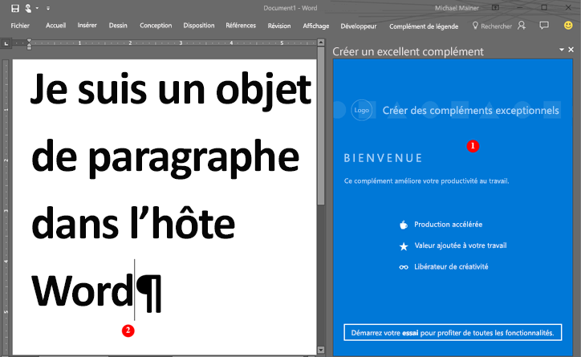

# <a name="word-add-ins-overview"></a>Présentation des compléments Word

Vous souhaitez créer une solution qui étend les fonctionnalités de Word ? Par exemple, une solution qui assemble automatiquement les documents ? Ou une solution qui relie les données et y accède dans un document Word à partir d’autres sources de données ? Vous pouvez utiliser la plateforme de compléments Office. Elle comprend l’API JavaScript pour Word et l’API JavaScript pour Office, pour développer les clients Word qui s’exécutent sur un ordinateur de bureau Windows, un Mac ou dans le cloud.

Les compléments Word font partie des nombreuses options de développement disponibles sur la [plateforme de compléments Office](../overview/office-add-ins.md). Vous pouvez utiliser les commandes de complément pour développer l’interface utilisateur Word et créer des volets Office qui exécutent un code JavaScript pour interagir avec le contenu d’un document Word. Tout code que vous pouvez exécuter dans un navigateur peut s’exécuter dans un complément Word. Les compléments qui interagissent avec le contenu d’un document Word créent des requêtes qui agissent sur des objets Word et synchronisent l’état des objets. 

> [!NOTE]
> Lorsque vous créez votre complément, si vous envisagez de le [publier](../publish/publish.md) dans AppSource, assurez-vous que vous respectez les [stratégies de validation AppSource](/office/dev/store/validation-policies). Par exemple, pour réussir la validation, votre complément doit fonctionner sur toutes les plateformes qui prennent en charge les méthodes définies (pour en savoir plus, consultez la [section 4.12](/office/dev/store/validation-policies#4-apps-and-add-ins-behave-predictably) et la page relative à la [disponibilité des compléments Office sur les plateformes et les hôtes](../overview/office-add-in-availability.md)).

La figure suivante montre un exemple d’un complément Word qui s’exécute dans un volet des tâches.

*Figure 1. Complément exécuté dans un volet Office de Word*



Le complément Word (1) peut envoyer des demandes dans le document Word (2) et utiliser JavaScript pour accéder à l’objet de paragraphe et mettre à jour, supprimer ou déplacer le paragraphe. Par exemple, le code suivant montre comment ajouter une nouvelle phrase à ce paragraphe.

```js
Word.run(function (context) {
    var paragraphs = context.document.getSelection().paragraphs;
    paragraphs.load();
    return context.sync().then(function () {
        paragraphs.items[0].insertText(' New sentence in the paragraph.',
                                       Word.InsertLocation.end);
    }).then(context.sync);
});

```

Vous pouvez utiliser n’importe quelle technologie de serveur web pour héberger votre complément Word, comme ASP.NET, NodeJS ou Python. Utilisez votre infrastructure côté client préférée (Ember, Backbone, Angular, React), ou utilisez VanillaJS pour développer votre solution et utilisez des services comme Azure pour [authentifier](../develop/use-the-oauth-authorization-framework-in-an-office-add-in.md) et héberger votre application.

Les interfaces API JavaScript pour Word permettent à votre application d’accéder aux objets et aux métadonnées situés dans le document Word. Vous pouvez utiliser ces API pour créer des compléments destinés à :

* Word 2013 ou une version ultérieure pour Windows
* Word Online
* Word 2016 ou une version ultérieure pour Windows
* Word pour iOS

Écrivez votre complément une seule fois. Celui-ci s’exécutera dans toutes les versions de Word sur plusieurs plateformes. Pour plus d’informations, voir la page relative à la [disponibilité des compléments Office sur les plateformes et les hôtes](../overview/office-add-in-availability.md).

## <a name="javascript-apis-for-word"></a>APIs JavaScript pour Word

Vous pouvez utiliser les deux ensembles d’APIs JavaScript pour interagir avec les objets et les métadonnées d’un document Word. Le premier groupe est l’[API commune](../reference/javascript-api-for-office.md), qui a été introduit dans Office 2013. La plupart des objets dans l’API commune peuvent être utilisés dans des compléments hébergés par deux clients Office ou plus. Cette API utilise largement les rappels.

Le deuxième est l’[API JavaScript pour Word](../reference/overview/word-add-ins-reference-overview.md). Il s’agit d’un modèle d’objet fortement typé qui vous permet de créer des compléments Word destinés à Word 2016 pour Mac et Windows. Ce modèle d’objet utilise les promesses et fournit un accès aux objets Word, tels que le [corps](/javascript/api/word/word.body), les [contrôles de contenu](/javascript/api/word/word.contentcontrol), les [images incluses](/javascript/api/word/word.inlinepicture) et les [paragraphes](/javascript/api/word/word.paragraph). L’API JavaScript pour Word inclut les définitions TypeScript et les fichiers vsdoc pour vous permettre d’obtenir des conseils concernant votre code dans votre IDE.

Actuellement, tous les clients Word prennent en charge l’API JavaScript partagé pour Office, et la plupart des clients prennent en charge l’API JavaScript pour Word. Pour plus d’informations sur les clients pris en charge, voir la [Documentation de référence de l’API](/office/dev/add-ins/reference/javascript-api-for-office?product=word).

Nous vous recommandons de démarrer avec l’API JavaScript pour Word car le modèle d’objet est plus facile à utiliser. Utilisez l’API JavaScript pour Word pour :

* Accéder aux objets d’un document Word.

Utilisez l’API JavaScript partagé pour Office pour :

* Cibler Word 2013.
* Effectuer des actions initiales pour l’application.
* Vérifier l’ensemble de conditions requises pris en charge.
* Accéder aux métadonnées, aux paramètres et aux informations de l’environnement du document.
* Établir des liaisons avec des sections d’un document et capturer les événements.
* Utiliser des parties XML personnalisées.
* Ouvrir une boîte de dialogue.

## <a name="next-steps"></a>Étapes suivantes

Prêt à créer votre premier complément Word ? Consultez la page [Création de votre premier complément Word](word-add-ins.md). Vous pouvez également essayer notre procédure de [prise en main](/office/dev/add-ins/?product=Word) interactive. Utilisez le [manifeste de complément](../develop/add-in-manifests.md) pour décrire l’emplacement d’hébergement de votre complément et son affichage, et définir des autorisations et d’autres informations.

Pour savoir comment concevoir un complément Word de qualité qui offre une expérience intéressante aux utilisateurs, consultez les [recommandations de conception](../design/add-in-design.md) et les [meilleures pratiques](../concepts/add-in-development-best-practices.md).

Une fois le développement de votre complément terminé, vous pouvez le [publier](../publish/publish.md) sur un partage réseau, dans un catalogue d’applications ou dans AppSource.

## <a name="whats-coming-up-for-word-add-ins"></a>Nouveautés pour les compléments Word

Au fur et à mesure que nous concevons et développons de nouvelles API pour les compléments Word, nous les mettons à votre disposition sur notre page de [spécifications ouvertes d’API](/office/dev/add-ins/reference/openspec) pour que vous puissiez fournir vos commentaires. Découvrez les nouvelles fonctionnalités dans le pipeline pour les API JavaScript pour Word et donnez votre avis sur nos spécifications de conception.

## <a name="see-also"></a>Voir aussi

* [Vue d’ensemble de la plateforme des compléments Office](../overview/office-add-ins.md)
* [Référence d’API JavaScript pour Word](/office/dev/add-ins/reference/overview/word-add-ins-reference-overview)
